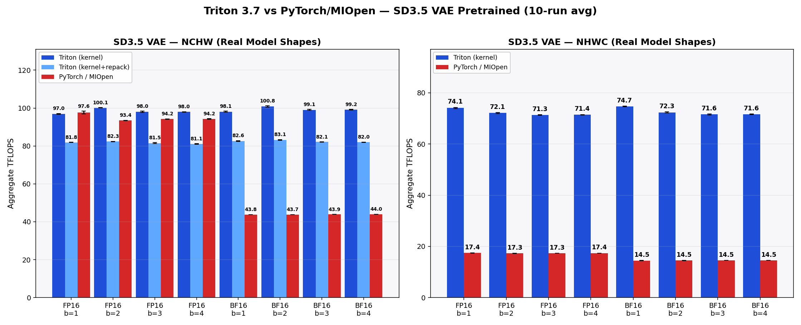
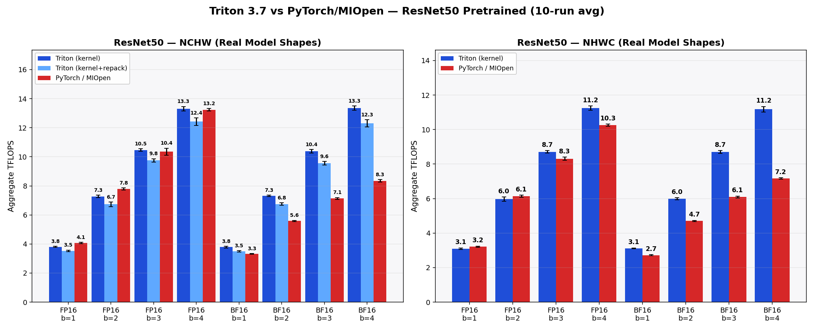
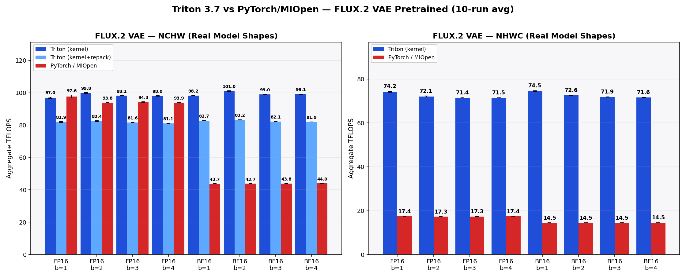

# conv2d (Triton, AMD ROCm)

> **`Conv2d` for AMD ROCm — a drop-in replacement for `torch.nn.Conv2d`,
> optimized for AMD RDNA GPUs.**

[](LICENSE)
[](https://www.python.org)
[](https://pytorch.org)
[](https://www.amd.com/en/developer/resources/rocm-hub.html)
[](https://github.com/triton-lang/triton)

A hand-written Triton 2-D convolution library optimized for AMD RDNA
GPUs. Five kernel families (1×1, 3×3 cblocked, 3×3 NHWC, Winograd
F(4×4, 3×3), general) behind one shape-driven router and one entry
point. Drop-in for the forward path of `nn.Conv2d`.

---

## Why this op exists

PyTorch on AMD goes through MIOpen, which ships hand-tuned solvers per
architecture, per dtype, per layout. That works well on the combinations
the solvers were specifically tuned for, but every new dtype × layout ×
architecture combination needs its own tuning pass — so coverage is
uneven across the matrix (e.g. on RDNA4 the fp16 path is well-served,
while bf16 falls back to direct/GEMM solvers that are noticeably slower
at large channel counts; most modern checkpoints — LLMs, diffusion VAEs
— ship in bf16).

This op takes the opposite approach: a single set of Triton kernels
that runs **fp16 and bf16 through the same code path**, supports
**both NCHW and NHWC end-to-end** (NHWC inputs run on an NHWC kernel —
no NHWC↔NCHW conversion), and gets reasonable performance across the
full matrix **without per-architecture hand tuning**. A shape-driven
router picks between five kernel families (1×1, 3×3 cblocked, 3×3 NHWC,
Winograd F(4×4, 3×3), general) so the right kernel runs per layer
automatically. Some kernels do repack inputs/weights into kernel-local
formats (channel-blocked tiles for cblocked, G/Bᵀ transforms for
Winograd) — these packs are LRU-cached so steady-state cost is
negligible.

---

## Headline results

48 configurations: 3 models × 2 dtypes × 2 layouts × 4 batch sizes,
10 runs each, on RDNA4.





> **Note on TFLOPS**: numbers are *direct-convolution-equivalent* throughput
> (the standard convention used by cuDNN, MIOpen, and the Winograd
> literature), applied identically to both backends. Winograd kernels —
> Triton's F(4×4, 3×3) and MIOpen's F(2×2, 3×3) / Fury alike — execute
> fewer literal hardware MACs than this denominator counts (≈4× fewer for
> F(4,3), ≈2.25× for F(2,3)). The comparison is apples-to-apples.

---

## Quick start

### Use the function directly

```python
import torch
from aiter.ops.triton.conv.conv2d import conv2d

x = torch.randn(4, 256, 56, 56, device="cuda", dtype=torch.float16)
w = torch.randn(512, 256, 3, 3, device="cuda", dtype=torch.float16)

y = conv2d(
    x, w, bias=None,
    stride=(1, 1), padding=(1, 1), dilation=(1, 1),
    activation="relu",          # "none" | "relu" | "relu6" | "gelu"
    out_dtype=torch.float16,
    layout="nchw",              # "nchw" or "nhwc"
)
```

A shape-driven router picks one of five kernel families:

| Family | When it runs |
|---|---|
| 1×1 GEMM | `R==1, S==1` |
| 3×3 cblocked (NCHW) | 3×3, channel-blocked input for coalesced loads |
| 3×3 NHWC | 3×3 with channels-last input — no input repack |
| Winograd F(4×4, 3×3) | 3×3, stride=1, dilation=1, `C ≥ 512`, `K ≥ 512`, enough output tiles |
| General | anything not 1×1 or 3×3 (5×5, 7×7, dilated, strided) |

### Use as `nn.Conv2d` drop-in

The kernel families above are functional; wrapping them in an `nn.Module`
(walk a model, swap each `nn.Conv2d` for a Triton-backed module that
calls `conv2d(...)` in its `forward`) works as expected and produces
images visually indistinguishable from the PyTorch / MIOpen reference.

Same prompt, same seed — left: PyTorch (MIOpen). Right: this op.

| PyTorch / MIOpen | Triton (this op) |
|---|---|
|  |  |

Pixel-level agreement: max diff **6 / 255**, mean diff **0.17 / 255**.

---

## Constraints

- `groups` must equal 1 (depthwise / grouped not yet implemented).
- `padding_mode` must be `"zeros"`. The pad *amount* (`padding=`, e.g.
  `(1, 1)` or asymmetric `(0, 2)`) is unrestricted; only the pad *value*
  is — `"reflect"`, `"replicate"`, and `"circular"` fall back to PyTorch /
  MIOpen.
- Inputs must be `fp16` or `bf16`.
- Forward only (no backward / training).

---

## Reproducing the benchmarks

The harness lives at `op_tests/triton_tests/conv/`. Run from the AITER
repo root.

### Correctness

By test mode:

```bash
python -m op_tests.triton_tests.conv.cli --test-mode edge          # edge cases (default)
python -m op_tests.triton_tests.conv.cli --test-mode random --num-random 200
python -m op_tests.triton_tests.conv.cli --test-mode stability     # stability check
python -m op_tests.triton_tests.conv.cli --test-mode activations   # relu/relu6/gelu fusion
python -m op_tests.triton_tests.conv.cli --test-mode models --model-name resnet50
python -m op_tests.triton_tests.conv.cli --test-mode all           # everything above
```

Cross-axis flags (combine with any mode):

```
--dtype {fp16,bf16}                           # default fp16
--layout {nchw,nhwc,both}                     # default nchw
--method {default,cblocked,winograd_f4x3,winograd_f4x3_fused,winograd_f4x3_cblocked,all}
```

Pytest entry (parametrized over fp16/bf16 × nchw/nhwc):

```bash
pytest op_tests/triton_tests/conv/test_pytest.py                              # full matrix
pytest op_tests/triton_tests/conv/test_pytest.py -k "edge and fp16_nchw" -s   # single case
```

### Benchmark

Per-layer TFLOPS table vs PyTorch / MIOpen:

```bash
python -m op_tests.op_benchmarks.triton.bench_conv2d --model-name resnet50 --num-layers 53
python -m op_tests.op_benchmarks.triton.bench_conv2d --model-name sd35_vae \
    --model-path <path to model>/stable-diffusion-3.5-medium
python -m op_tests.op_benchmarks.triton.bench_conv2d --model-name flux2_vae \
    --model-path <path to model>/FLUX.2-klein-9B
```

3×3 method comparison table (all methods side-by-side):

```bash
python -m op_tests.op_benchmarks.triton.bench_conv2d --method all --model-name resnet50
```

Bench-specific flags:

```
--num-layers N                                # cap layers (default 53 for bench)
--batch-size N                                # default 1 (all models)
--height H --width W                          # override input shape; omit = real per-layer shapes
--model-path PATH                             # required for sd_unet / sd35_vae / flux2_vae
--pretrained                                  # use real pretrained weights (all models). Default: random init
```

Tested on ROCm 7.2 / PyTorch `2.9.1+gitff65f5b` / Triton 3.7 (commit `23f4e522d`).

---

## Documentation

- **[`DESIGN.md`](DESIGN.md)** — architecture, per-kernel deep-dive, full
  Winograd F(4,3) derivation (G/Bᵀ/Aᵀ matrices, 361× amplification
  analysis, why Winograd is disabled for `C < 4`), the
  `_select_3x3_method` heuristic, memory layouts and repacking,
  numerical model, extension guide.

---

## Repository layout

```
aiter/ops/triton/conv/                Kernel library
  conv2d.py                           Public API + smart routing
  _launch.py                          Grid setup + _select_3x3_method
  _prepack.py                         Weight/input repack caches (LRU)
  _utils.py                           Shape math, tolerance model
  README.md, DESIGN.md, images/

aiter/ops/triton/_triton_kernels/conv/   @triton.jit kernels
  (1x1, 3x3 cblocked, 3x3 NHWC, general, 5 Winograd kernels)

op_tests/triton_tests/conv/           Correctness suite + benchmark driver
op_tests/op_benchmarks/triton/bench_conv2d.py   Bench shim
```
