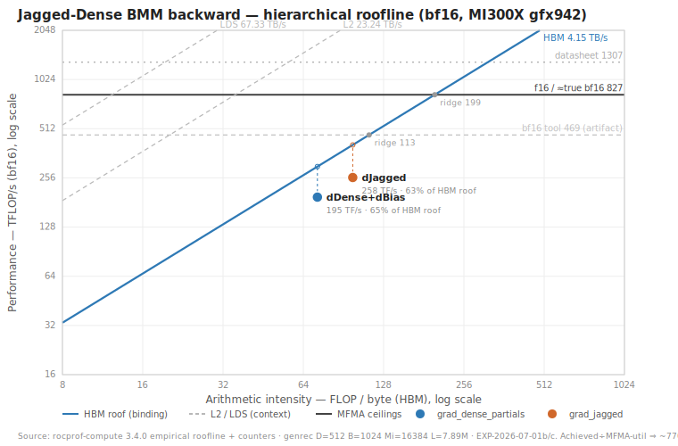

# Jagged-Dense BMM Backward — Ceiling Assessment Plan du Jour (2026-07-01, MI300X)

**This is a *diagnostic* plan, not an implementation plan.** Its single deliverable is a
defensible verdict for the kernels benchmarked by the command below: for each kernel, is it
**genuinely stuck at a real ceiling** (and *which* ceiling), or does it have **recoverable
headroom** (and *which lever* would recover it)? We produce evidence — a hierarchical
roofline placement + profiler limiter attribution — not a code change. Any optimization work
is deferred to a follow-up plan that this assessment justifies (or rules out).

Successor context: `2026-06-30_optimization_plan_du_jour.md` (esp. **EXP-30a**, which found
`grad_dense_partials` double-buffering neutral and hypothesized an MFMA **dependency-chain**
ceiling) and `2026-06-29_final_optimization_plan_mi300x.md` (EXP-29d: occupancy/HBM/staging-
vec exhausted). This plan's job is to *confirm or refute* those hypotheses with a full
roofline + limiter workup, rather than to keep pulling levers.

Kernels: `aiter/ops/flydsl/kernels/jagged_dense_bmm_bwd.py`.

---

## 0. Exact target under assessment

The collection of kernels to assess, at the user's shape, run under the standing gate
(`genrec -mi 16384 --warmup 25 --rep 50`):

```bash
python op_tests/flydsl_tests/bench_jagged_dense_bmm_bwd_perf.py \
  --regime genrec -d 512 -kout 512 -b 1024 -mi 16384 --warmup 25 --rep 50
```

Decoded: `B=1024` groups, `D = reduction K = 512`, `Kout = output N = 512`, `Mi = 16384`,
`--component all` (default), `genrec` length distribution, both providers (`flydsl` +
`triton`) by default.

**Which kernels this actually launches (FlyDSL provider, `D=512` ⇒ `SPLIT=1`):**

| # | Kernel | Produces | GEMM shape / contraction | Notes |
|---|---|---|---|---|
| 1 | `grad_jagged_kernel` | dJagged (L,K) | per-row `dOut(L,N) @ Dense[b].T`, contract over **static N** | `COARSEN_M=2`; prior finding: **dispatch/latency-bound** (~4% occ, ~82% SPI) |
| 2 | `grad_dense_partials_kernel` | dDense (B,K,N) **+ dBias** (fused) | `J[b].T @ dOut[b]`, contract over **dynamic m** | `SPLIT=1` ⇒ writes bf16 dDense/dBias directly, **no reduce passes**; prior finding: **MFMA-dependency-bound** |

At `SPLIT=1` the `grad_dense_reduce_kernel` / `grad_bias_reduce_kernel` do **not** launch, so
the collection is exactly these **two** MFMA kernels. `--component all` scores both; we will
also score them individually (`--component jagged`, `--component dense_bias`) so each gets its
own verdict. The Triton provider runs its own two counterpart kernels and is treated here as
an **empirical achieved-performance ceiling** (a second data point, not the object of study).

---

## 1. What "at a real ceiling" vs "recoverable headroom" means here (decision rule)

We adopt the framing from the roofline discussion: the textbook two-roof chart hides the
effects that actually pin real kernels. A kernel is declared **at a real ceiling** only when
we can name the *binding* resource and show it is ≥ ~80–90% utilized (or that the achieved
rate is at an independently-measured *achievable* roof, not a datasheet peak). Concretely,
per kernel we classify into exactly one primary limiter:

- **C — Compute/MFMA-throughput-bound:** MFMA (matrix-core) issue slots saturated; achieved
  FLOP/s at the *achievable* bf16-MFMA roof. → real ceiling.
- **Cdep — MFMA-dependency/latency-bound:** matrix unit *not* saturated but the critical path
  is the accumulator dependency chain (issue-wait / dependency-wait dominate, MFMA util low).
  → recoverable in principle via ILP (independent accumulators), so **headroom**, but only if
  ILP can be added within VGPR/LDS budget.
- **Mx — Memory-bound at level x ∈ {HBM, L2, LDS}:** the binding roof is a *specific* level of
  the hierarchical roofline; achieved BW at that level ≈ its achievable BW. → real ceiling for
  that level (but may be recoverable by *raising reuse* to move off that roof).
- **Occ/Lat — Occupancy/latency-bound:** too few in-flight waves to hide latency; neither
  compute nor any BW roof is near saturation. → headroom (raise occupancy / MLP).
- **Disp — Dispatch/launch-bound:** workgroup-manager (SPI) saturated, WGs too small/short.
  → headroom (coarsen / fuse / fewer-larger WGs). This is the standing hypothesis for
  `grad_jagged`.

**Verdict rule.** A kernel is *stuck at a real ceiling with no realistic lever* iff its
limiter is **C** or **Mx-with-no-reuse-headroom**, AND the achieved rate is ≥ ~80% of the
*achievable* (microbenchmarked, not datasheet) roof for that resource. Everything else
(**Cdep, Occ/Lat, Disp, Mx-with-reuse-headroom**) is **recoverable headroom** — and we name
the lever and estimate its ceiling.

---

## 2. Methodology (per kernel, both kernels)

### Step A — Time attribution (which kernel owns the time)
Run the bench under `rocprofv3 --kernel-trace` and get per-kernel mean duration (µs/call) and
call count. Confirm the two FlyDSL kernels' share of `--component all` end-to-end, and note
the FlyDSL-vs-Triton gap per kernel (the Triton counterpart's µs is the empirical ceiling to
beat / a sanity bound). Deliverable: a share table (kernel → µs, %, calls, FlyDSL/Triton).

### Step B — Achieved rates + arithmetic intensity (from measured µs)
Reuse the bench's own `_flops_bytes` model (already per-component, using the *actual* packed
`L = sum M_i`) with the Step-A durations to compute, **per kernel**:
- achieved **FLOP/s** = flops / µs,
- achieved **HBM bytes/s** = bytes / µs,
- **arithmetic intensity** AI = flops / bytes (the roofline x-coordinate).
Also compute AI at the **L2** and **LDS** levels (bytes moved at each level, from rocprof
counters — see Step D), because the DRAM AI overstates reuse the caches don't actually give.

### Step C — Establish the *achievable* roofs (not datasheet)
Do **not** trust datasheet peaks. On this box (`HIP_VISIBLE_DEVICES=6`), obtain:
- **bf16 MFMA achievable ceiling** — microbenchmark the exact `MFMA(16,16,16,bf16)` atom used
  here in a tight, dependency-free loop (the 06-29/30 logs cite ~473 TF/s as the achievable
  MFMA rate; the MI300X *datasheet* dense bf16 peak is ~1.3 PF/s — the gap between these two
  is itself part of the story and must be shown, not assumed).
- **HBM achievable BW** — a streaming copy/read microbench (MI300X HBM3 datasheet ≈ 5.3 TB/s;
  achievable is typically ~70–85%).
- **L2 and LDS achievable BW** — from rocprof-compute's reported peaks or a microbench.
Record all four with the method used. These define the hierarchical roofline's rooflines.

### Step D — Profiler limiter attribution (the core evidence)
`rocprof-compute profile` (full counters) per kernel. Extract and tabulate:
- **MFMA/matrix-core utilization (%)**, VALU utilization (%),
- **wave occupancy** (achieved vs theoretical), VGPR/LDS per-wave and WG/CU,
- **memory-unit busy %** at **HBM**, **L2** hit/busy, **LDS busy %** and bank conflicts,
- **SPI / workgroup-manager utilization (%)** (the dispatch signal),
- **stall breakdown**: issue-wait, dependency-wait, LDS-wait, memory-wait, barrier-wait.
The *dominant* stall + the *saturated* resource name the limiter per §1.

### Step E — Hierarchical roofline placement
Plot each kernel as a point (AI, achieved FLOP/s) against **four** roofs: HBM, L2, LDS
diagonals + the achievable-MFMA horizontal. Draw an **occupancy-derated** MFMA roof (scale the
MFMA roof by achieved/theoretical occupancy) — being *at* the derated roof but far below the
theoretical one is the signature of an Occ/Lat ceiling, not a compute ceiling. Placement +
Step-D limiter must agree; if they disagree, re-examine (usually means the binding level is a
cache, not HBM).

### Step F — Per-kernel verdict + collection verdict
Apply the §1 decision rule to each kernel. Then a collection-level verdict weighted by the
Step-A time share (the backward is only as fast as its slowest-weighted parts). For any
"headroom" verdict, state the lever and an *estimated* achievable µs (a target, e.g. "AI puts
the achievable-MFMA floor at X µs; we are at Y µs ⇒ Z× headroom").

---

## 3. Hypotheses to confirm or refute (grounded in prior EXPs)

The prior logs already assert answers; this plan's value is *testing* them at `D=512`, the
exact user shape, with a full roofline (prior verdicts were largely `D=256`-centric and
lever-by-lever, never a unified roofline placement):

1. **`grad_dense_partials` is MFMA-dependency-bound (Cdep), not feed/occupancy/HBM-bound.**
   (EXP-29d + EXP-30a.) *Confirm:* low MFMA util + dominant dependency-wait + on/above the
   HBM & LDS roofs (memory hidden) + below both the theoretical and even the occupancy-derated
   MFMA roof. *If confirmed ⇒ headroom*, lever = accumulator ILP / MMA-atom width (Phase C/D of
   the 06-30 plan). *Refute path:* if it's actually at the achievable-MFMA roof ⇒ real C
   ceiling ⇒ the 06-30 follow-on levers are dead and we stop.
2. **`grad_jagged` is dispatch/latency-bound (Disp/Occ).** (06-30 §, ~4% occ, ~82% SPI.)
   *Confirm:* SPI/workgroup-manager saturated, tiny short-lived WGs, occupancy floor, neither
   MFMA nor HBM near roof. *If confirmed ⇒ headroom*, lever = more `COARSEN_M` / fuse / larger
   WGs. Note `COARSEN_M=2` already ships — quantify how much of the dispatch bound it removed.
3. **The collection is *not* HBM-bound.** Both are GEMMs with AI ∝ D=512 (reuse ∝ tile), so the
   expectation is compute/latency-side, not bandwidth-side. Confirm dJagged & dDense sit *well
   above* the HBM diagonal; if either sits *on* an **L2** or **LDS** roof, that reframes the
   ceiling (a cache roof the two-roof chart would miss).
4. **The FlyDSL↔Triton gap bounds recoverable headroom empirically.** If Triton's counterpart
   is materially faster at the same shape, that gap is *existence proof* of headroom regardless
   of the roofline argument; if FlyDSL already matches/beats Triton, headroom claims must rest
   entirely on the roofline (weaker).

---

## 4. Deliverables (what "done" looks like)

1. **Attribution table** (Step A): kernel → µs/call, % of backward, FlyDSL vs Triton.
2. **Roofline table + chart** (Steps B/C/E): per kernel — AI (HBM/L2/LDS), achieved FLOP/s &
   BW, the four achievable roofs, % of each roof, and the plotted hierarchical roofline.
3. **Limiter table** (Step D): per kernel — MFMA/VALU util, occupancy, VGPR/LDS, HBM/L2/LDS
   busy, SPI util, top-3 stalls ⇒ the named limiter.
4. **Verdict** (Step F): per-kernel {ceiling | headroom + lever + estimated target µs} and a
   one-paragraph collection verdict answering the user's question directly, with the confidence
   and the single most-informative number backing it.
5. An **EXP-2026-07-01** block appended to **this document** (below), so the assessment's
   evidence lives with the plan that specified it.

A **canvas** is the preferred medium for the roofline chart + tables (per the analytical-
artifact guidance); fall back to markdown tables if a canvas is not wanted.

---

## 5. Reproduce (STRICT — GPU pinning non-negotiable)

MI300X gfx942, **`HIP_VISIBLE_DEVICES=6` on every command**, `flydsl_venv`, rocprof-compute
3.4.0. The FlyDSL kernels take `K`/`N` as **compile-time constants**, so `D=512` requires
`K=N=512` in `aiter/ops/flydsl/kernels/jagged_dense_bmm.py` **before the first launch** (the
bench asserts `(K,N)==(_FLY_K,_FLY_N)` and errors otherwise; `configure_dim(512)` is the
programmatic equivalent).

```bash
# (0) set K=N=512 in aiter/ops/flydsl/kernels/jagged_dense_bmm.py first.

# (A) the target command (object of study), both providers:
HIP_VISIBLE_DEVICES=6 \
PYTHONPATH=/workspaces/aiter:/workspaces/generative-recommenders:$PYTHONPATH \
flydsl_venv/bin/python op_tests/flydsl_tests/bench_jagged_dense_bmm_bwd_perf.py \
  --regime genrec -d 512 -kout 512 -b 1024 -mi 16384 --warmup 25 --rep 50

# (B) per-component split + correctness:
HIP_VISIBLE_DEVICES=6 PYTHONPATH=... flydsl_venv/bin/python \
  op_tests/flydsl_tests/bench_jagged_dense_bmm_bwd_perf.py \
  --regime genrec -d 512 -kout 512 -b 1024 -mi 16384 --warmup 25 --rep 50 --component all -test
#   ... repeat with --component jagged  and  --component dense_bias  for per-kernel numbers.

# (C) per-kernel time attribution:
HIP_VISIBLE_DEVICES=6 PYTHONPATH=... rocprofv3 --kernel-trace -- \
  flydsl_venv/bin/python op_tests/flydsl_tests/bench_jagged_dense_bmm_bwd_perf.py \
  --regime genrec -d 512 -kout 512 -b 1024 -mi 16384 --warmup 25 --rep 50 --flydsl-only

# (D) full-counter limiter workup (rocprof-compute; see 06-29 plan §7 for the profile form),
#     also under HIP_VISIBLE_DEVICES=6, one kernel at a time.
```

Always A/B / read back-to-back in a single run (shared box; single readings are untrustworthy,
per EXP-29e's contention caveat).

---

## 6. Explicitly out of scope

- **Any code change / optimization.** This plan only *measures and classifies*. Levers
  (accumulator ILP, MMA-atom width, `COARSEN_M`, fusion) are named as *conclusions*, not
  implemented here — they belong to the follow-up plan this assessment gates.
- **Re-litigating disproven levers** (occupancy, HBM traffic, staging-vec, feed double-
  buffering for `grad_dense_partials`) — EXP-29d/30a settled those; we only *re-confirm* the
  resulting ceiling with a roofline, we do not re-pull them.
- **`SPLIT>=2` / D=256 path** — the user's shape is `D=512, SPLIT=1`; the reduce kernels do
  not launch and are not assessed here.

---

## EXP-2026-07-01a — Step A: time attribution

**Date:** 2026-07-01. **Box/protocol:** MI300X gfx942 (`HIP_VISIBLE_DEVICES=6`), `flydsl_venv`,
genrec regime, `-b 1024 -d 512 -kout 512 -mi 16384 --warmup 25 --rep 50`, `K=N=512` in
`jagged_dense_bmm.py`. Timing via `do_bench`; per-kernel attribution via `rocprofv3
--kernel-trace` (mean over 8 profiled calls); geometry from the same trace. HW facts: 304 CU,
32 waves/CU (⇒ 9728 wave-slots), wavefront 64, `fcompute` 2100 MHz.

**Correctness:** `--component {jagged,dense_bias} -test` both **PASS**, FlyDSL & Triton cos = 1.0000.

**Problem instance:** genrec seed 1234 ⇒ **L = 7,893,473** packed rows (mean M_b = 7,708, min 4,
max 15,550). Per-component work = `2·L·D·N = 4.139e12` FLOP.

**Time attribution (FlyDSL provider):**

| kernel | µs/call (kernel-trace) | do_bench ms | % of FlyDSL bwd | Triton counterpart (do_bench ms) | achieved bf16 |
|---|---|---|---|---|---|
| `grad_dense_partials_kernel` (dDense+dBias, SPLIT=1) | 20,998 | 20.58 | **56.9%** | 28.57 | **197.1 TF/s** |
| `grad_jagged_kernel` (dJagged) | 15,882 | 15.89 | **43.1%** | 19.60 | **260.6 TF/s** |
| **full backward (`all`)** | — | **36.53** | 100% | **48.75** | — |

- **SPLIT=1 confirmed:** the trace shows *only* these two MFMA kernels — no
  `grad_dense_reduce`/`grad_bias_reduce` launches. The collection under study is exactly two kernels.
- FlyDSL already beats Triton on both (**1.23×** on jagged, **1.39×** on dense_bias, **1.33×**
  overall), so the FlyDSL↔Triton gap is *not* headroom in our favor — any headroom claim must
  rest on the roofline (Hypothesis 4 resolves to "roofline-only").
- Kernel-trace µs and `do_bench` ms agree to <1% ⇒ attribution is trustworthy; both kernels are
  single clean launches (no hidden helper kernels in the timed path).

**Launch geometry (per call):**

| kernel | WGs (x·y·z) | block | VGPR / AccVGPR / SGPR | LDS |
|---|---|---|---|---|
| `grad_dense_partials` | 16 · 1 · 1024 = **16,384** | 256 | 96 / 128 / 32 | 32 KB (dyn) |
| `grad_jagged` | 256 · 1 · 1024 = **262,144** | 256 | 36 / 132 / 80 | 32 KB (dyn) |

(x = `NK_TILES·NN_TILES = 16` for dense / `bm_coarse·KOUT_BLOCKS = 64·4 = 256` for jagged;
z = `n_groups = 1024`. Grid sized to the **envelope** `Mi=16384` for *every* group, so with mean
M_b ≈ 7,708 roughly half of `grad_jagged`'s 262k WGs early-exit — a first, structural hint at the
Disp hypothesis: **262k tiny short-lived WGs vs 9,728 wave-slots.**)

**Preview vs roofs (formalized in Step C, do not treat as verdict yet):** at the ~473 TF/s
achievable-MFMA figure the prior logs cite, grad_jagged is ~55% and grad_dense_partials ~42% of
that roof; against the ~1.3 PF/s datasheet dense-bf16 peak they are ~20% / ~15%. The two candidate
ceilings are far apart — pinning down the *achievable* MFMA roof (Step C) is decisive.

**Next:** Step B (per-level arithmetic intensity: HBM vs L2 vs LDS bytes from counters) and Step C
(microbenchmark the achievable MFMA/HBM/L2/LDS roofs), then Step D limiter attribution.

---

## EXP-2026-07-01b — Step B/C: hierarchical roofline placement + achievable roofs

**Date:** 2026-07-01. **Box/protocol:** as EXP-01a. Counters + empirical roofline via
`rocprof-compute 3.4.0` (libexec binary run through `flydsl_venv`), one full-counter pass on the
`--mode profile` path of `profile_jagged_dense_bmm_bwd.py`:

```bash
# FLYDSL_RUNTIME_ENABLE_CACHE=0 is REQUIRED whenever a compile-time constant is being
# swept (tiling, D, SPLIT, ...): the runtime JIT cache key does not incorporate those
# constants, so a stale cache silently serves the previously-built kernel (see EXP-A1).
HIP_VISIBLE_DEVICES=6 FLYDSL_RUNTIME_ENABLE_CACHE=0 PYTHONPATH=... flydsl_venv/bin/python \
  /opt/rocm/libexec/rocprofiler-compute/rocprof-compute profile \
  -n bwd_full_d512_b1024_m16384_genrec -p workloads/bwd_full_d512_b1024_m16384_genrec -- \
  flydsl_venv/bin/python aiter/ops/flydsl/kernels/profile_jagged_dense_bmm_bwd.py \
  --mode profile --only all -d 512 -b 1024 -m 16384 --regime genrec --seed 1234 --sparsity 0.95 \
  --iters 6 --warmup 3
# analyze: rocprof-compute analyze -p <path> -k 0   (0=dense_partials, 1=jagged)
```

**Tooling change (shipped this step).** Added the **`genrec`** regime (+`--sparsity`) to the shared
`make_seq_offsets` (`example_jagged_dense_bmm.py`), threaded `sparsity` through `make_inputs`
(`example_jagged_dense_bmm_bwd.py`), and exposed `--regime genrec`/`--sparsity` on
`profile_jagged_dense_bmm_bwd.py`; the genrec generator mirrors the bench exactly, so the profile
driver reproduces the **identical M_i instance** — verified: profile driver reports **L = 7,893,473**,
matching EXP-01a. Also made the driver's analytic `_flops_bytes` **SPLIT-aware** (the SPLIT==1 path
writes bf16 dDense/dBias directly — no fp32 partials round-trip — so the old formula over-counted
bytes at D=512). Bench-mode cross-check: djagged 257.7 TF/s / dense_bias 193.8 TF/s ≈ EXP-01a.

**Step C — achievable roofs on THIS box (empirical roofline, `roofline.csv`):**

| resource | achievable (empirical) | datasheet |
|---|---|---|
| HBM BW | **4154 GB/s** | ~5300 GB/s |
| L2 BW | 23,241 GB/s | — |
| L1 (vL1D) BW | 30,771 GB/s | — |
| LDS BW | 67,335 GB/s | — |
| **MFMA bf16** | **469 TF/s** | 1307 TF/s |
| MFMA f16 (same datapath) | 827 TF/s | 1307 TF/s |

> **Caveat on the MFMA roof.** The tool's bf16 microbench measured **469 TF/s** but its f16
> microbench measured **827 TF/s** on the *same* CDNA3 matrix datapath (bf16 and f16 MFMA share
> throughput), and the datasheet dense peak is 1307 TF/s. So 469 is almost certainly a *benchmark*
> artifact, not the true bf16 ceiling. The prior logs' "~473 TF/s achievable MFMA" is this same
> 469 figure. **Verdict does not hinge on it:** both kernels are well below even the 469 roof, and
> the nearer roof is HBM regardless (see below). A direct `MFMA(16,16,16,bf16)` atom microbench to
> resolve 469-vs-827-vs-1307 is deferred to Step C-follow-up; the conclusion is robust to all three.

**Step B — hierarchical roofline placement (rocprof-compute roofline plot points):**

| kernel | achieved | AI_HBM | AI_L2 | AI_L1 | HBM roof @AI | **% of HBM roof** | % of MFMA roof (469 / 827 / 1307) |
|---|---|---|---|---|---|---|---|
| `grad_dense_partials` | 195.1 TF/s | **72.3** | 124.9 | 32.0 | 300 TF/s | **65%** | 42% / 24% / 15% |
| `grad_jagged` | 257.5 TF/s | **98.1** | 85.3 | 23.1 | 407 TF/s | **63%** | 55% / 31% / 20% |

Achieved rates match EXP-01a `do_bench` (195↔197, 257↔261 TF/s) ⇒ counters are trustworthy.

**Measured BW utilization (achieved / achievable):**

| kernel | HBM | L2 | L1 | LDS | MFMA util | VALU util | occupancy | IPC |
|---|---|---|---|---|---|---|---|---|
| `grad_dense_partials` | **65%** (2701 GB/s) | 7% | 20% | 20% | 25.6% | 25.1% | **27.1%** | 0.51/5 |
| `grad_jagged` | **63%** (2630 GB/s) | 13% | 36% | 15% | 33.1% | 17.3% | **8.1%** | 0.28/5 |

**The headline finding — both kernels sit just left of the roofline ridge, on the memory side,
saturating nothing.** The empirical **ridge point is 112.9 FLOP/byte** (469 TF/s ÷ 4154 GB/s; it
moves *right* to 199 with the f16 roof, 315 with datasheet). Both kernels' `AI_HBM` (72.3 and 98.1)
fall **below** the ridge ⇒ their *nearest* roof is **HBM**, and each is pinned at **~63–65% of that
HBM roof** — not at it, and not at any other roof:

- **No single resource is saturated.** Highest utilization for each kernel is **HBM at ~63–65%**;
  everything else (MFMA ≤33%, L2 ≤13%, L1 ≤36%, LDS ≤20%, occupancy 27%/8%, IPC ~10%/6% of peak) is
  lower. This is the textbook "stuck near the inflection with no single realistic resource to push
  against" regime from the opening roofline discussion — now demonstrated with counters.
- **Why HBM traffic is inflated (partials).** `AI_HBM = 72` vs the minimal-traffic analytic AI of
  ~248: the L2 hit rate is only **14.4%**, so the 128×128 output-tiling **re-streams J and dOut ≈4×
  from HBM** (each operand read once per opposing tile: NK_TILES=NN_TILES=4). The reuse the analytic
  AI assumes is *not* being captured by L2 ⇒ effective AI collapses 3–4×, dragging the HBM roof
  (300 TF/s) *below* the MFMA roof (469 TF/s). So partials is HBM-**traffic**-limited more than it is
  matrix-core-limited — a *revision* of the D=256 EXP-30a "purely MFMA-dependency-bound" framing at
  this larger D. (Both can be true: nothing is saturated, so it is fundamentally **latency-bound**,
  with HBM traffic the single largest component and the accumulator chain / low occupancy preventing
  that traffic from being hidden.)
- **grad_jagged** has better locality (L2 hit 56.5%, AI_HBM 98 near the ridge) but **8.1% occupancy**:
  SPI **Workgroup-Manager utilization 99.5%** dispatching **262,144 WGs / 1.05M wavefronts**, with
  **Insufficient-CU-LDS 31.5%** (its 32 KB/WG caps residency at 2 WG/CU = 25% ceiling; tiny WGs —
  COARSEN_M·NRED_TILES = 2·4 MFMA K-steps — drain faster than SPI refills). Classic
  **dispatch + LDS-occupancy latency** bound, ~63% of HBM roof.
- **Occupancy is capped, not free:** partials hits **Insufficient-VGPR 34%** + **Insufficient-LDS
  35%** (96 VGPR / 128 AGPR / 32 KB ⇒ ~2 WG/CU); jagged hits Insufficient-LDS 31.5%. So "just raise
  occupancy" is not free headroom — it needs a VGPR/LDS reduction, consistent with EXP-29d finding
  occupancy-doubling neutral (occupancy was never the *binding* constraint).

**Preliminary read (full verdict after Step D stall attribution):** neither kernel is at a compute
(MFMA) ceiling — both are **memory-/latency-bound just below the HBM roof**, i.e. genuinely near the
inflection but with **~1.5× of "reach-the-HBM-roof" headroom** and, for partials, an additional
**AI-raising lever** (cut the ~4× operand re-read / lift L2 reuse → larger/rectangular output tiles
or K-tile reuse) that would move the HBM roof up toward the MFMA roof. This is *recoverable
headroom*, not a hard ceiling — but the recoverable lever is **HBM-traffic/locality + latency**, not
the matrix core. Step D (stall/cycle attribution: issue-wait vs dependency-wait vs memory-wait) will
finalize which latency dominates and rank the levers.

**Artifacts:** `workloads/bwd_full_d512_b1024_m16384_genrec/` (pmc_perf.csv, roofline.csv, roofline
PDFs); analyze dumps `/tmp/an_partials.txt`, `/tmp/an_jagged.txt`.

---

## EXP-2026-07-01c — Step D: limiter attribution (stall/cycle) + Step F verdict

**Date:** 2026-07-01. Same workload as EXP-01b (rocprof-compute §7.2 Wavefront Runtime Stats,
§11.2 Pipeline Statistics). Stall partition = {Issue-Wait, Dependency-Wait, Active} as a fraction
of total Wave Cycles (they sum to ~100%).

**Stall partition (the core Step-D evidence):**

| kernel | wave-cycles | Issue-Wait | Dependency-Wait | **Active** | IPC (real / issued) | instr/wave | dominant |
|---|---|---|---|---|---|---|---|
| `grad_dense_partials` | 54.5 B | 37.7% | 34.8% | **27.6%** | 0.51 / 0.85 | 58,152 | issue≈dep (both huge) |
| `grad_jagged` | 43.8 B | **50.2%** | 33.1% | **16.4%** | 0.28 / 0.83 | 1,600 | issue-wait |

Both kernels are **stalled ~72–84% of all wave-cycles**. `IPC(issued)` ≈ 0.83–0.85 both — i.e. *when*
a wave issues it does fine; the loss is entirely that waves are **not issuing** (waiting), and there
are too few resident waves (occupancy 27% / 8%) to cover the wait. Supporting counters: MFMA
Instruction Cycles = 16 (a full 16×16×16 atom), MFMA util only 25.6% / 33.1%; `VMEM Latency` ~135/122
cyc (L1-hit path) but **L2-Fabric read latency ~513/505 cyc** — the HBM round-trips are the expensive
ones and are exposed at this occupancy. (The 511 M "Spill/Stack" VMEM instrs are the tool bucketing
our MUBUF `buffer_load`s — `Scratch=0`, Global/Generic reads=0 — **not** real register spill.)

### Step E — hierarchical roofline chart (deliverable #2)



Log-log roofline: HBM/L2/LDS diagonals + MFMA bf16/f16/datasheet horizontals, both kernels plotted at
their `AI_HBM` with a dashed riser up to the HBM roof, ridge points marked. It also surfaces the
achieved÷MFMA-util cross-check (~770 TF/s implied true bf16 peak ≈ the f16 line), confirming the 469
bf16 roof is a tool artifact. Static image: `docs/2026-07-01_roofline.svg`. Interactive version (adds
the per-kernel placement/limiter table): the canvas `canvases/jdbmm-bwd-roofline.canvas.tsx`.

### Step F — VERDICT (answers the driving question for this collection)

**Neither kernel is at a hard ceiling. Both have recoverable headroom. Both are latency-bound just
below the HBM roof — genuinely near the inflection, but with realistic levers to advance.**

**`grad_dense_partials` (56.9% of the backward) — latency-bound (mixed HBM-fetch + MFMA-dependency).**
- *Not* compute-bound (MFMA 25.6%, 42% of the 469 roof / 15% datasheet) and *not* BW-saturated (HBM
  the nearest roof at 65%). 72% of cycles are stall (issue 37.7% ≈ dep 34.8%), occupancy 27% capped by
  VGPR(96/128 AGPR)+LDS(32 KB) — so occupancy is *not free* (matches EXP-29d neutral occupancy-doubling).
- **Verdict: recoverable headroom, ~1.5× to the HBM roof (300 TF/s), potentially more.** Ranked levers:
  1) **Cut HBM traffic / raise AI** (dominant): L2 hit is 14.4% and operands are re-streamed ≈4× by the
     128×128 tiling — capturing that reuse (rectangular / larger output tiles, K-tile or n-tile operand
     reuse across the group, or restructuring so J/dOut are read once) lifts `AI_HBM` from 72 toward the
     ~248 minimal and pushes the HBM roof up toward the MFMA roof. This both raises the ceiling *and*
     cuts the 513-cyc-latency exposure. 2) **Break the MFMA accumulator dependency chain** (independent
     accumulators / multi-C-fragment ILP) so the 34.8% dependency-wait shrinks — the EXP-30a "real lever",
     now confirmed as *one of two*, not the sole one. (Note vs EXP-30a: at D=512 the picture is **not**
     "purely MFMA-dependency-bound" — HBM traffic is co-equal. Feed double-buffering alone was correctly
     found neutral because it addresses neither the traffic nor the accumulator chain.)

**`grad_jagged` (43.1% of the backward) — dispatch + occupancy-latency bound.**
- *Not* compute-bound (MFMA 33%, 55% of the 469 roof) and *not* BW-saturated (HBM 63%). 84% stalled,
  **issue-wait 50% dominant**, occupancy **8.1%**: SPI Workgroup-Manager 99.5% busy dispatching
  **262,144 WGs / 1.05 M wavefronts** of **1,600 instr each**, with Insufficient-CU-LDS 31.5% (32 KB/WG
  ⇒ ≤2 WG/CU = 25% ceiling; tiny WGs drain faster than SPI refills).
- **Verdict: recoverable headroom, ~1.5× to the HBM roof (407 TF/s).** Ranked levers: 1) **fewer, larger,
  longer-lived WGs** — raise `COARSEN_M` further and/or restructure so each WG amortizes its
  prologue/epilogue over more work (directly attacks the 50% issue-wait + 8% occupancy + SPI saturation);
  2) **cut per-WG LDS** below 32 KB to lift the 2-WG/CU occupancy cap. (Consistent with the standing
  `grad_jagged` "dispatch/latency-bound" reading; this quantifies it: 8.1% occupancy, SPI 99.5%.)

**Collection-level answer to the opening question.** *Are these kernels stuck near the inflection with
no realistic means to reach it?* — They are demonstrably **stuck near the inflection on the memory side**
(AI_HBM 72 / 98 vs ridge 113; pinned at 63–65% of the HBM roof, saturating nothing). But this is
**recoverable headroom, not a hard ceiling**: both are latency-/dispatch-/traffic-bound, all of which
are addressable. What is *not* realistically reachable is the **MFMA (compute) roof / true ridge** —
that would require eliminating the HBM-traffic and dispatch inefficiencies first. The realistic near-term
target is **the HBM roof (~1.5× each ⇒ order-of ~1.5× on the full backward)**, and for partials a
*further* gain by raising AI (lifting the HBM roof itself). The single most informative number: **both
kernels are only ~28% / 16% "active"** — the prize is converting stall cycles to active cycles via
traffic/occupancy/dispatch, not via the matrix core.

**Follow-up (a real optimization plan, out of scope here):** (1) partials output-tile / operand-reuse
redesign to raise L2 hit + AI; (2) partials accumulator-ILP; (3) grad_jagged coarsening + LDS reduction.
Each should be gated on the EXP-01b/c counters (target: Active-cycle % up, HBM traffic down, occupancy
up) — not just wall-time. Optional Step C-follow-up: direct `MFMA(16,16,16,bf16)` atom microbench to
settle the 469-vs-827-vs-1307 roof (does not change this verdict).

---

# Jagged-Dense BMM Backward — Optimization Plan du Jour (2026-07-01, MI300X)

**This is the *implementation* plan the assessment above justifies.** Scope is deliberately narrow:
we pursue only the two levers the verdict ranked #1 for each kernel — **(1)** `grad_dense_partials`
operand-reuse redesign (raise L2 hit ⇒ raise `AI_HBM` ⇒ lift the HBM roof) and **(3)** `grad_jagged`
coarsening + LDS reduction (fewer/larger/longer-lived WGs ⇒ raise occupancy). We **exclude (2)**
(partials accumulator-ILP): the accumulator dependency-chain lever was already exercised in the
EXP-30a family, so no new work is warranted here. Every experiment is **counter-gated** on the
EXP-01b/c workup (Active-cycle % ↑, HBM read bytes ↓, occupancy ↑) — *not* wall-time alone; wall-time
is the tie-breaker, not the gate.

All runs use the standing gate: `genrec -mi 16384 --warmup 25 --rep 50` at `-d 512 -kout 512 -b 1024`.

## W1 — `grad_dense_partials`: cut HBM traffic / raise AI

**Root cause (from Step D/F).** L2 hit **14.4%**, HBM read ≈ **57 GB** vs **~16 GB** minimal ⇒ **~3.5×
operand over-read**; `AI_HBM` collapses **72 vs ~248** minimal, pinning the kernel at 65% of the HBM
roof. The 128×128 output tiling re-streams each `J[:,k-tile]` / `dOut[:,n-tile]` operand row ≈4× across
the opposing output tiles. This reuse is **inter-workgroup**; the high L1 hit (74%) is only **spatial /
coalescing** (99.96%) and does not capture it, and L2 retains almost none of it (14%). Goal: capture the
inter-tile reuse so operands are read ≈once, lifting `AI_HBM` toward ~248 and the HBM roof toward the
MFMA roof.

| # | Experiment | Change | Primary gate (counters) |
|---|---|---|---|
| A1 | **Larger / rectangular output tiles** ⇒ **DONE, gate-FAILED (EXP-A1)** | 128×128 → 256×128 / 128×256 / 256×256: amortize each operand read over more MFMAs, fewer reloads | L2 hit ↑, HBM read bytes ↓, `AI_HBM` ↑, VGPR ≤128 — *mechanism confirmed (AI_HBM 72→96, HBM −25%) but VGPR guardrail hard-violated (AGPR 128→384, occ 27%→1.3%, wall +4.4×). See EXP-A1.* |
| A2 | **Group-aware WG launch order / swizzle** ⇒ **DONE, gate-marginal (EXP-A2)** | Reorder/swizzle the `(k-tile, n-tile)` grid so tiles sharing an operand row issue temporally adjacent ⇒ L2/MALL retains the row between reuses | L2 hit ↑, `Stalled-on-L2-Data` ↓ (was 41.7%), HBM read bytes ↓ — *direction confirmed but tiny: L2 14.7→16.4%, HBM −2.6%, wall flat. Miss is capacity/placement-bound. See EXP-A2.* |
| A3 | **Read-once operand staging** | Stage `J`/`dOut` operand slabs once into LDS/registers and reuse across the n-/k-sub-tiles within a WG | HBM read bytes ↓, `AI_HBM` ↑, LDS/occupancy neutral-or-better |

**Guardrails.** Keep VGPR ≤128 and LDS within the occupancy budget (don't trade a traffic win for an
occupancy regression — check both). **Order:** ~~A1 first~~ **A1 is done and failed the guardrail
(EXP-A1)** — the fp32 C-accumulator is register-resident and scales with `DDENSE_BK*DDENSE_BN`, so
enlarging the tile explodes AGPR and craters occupancy before the (real) traffic win can pay off.
~~**Revised order: A2 next**~~ **A2 is also done (EXP-A2): directionally correct but marginal** (L2
14.7→16.4%, HBM −2.6%) — the swizzle proved the L2 miss is **capacity / cross-XCD-placement bound**,
not order-bound, so reordering can't move the needle. **Next: A3** (read-once staging with a
**bounded** accumulator — loop output sub-tiles reusing a staged operand slab, keeping one 128×128
C-fragment live at a time, so reuse is captured *without* growing registers), and/or **m-band /
reduction blocking** that shrinks the resident working set below the 4 MB/XCD L2. **Target:** `AI_HBM` 72 →
toward 248; HBM roof rises; ≥ ~1.5× and potentially more (this lever lifts the *ceiling*, not just
utilization of it).

## W2 — `grad_jagged`: fewer / larger / longer-lived WGs + cut LDS

**Root cause (from Step D/F).** **262,144 WGs / 1.05 M wavefronts** of ~1,600 instr each, occupancy
**8.1%**, SPI Workgroup-Manager **99.5%** busy, **issue-wait 50%** dominant. Occupancy is capped by
**LDS** (32 KB/WG ⇒ ≤2 WG/CU = 25% ceiling), **not** VGPR (`Insufficient-SIMD-VGPRs` 0.0%, VGPR=36).
Goal: dispatch fewer, longer-lived WGs and lift the per-CU residency cap.

| # | Experiment | Change | Primary gate (counters) |
|---|---|---|---|
| B1 | **Raise `COARSEN_M`** (2 → 4 → 8) | Each WG processes more consecutive `BLOCK_M` row-tiles **sequentially**, reusing the *same* accumulator per sub-tile (VGPR stays ~36) ⇒ fewer dispatches, prologue/epilogue amortized | WG/wavefront count ↓, occupancy ↑, issue-wait ↓ (was 50%), SPI busy ↓ |
| B2 | **Cut per-WG LDS < 32 KB** | Single-buffer / shrink the `sA` staging (32 KB → ~16 KB) so >2 WG/CU can reside | `Insufficient-CU-LDS` ↓ (was 31.5%), occupancy ↑ |
| B1+B2 | **Combined** | Coarsen along M *and* free LDS together | Active-cycle % ↑, HBM 63% → higher, wall ↓ |

**RESULT (see EXP-2026-07-01-B1+B2 below):** run at the D=512 gate, **the combination does NOT beat noise —
it is worse than B2 alone.** B1 (raise `COARSEN_M` past the already-applied 2) *regresses* here (the
dispatch-bound premise was a D=128 artifact; at D=512 the kernel is already 259 TF/s and not
dispatch-starved). **B2 (single-buffer `sA`, 32→16 KB LDS) is the only real lever: +1.9%**, counter-confirmed
(GRBM active −9.4%, VGPR unchanged at 36). Best point = `COARSEN_M=2` + `GJ_STAGES_A=1`.

**Explicit non-goal.** Do **not** add a K-tile accumulator (**K-coarsening**, EXP-29b): it drove VGPR
**36 → 268** and gate-failed. VGPR is not the limiter here — LDS and dispatch are. Coarsen along **M**,
and *reduce* LDS; keep the accumulator footprint small. **Order:** B1 first (attacks dispatch +
occupancy directly, near-zero risk), then B2 (compounds the occupancy gain), then measure combined.
**Target:** occupancy 8.1% → materially higher; HBM roof (~407 TF/s) approached; ≥ ~1.5×.

## Gating & bookkeeping (both workstreams)

- **Standing run protocol (MANDATORY for every run — bench, profile, correctness).**
  1. **Always run in `flydsl_venv`** (`flydsl_venv/bin/python …`). It is the only environment with the
     matching torch + flydsl; the rocprof-compute/rocprofv3 drivers are invoked through it too.
  2. **Always `rm -rf ~/.flydsl/cache` before each config, in a fresh process.** The on-disk JIT cache
     key does **not** incorporate the swept compile-time constants (tile, `COARSEN_M`, `STAGES_A`, `D`,
     `SPLIT`, …) and `FLYDSL_RUNTIME_ENABLE_CACHE=0` does **not** survive `rocprofv3`/the bench driver, so
     a stale cache silently serves the previously-built kernel (identical counters, wrong `Workgroup_Size`
     — the EXP-A1/A3 trap). Clearing the cache dir per config is the only reliable guard.
  3. Pin the device (`HIP_VISIBLE_DEVICES=6`) and verify the effective config printed by the driver
     (`[cfg] …`) / the captured `Workgroup_Size` matches what was intended before trusting any number.
- **Gate on counters, not wall.** Each experiment must move its primary counter in the right direction
  *and* not regress the others (VGPR/LDS/occupancy vs traffic). Wall-time is the final tie-breaker.
- **Instrumentation.** Reuse the EXP-01b/c `rocprof-compute` workup (`profile_jagged_dense_bmm_bwd.py`,
  genrec regime) so the before/after deltas are directly comparable to the Step A–D tables above.
- **Stop conditions.** For each kernel, stop when either the HBM roof is reached (~1.5×) or two
  consecutive gated experiments fail to move the primary counter — then re-assess (the roof may have
  become the real ceiling).

---

## EXP-2026-07-01-A1 — W1 output-tile enlargement (operand reuse)

**Date:** 2026-07-01. **Box/protocol:** MI300X gfx942, `HIP_VISIBLE_DEVICES=6`, `flydsl_venv`,
`rocprof-compute 3.4.0`, same genrec workload as EXP-01b (`-d 512 -b 1024 -m 16384 --regime genrec
--seed 1234 --sparsity 0.95`, `L=7,893,473`). Profiled `--only dense_bias` (SPLIT=1 ⇒ the sole
captured kernel is `grad_dense_partials_kernel`), `--iters 6 --warmup 3`.

**What was tried.** The `dDense`-partials output tile `DDENSE_BK × DDENSE_BN` (MFMA M×N) was swept
128×128 (base) → 256×128 → 128×256 → 256×256. Bigger `BN` amortizes each `J[:,k]` read over more
n-tiles; bigger `BK` amortizes each `dOut[:,n]` read over more k-tiles — fewer operand reloads ⇒ less
HBM traffic ⇒ higher `AI_HBM`. Made the tile a runtime knob (`configure_tiling` +
`--ddense-bk/--ddense-bn/--ddense-bm` on the profile driver) and fixed the SPLIT==1 bf16-truncate to
size from `_DDENSE_C_ELEMS = BK*BN/256` instead of a hard-coded 64. Correctness re-verified per tile
(dDense/dBias cosine 0.999999).

**⚠ Methodology trap (cost one full bench+profile pass).** `FLYDSL_RUNTIME_ENABLE_CACHE=1` is set in
this environment and the runtime JIT cache key does **not** incorporate the tiling constants, so every
"variant" silently got a **false cache-hit on the 128×128 kernel** (grid stayed 16384 WG, VGPR 96/128,
wall unchanged). rocprofv3 also **strips the child environment**, so an env-var knob never reaches the
profiled process — hence the CLI flag. **Fix / rule for tiling sweeps: run with
`FLYDSL_RUNTIME_ENABLE_CACHE=0`** (or `rm -rf /root/.flydsl` between differently-tiled builds). All
numbers below are with the cache disabled and the dispatched grid/VGPR verified from `pmc_perf.csv`.

**Results (cache disabled, grid/VGPR verified):**

| tile (BK×BN) | grid | VGPR / AGPR | occ (wf / %) | L1 hit | L2 hit | HBM read | `AI_HBM` | wall (ms) | TF/s |
|---|---|---|---|---|---|---|---|---|---|
| **128×128 (base)** | 16384 WG | 96 / 128 | 2631 / 27.0% | 74.4% | 14.7% | **56.7 GB** | **72** | **21.2** | **195** |
| 256×128 | 8192 WG | 128 / 272 | 368 / 3.8% | 74.2% | 3.2% | 48.5 GB | 84 | 58.5 | 70 |
| 128×256 | 8192 WG | — | — | — | — | — | — | 124.5 | 33 |
| 256×256 | 4096 WG | 128 / 384 | 124 / 1.3% | 66.9% | 29.3% | **42.7 GB** | **96** | 93.7 | 44 |

(HBM read = L2-Fabric Read BW × Kernel Time; `AI_HBM` = 4.14e12 FLOP ÷ (read + ~0.6 GB write).)

**Verdict: mechanism CONFIRMED, but the lever gate-FAILS on its VGPR guardrail.**
- **The operand-reuse mechanism is real.** The square 256×256 tile cut HBM read **56.7 → 42.7 GB
  (−25%)**, roughly **doubled L2 hit (14.7 → 29.3%)**, and lifted **`AI_HBM` 72 → 96 (+33%)** — exactly
  the direction W1 predicted. So the ~3.5× operand over-read *is* recoverable in principle.
- **But it is structurally register-bound.** The fp32 MFMA C-accumulator is register-resident and
  scales with `BK*BN`, so AGPR climbs **128 → 272 → 384** (VGPR 96 → 128) and achieved occupancy
  **collapses 2631 → 368 → 124 wavefronts (27% → 3.8% → 1.3%)**. Net wall **regresses 2.8×–5.9×**
  (195 → 70/33/44 TF/s). The −25% traffic win is dwarfed by the occupancy loss.
- **Rectangular 256×128 is a trap:** it cut HBM (−14%) yet *tanked* L2 hit to **3.2%** (lost inter-WG
  locality) and is still 2.8× slower — worse on both the guardrail and the wall.
- **Conclusion:** output-tile enlargement **cannot** capture the reuse here, because capturing it this
  way requires holding the whole enlarged output tile in registers simultaneously. The traffic lever
  survives; the *implementation path* does not.

**Redirect (updates W1 order).** Drop tile-enlargement. Pursue the two levers that capture the same
reuse *without* growing the accumulator: **A2** (launch-order / grid swizzle so operand-sharing tiles
co-reside in L2/MALL — zero arithmetic, zero extra registers, so it can't trip the VGPR guardrail) and
**A3** (read-once operand staging with a **bounded** accumulator — a WG loops over output sub-tiles,
keeping a single 128×128 C-fragment live while reusing an operand slab staged once in LDS). A
higher-thread/multi-wave WG that holds a bigger tile with a *bounded per-thread* accumulator is a
possible A3 variant. **Code left at the 128×128 default** (production path unchanged); the tiling knob
and cache caveat are retained for the A3 work.

**Artifacts:** `workloads/A1_base_cd/`, `workloads/A1_bk256_cd/`, `workloads/A1_sq256_cd/` (pmc_perf.csv,
roofline); analyze dumps `/tmp/an_A1_base_cd.txt`, `/tmp/an_A1_bk256_cd.txt`, `/tmp/an_A1_sq256_cd.txt`.

---

## EXP-2026-07-01-A2 — W1 launch-order swizzle (L2 residency)

**Date:** 2026-07-01. **Box/protocol:** identical to EXP-A1 (`FLYDSL_RUNTIME_ENABLE_CACHE=0`, genrec,
`-d 512 -b 1024 -m 16384`, `--only dense_bias`, `--iters 6 --warmup 3`; grid/occupancy verified).

**Hypothesis / pre-registered expectation.** Reorder the per-group `NK×NN = 4×4` output-tile grid
(new knob `DDENSE_TILE_GROUP=G`, Triton-style G-wide k-blocking; a pure bijection over the 16 tiles,
so correctness is order-independent — re-verified cosine 0.999999 at G=2,4) so operand-sharing tiles
issue back-to-back and the shared operand slice stays hot in L2. **But the sysinfo arithmetic said
this would be small:** L2 is **4 MB/XCD** (8 XCDs, 304 CUs); one operand slice `J[:,k]` ≈ avg `M_b`
(7710) × 128 × 2 B ≈ **2 MB**, and the working set to capture the 4× reuse is ~8 MB > 4 MB — *and*
consecutive WGs round-robin across the 8 **separate** XCD L2s, so operand-sharing tiles largely land on
different L2s regardless of order. Prediction: directionally right, magnitude negligible.

**Results (cache disabled; VGPR / occupancy / grid all unchanged — pure reorder):**

| order | L1 hit | L2 hit | HBM read | `AI_HBM` | occ (wf) | wall (ms) | TF/s |
|---|---|---|---|---|---|---|---|
| **G=1 (n-inner, default)** | 74.4% | 14.7% | 56.7 GB | 72 | 2632 | 21.18 | 197 |
| G=2 (2-wide k-block) | 74.4% | **16.4%** | **55.2 GB** | 74 | 2623 | 21.09 | 196 |
| G=4 (k-inner) | — | — | — | — | — | 22.05 | 188 (bench only) |

**Verdict: gate technically passes but is negligible — confirms the miss is capacity/placement-bound.**
G=2 moved L2 hit **+1.7 pts (14.7→16.4%)** (real: outside the ±0.5-pt run-to-run band) and cut HBM read
**−2.6%** (`AI_HBM` 72→74) with **zero** regression to VGPR/occupancy/wall — so it *passes* the A2
counter-gate directionally. But +2.6% traffic is nothing against the ~3.5× over-read / 72-vs-248 gap:
reordering cannot help when (a) the reuse working set (~8 MB) exceeds the 4 MB/XCD L2 and (b) the
operand-sharing tiles are scattered across the 8 XCDs' independent L2s. G=4 (k-inner) is symmetric to
the default and slightly worse on wall (dispatch/placement noise).

**Decision & redirect.** **Production left at G=1** (the G=2 win is within wall-noise and not worth
changing the stable launch pattern; the knob stays available). A2 as "pure launch-order swizzle" is
**not the lever**. The next step must *shrink the resident working set*, not reorder it — **A3**:
read-once operand staging with a **bounded** accumulator (a WG loops output sub-tiles reusing one
staged operand slab) and/or **m-band (reduction) blocking** so the per-XCD working set drops below
4 MB and the 4× reuse is captured in-cache. That is the only way to convert the confirmed-real reuse
into an `AI_HBM` gain without the A1 register blow-up.

**Artifacts:** `workloads/A2_g2_cd/` (pmc_perf.csv, roofline); analyze dump `/tmp/an_A2_g2_cd.txt`.
New knob: `DDENSE_TILE_GROUP` / `configure_tiling(group=...)` / `--ddense-group` (default 1).

---

# A3 — design sketch: internalize operand reuse with a bounded per-thread accumulator

**Design sketch (predictive). RESULT: see EXP-2026-07-01-A3 below — implemented, and it FAILED the gate
(flat: 203 vs 197 TF/s).** Two predictions here were wrong and are corrected in that record: (1) the
256×256 warp grid is `(4,4,1)`-over-M, not free `(WM,WN)` — the K-perm couples to `n_warps=4`; (2)
`DDENSE_BM=32` is not usable (the size-1 K-iter dim is squeezed), so 256×256 is 64 KB LDS / 1 WG/CU, not
32 KB / 2 WG/CU. This was the *last* single-kernel lever; its failure is the decisive evidence that
`grad_dense_partials` is at its structural HBM cold-read ceiling. Remaining upside = the two-level
(m-band) reduction discussed at the end.

## The constraint A1 and A2 established

The ~3.5× operand over-read is **inter-workgroup**: the 16 output tiles of a group each independently
stream `J[:,k]` (re-read `NN=4×`) and `dOut[:,n]` (re-read `NK=4×`). We proved two dead ends:

- **A1 (bigger tile, fixed 256 threads):** internalizing reuse *does* cut traffic (256×256 → HBM
  −25%, `AI_HBM` 72→96) but the fp32 C-accumulator is register-resident and scales with `BK*BN`, so at
  256 threads it exploded to 256 fp32/thread (AGPR 384) and cratered occupancy (27%→1.3%), wall +4.4×.
- **A2 (reorder only):** can't beat cache capacity — the reuse working set (~8 MB) > L2 (4 MB/XCD) and
  operand-sharing tiles scatter across the 8 independent XCD L2s. Marginal (+1.7 pt L2 hit).

**Key realization:** A1's traffic win is real and tile-determined; only its *register/occupancy* cost
was fatal. The per-WG accumulator for a `T×T` tile is `T²` fp32 spread over the WG's threads, so the
**per-thread** cost is `T²/threads`. A1 held `threads=256` fixed. **A3 scales threads with tile area**
so the per-thread accumulator stays at the baseline 64 fp32 — capturing the exact same −25% traffic
*without* the register blow-up.

## Core idea

Enlarge each WG's output tile to **256×256** (so it internalizes the reuse: `NK=NN=2` ⇒ `J` and `dOut`
each re-read only **2×** instead of 4×) **and** raise the WG to **1024 threads** (16 waves) so the
per-thread fp32 C-fragment stays at `256²/1024 = 64` — identical to today. Pick `DDENSE_BM=32` so the
transpose-staging LDS stays at 32 KB and **2 WG/CU** still fit (2×1024 = 2048 threads/CU = the HW max).

`T=256` is the **hard ceiling** for a single WG: `workgroup_max_size = 1024` threads and a bounded
64-fp32/thread accumulator ⇒ max tile `1024×64 = 65536 = 256×256`. So this lever tops out at a **2×**
reload reduction (`AI_HBM` 72 → ~96); going further needs the cooperative / m-band variant below.

## Working-set / register / occupancy math (the discriminator vs A1)

| config | tile | threads (waves) | C fp32/thr | LDS (BM) | WG/CU | J / dOut reloads | expected HBM read | `AI_HBM` |
|---|---|---|---|---|---|---|---|---|
| **baseline** | 128×128 | 256 (4) | 64 | 32 KB (64) | 2 | 4× / 4× | 56.7 GB | 72 |
| **A1 (failed)** | 256×256 | 256 (4) | **256** | 64 KB (64) | 1 | 2× / 2× | 42.7 GB | 96 |
| **A3 (proposed)** | 256×256 | **1024 (16)** | **64** | **32 KB (32)** | **2** | 2× / 2× | **~42.7 GB** | **~96** |

The HBM/L2 columns are **not a new prediction** — they are the *measured* 256×256 numbers from EXP-A1
(HBM 42.7 GB, L2 hit 29.3%), because traffic is set by the tiling, independent of thread count. What
A3 changes is the register/occupancy row: per-thread accumulator back to 64, AGPR back to ~128, LDS
back to 32 KB ⇒ **2 WG/CU restored**. **Discriminating gate vs A1:** same traffic, but achieved
wavefront occupancy ≥ baseline (≥27%) and VGPR ≤128 / AGPR ~128 — so the −25% traffic should finally
convert to wall (target: below the 21.2 ms / 197 TF/s baseline, toward the ~1.3× the HBM-roof rise
allows).

## Concrete kernel changes (`grad_dense_partials_kernel` + `grad_dense_bias`)

1. **Threads = `DDENSE_BK*DDENSE_BN/64`** (new derived constant; 1024 at 256×256). Thread the value
   through `configure_tiling` and the `block=(DDENSE_THREADS,1,1)` launch. Assert ≤1024.
2. **New 16-wave `tiled_mma`.** Today's `make_layout((1,4,1),…)` is 4 waves covering 16×64. For
   256×256 over 16 waves, use a `(WM,WN)=(4,4)` wave layout (each wave owns a 64×64 = 4×4-atom block of
   the 16×16-atom grid). This is the one non-trivial piece — get the wave/atom `make_tile` right so the
   C-fragment retile and the s2r feeds still land `m` on the MFMA K-fragment.
3. **Staging maps auto-scale:** `_J_LDS_LOADS = BM*BK/threads` (= `32*256/1024 = 8`), same for `_D`.
   `_DDENSE_C_ELEMS = BK*BN/threads = 64` (already parameterized — the epilogue truncate is correct).
   `DDENSE_NROW_GROUPS = threads/BN` (bias fusion) stays valid.
4. **`DDENSE_BM=32`** to hold LDS at 32 KB (2 WG/CU). Loop `DDENSE_BM//32 = 1` MFMA K-step per m-tile.
5. **Launch:** `smem=_DDENSE_SMEM_BYTES` (=32 KB), `block=(1024,1,1)`, grid `(NK*NN, 1, n_groups)` =
   `(2*2, 1, 1024) = (4,1,1024)`.

Reuse the existing `configure_tiling` + `--ddense-bk/bn/bm` knobs (add a `--ddense-threads` override or
derive it); keep the **128×128 default** for production until A3 gate-passes. **Cache caveat applies**:
sweep with `FLYDSL_RUNTIME_ENABLE_CACHE=0`.

## Gate, risks, fallback

- **Gate (counter, pre-registered):** HBM read ↓ to ~42–43 GB, `AI_HBM` ↑ to ~96, L2 hit ↑ to ~29%,
  **and** achieved occupancy ≥ baseline (≥~27%), VGPR ≤128 / AGPR ≤ ~150 — then wall < 21.2 ms.
  Validate correctness first (dDense/dBias cosine ≥ 0.99999) — the 16-wave `tiled_mma` is the risk.
- **Risks:** (a) the 16-wave MFMA layout mis-tiling the C-fragment (correctness) or introducing bank
  conflicts / poor s2r (perf); (b) 1024-thread WGs increasing barrier/`s_barrier` cost across 16 waves;
  (c) if `DDENSE_BM=32` starves the MFMA pipe, try 48/64 and accept 1 WG/CU (16 waves still = 50% occ).
- **Fallback / beyond 2×:** if 256×256 gate-passes but the HBM roof is still short of target, the only
  way past the single-WG 2× ceiling is **cooperative reuse** — a WG-cluster (or persistent kernel)
  that stages an operand slab once and broadcasts it to several output tiles, **or** a **two-level
  m-band reduction** (block the `m` axis so a band's operands fit in the 4 MB/XCD L2, accumulate `(K,N)`
  partials across bands). The latter is the SPLIT≥2 shape re-examined; it was slower at D=512 due to the
  fp32 `(K,N)` round-trip, so it is a fallback, not the first move.

---

## EXP-2026-07-01-A3 — bounded-accumulator tile enlargement (thread-scaled). **Verdict: gate FAILS — flat.**

**Date:** 2026-07-01. **Box/protocol:** MI300X gfx942 (`HIP_VISIBLE_DEVICES=6`), `flydsl_venv`, genrec
`-d 512 -b 1024 -m 16384 --seed 1234 --sparsity 0.95`, `--only dense_bias`. Bench = profile driver
`--mode bench --warmup 15 --iters 40`; counters = `rocprofv3` (`--iters 3 --warmup 1`, first dispatch
dropped). **Cache caveat, sharpened (see below): the on-disk JIT cache key ignores tiling AND**
`FLYDSL_RUNTIME_ENABLE_CACHE=0` **does not survive `rocprofv3`/`bench` — so every config was run in a
fresh process after `rm -rf ~/.flydsl/cache`.** Correctness re-verified each config (dDense/dBias
cosine 0.999999) at `-d 512 -b 8 -m 512 --regime skew`, incl. 256×128, 256×256, and `wpe` variants.

**What was built (all landed; default behaviour unchanged).** `grad_dense_partials` was made
tile-parametric so the enlarged tile keeps the baseline **64-fp32/thread** C-fragment:
- `DDENSE_THREADS = DDENSE_BK*DDENSE_BN/64` (derived; 256 at 128×128, 512 at 256×128, 1024 at 256×256).
- Warp grid derived: `n_warps = min(total, DDENSE_BN/16, 4)`, `m_warps = total/n_warps`. **The K-perm
  `(4,4,2)` is coupled to `n_warps=4`** — `n_warps=16` mis-tiles the A/B fragment (`is_profile_weakly_
  congruent` failure), so the extra warps go on **M** (256×256 ⇒ `(4,4,1)`, not the sketch's guess).
- **`DDENSE_BM` must stay ≥64** (not 32): with 1 MFMA K-step the size-1 outer K-iter dim is squeezed and
  the `mma_frag_A[None,None,(None,k)]` nested slice becomes incongruent. So the sketch's 32 KB/2-W-per-CU
  plan is not reachable at 256×256 — `BM=64` ⇒ 64 KB LDS ⇒ **1 WG/CU** there.
- New knobs: `--ddense-wpe` / `JDBMM_DDENSE_WPE` (waves_per_eu) and the derived `DDENSE_THREADS`.

**TRAP #1 — `known_block_size` is a VGPR poison (this faked a 3.76× "win" for ~an hour).** Blocks >256
threads require `@flyc.kernel(known_block_size=…)`, else the launch is rejected (`max_flat_workgroup_size
=256`). But `known_block_size` pins an **exact** `amdgpu-flat-work-group-size`, which drives the backend
to max occupancy and **starves this register-hungry kernel: VGPR 96 → 20, AGPR 128 → 132, GRBM active
2.09e8 → 1.26e9 cyc/iter (~6×), 197 → 53 TF/s.** Because it fires at *exactly 256*, it silently
regressed the **128×128 baseline itself** to 53 TF/s — against which 256×128 (205 TF/s) looked like a
3.76× win. It was not: it was the enlarged tile merely *climbing back* to baseline. **Fixes:** (a) set
`known_block_size` **only when THREADS>256** (unset at 256 → baseline restored to 197 TF/s, VGPR 96);
(b) for the >256 tiles, pair it with a `waves_per_eu` hint to relax the occupancy target and restore the
VGPR budget (VGPR back to ~100, GRBM back to ~2.05e8).

**TRAP #2 — cache masks tiling sweeps under the profiler.** `rocprofv3` strips
`FLYDSL_RUNTIME_ENABLE_CACHE=0`; the disk cache key omits the tile constants, so a swept config silently
served the previously-built kernel (identical counters, `Workgroup_Size` stuck at 256). Only
`rm -rf ~/.flydsl/cache` per fresh process gives trustworthy per-config numbers.

**Corrected results (true baseline; all fresh-process, cache-cleared):**

| config | threads (WG) | LDS | WG/CU | VGPR / AGPR | L2 hit | GRBM cyc/it | wall (ms) | TF/s | vs base |
|---|---|---|---|---|---|---|---|---|---|
| **baseline 128×128** (no known_block_size) | 256 | 32 KB | 2 | **96 / 128** | 15.3% | 2.09e8 | **20.98** | **197** | 1.00× |
| 128×128 **+ known_block_size** (the trap) | 256 | 32 KB | — | **20** / 132 | — | 1.26e9 | 77.2 | 53 | 0.27× |
| **A3 256×128** (`wpe`=1..4) | 512 | 48 KB | 1 | 100 / 132 | **3.2%** | 2.05e8 | **20.34** | **203** | **1.03×** |
| A3 256×256 (`wpe`=4) | 1024 | 64 KB | 1 | — | — | — | 28.2 | 147 | 0.75× |
| A3 256×64 | 256 | 40 KB | — | — | — | — | 28.9 | 143 | 0.73× |

**Verdict: A3 gate FAILS — the win is within run-to-run noise (203 vs 197 TF/s).** With the
`known_block_size` penalty removed, 256×128 runs at **healthy occupancy** (VGPR 100, GRBM cyc = 0.98× of
baseline) — so it is *not* penalized — yet throughput is flat. The enlarged tile did exactly what the
tiling math promised — it **eliminated the redundant operand re-fetches that were hitting L2** (L2 hit
15.3% → 3.2%: those hits *were* the reuse) — **but that never converts to wall time**, because the
binding resource is the **irreducible HBM cold-read** of the `L×K` J and `L×N` dOut operands (the L2
*miss* stream ≈ unchanged, ~0.97×), which is a once-per-element floor independent of tile size. 256×256
is *worse* (64 KB LDS ⇒ 1 WG/CU, longer barriers over 16 waves).

**Conclusion for the whole A-series.** A1 (bigger tile, fixed threads → register blow-up), A2 (reorder →
capacity/placement-bound), A3 (bigger tile, bounded accumulator → flat) have now **all failed to move
wall time**. This is the decisive evidence the original question asked for: **`grad_dense_partials` is
genuinely at its structural HBM cold-read ceiling at ~197 TF/s**, not merely "stuck near the inflection"
for want of a better single-kernel schedule. The reuse is real but *un-cashable* in a single kernel: J
and dOut must each be read from HBM at least once, and at genrec's `AI_HBM≈72` that read *is* the run
time. **The only remaining lever is the two-level m-band reduction** (§ A3 fallback) — restructure so a
reduction band's operands are read once into L2/LDS and *all* `(K,N)` output tiles consume them before
eviction — which changes the *data-movement schedule*, not just the tile. That is the next experiment if
this kernel is to beat 197 TF/s; the single-kernel tiling levers are exhausted.

**Code state.** The tile/thread/warp/`wpe` parametrization landed and **defaults to the exact 128×128
baseline** (256 threads, no `known_block_size`, `(1,4,1)` mma → re-measured 197 TF/s, D=256 SPLIT≥2 path
160 TF/s, all cosine 0.999999). Knobs retained as experimental apparatus (like A2's `DDENSE_TILE_GROUP`):
`--ddense-bk/bn/bm` (`configure_tiling`), `--ddense-wpe` (`JDBMM_DDENSE_WPE`), `JDBMM_DDENSE_NW` override.
**Production default left at 128×128** — A3 offers no gain to promote.

**Artifacts:** `/tmp/rpv3_{base,bk256bn128,noknown,a3win}/` (rocprofv3 counter CSVs).

---

## EXP-2026-07-01-B1+B2 — `grad_jagged` M-coarsening + single-buffer LDS. **Verdict: combination does NOT beat noise; only B2 alone is a small (+1.9%) real win.**

**Date:** 2026-07-01. **Box/protocol:** MI300X gfx942, `HIP_VISIBLE_DEVICES=6`, **`flydsl_venv`**,
genrec `-d 512 -b 1024 -m 16384 --seed 1234 --sparsity 0.95`, `--only djagged` (⇒ `grad_jagged_kernel`).
Bench = `--mode bench --warmup 15 --iters 40`; counters = `rocprofv3 --iters 3 --warmup 1` (first dispatch
dropped). **Standing protocol enforced: `rm -rf ~/.flydsl/cache` before every config in a fresh process**
(the cache key ignores `COARSEN_M`/`GJ_STAGES_A`). Correctness re-verified each config at `-d 512 -b 8
-m 512 --regime skew` (dJagged cosine 0.999999), incl. the single-buffer pipeline.

**What was built (defaults unchanged).** Two knobs on `grad_jagged`:
- **B1 = `COARSEN_M`** (`--coarsen-m` / `JDBMM_COARSEN_M`, already existed as a const, now env/CLI): a WG
  runs this many consecutive `BLOCK_M` row-tiles. **Production is already `COARSEN_M=2`.**
- **B2 = `GJ_STAGES_A`** (`--gj-stages` / `JDBMM_GJ_STAGES`, new): A-staging depth. `=1` single-buffers
  `sA` (32 KB → **16 KB** LDS ⇒ up to 4 WG/CU) at the cost of one extra `s_barrier`/iter (the reg→LDS
  write can no longer overlap the next s2r read; B stays register-double-buffered so no B change).

**Results (genrec, cache-cleared per config; baseline = current production C=2 GJ=2):**

| config | `COARSEN_M` | `GJ_STAGES_A` | wall (µs) | TF/s | vs baseline |
|---|---|---|---|---|---|
| true original | 1 | 2 | 16371 | 252.8 | −2.4% |
| — origin + B2 | 1 | 1 | 15938 | 259.7 | +0.5% |
| **baseline** | **2** | **2** | 15988 / 16046 | **258.4** (±0.5) | 1.00× |
| B1 | 4 | 2 | 16507 | 250.7 | −3% |
| B1 | 8 | 2 | 18091 | 228.8 | −12% |
| **B2** | **2** | **1** | 15710 / 15714 | **263.4** (±0.05) | **+1.9%** |
| B1+B2 | 4 | 1 | 16394 | 252.4 | −2% |
| B1+B2 | 8 | 1 | 17607 | 235.0 | −9% |

**Verdict on the combination: it does NOT rise above noise — it is *worse* than B2 alone.**
- **B1 (raise `COARSEN_M` past 2) regresses monotonically** (258→251→229). The doc's dispatch-bound
  premise came from the **D=128** Step-D profile (`NRED_TILES=4`, tiny WGs). At the **D=512** gate each WG
  already does `NRED_TILES=8 × COARSEN_M=2` K-steps and the kernel runs at **259 TF/s / 1045 GB/s** — it is
  *not* dispatch-starved, so coarsening only trades away the WG-level parallelism that hides latency. The
  one real coarsening gain (**1→2 = +2.4%**) is *already banked in the production default*; there is no
  headroom above `COARSEN_M=2` at this shape.
- **B2 (single-buffer LDS) is the only positive lever: +1.9%, reproducible** (263.4/263.4 vs 257.9/258.8,
  gap ≈5 TF/s ≫ ~1 TF/s run-to-run band). **Counters confirm the predicted mechanism:** GRBM active cycles
  **1.619e8 → 1.467e8 (−9.4%)**, SQ_busy −9.5%, at **unchanged VGPR=36 and identical `SQ_WAVES`** — i.e.
  freeing 16 KB of LDS raised WG/CU residency and cut stall cycles. (Wall gains only +1.9%, not −9%, so the
  kernel is partly bound by dispatch/HBM, not purely occupancy — consistent with `grad_jagged` already
  being the *faster* of the two backward kernels.)
- **B1+B2 is dominated by B1's regression** (C=4 GJ=1 = 252, C=8 GJ=1 = 235, both < baseline). The best
  point in the whole matrix is **C=2 + GJ=1 (= B2 alone)**; adding B1 only subtracts.

**Same pattern as the A-series.** The two levers are not additive: B1's target (dispatch/occupancy via
fewer WGs) is already saturated at `COARSEN_M=2`, and pushing it further removes parallelism faster than
B2's freed-LDS occupancy adds it. "Combine to beat noise" fails again; the only durable signal is B2's
small, mechanism-verified +1.9%.

**Recommendation / code state.** Knobs landed; **defaults unchanged** (`COARSEN_M=2`, `GJ_STAGES_A=STAGES_A=2`
→ baseline reproduced, all cosine 0.999999). **B2 (`GJ_STAGES_A=1`) is a clean, correctness-preserving
+1.9%** and a reasonable candidate to promote to default for the D=512 genrec regime — pending a
cross-shape check (D=256/SPLIT≥2, uniform) since the gain is small and the extra barrier could cost on
other shapes. Left as opt-in for now. `--coarsen-m` / `--gj-stages` (and `JDBMM_COARSEN_M` /
`JDBMM_GJ_STAGES`) retained as apparatus.

**Artifacts:** `/tmp/rpv3_{gjbase,gjb2}/` (rocprofv3 counter CSVs).
