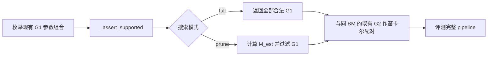

# A4W4 MXMOE GEMM1 如何按 M_est 缩小调优搜索空间

专用 gfx950 A4W4 MXMOE tuner 会把 GEMM1 候选与同 BM 的 GEMM2 候选配对，放大完整 pipeline 的评测量。
当前实现默认按 `M_est` 剪枝，减少需要评测的合法 G1 候选，并提供 `full` 模式供调优人员主动复查。

本功能覆盖专用 tuner 接受的 A4W4 shape。GEMM2 候选空间和同 BM 配对规则继续沿用既有行为；
普通 FMoE tuner、GPU kernel 和 production dispatch 的行为不受这组规则影响。

## 调优器在 routing 生成前估算每个 expert 的工作量

调优器从 shape row 的 `token`、`topk` 和 `expert` 计算 expected expert M：

```text
M_est = ceil(token * topk / expert) = (token * topk + expert - 1) // expert
```

实现使用整数向上取整，计算过程不需要 routing tensor。`M_est` 表示平均 routed rows 的估计，
不是实际最忙 expert 的 M。Pseudo-random routing 下的 expert 负载可能明显偏离这个估计；
balanced routing 会让各 expert 的 routed rows 接近它。

## 剪枝器先保留重叠的 BM family，再筛选调度参数

BM 表示 GEMM1 在 M 方向的 tile 大小，也就是一个 tile 处理的行数。
每个 BM family 包含同一 BM 下的全部合法参数组合。调优器按下表决定是否保留该 family。

| BM family | 保留条件 | 边界含义 |
| --- | --- | --- |
| BM16 | `M_est < 16` | `16` 起删除 |
| BM32 | `4 <= M_est <= 128` | `4` 和 `128` 均保留，`129` 起删除 |
| BM64 | `M_est >= 16` | `16` 起保留 |
| BM128 | `M_est >= 64` | `64` 起保留 |

这些区间允许邻近 BM family 同时参与调优，以覆盖不同 shape 下的 winner 变化。
当 `M_est=4` 时，调优器保留 BM16、BM32；当 `M_est=16` 时，它保留 BM32、BM64。
当 `M_est=64` 或 `128` 时，它保留 BM32、BM64、BM128；从 `129` 起，它保留 BM64、BM128。
上述集合仍受 support check 约束，`M_est` 规则不会让原本不合法的参数组合重新进入搜索空间。

对于通过 BM 规则的 BM32，调优器在 `M_est <= 32` 时保留全部合法调度参数；在 `M_est > 32` 时，
调优器只保留 `num_waves=4`、`k_wave=1`、`use_nt=False` 同时成立的组合。
因此 `M_est=32` 仍允许合法的 two-wave、`k_wave>1` 和 NT 变体，`33` 起删除这些变体。

对于通过 BM 规则的 BM64，调优器在 `M_est <= 64` 时保留合法的 NT 与非 NT 变体；在 `M_est > 64` 时，
调优器只保留 `use_nt=False`。因此 `M_est=64` 仍允许 NT，`65` 起删除 NT。

调优器没有为 BN、`xcd_swizzle` 和 BM16 的 `prefetch_hidden` 增加 `M_est` 剪枝，也没有为 BM16、BM128 增加额外调度规则。
只要对应 BM family 被保留，这些轴上的合法取值就继续参与搜索，合法性由现有 support check 决定。

阈值采用历史 winner 支持的重叠区间。BM32 的上界扩展到 `128`，
用于覆盖 leave-one-shape-family-out 检查暴露的边界缺口；这些经验规则不保证未见 shape 的 winner 必然保留。

## tuner 在完整 support check 后应用搜索模式



1. `_g1_variants()` 先完整枚举既有参数轴，并对每个组合执行 kernel 的 `_assert_supported()`。
   support check 继续负责 shape、BN、wave、`k_wave` 等合法性约束。
2. `_g1_variants()` 在 `full` 模式下直接返回完整合法集合；在 `prune` 模式下计算 `M_est`，
   再调用 `_g1_matches_m_est()` 应用 BM 和调度参数规则。
3. `_candidate_rows()` 继续将每个保留的 G1 与同 BM 的现有 GEMM2 候选作笛卡尔配对。
   它沿用现有 `flydsl_moe2_layout_*` family，并要求 GEMM2 的 `tile_m` 等于 G1 的 BM。
4. `_tune_one_shape()` 从 `args.mxfp4_search_mode` 读取选择，每个 shape 只生成一次候选列表。
   正常评测和全部候选失败的处理都复用这个列表，避免重复枚举和重复打印剪枝摘要。
5. 多进程 shape worker 接收同一个 `args` 参数对象，沿用相同的模式选择。
   worker 发生 shape 级异常或意外退出时，`_mxfp4_failed_row()` 直接构造失败结果行，不重新枚举候选。

## 使用者通过一个模式参数选择 prune 或 full

以下命令从仓库根目录执行，使用者需要把输入、输出文件名替换为实际路径。
使用者只传 `--mxfp4-flydsl` 就会启用专用 tuner，并默认使用 `prune`：

```bash
python3 csrc/ck_gemm_moe_2stages_codegen/gemm_moe_tune.py \
  -i untuned.csv -o tuned.csv --mxfp4-flydsl
```

使用者也可以显式指定 `prune`，其行为与默认模式相同：

```bash
python3 csrc/ck_gemm_moe_2stages_codegen/gemm_moe_tune.py \
  -i untuned.csv -o tuned.csv --mxfp4-flydsl --mxfp4-search-mode prune
```

使用者指定 `full` 后，调优器会搜索全部通过 support check 的 G1 候选：

```bash
python3 csrc/ck_gemm_moe_2stages_codegen/gemm_moe_tune.py \
  -i untuned.csv -o tuned.csv --mxfp4-flydsl --mxfp4-search-mode full
```

`--mxfp4-search-mode` 只接受 `prune` 和 `full`。使用者显式传入它时，必须启用专用 tuner；
普通 tuner 或与 `--grouped-gemm` 组合使用时，程序会拒绝参数，不会静默忽略选择。

## Kimi-K3 的一个 shape 展示了实际剪枝结果

本例采用 gfx950 Kimi-K3 的 `token=4096`、`model_dim=3584`、`inter_dim=384`、
`expert=896`、`topk=16`、`act_type=ActivationType.Situv2` shape，A/W 为 fp4，输出为 bf16。
调优器计算得到 `M_est = (4096 * 16 + 896 - 1) // 896 = 74`。下表来自当前代码对该 shape 的静态候选枚举。

| BM family | full G1 数量 | prune G1 数量 | prune 保留的 BN |
| --- | ---: | ---: | --- |
| BM16 | 12 | 0 | 无 |
| BM32 | 48 | 9 | 64、128、256 |
| BM64 | 12 | 6 | 128、256 |
| BM128 | 6 | 6 | 128、256 |

保留的三个 BM family 都使用 `num_waves=4`、`k_wave=1`、`use_nt=False`，
并保留 `xcd_swizzle={0,2,4}`。合法 G1 总数从 `78` 降到 `21`，
同 BM 配对后的 pipeline 候选从 `1,248` 降到 `336`。本例的剪枝日志如下：

```text
[mxfp4-port] pruned G1: M_est=74 valid=78 kept=21
```

调优器只在实际删除 G1 候选时打印一行摘要，并且不依赖 `--verbose`。
`full` 模式或没有删除候选的 shape 不会打印这条剪枝日志。

## 静态验证说明了候选集合变化，性能仍需另行测量

本轮验证使用当前代码分别枚举 `full` 与 `prune` 的最终候选集合，得到以下汇总。

| 输入集合 | 统计对象 | full 数量 | prune 数量 |
| --- | --- | ---: | ---: |
| 本地历史 398 个 shape row | G1 候选总数 | 33,240 | 9,594 |
| 本地历史 398 个 shape row | pipeline 候选总数 | 999,456 | 288,288 |
| Kimi-K3 17 个 shape row | G1 候选总数 | 1,326 | 366 |
| Kimi-K3 17 个 shape row | pipeline 候选总数 | 21,216 | 5,856 |

验证确认历史 398 个 G1 winner 均被保留。包含边界输入在内的 437 个 row 中，
`full` 的候选集合与剪枝改动前一致，保留 G1 的 GEMM2 配对及顺序也一致。

shape family 由 `(model_dim, inter_dim, expert, topk, act_type)` 定义，`token` 在 family 内变化。
25 折 leave-one-shape-family-out 检查在每折用其余 family 重新推导阈值，
累计检查 398 个 held-out row，历史 G1 winner 遗漏数为 `0`。
这些阈值是在观察现有 family 后形成的，因此该检查只能说明规则对当前数据的 family 扰动保持稳定。

剪枝减少了候选评测工作量，预计可缩短调优总耗时。
本轮尚未对比 `full` 与 `prune` 模式的实际调优 wall time，因此暂不报告具体加速幅度。
最终选中 kernel 的性能，以及未见 shape 的最优候选是否仍被保留，需要另行验证。
调优人员可以对未见 shape 或可疑结果主动使用 `full` 复查。历史 G1 winner 标签取自完整 pipeline 调优结果的 `kernelName1` 字段，
数据没有逐候选 latency 或 runner-up margin；ground-truth CSV 保持本地，不作为文档或 CI 依赖。

读者可以在 [tuner 实现](../csrc/ck_gemm_moe_2stages_codegen/gemm_moe_tune.py)、[G1 support check](../aiter/ops/flydsl/mxfp4_gemm1_kernels.py) 和
[命令行说明](../csrc/ck_gemm_moe_2stages_codegen/README.md) 中核对当前行为。
