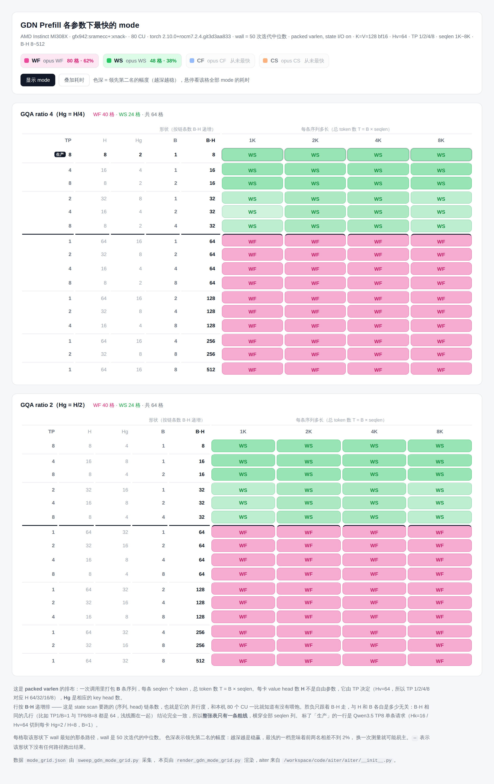

# GDN Prefill 后端性能对比（2026-08-26）

七个 GDN prefill 后端在同一形状、同一进程、同一块卡上的端到端与分 kernel 对比。
重点结论在最后一节「FlyDSL K6 的目标」。

## 1. 测量环境

| 项 | 值 |
| --- | --- |
| 设备 | AMD Instinct MI308X，`gfx942:sramecc+:xnack-`，80 CU |
| 可见设备 | `HIP_VISIBLE_DEVICES=7` |
| torch | 2.10.0+rocm7.2.4.git3d3aa833 |
| 分支 | `dev/huizzhan/flydsl_prefill_gdn_block` |
| HEAD | `765f5dad0`（rebase 到 `origin/main` = `987203ba5` 之后，领先 11 个提交） |
| 日期 | 2026-08-26 03:31 UTC |

形状为 `varlen-64k-qwen-ptpc-ali` 组：每条序列 `full_prompt_len=8192`，模型级
`Hk=16 / Hv=64` 在 TP=8 下切成每卡 `Hg=2` 个 key head、`H=8` 个 value head
（GQA ratio 4），`K=V=128`，bf16，packed varlen，state I/O 打开。
`N` 是序列条数，`T = N × 8192` 是总 token 数，扫 `N=1..8`。

计时口径：`wall` 是 50 次迭代的中位数（取中位数而非均值，避免前几次迭代的
autotune/cache 效应）；分 kernel 时间是 20 次迭代的 `torch.profiler` device time。
四个 `opt_vk` 后端都拿到预构建的 `prefill_metadata`（生产里就是这么驱动的，也是
fused prepare kernel 在 varlen 上的前提），opus 只拿 `cu_seqlens`、自己在 host 上
推导 schedule。

## 2. 七个后端

| 代号 | 含义 | 实现 |
| --- | --- | --- |
| WS | opus WS | `opus_gdn_wu_prefill_fwd`，`k2_mode=0`：K1..K4 一个 HIP kernel，然后 split 的 scan 和 output |
| WF | opus WF | 同前端，`k2_mode=1`：融合的 W/U K2，把 state scan 和 output 合成一个 kernel |
| CF | opus CF | `opus_gdn_c_prefill_fwd`，`c_mode=1`：C-input 前端（chunk inverse 而非 W/U）+ 一个融合 scan/output kernel |
| CS | opus CS | `c_mode=2`：同 C 前端，然后 split 的 C scan 和与 WS 共享的 K6 |
| fly | tri K14+fly K5 | `chunk_gated_delta_rule_opt_vk(use_chunk_flydsl=True)`：Triton prepare 对负责 K1..K4，FlyDSL K5，Triton K6 |
| prep | fly K14+fly K5 | 再加 `use_prepare_flydsl=True`：K1..K4 换成融合的 FlyDSL kernel，只剩 K6 是 Triton |
| tri | triton only | `use_chunk_flydsl=False`，全 Triton |

packed batch 下 `path="auto"` 只会选到 WS，其余三个 opus 列都要显式请求。

## 3. 端到端（wall，us）

| N | T | WS | WF | CF | CS | fly | prep | tri |
| ---: | ---: | ---: | ---: | ---: | ---: | ---: | ---: | ---: |
| 1 | 8192 | **540.5** | 1305.8 | 2263.4 | 837.1 | 666.3 | 509.4 | 993.7 |
| 2 | 16384 | **843.0** | 1418.4 | 2312.3 | 1111.4 | 1085.4 | 817.6 | 1352.5 |
| 3 | 24576 | **1261.3** | 1531.1 | 2367.9 | 1550.6 | 1642.6 | 1238.6 | 2325.3 |
| 4 | 32768 | **1572.3** | 1681.1 | 2420.7 | 1760.6 | 2052.1 | 1526.0 | 2727.6 |
| 5 | 40960 | **1824.8** | 1815.8 | 2471.5 | 1971.7 | 2446.2 | 1794.2 | 3126.6 |
| 6 | 49152 | **2607.2** | 1971.1 | 3006.2 | 2443.5 | 3288.7 | 2500.5 | 4088.4 |
| 7 | 57344 | **2870.3** | 2096.4 | 3287.3 | 2636.9 | 3691.9 | 2772.9 | 4488.1 |
| 8 | 65536 | **3154.5** | 2224.1 | 3433.1 | 2834.3 | 4108.1 | 3061.4 | 5451.8 |

以 WS 为 1.00x 的比值：

| N | WF/WS | CF/WS | CS/WS | fly/WS | prep/WS | tri/WS |
| ---: | ---: | ---: | ---: | ---: | ---: | ---: |
| 1 | 2.42x | 4.19x | 1.55x | 1.23x | **0.94x** | 1.84x |
| 2 | 1.68x | 2.74x | 1.32x | 1.29x | **0.97x** | 1.60x |
| 3 | 1.21x | 1.88x | 1.23x | 1.30x | **0.98x** | 1.84x |
| 4 | 1.07x | 1.54x | 1.12x | 1.31x | **0.97x** | 1.73x |
| 5 | 1.00x | 1.35x | 1.08x | 1.34x | **0.98x** | 1.71x |
| 6 | **0.76x** | 1.15x | 0.94x | 1.26x | 0.96x | 1.57x |
| 7 | **0.73x** | 1.15x | 0.92x | 1.29x | 0.97x | 1.56x |
| 8 | **0.71x** | 1.09x | 0.90x | 1.30x | 0.97x | 1.73x |

三条线：

- **prep 在每一档都快于 WS**（0.94~0.98x），是唯一全程稳定占优的方案，但优势很薄。
- **WF 在 N≥6 拉开差距**（0.71~0.76x），代价是小 N 极差（N=1 时 2.42x）。交叉点在 N=5。
- **CF 全程垫底**，其融合 kernel 有一个约 2.2ms 的巨大固定成本，只有在 T 足够大时才被摊薄。

## 4. 分 kernel 拆解

`front` 是 scan 之前的全部时间（W/U 家族花在 W 和 U 上，C 家族花在 chunk inverse 上，
所以只有总和跨家族可比）；`K1+K2`/`K3`/`K4` 三列只对拆开这几段的后端有值。
WF 和 CF 把 scan 和 output 融在一起，所以填 `K5+K6` 而非 `K5`/`K6`。
`total` 是 profiler 逐 kernel device time 之和，`wall` 是端到端中位数，两者之差即 launch gap。

### N=1，T=8192（us）

| scheme | K1+K2 | K3 | K4 | front | K5 | K6 | K5+K6 | other | total | wall | vs WS |
| --- | ---: | ---: | ---: | ---: | ---: | ---: | ---: | ---: | ---: | ---: | ---: |
| opus WS | - | - | - | 121.9 | 280.4 | **135.0** | - | - | 537.3 | 540.5 | 1.00x |
| opus WF | - | - | - | 121.6 | - | - | 1180.5 | - | 1302.1 | 1305.8 | 2.42x |
| opus CF | - | - | - | **57.1** | - | - | 2194.7 | 5.2 | 2257.0 | 2263.4 | 4.19x |
| opus CS | - | - | - | 54.0 | 643.2 | 134.3 | - | 5.1 | 836.5 | 837.1 | 1.55x |
| tri K14+fly K5 | 41.0 | 134.9 | 82.9 | 258.9 | 237.9 | 166.7 | - | - | 663.5 | 666.3 | 1.23x |
| fly K14+fly K5 | - | - | - | 98.7 | **237.0** | 166.5 | - | 5.3 | 507.4 | 509.4 | **0.94x** |
| triton only | 41.2 | 134.9 | 82.3 | 258.4 | 566.8 | 165.9 | - | - | 991.1 | 993.7 | 1.84x |

### N=8，T=65536（us）

| scheme | K1+K2 | K3 | K4 | front | K5 | K6 | K5+K6 | other | total | wall | vs WS |
| --- | ---: | ---: | ---: | ---: | ---: | ---: | ---: | ---: | ---: | ---: | ---: |
| opus WS | - | - | - | 943.7 | 1100.6 | **1107.4** | - | - | 3151.7 | 3154.5 | 1.00x |
| opus WF | - | - | - | 937.4 | - | - | 1284.8 | - | 2222.2 | 2224.1 | **0.71x** |
| opus CF | - | - | - | **379.5** | - | - | 3050.9 | 5.5 | 3435.9 | 3433.1 | 1.09x |
| opus CS | - | - | - | 379.9 | 1343.1 | 1102.6 | - | 5.5 | 2831.2 | 2834.3 | 0.90x |
| tri K14+fly K5 | 281.2 | 886.5 | 618.7 | 1786.4 | 928.0 | 1393.1 | - | - | 4107.5 | 4108.1 | 1.30x |
| fly K14+fly K5 | - | - | - | 727.1 | **934.0** | 1390.9 | - | 5.7 | 3057.7 | 3061.4 | 0.97x |
| triton only | 281.3 | 885.7 | 617.3 | 1784.4 | 2270.8 | 1394.3 | - | - | 5449.5 | 5451.8 | 1.73x |

N=2..7 的同类表在 `bench_run.log` 里。

`other` 那 5.2~5.7us 是 `bfloat16tofloat32_copy_kernel_cuda`，出现在需要 fp32
initial state 的路径上（CF/CS/prep），与后端优劣无关。

### 各段最快的实现

| 段 | 最快 | N=1 | N=8 | 次快 |
| --- | --- | ---: | ---: | --- |
| front（K1..K4） | opus CF/CS 的 C 前端 | 54.0 | 379.5 | FlyDSL fused prepare（98.7 / 727.1） |
| K5 state scan | **FlyDSL K5** | 237.0 | 934.0 | opus WS（280.4 / 1100.6） |
| K6 output | **opus K6** | 134.3 | 1102.6 | Triton K6（166.5 / 1390.9） |

C 前端便宜是因为它只建 chunk inverse、不算 W/U，但这笔账在 scan 里还回去了：
CS 的 K5 是 643.2us（N=1），是 FlyDSL K5 的 2.7 倍，因为 W/U 要在 scan kernel 里重建。
净结果 CS 全程慢于 WS 或与之持平。

## 5. prep 对 WS 的逐段收支

prep 相对 WS 的每段差值（负数=prep 更快）：

| N | Δfront | ΔK5 | ΔK6 | Δother | Δtotal |
| ---: | ---: | ---: | ---: | ---: | ---: |
| 1 | -23.2 | -43.4 | **+31.5** | +5.3 | -29.8 |
| 2 | -41.6 | -45.7 | **+56.7** | +5.4 | -25.1 |
| 3 | -78.7 | -55.6 | **+105.7** | +5.5 | -23.1 |
| 4 | -103.9 | -83.8 | **+134.6** | +5.4 | -47.7 |
| 5 | -128.4 | -84.7 | **+179.1** | +5.5 | -28.5 |
| 6 | -152.4 | -174.2 | **+214.4** | +5.7 | -106.5 |
| 7 | -179.8 | -175.7 | **+251.4** | +5.6 | -98.6 |
| 8 | -216.6 | -166.5 | **+283.5** | +5.7 | -94.0 |

（每行逐段差值之和精确等于 `Δtotal`，已用 `bench/*.json` 原始值校验。）

FlyDSL 侧在 front 上稳定省 22~23%，在 K5 上稳定省 13~16%，但这两笔收益几乎被
K6 一段全部吃掉。K6 的劣势稳定在 **1.22~1.27x**，且随 T 线性放大，到 N=8 已经是
283.5us 的绝对差距。这就是 prep 只能做到 0.94~0.98x、无法把前两段的优势兑现成
端到端优势的唯一原因。

## 6. FlyDSL K6 的目标

当前 FlyDSL 路径（prep）用的还是 Triton 的 `chunk_fwd_kernel_o_opt_vk`。
如果把它换成一个能与 opus `gdn_k2_out_kernel` 打平的 FlyDSL K6：

| N | prep 现状 wall | 减去 ΔK6 后（推算） | vs WS 现状 | vs WS 打平后 |
| ---: | ---: | ---: | ---: | ---: |
| 1 | 509.4 | ~477.9 | 0.94x | **~0.88x** |
| 2 | 817.6 | ~760.9 | 0.97x | **~0.90x** |
| 3 | 1238.6 | ~1132.9 | 0.98x | **~0.90x** |
| 4 | 1526.0 | ~1391.4 | 0.97x | **~0.89x** |
| 5 | 1794.2 | ~1615.1 | 0.98x | **~0.89x** |
| 6 | 2500.5 | ~2286.1 | 0.96x | **~0.88x** |
| 7 | 2772.9 | ~2521.5 | 0.97x | **~0.88x** |
| 8 | 3061.4 | ~2777.9 | 0.97x | **~0.88x** |

也就是全程落到 0.88~0.90x，比现在的 0.94~0.98x 是一个干净的提升。这是把 K6 的
超出部分整段减掉的乐观上界，实际取决于 FlyDSL K6 能追平多少。

但要注意两点，它们决定了 K6 之后还剩多少事：

1. **K6 打平不足以在大 N 追上 WF。** WF 的 `K5+K6` 融合 kernel 从 N=1 的 1180.5us
   只涨到 N=8 的 1284.8us —— 几乎不随 T 增长，因为 persistent kernel 把固定成本
   摊薄了。而 prep 的 K5+K6 在 N=8 是 934.0+1390.9=2324.9us。即便 K6 追平 opus
   split K6，prep 在 N=8 也只到约 2778us，仍慢于 WF 的 2224us。要在长 batch 上赢
   WF，光优化 split K6 不够，得考虑 K5/K6 融合。
2. **小 N 的收益立刻可兑现。** N≤5 时 WF 还很差（1.00~2.42x），prep 加上一个打平的
   K6 就是全场最快，领先 WS 约 10~12%。

换句话说：FlyDSL K6 在 N≤5 是直接拿分，在 N≥6 是为后续 K5+K6 融合铺路。

## 7. 数值一致性

以 opus WS 为基准，N=1，`|o| mean = 0.000333`：

| 后端 | o max diff | o mean diff | final_state max diff | final_state mean diff |
| --- | ---: | ---: | ---: | ---: |
| opus WF | 0.000061 | 3.0e-7 | 0.000141 | 5.06e-6 |
| opus CF | 0.000061 | 3.0e-7 | 0.000141 | 5.06e-6 |
| opus CS | 0.000061 | 3.0e-7 | 0.000141 | 5.06e-6 |
| tri K14+fly K5 | 0.000183 | 4.8e-7 | 0.000511 | 7.63e-6 |
| fly K14+fly K5 | 0.000183 | 4.8e-7 | 0.000511 | 7.62e-6 |
| triton only | 0.000183 | 6.9e-7 | 0.000535 | 1.061e-5 |

三个 opus 家族之间数值完全一致，三个 opt_vk 家族之间也一致，两组之间的差异来自
不同的累加顺序与中间精度，量级属于 bf16 正常范围。

## 8. 与 2026-08-17 基线对比：rebase 无回归

本次是在 rebase 到 `origin/main`（`987203ba5`）之后测的，mainline 期间更新过
FlyDSL K5 与 K1-K4 prepare（含 PR #4598、#4952 把三角求逆从 bf16 换成 fp32 MFMA）。
与 rebase 前 8月17 日的同配置基线（`baseline_0817_gdn_rc_a.log`）对比 wall：

| N | WS 0817→0826 | WF | CF | CS | fly | prep | tri |
| ---: | --- | --- | --- | --- | --- | --- | --- |
| 1 | 540.2→540.5 | 1305.2→1305.8 | 2257.2→2263.4 | 837.2→837.1 | 665.6→666.3 | 507.0→509.4 | 994.8→993.7 |
| 4 | 1568.4→1572.3 | 1680.0→1681.1 | 2421.9→2420.7 | 1771.5→1760.6 | 2050.8→2052.1 | 1511.0→1526.0 | 2731.3→2727.6 |
| 8 | 3144.5→3154.5 | 2219.6→2224.1 | 3437.0→3433.1 | 2830.7→2834.3 | 4102.6→4108.1 | 3031.7→3061.4 | 5448.4→5451.8 |

全部落在 ±1% 以内（prep 最大 +1.0%），属于 run-to-run 噪声。**rebase 没有引入性能回归。**

## 9. 复现

```bash
cd <aiter>
HIP_VISIBLE_DEVICES=7 python op_tests/flydsl_tests/bench_gdn_block_ws_vs_flydsl.py \
    --n-seqs 1 2 3 4 5 6 7 8 --outdir /tmp/gdn_block_bench
```

只重跑一个后端并从已存 JSON 出报告：

```bash
python op_tests/flydsl_tests/bench_gdn_block_ws_vs_flydsl.py --backend prepare --outdir <dir>
python op_tests/flydsl_tests/bench_gdn_block_ws_vs_flydsl.py --report --compare --outdir <dir>
```

换形状（各自用独立 `--outdir`，report 会丢弃形状不一致的 JSON）：

```bash
# TP=4，每卡 head 数翻倍
python <this> --tp 4 --outdir /tmp/gdn_block_bench_tp4
# 纯 MHA
python <this> --Hk 64 --Hv 64 --outdir /tmp/gdn_bench_mha
# 同一 65536 token 预算的两种切法
python <this> --n-seqs 8 --full-prompt-len 8192  --outdir /tmp/gdn_bench_8x8k
python <this> --n-seqs 1 --full-prompt-len 65536 --outdir /tmp/gdn_bench_1x64k
```

C-input 家族（CF/CS）要求 gfx942 且 `full_prompt_len` 被 BT=64 整除，其它环境下
全后端 sweep 会自动跳过它们。

## 10. 各参数下最快的 mode（varlen 网格）

前面各节都固定在每卡 Hg=2/H=8、每条序列 8192 token 上。为了知道 4 个 opus mode
各自的地盘，按 serving 的实际排布扫了一遍网格。

每卡 value head 数 **H 不是自由参数**，它由 TP 决定：Qwen3.5 的 Hv=64，TP=1/2/4/8
就对应 H=64/32/16/8（TP=8 是生产配置）。请求侧是 packed varlen，一次调用打包
**B** 条序列、每条 seqlen 个 token，总 token 数 T = B × seqlen。因为胜负只跟着
**B·H** 走（下一小节），(H, B) 不必各占一个轴，**合成行并按 B·H 递增排**即可，
seqlen ∈ {1K,2K,4K,8K} 留给列。于是 GQA ratio 4 和 2 **各一张表，16 行 × 4 列
共 128 格**，全部跑通，用时 71 秒。

下面是静态截图。交互式版本是 [`gdn-mode-by-seqlen.html`](./gdn-mode-by-seqlen.html)，
单文件、直接双击打开：悬停任意格可看该形状下 4 个 mode 的耗时和 B·H，顶部可切换
「叠加耗时」。



### 分界线只有一条，而且是 B·H

按 B·H 排完序，两张表里的分界都退化成**一条水平粗线**，横穿全部 4 个 seqlen 列
（下表格数是两张表合计，同一个 B·H 对应多种 (H, B) 拆法）：

| B·H | WS 获胜 | WF 获胜 | WS/WF 耗时比 |
| ---: | ---: | ---: | --- |
| 8 | 8 | 0 | 0.48x |
| 16 | 16 | 0 | 0.63x |
| 32 | 24 | 0 | 0.92x |
| 64 | 0 | 32 | **1.41x** |
| 128 | 0 | 24 | 1.41x |
| 256 | 0 | 16 | 1.37x |
| 512 | 0 | 8 | 1.43x |

128 格无一例外，GQA 4 和 2 两张表逐格相同（key head 数只影响 K1-K4 前端，不进 scan
的并行度）。**同一个 B·H 怎么凑出来完全不重要**：B·H=64 可以是 TP1 单请求、TP2 收
2 条、TP4 收 4 条、TP8 收 8 条，四行结论一致 —— 而且不只是赢家一致，最优耗时本身
也一致，seqlen=4K 那列四种拆法分别是 1103/1093/1097/1094us，极差 0.9%。B·H=32 和
128 各三种拆法，极差 0.7% 和 1.7%。

翻转很陡：B·H=32 时 WS 还领先 9%，到 64 就变成 WF 领先 41%，再往上一直稳在 1.4x。
本表的 H 只取 TP 能给出的 8/16/32/64，所以只能把阈值卡在 32 和 64 之间；上一轮用
H=20/24/48 的更细网格把它收窄到了 **40~48**。本机 80 CU，B·H=48 时每条链平均分到
1.7 个 CU —— 链条数少时 WF 那个融合 persistent kernel 喂不饱，拆成多个 kernel 反而
能把机器铺满；一旦链条数逼近 CU 数，融合省下的中间张量往返和 kernel 启动就压倒一切。
这与第 3 节里 WF 在 N ≥ 6（H=8，即 B·H ≥ 48）反超是同一件事的一个切面。

**这条规则可以直接用于 dispatch**：`B·H ≥ 48 → WF`，否则 WS，判据只要 cu_seqlens
的长度和 H，host 侧都是现成的。当前 `path="auto"` 在 packed batch 下恒选 WS，
在过线的那 80 格里一律慢 37~43%。

### seqlen 不进入判据

四列从 1K 到 8K，没有一行在中途换过赢家 —— 那条粗线是横平的，没有在任何一列上错位。
seqlen 影响的是每条链有多长（也就是绝对耗时，逐列大致翻倍），不影响有多少条链，
而后者才是 WS/WF 之争的全部内容。所以调度器怎么切 token 预算不改变 mode 选择，
只改变 B —— 而 B 恰恰是判据里的另一半。

### 生产配置那一行

标了「生产」的 TP=8 / B=1 行（Qwen3.5，Hg=2/H=8，单条请求）B·H=8，排在表首，是全表
并行度最低的一行，四个 seqlen 全归 WS，而且 WF 在这里要慢一倍以上（seqlen 8K：
WS 538.7us vs WF 1305.2us）。但同为 TP=8，B 涨到 8 就落到粗线以下改判 WF ——
生产配置对 batch 大小是敏感的，不能按单请求的结论一路配到底。

### CF 和 CS 依然一格没赢

128 格里 C 家族零胜。这与更早那份按超长序列（T=128K、state off）做的 mode 图差别
很大 —— 那种场景下 CF 占据大片格子。区别在于本次全程是 packed varlen 且 state I/O
打开，C 前端省下的时间在 scan 里加倍还了回去（见第 4 节）。C 家族的价值域不在这张
网格覆盖的范围里。差距也不小：CS 比当格最优中位慢 1.28x（1.12~1.55x），CF 中位
1.61x，在并行度最低的角落（生产行、seqlen 8K）最差达到 4.2x。

### 附：短序列下 opt_vk 的 host 开销

上面的网格全是 opus mode，看不到这件事，但把单条序列缩到 64 token 就很明显：
**三条 opt_vk 路径都有约 200us 的固定 host 开销。** 下面是 seqlen=64、B=1、
Hg=2/H=8 时逐路径的 wall 与 kernel 时间之差（原始数据在 `probe_seqlen64/`）：

| 路径 | wall | kernel 之和 | host gap |
| --- | ---: | ---: | ---: |
| opus WS | 58.9 | 39.7 | 19.2 |
| opus WF | 53.7 | 39.2 | 14.5 |
| opus CF | 66.0 | 53.1 | 13.0 |
| opus CS | 71.0 | 34.7 | 36.4 |
| tri K14+fly K5 | 301.6 | 65.4 | **236.1** |
| fly K14+fly K5 | 228.4 | 36.2 | **192.2** |
| triton only | 278.0 | 68.5 | **209.5** |

opus 的 host gap 是 13~36us，三条 `chunk_gated_delta_rule_opt_vk` 路径都是 192~236us。
注意 `triton only` 也有 209.5us，所以这不是 FlyDSL 引入的，而是 opt_vk 这层
Python 包装（逐 kernel 的 Python launch、metadata 处理）本身的成本。它在
T ≥ 4K 时被 GPU 时间完全盖住（生产形状上 launch gap 只有 2us），只在短序列下才会
浮出水面成为瓶颈，所以本节的 varlen 网格完全不受它影响。

对 K6 的含义：**FlyDSL K6 能改善的只有 GPU 时间。** 短序列场景要赢 opus，
省 kernel 时间没有用，得先把 host 路径缩短。

## 11. 相关文件

| 文件 | 说明 |
| --- | --- |
| `docs/gdn_prefill_backend_perf.md` | 本文档 |
| `docs/gdn-mode-by-seqlen.html` | 第 10 节 mode 网格的交互式网页（单文件，可悬停查看每格 4 个 mode 的耗时） |
| `docs/images/gdn-mode-by-seqlen.png` | 同一张网格的静态截图，供本文档内嵌 |
| `op_tests/flydsl_tests/bench_gdn_block_ws_vs_flydsl.py` | 块级 bench，第 3~9 节的全部数值出自它 |
| `op_tests/flydsl_tests/sweep_gdn_mode_grid.py` | 第 10 节的网格采集脚本 |
| `op_tests/flydsl_tests/render_gdn_mode_grid.py` | 由网格 JSON 渲染交互式网页 |
| `op_tests/flydsl_tests/gdn_prefill_mode_grid.json` | 网格原始数值（128 格 × 4 个 opus mode），随本文档一起提交，可直接重渲染 |

第 3~9 节的运行日志、逐后端 JSON 和 seqlen=64 探针数据体积较大且可重跑，未随文档
提交；下面的命令可以复现它们。

重新跑第 3~9 节的块级 bench：

```bash
cd <aiter>
HIP_VISIBLE_DEVICES=7 python op_tests/flydsl_tests/bench_gdn_block_ws_vs_flydsl.py \
    --backend all --outdir /tmp/gdn_block_bench
```

重新采集第 10 节的网格并渲染网页：

```bash
cd <aiter>
HIP_VISIBLE_DEVICES=7 python op_tests/flydsl_tests/sweep_gdn_mode_grid.py \
    --hv 64 --tps 1 2 4 8 --n-seqs 1 2 4 8 --seqlens 1024 2048 4096 8192
python op_tests/flydsl_tests/render_gdn_mode_grid.py
```

两个脚本不传参就地更新入库的那几份：sweep 写自己旁边的
`gdn_prefill_mode_grid.json`，render 读它并覆盖 `docs/gdn-mode-by-seqlen.html`。
截图需要另外补：用无头浏览器打开该网页整页截屏，存到
`docs/images/gdn-mode-by-seqlen.png`。

sweep 复用块级 bench 的输入构造与计时函数，只是跳过 profiler（网格只需要知道谁
最快），128 格约 71 秒。`--hv` 是模型的 value head 数，配合 `--tps` 给出每行的
H = Hv/TP；`--n-seqs` 是打包的序列条数 B，行按 B·H 递增排；`--seqlens` 是列。

块级 bench 还会存 `out_<backend>_n1.pt`（各 17MB，供 `--compare` 跨进程比对输出），
同样不入库。
