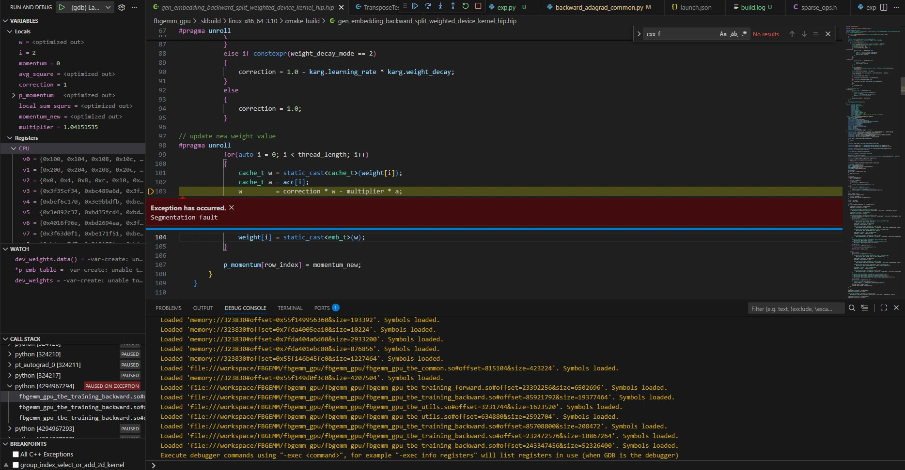
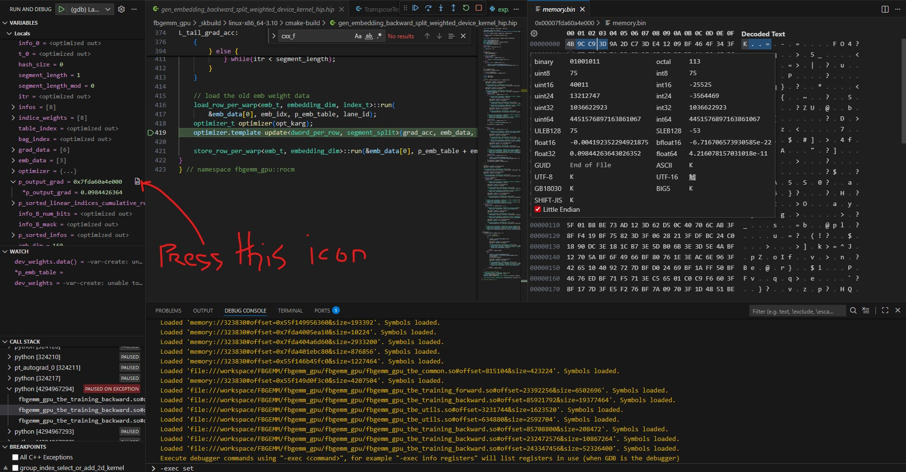

# 🐞 Debugging HIP Kernels
[← Kernel Optimization](../kernel_optimization.md)

---

Reliable performance work starts with kernels that are functionally correct and easy to reason about under a debugger. This section captures practical techniques for finding bugs in HIP kernels that target AMD GPUs, ranging from how you build the binary to how you collect context when something fails on the device.

Use it alongside the data-collection guidance in [GPU profiling](../gpu_profiling/gpu_profiling.md) and [instrumenting code](../instrumenting_code.md).

---

## Debugging without a debugger

### 1. Tracing the kernel launches

Set the `AMD_LOG_LEVEL` environment variable when launching the binary to print verbose information for every kernel (shader) dispatch:
```bash
# Will list all the kernels under "ShaderName" line and all it's inputs
AMD_LOG_LEVEL=3 ./my_binary 

# Filter out only "ShaderName":
AMD_LOG_LEVEL=3 AMD_LOG_MASK=128 ./my_binary 
```

Example output for a single shader is available [here](./assets/amd_log_level.log).

### 2. Fail Fast on the Host

Many “kernel bugs” start as unreported HIP API errors—that is why nearly every HIP host function is marked `[[nodiscard]]`. Enforce error checking and isolate failing launches.

```cpp
#define HIP_CHECK(cmd)                                                      \
    do {                                                                    \
        hipError_t e = (cmd);                                               \
        if (e != hipSuccess) {                                              \
            fprintf(stderr, "HIP error %s (%d) at %s:%d\n",                 \
                    hipGetErrorString(e), e, __FILE__, __LINE__);           \
            abort();                                                        \
        }                                                                   \
    } while (0)

HIP_CHECK(hipLaunchKernelGGL(...));
HIP_CHECK(hipDeviceSynchronize());
```

Tips:
- Check `hipGetLastError()` immediately after the launch to catch deferred parameter validation issues.
- Run under `ROCR_VISIBLE_DEVICES=0` (single GPU) to ensure the offending device is the one you are debugging.
- Use smaller synthetic inputs when reproducing; deterministic, tiny tensors simplify reasoning and make `rocgdb` breakpoints easier to hit.

---

### 3. Device-Side Diagnostics

Sometimes you need the kernel to surface its own context. This might seem naive, but for multinode or multiprocess debugging it is often the fastest way to gain insight.

- **Conditional `printf`**: Gate device prints on a single lane or block to avoid overwhelming the runtime.

  ```cpp
  if (threadIdx.x == 0 && blockIdx.x == 0) {
      printf("iter=%d val=%f\n", iter, val);
  }
  ```

- **Assertions / traps**: Use `assert()` (HIP supplies a device variant) or emit a trap to halt the offending wavefront.

  ```cpp
  if (!isfinite(acc)) {
      asm volatile("s_trap 2"); // collectable by rocprof / rocgdb
  }
  ```

> **Important:** Because the GPU is massively parallel, excessive `printf` usage or traps can drastically slow execution or even deadlock if not carefully managed. Output from multiple threads interleaves, becomes difficult to parse, and can change synchronization behavior enough to mask the original bug.

It is usually a good idea to include the wavefront or block ID in each message so you can correlate prints with execution contexts.

- **Sentinel values**: Initialize output buffers with a known bit pattern and verify on the host after each iteration. Any untouched element exposes diverged control flow quickly.

- **Guard shared memory**: Pad shared memory allocations with canaries and verify them before returning to detect out-of-bounds writes.

These techniques complement the lightweight instrumentation ideas in [instrumenting code](../instrumenting_code.md).

---
### 4. Catching hardware exceptions

If a hardware exception occurs (for example, `trap()` or segmentation fault) set the debug agent before launching the binary:
```bash
HSA_TOOLS_LIB=/opt/rocm/lib/librocm-debug-agent.so.2 \
        ./my_binary
```
This points you to the exact place where the hardware exception occurred and dumps the call stack, registers (scalar, vector, program counter, and more), plus a small memory window around the faulting instruction.

However, the dump can be hard to interpret “as is”. Release binaries are typically built with aggressive optimizations, so instructions have been reordered and inlined, making ISA-to-source mapping difficult. See the build section below for steps that retain symbols and line tables.

An example of a single wave dump is available [here](./assets/hsa_debug_agent.log).

### 5. Build Configurations That Preserve Debug Data

By default, release builds of the libraries strip debug information and apply aggressive optimizations that obscure the source of bugs.

Debuggers and profilers need line information and unmangled symbols. Start by generating a debuggable binary alongside the optimized build. The specifics depend on your build system, but the goals are:
1. Pass `-g -ggdb` (or at least `-gline-tables-only`) to `hipcc`.
2. Keep optimization low (≤ `-O1`) while reproducing the bug; `-O0` gives near 1:1 source-to-ISA mapping.
3. Specify an `--offload-arch` that matches the GPU in the system.


Here are some examples of specifying those flags for different scenarios:

Directly calling hipcc:
```bash
# Example: build a debuggable binary for MI300A
hipcc -g -ggdb -O0  \
      --offload-arch=gfx942 -o kernel_dbg app.cpp
```

Using cmake:
```bash
# Options for DCMAKE_BUILD_TYPE are Debug (-O0 -g), Release (-O3), RelWithDebInfo (-O3 -g) and MinSizeRel 
cmake .. -DCMAKE_BUILD_TYPE=Debug

# Or manually specify the flags
cmake .. -DCMAKE_CXX_FLAGS="-g -ggdb -O0" \
        -DCMAKE_HIP_CXX_FLAGS="-g -ggdb -O0"
```

> Keep in mind that projects might have their own build systems or scripts that override these flags.

You can also append the flags in `CMakeLists.txt` or project-specific `.cmake` helpers if the cache keeps resetting them.

Using setup.py with CMake under the hood:
```bash
python setup.py build_ext -DCMAKE_BUILD_TYPE=Debug

# Or
python setup.py build_ext -DCMAKE_CXX_FLAGS="-g -ggdb -O0" \
        -DCMAKE_HIP_CXX_FLAGS="-g -ggdb -O0"
```

Or manually append flags directly inside `setup.py` (search for the `cxx_flags` / `nvcc_flags` variables).

Verify that your binary has debug information:
```bash
readelf --debug-dump=info <binary_or_library>
# or
nm -a <binary_or_library>
```

Be aware that after turning off optimization some workloads take significantly longer to run. Consider shrinking inputs to a minimal reproducible example.

> **Hint**: If the problem is gone after building with optimization turned off (`-O0`), the issue *might* be related to uninitialized variables or missing synchronization.

> **Hint**: For deeper analysis, add `--save-temps` and `-fverbose-asm` so you can inspect the intermediate assembly annotated with source lines.

### 6. Adding more verbose compile flags

It is usually a good idea to add `-Wall -Wextra -Wpedantic` (and in smaller projects even `-Werror`) if they are not already part of the build. Inspecting warnings carefully often reveals undefined behavior or other hotspots (for example, uninitialized variables). Compiler diagnostics also highlight missed optimizations such as loops that refused to unroll.

### 7. Using address sanitizers

ROCm ships an AddressSanitizer (ASan) runtime that instruments both host *and* HIP device allocations when you compile with Clang/hipcc. It is invaluable for catching use-after-free, heap overflows, and stack-clobbering bugs that may only surface at scale.

> Supported on ROCm 7.0+ (MI200/MI300/CDNA3 and RDNA3 class). Expect noticeably slower kernels because every memory access is checked.

#### Build requirements

```bash
# 1. Compile with ASan enabled and keep debug info
hipcc -g -O1 -fsanitize=address --hip-link \
    --offload-arch=gfx942 -o my_app_asan main.cpp

# 2. Optionally keep host-only symbols for faster iteration
hipcc -g -O1 -fsanitize=address -fno-omit-frame-pointer \
    --offload-arch=gfx942 -c kernels.cpp
```

- `--hip-link` ensures the device-side ASan runtime is linked; without it you will only instrument the host.
- Prefer `-O0`/`-O1` so the instrumentation stays readable. Higher optimizations can fold checks away.
- Ensure every final link step also receives `-fsanitize=address` (for example, `target_link_options(my_target PRIVATE -fsanitize=address)` in CMake); omitting it silently drops the host runtime even if compile flags were set.
- If you build via CMake, add `-fsanitize=address --hip-link` to both `CMAKE_CXX_FLAGS` and `CMAKE_HIP_FLAGS` (or specific targets through `target_compile_options`) and mirror the link option with `target_link_options` or `CMAKE_EXE_LINKER_FLAGS`.
- For Python extensions (`setup.py`, `setuptools`), forward the same flags via `extra_compile_args={'hipcc': ['-g','-O1','-fsanitize=address','--hip-link']}` and `extra_link_args=['-fsanitize=address']` so the module exposes device stack traces when loaded by CPython.

#### Runtime configuration

```bash
export ASAN_OPTIONS="detect_leaks=0:halt_on_error=1: symbolize=1"
export HSA_XNACK=0                # keep default unless your kernel relies on XNACK
export ROCM_ASAN_STACKTRACE=1     # enables device stack traces when available
./my_app_asan <args>
```

- Disable leak detection (`detect_leaks=0`) for long-running training jobs; GPU allocations often outlive the process on exit and produce noise.
- Make sure `llvm-symbolizer` from the same ROCm toolchain is on `PATH` so stack traces contain file/line info.
- If you use multiple GPUs, restrict the run with `ROCR_VISIBLE_DEVICES` to keep logs readable.
- When debugging HIP kernels launched from Python, export `PYTHONMALLOC=malloc` so CPython cooperates with ASan’s allocator wrappers and yields accurate host stack traces.

#### Typical workflow

1. Reproduce the issue with reduced inputs while ASan is enabled. The slowdown can be 2‑5× depending on memory intensity.
2. When ASan reports an invalid access, note the GPU wavefront and PC in the log, then open the same build in `rocgdb` to inspect state around that PC.
3. For race-like symptoms, run an ASan build once with `ASAN_OPTIONS=verbosity=1:detect_stack_use_after_return=1` to flush out latent stack bugs, then disable the extra checks for day-to-day debugging.

Limitations:
- Device-side ASan currently instruments global and shared (LDS) memory. Registers and vector registers are not guarded.
- Kernels that rely on UB (e.g., intentionally reading past bounds for padding) will need guard code or `__attribute__((no_sanitize_address))` annotations on the offending functions.
- Instrumented binaries are not meant for production; always rebuild without `-fsanitize=address` after the bug is fixed.

## Debugging with a debugger

### 1. Using the rocGDB CLI

`rocgdb` (a ROCm-enhanced GDB build) lets you halt on device instructions, inspect registers, and unwind waves. All standard GDB commands apply, with a few AMDGPU-specific extensions:

1. "Threads" are "Waves" for GPU. So similar to switching between threads in multithreaded CPU code debugging scenario with `th <id>` command, you will switch between waves. To switch between lanes, use `lane <id>` command.
2. Specify `set amdgpu precise-memory on` to get more accurate.
3. If you want to step through the code deterministically, enable `set scheduler-locking step`.

Common workflow looks like this:
1. Launch under the debugger: `rocgdb ./kernel_dbg` or `rocgdb --args ./kernel_dbg <args>`. This starts rocGDB and halts the process immediately.
2. Set breakpoints on kernel entry (`break MyKernel`) or function (`break my_function`) before you launch it.
3. Execute the `run` command to start the program.
4. When the breakpoint is hit, run `set scheduler-locking step` to single-step safely, or set another breakpoint, `set scheduler-locking on`, and `continue`.
5. Continue stepping through the code, switching between lanes/waves, and inspecting variables/registers/memory as needed.


> Ensure you compiled with matching `--offload-arch` for the GPU present; otherwise `rocgdb` cannot map PC to source.


#### Common rocGDB / GDB commands

| Command | Purpose |
| --- | --- |
| `tui enable` / `tui disable` | Toggle the terminal UI split that shows source/assembly alongside the command prompt. |
| `break MyKernel` / `break my_kernel_function` / `break file.hip:42` | Set breakpoints on kernel entry, function or a specific source line before launching the workload. |
| `delete 1` / `disable 1` / `enable 1` | Remove or temporarily toggle breakpoint **1** when stepping through multiple kernels. |
| `run` / `continue` / `finish` | Start the program, resume after a breakpoint, or run until the current frame returns. |
| `stepi` / `nexti` | Single-step one GPU instruction at a time (entering vs skipping calls). |
| `info amdgpu waves` | List active GPU waves (think “threads”) and their state. |
| `bt` or `backtrace` | Show the call stack for the current wave. |
| `thread <id>` / `lane <id>` | Switch to a specific wave and then to an individual lane inside that wave. |
| `thread apply all bt` | Collect backtraces from every wave to spot the one stalled at a barrier or trap. |
| `info registers` / `info reg vgpr0` | Dump scalar and vector registers for the current wave; add `set amdgpu precise-memory on` for accurate memory refs. |
| `disassemble /m` | Show disassembly mixed with source lines around the current PC. |
| `x/16gx $vgpr0` | Examine GPU memory/register contents directly; adjust the format/count to match your data width. |
| `set logging on` | Persist the session transcript to a file—handy when sharing repro steps. |

---

### 2. Using rocGDB with a GUI (VS Code)


vscode supports debugging protocol and provides frontend to use gdb/rocgdb. You need to specify launch configuration in `.vscode/launch.json` to use it. For example:
```json
{
    "version": "0.2.0",
    "configurations": [
        {
            "name": "(gdb) Launch",
            "type": "cppdbg",
            "request": "launch",
            // In case your binary is python,
            // full path should be specified
            "program": "<path_to_binary>",
            "args": [
                "<arg1>",
                "<arg2>",
            ],
            "stopAtEntry": false,
            // "cwd" might be also "${workspaceFolder}" in 
            // common scenarios
            "cwd": "${fileDirname}",
            "environment": [],
            "externalConsole": false,
            "MIMode": "gdb",
            "miDebuggerPath": "/opt/rocm/bin/rocgdb",
            "setupCommands": [
                {
                    "description": "Enable pretty-printing for gdb",
                    "text": "-enable-pretty-printing",
                    "ignoreFailures": true
                },
                {
                    "description": "Set Disassembly Flavor to Intel",
                    "text": "-gdb-set disassembly-flavor intel",
                    "ignoreFailures": true
                }
            ]
        }
    ]
}

```
Hit `F5` to start debugging and you should see something like this:



Now you can proceed with the standard debugging process. rocGDB commands can be executed in the debug console with the `-exec` prefix. For example:
```bash
# In vscode debug console
-exec set scheduler-locking step
```

A handy option is to use the memory view in the GUI. click the small page icon next to a pointer variable in the Locals pane and install the memory-view VS Code extension (it prompts the first time you open a memory view):



#### Debugging Python front-ends that launch HIP kernels

When the HIP kernels are triggered from a Python script (for example, PyTorch or custom ctypes bindings), create a compound configuration so VS Code spawns the Python debugger and attaches rocGDB to the HIP-enabled extension once the process starts:

```jsonc
{
    "version": "0.2.0",
    "configurations": [
        {
            "name": "Python (debugpy)",
            "type": "python",
            "request": "launch",
            "program": "${workspaceFolder}/train.py",
            "env": {
                "PYTORCH_HIP_ALLOC_CONF": "garbage_collection_threshold:0.8"
            },
            "console": "integratedTerminal",
            "justMyCode": false
        },
        {
            "name": "rocgdb attach",
            "type": "cppdbg",
            "request": "attach",
            "processId": "${command:pickProcess}",
            "MIMode": "gdb",
            "miDebuggerPath": "/opt/rocm/bin/rocgdb",
            "setupCommands": [
                { "text": "-enable-pretty-printing" },
                { "text": "-gdb-set disassembly-flavor intel" }
            ]
        }
    ],
    "compounds": [
        {
            "name": "Python + rocGDB",
            "configurations": [
                "Python (debugpy)",
                "rocgdb attach"
            ]
        }
    ]
}
```

Workflow: start the compound configuration so `debugpy` pauses on the Python breakpoint you set near the HIP call. Once the process is running, the `cppdbg` configuration prompts for the Python PID; pick it to attach rocGDB, then use the Debug Console (`-exec break MyKernel`) to manage GPU breakpoints while still stepping through Python frames.

#### Debugging host-only C++ binaries from the same workspace

For pure C++ HIP launchers built via CMake or Bazel, add another `cppdbg` configuration whose `program` points at the compiled binary and whose `cwd` equals the build tree. This lets you step through host setup code and GPU kernels without leaving VS Code:

```jsonc
{
    "name": "rocgdb (host binary)",
    "type": "cppdbg",
    "request": "launch",
    "program": "${workspaceFolder}/build/bin/my_driver",
    "args": ["--config", "debug.yaml"],
    "cwd": "${workspaceFolder}/build",
    "environment": [
        { "name": "ROCR_VISIBLE_DEVICES", "value": "0" },
        { "name": "HIP_VISIBLE_DEVICES", "value": "0" }
    ],
    "MIMode": "gdb",
    "miDebuggerPath": "/opt/rocm/bin/rocgdb",
    "setupCommands": [
        { "text": "-enable-pretty-printing" },
        { "text": "-gdb-set disassembly-flavor intel" }
    ]
}
```

Use VS Code’s “Add Configuration…” command to place both Python and C++ entries in the same file so you can toggle between them as the repro changes.

> Tip: The marketplace extension **Python C++ Debugger** (`benjamin-simmonds.pythoncpp-debug`) wraps the two-debugger workflow above. After installing it, run the provided command palette entry to launch a Python script and automatically attach rocGDB (via `cppdbg`) to the same process once the interpreter loads your HIP extension. This is handy when you frequently bounce between Python control logic and native kernels.

### 3. MPI and multiprocess scenarios

Large training or benchmarking jobs often launch one HIP process per GPU through `mpirun`, `srun`, or `torchrun`. That improves throughput but complicates debugging because every rank is an independent process with its own waves. A reliable workflow usually combines tighter launch control, deterministic rank-to-device mapping, and scripted debugger sessions so you can reproduce the failure on fewer ranks.

#### 3.1 Map ranks to GPUs deterministically

Pin each MPI rank to a specific GPU so the failing kernel always executes on the same device:

```bash
mpirun -n 4 --map-by ppr:1:NUMA --bind-to core \
    bash -c 'export ROCR_VISIBLE_DEVICES=${OMPI_COMM_WORLD_LOCAL_RANK}; \
                     export HIP_VISIBLE_DEVICES=${OMPI_COMM_WORLD_LOCAL_RANK}; \
                     exec ./my_mpi_binary --cfg debug.yaml'
```

* Keep inputs small (micro-batches, truncated sequence lengths) so each rank reaches the buggy kernel quickly.
* Add `--tag-output` (OpenMPI) or `-l` (MPICH) to prefix stdout/stderr with rank IDs; this makes `printf`/ASan output tractable.

#### 3.2 Launch only selected ranks under `rocgdb`

Debugging four or eight ranks in separate terminals is unwieldy. Let healthy ranks run normally and start only the suspect rank(s) under the debugger. One approach is to gate on the MPI rank inside the launch script:

```bash
cat > /tmp/rocgdb_rank0.cmd <<'EOF'
set pagination off
set amdgpu precise-memory on
break MyKernel
run
EOF

mpirun -n 4 bash -c '
    export ROCR_VISIBLE_DEVICES=${OMPI_COMM_WORLD_LOCAL_RANK}
    if [[ ${OMPI_COMM_WORLD_RANK} -eq 0 ]]; then
        exec rocgdb --command=/tmp/rocgdb_rank0.cmd --args ./my_mpi_binary --cfg debug.yaml
    else
        exec ./my_mpi_binary --cfg debug.yaml
    fi
'
```

This keeps a single interactive `rocgdb` session while other ranks proceed at speed. Repeat with different rank IDs if the failure only reproduces on later ranks (for example, when data parallelism maps each shard to a rank-specific dataset slice).

#### 3.3 Collect device dumps per rank

When a crash reproduces only at large scale, start each rank with the debug agent so you can harvest per-rank dumps post-mortem without attaching a debugger:

```bash
mpirun -x HSA_TOOLS_LIB=/opt/rocm/lib/librocm-debug-agent.so.2 \
             -x ROCP_TOOL_CONTEXT_ID=$OMPI_COMM_WORLD_RANK \
             -n 8 ./my_mpi_binary --cfg stress.yaml
```

`ROCP_TOOL_CONTEXT_ID` (or a similar env var, depending on your tooling) tags the dump files with the MPI rank so you can align them with the failing process. Pair this with `ROCR_VISIBLE_DEVICES` to ensure the wave dumps map back to the right GPU.

#### 3.4 Attaching to a running MPI job

If the failure is long-lived (for example, a hang at a barrier), attach `rocgdb` to the offending process using its PID:

```bash
ps -eo pid,comm,cmd | grep my_mpi_binary
rocgdb --pid <pid_of_rank_3>
```

Inside `rocgdb`, use `info amdgpu waves` to see if one rank stalled at an `s_barrier` while others made progress. If multiple nodes are involved, wrap the attach command inside `pdsh`/`clush` so you can collect stacks from every node simultaneously.

#### 3.5 MPI-specific hygiene

- Force deterministic rendezvous: set `RCCL_ENABLE_SCHEDULING=0` or equivalent knobs so collective scheduling does not reorder kernels between runs while you are debugging.
- Disable retry logic temporarily (`NCCL_IB_HCA`, `UCX_RC_VERBS_TIMEOUT`) to surface the actual failure instead of silent retries.
- Persist logs per rank (`LOG_DIR=/tmp/logs/$OMPI_COMM_WORLD_RANK`) so you can diff host traces alongside device dumps.
- When running under job schedulers (Slurm/Flux), prefer `srun --pty` or `flux run --setattr=etc` so signal delivery (Ctrl+C) reaches every rank; otherwise stray ranks may continue holding the GPU.

#### 3.6 Drive multiple `rocgdb` sessions with `xterm`

When you must inspect several ranks simultaneously (for example, to compare wavefront state on ranks 0, 1, and 2), spin up lightweight `xterm` windows so each debugger stays interactive without tab juggling:

```bash
mpirun -n 3 bash -c '
    export ROCR_VISIBLE_DEVICES=${OMPI_COMM_WORLD_LOCAL_RANK}
    if [[ ${OMPI_COMM_WORLD_RANK} -le 2 ]]; then
        cmd=/tmp/rocgdb_rank${OMPI_COMM_WORLD_RANK}.cmd
        cat > ${cmd} <<EOF
set pagination off
break MyKernel
run
EOF
        exec xterm -T "rank-${OMPI_COMM_WORLD_RANK}" -hold \
                 -e rocgdb --command=${cmd} --args ./my_mpi_binary --cfg debug.yaml
    else
        exec ./my_mpi_binary --cfg debug.yaml
    fi
'
```

Tips:
- Use `xterm -geometry 120x40+X+Y` to arrange windows in a grid, or substitute `kitty`/`alacritty` if those are standard on your cluster images.
- If the cluster disallows X11 forwarding, pair this approach with `xpra`/`tmux` on the login node so GUI forwarding stays stable while the job queue starts your allocation.

Once the issue is isolated to a single rank, flip back to the single-process techniques from the previous sections to iterate faster.

### Bonus: reverse debugging

GDB/rocGDB can record execution and step backward through the recorded instructions, but there is little real-world experience using this on large HIP applications. More information can be found here:

https://rocm.docs.amd.com/projects/ROCgdb/en/latest/ROCgdb/gdb/doc/gdb/Process-Record-and-Replay.html

## References

1. https://rocm.docs.amd.com/en/latest/reference/env-variables.html#debug-variables
2. https://amd.atlassian.net/wiki/spaces/MLSE/pages/744161841/How+to+debug+like+a+ROCkstar
3. https://rocm.docs.amd.com/projects/ROCgdb/en/latest/
4. https://amd.atlassian.net/wiki/spaces/MLSE/pages/744174777/FBGEMM+Learning (section 8)

[← Kernel Optimization](../kernel_optimization.md)