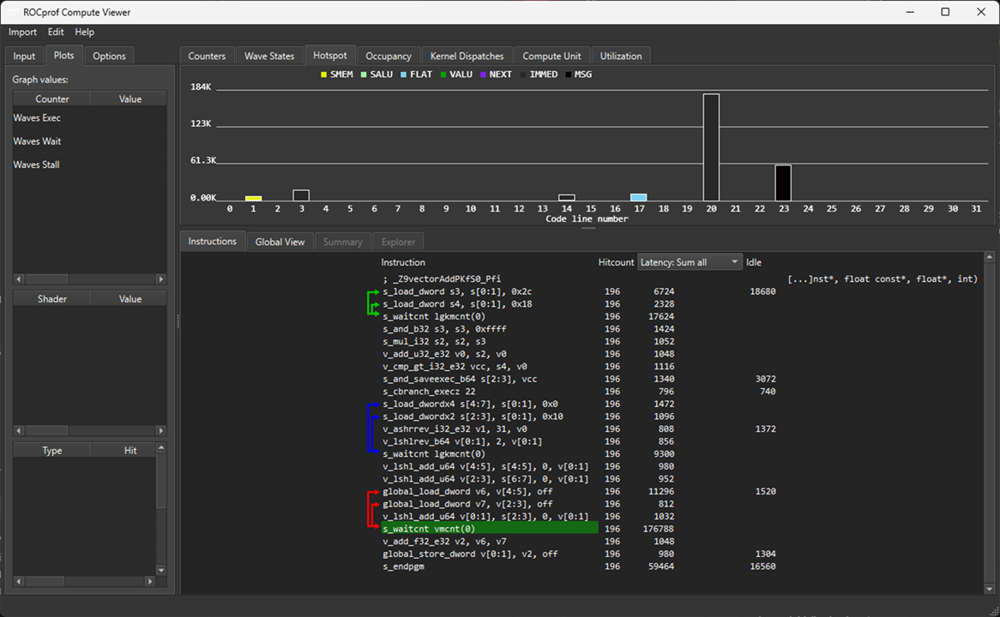

# 📊 Identifying hot spots in a kernel using thread tracing
[<- Back to Rocprof v3](rocprofv3.md)

---

Profiling is an essential step to help you identify performance bottlenecks and optimize your GPU kernels effectively.

In this guide, we’ll start with a simple vector addition kernel. You will learn how to profile this kernel to locate hot spots and understand where optimizations are needed.


## 🧠 Overview

**ROCprofV3** is AMD’s **performance profiling tool** for GPUs, part of the ROCm ecosystem. It enables developers to:

- Measure **kernel execution time**  
- Identify **bottlenecks** in compute or memory  
- Track **wavefront occupancy**, memory throughput, and instruction utilization  

**Hotspots** are sections of your code where the GPU spends the most time. Identifying these allows you to optimize kernels effectively.

## ⚙️ Install ROCprofV3

ROCprofV3 is included with **ROCm** (version 5.0+). To install:

```bash
sudo apt update
sudo apt install rocm-dbg rocm-profiler
```


## 📝 Example kernel
 This HIP kernel performs element-wise addition of two vectors `A` and `B` on the GPU, storing the result in `C`, demonstrating basic GPU parallelism, memory management, and thread indexing.


```cpp

#include <hip/hip_runtime.h>
#include <stdio.h>

__global__ void vectorAdd(const float* A, const float* B, float* C, int N) {
    int idx = blockIdx.x * blockDim.x + threadIdx.x;
    if (idx < N) {
        C[idx] = A[idx] + B[idx];
    }
}

int main() {
    int N = 1 << 20; // 1 million elements
    size_t size = N * sizeof(float);

    float *h_A = (float*)malloc(size);
    float *h_B = (float*)malloc(size);
    float *h_C = (float*)malloc(size);

    // Initialize vectors
    for (int i = 0; i < N; i++) {
        h_A[i] = i * 1.0f;
        h_B[i] = i * 2.0f;
    }

    float *d_A, *d_B, *d_C;
    hipMalloc(&d_A, size);
    hipMalloc(&d_B, size);
    hipMalloc(&d_C, size);

    hipMemcpy(d_A, h_A, size, hipMemcpyHostToDevice);
    hipMemcpy(d_B, h_B, size, hipMemcpyHostToDevice);

    int threads = 256;
    int blocks = (N + threads - 1) / threads;

    hipLaunchKernelGGL(vectorAdd, dim3(blocks), dim3(threads), 0, 0, d_A, d_B, d_C, N);

    hipMemcpy(h_C, d_C, size, hipMemcpyDeviceToHost);

    hipFree(d_A);
    hipFree(d_B);
    hipFree(d_C);
    free(h_A);
    free(h_B);
    free(h_C);

    return 0;
}

```

Compile this code with...

```bash
hipcc -O3 vector_add.cpp -o vector_add
```
As we are interested in identifying hot spots in the kernel we compile with the thread tracing enabled using the following options...

```bash
rocprofv3 --att -- ./vector_add
```

This will generate key metrics that can be used to help understand the efficiency of code. The '--att' option generates a UI folder which can be opened using the [ROCprof Compute Viewer](https://rocm.docs.amd.com/projects/rocprof-compute-viewer/en/latest/). For the above kernel we can then identify the most impactful section of the kernel code.



This illustrates that the majority of this kernel's time is spent in the 's_waitcnt vmcnt(0)' instruction. ([See Rocm Blog on AMD instructions](https://rocm.blogs.amd.com/software-tools-optimization/amdgcn-isa/README.html))

You can see from the above hot spot analysis that the kernel hot spot is caused by the kernel waiting for global load to complete before adding the values and then storing in global memory.


---

[-> Improving Occupancy](../../occupancy/improving_occupancy.md)

---
[<- Back to Rocprof v3](rocprofv3.md)
