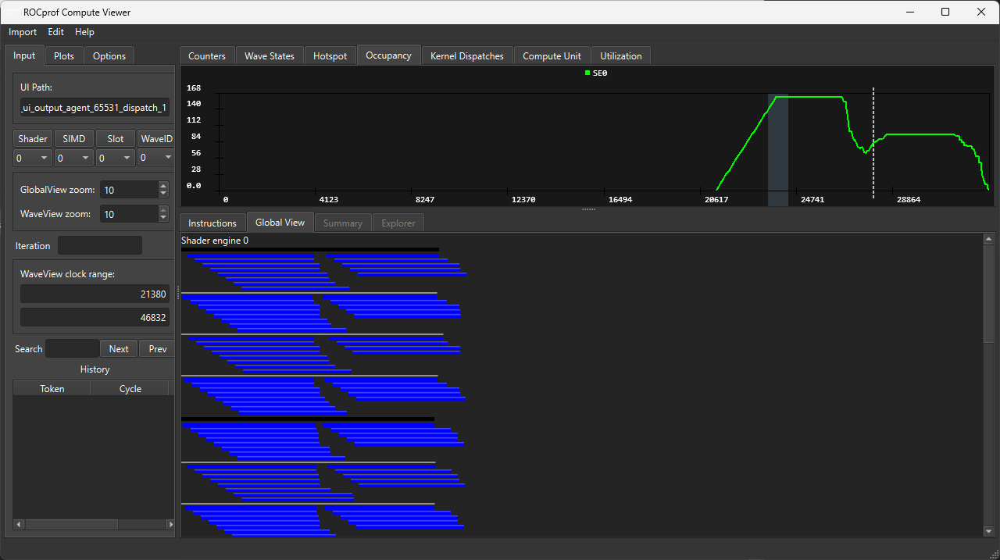

# 🧠 Improving GPU occupancy

[← kernel optimiztation](../kernel_optimization.md)

---

Occupancy is a critical concept in GPU kernel optimization. It refers to the ratio of active warps (wavefronts on AMD GPUs) per compute unit (CU) to the maximum number of possible active warps.

## 🎯 Why Occupancy Matters

When optimizing a kernel, low occupancy can mean:

- Idle compute units
- Poor latency hiding (e.g., when waiting for global memory)
- Underutilized hardware resources

But too much occupancy can cause:

- Register or shared memory pressure
- Reduced cache efficiency
- Thread-level contention

The max occupancy of kernel is determined in part by the complexity of a kernel, namely the number of registers required. There is a physical limit per wavefront scheduler.

## 🧩 Factors That Affect Occupancy

| Factor                       | Description                                                                               | Optimization Strategy                                                                                                     |
| ---------------------------- | ----------------------------------------------------------------------------------------- | ------------------------------------------------------------------------------------------------------------------------- |
| **Registers (VGPRs)**        | Each wavefront consumes registers. Too many registers per thread limit wavefronts per CU. | Reduce register pressure: inline small functions, use fewer temporaries, apply `__attribute__((noinline))` strategically. |
| **Local Data Store (LDS)**   | Shared memory per workgroup can limit number of resident wavefronts.                      | Minimize shared memory usage; reuse buffers; double-buffer only if beneficial.                                            |
| **Workgroup Size**           | Determines how many wavefronts per workgroup.                                             | Choose workgroup sizes that evenly divide wavefront size (multiples of 64).                                               |
| **Barrier Synchronization**  | Excessive barriers reduce concurrency.                                                    | Use fine-grained sync (wavefront-level ops) instead of block-wide `barrier()`.                                            |
| **Kernel Launch Parameters** | Affects scheduling across CUs.                                                            | Adjust grid/workgroup dimensions to ensure good CU utilization.                                                           |


## How to determine the max occupancy of your hardware and kernel

In order to improve the occupancy it is necessary to understand the max occupancy of your hardware, namely the number of compute units (CUs) multiplied by the maximum concurrent wavefronts supported by each CU. The number of CUs is a constant, however the number of concurrent wavefronts is limited by the capacity of the wavefront schedular and the complexity of the kernel. There are a finite number of registers associcated with a CU which are shared amongst all wavefronts in flight. Therefore, more complicated kernels may require more registers and limit the number of possible concurrent wavefronts. This can lead to under utilisation of a CU's compute capacity.

The HIP runtime API provides some useful API commands for determining the maximum achievable occupancy for a kernel. The following API call can be used to progammatically return the max occupancy, per CU, that can be achieved for kernel.

```cpp
hipError_t hipOccupancyMaxActiveBlocksPerMultiprocessor	(int * 	numBlocks,
                                                         const void * 	f,
                                                         int 	blockSize,
                                                         size_t 	dynSharedMemPerBlk)	
```

The AMD profiling tools can also be used to extract detailed information regarding occupancy.



You can also see that for this kernel, targeting MI300 hardware, that consistantly occpuy all compute units. 

## 🔬 How to improve occupancy


To maximize occupancy on AMD GPUs, start by minimizing per-thread register usage and shared memory (LDS) consumption. Excessive use of either limits the number of thread blocks that can run concurrently. Use the __launch_bounds__ attribute in your kernel to constrain threads per block and guide register allocation. Choose thread block sizes that are multiples of the wavefront size (64 or 32) to ensure full wavefront efficiency. Use the hipOccupancyMaxActiveBlocksPerMultiprocessor() API to calculate the optimal configuration based on current resource usage. Profile your kernel using rocprofv3 to examine actual occupancy, register pressure, and memory stalls. Iterate by adjusting launch parameters and simplifying computation patterns to reduce pressure on resources. Aim for high occupancy only when it improves performance, as sometimes lower occupancy with more efficient execution yields better results.


## 🔢 Step-by-Step: Improving Occupancy
### Step 1: Profile Baseline Occupancy

Use rocprof or rocm-smi to collect occupancy data:

Look for metrics like:
- SQ_WAVES: Number of active wavefronts
- WAVES_PER_CU: Average number of waves per compute unit
- VGPR_PER_THREAD, LDS_PER_BLOCK: Resource usage indicators

### Step 2: Reduce Register Pressure

Registers (VGPRs) are often the first occupancy bottleneck.

**Tips**:
- Use compiler flags to control register allocation:
```
hipcc -mllvm -amdgpu-num-vgpr=64 mykernel.cpp
```

- Avoid excessive loop unrolling.

- Minimize use of large structs or arrays in registers.

- Use ```__attribute__((always_inline))``` or ```__attribute__((noinline))``` to tune inlining.

**Example**:
```cpp
__device__ float heavy_compute(float a, float b) {
    return a * b + sqrtf(a + b); // May generate many registers
}
```
can be simplified or inlined only when necessary.

### Step 3: Optimize Shared Memory (LDS) Usage

LDS is limited (64 KB per CU). Too much usage can reduce wavefront count.


## ⚙️ How Imbalanced Workloads Affect Occupancy on AMD GPUs

When workloads are imbalanced, AMD GPUs can suffer from reduced occupancy — meaning fewer wavefronts are active per compute unit (CU), which in turn limits performance and efficiency.

### ⚖️ 2. What Causes Imbalanced Workloads

Workload imbalance happens when some parts of the GPU do more work than others.
This can occur due to:

- Uneven loop iterations or early exits
- Irregular data patterns (e.g., sparse matrices, adaptive grids)
- Divergent branches within a kernel
- Non-divisible problem sizes that don’t evenly map to CUs

🧠 Example:
If half of your work-groups finish early, the compute units they occupied become idle, while others continue running.

### 📉 How Imbalance Reduces Occupancy

Even if theoretical occupancy is high, effective occupancy drops when not all CUs or wavefronts are active.

- Idle CUs: Some finish early, leaving silicon unused.
- Uneven wavefront activity: Divergence or irregular loops cause wavefronts to finish at different times.
- Fewer ready wavefronts: The scheduler can’t hide latency as effectively, hurting instruction issue rates.

Result: The GPU spends more time waiting and less time computing.

### 🛠️ Mitigation Strategies

To keep occupancy high and workloads balanced:

- Distribute work evenly across work-groups.
- Pad or adjust problem sizes to fit GPU granularity.
- Minimize divergence in control flow.
- Use dynamic scheduling (e.g., persistent threads or work stealing).

## 📚 References

[HIP Runtime API Reference : Occupancy](https://rocm.docs.amd.com/projects/HIP/en/latest/doxygen/html/group___occupancy.html)

---
[← kernel optimiztation](../kernel_optimization.md)
