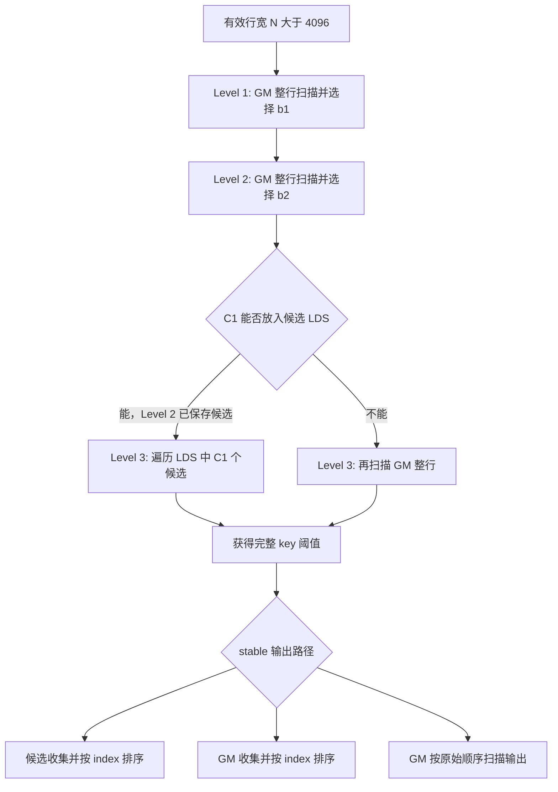

# GLM-5.2 真实 logits 下的 FlyDSL one-block radix top-k 优化分析

日期：2026-09-14。第 1～17 节保留初始分析及 O1/O2/O3/O4 历史记录。第 18 节起以 `22cb63ce6fc2b502b0081af0334f97a75538d192`（本轮任务开始时的 kernel）为新基线，继续逐点实现和验证。当前新增首轮 float4 / wave 有限聚合、stable 位图排序及按工作量回退、排序后 gather values、去除中间 index 复制及重复 barrier。每项采纳/撤回理由见第 18～28 节，最终累计结果见第 29 节。原有 14-bit radix、48K 缓存输出门槛及 dispatch 保持不变。全部已采纳改动和从较早版本算起的总收益见第 30 节。

分析对象：[radix_topk_one_block.py](../aiter/ops/flydsl/kernels/radix_topk_one_block.py)。调用配置以 prefill、FP32 logits、`k=2048`、`stable=True`、`values=None` 为主。

第 1～14 节的“当前路径”指初始提交中的 `12+10+10`、自动 replicas 基线。本次实现保留 gfx950 的 `14+10+8`、单份首轮 histogram 配置；重新计算的 C1、C2、早停率见第 15 节，上一阶段的实测收益见第 16 节，本轮累计收益见第 29 节。不同 radix 配置不能直接共用基线统计。

第 1～14 节记录初始源码分析、真实输入的 CPU 统计、优化设计和 GPU 验证方案；其中的方案当时尚未实现。第 15 节保留 O1 实现、O3 特化撤回时的历史记录。第 16 节记录统一长度门槛的 O3 实现、正确性和性能验证。候选数量、分支命中率和 atomic 数量估算不能直接换算成加速比。

## 1. 核心判断与优先级

所有有效行宽 ≥50,000 的输入，在这个 one-block kernel 内都会进入 `run_streaming_path`。现有长行路径的第一、第二轮均扫描整行 GM。第二轮可以把首轮选中桶压缩到 LDS，使第三轮从 LDS 读取候选。

必须区分三个数量：

- **整行长度 N**：决定是否进入短行全量缓存路径，门槛固定为 4096。
- **首轮边界桶大小 C1**：决定候选能否缓存在 LDS，容量由配置计算。
- **第二轮边界桶大小 C2**：决定还需要细分多少边界元素；当前第三轮仍遍历 C1 或整行 N，只对其中符合前缀的 C2 个元素累加。

建议先实施能独立归因的小改动，再开展选择算法改造：

| 编号 | 优化 | 主要节省 | 适用条件 | 建议顺序 |
|---|---|---|---|---|
| O1 | stable 模式允许第一、第二轮精确提前结束 | 第三轮 LDS 工作；溢出路径可能少一次 GM 扫描 | 边界桶恰好全部入选 | 第一批 |
| O2 | 首轮位宽、histogram replica 布局和数量调优 | 桶集中、热点地址与 bank 冲突 | 高集中度输入 | 第一批 |
| O3 | stable 输出门槛与候选排序路径调优 | 最终整行 GM 扫描及逐 tile 同步 | 已保留候选和确定入选元素 | 第一批 |
| O4 | 小 C2 使用 wave 内精确选择 | 1024-bin 第三轮 histogram、block scan | C1 已缓存、C2 很小 | 第二批 |
| O5 | 有限的 wave/线程内 histogram 聚合 | 首轮 atomic 指令与热点更新 | 重复桶足够多 | 第二批，按分布验证 |
| O6 | 候选压缩计数器聚合、LDS 容量调优 | 单地址 atomic、候选溢出引起的重扫 | 压缩成本或溢出占比高 | profiler 支持后实施 |
| O7 | 抽样阈值、精确过滤、LDS top-k | 首轮全量 histogram，可能减少 GM 扫描 | 过滤后候选数量落在容量内 | 算法原型 |
| O8 | 按数值范围构建自适应粗桶 | 首轮符号/指数集中导致的热点 | 少数原始 radix 桶占据大多数元素 | 算法原型 |

当前完整快照上，O1 主要省 LDS 处理，O3 才直接针对最终 GM 重扫。对跨层统计中高度集中的行，O2、O5、O7、O8 更值得验证。不同分布不应共用一个未经验证的瓶颈结论。

## 2. 数据来源、统计口径与适用范围

### 2.1 采集位置和文件

数据目录：`/shared/data/amd_int/glm52_topk_logits`。

采集点是 `atom/models/deepseek_v2.py` 中 `top_k_per_row_prefill()` 的入参。GLM-5.2 此处使用 deepseek_v2 路径。采集 prompt 长度为 112,018 tokens。

| 文件 | 实际内容 | 可以回答的问题 |
|---|---|---|
| `topk_wide.jsonl` | 只采样有效行宽 ≥50,000 的行，覆盖多个调用 | 跨调用分布、kth 分数、边界间隔 |
| `real_logits.pt` | 一份 `8192 × 65536` FP32 输入及 `rowStarts`、`rowEnds` | 对这份输入完整计算 C1、C2、tie、分支条件 |
| `README.md` | 采集说明、生产参数、历史 A/B | 解释来源与测试范围 |

JSONL 有 800 条记录；每条内容完整重复 4 次。精确去重后为 **200 条调用记录、1,579 条行统计**，原文件展开后为 6,316 行。这里不推断重复原因，也不把重复项当作独立样本。

`6316 / 200` 不能作为单次 kernel 的行数。日志只记录部分采样行，真实 `numRows` 应读取各记录的 `shape[0]`。该日志包含 256、3328、4242、4736、5376、6528、8192 等调用行数。

完整张量的物理行宽为 65,536，有效行宽却是 **49,153～57,344**。其中 **7,345 行**满足 ≥50,000 的过滤条件。112,018 是完整 prompt 长度，不能据此把这份快照的每一行视作 112,018 个有效元素。

### 2.2 用户提供的分布和历史耗时

以下保留用户提供的参考口径。耗时属于此前测试，本文没有重新测量；正式 A/B 需补齐行数、stable 配置、GPU、源码版本和计时方式。

| 数据 | 首轮最大桶占比 | 非空桶 | 历史 FlyDSL / HIP |
|---|---:|---:|---:|
| randn | 0.029 | 232 | 182 / 235 µs |
| all_in_0.9_1.0 | 0.627 | 2 | 356 / 411 µs |
| k_scores_ge_0.9 | 0.980 | 3 | 872 / 885 µs |
| softmax_pmax_0.9 | 1.000 | 2 | 910 / 886 µs |
| REAL 最好的层 | 0.058 | 227 | 待统一配置回放 |
| REAL 中位层 | 0.289 | 28 | 待统一配置回放 |
| REAL 最差的层 | 0.854 | 5 | 待统一配置回放 |

| 层 | min | p50 | p90 | p99 | max | std |
|---|---:|---:|---:|---:|---:|---:|
| 最好的层 | -5.0 | -0.7 | 8.6 | 11.0 | 16.3 | 4.2 |
| 中位层 | -122.2 | -84.3 | -69.3 | -52.6 | 44.2 | 11.0 |
| 最差的层 | 57.9 | 67.6 | 71.1 | 74.0 | 84.0 | 2.7 |

这些是 softmax 前的真实 logits。集中主要与数值量级和原始 FP32 分桶方式有关，不能用概率分布的解释直接代入。

数据 README 说明采集使用重复文本的合成 prompt、冷启动、无前缀缓存。这批数据可以验证对应输入上的行为；生产 agentic 负载的行数、缓存命中和文本分布还需要单独覆盖。README 中 1007.6 µs / 1040.3 µs 的 FlyDSL / HIP 数字也属于历史测量，不能作为本文优化的新结果。

### 2.3 CPU 重新统计结果

使用与 kernel 相同的 FP32 ordered-key 编码，对完整张量的每行有效区间计算。下面的分位数按行统计；与用户表中按层汇总的值不要求相同。

| 指标 | 全部 8192 行，中位数 | 宽度 ≥50K 的 7345 行，中位数 | ≥50K 行 P90 | ≥50K 行最大值 |
|---|---:|---:|---:|---:|
| 有效行宽 N | 53,248.5 | 53,672 | 56,609.6 | 57,344 |
| 首轮最大桶占比 | 8.50% | 8.30% | 15.63% | 22.59% |
| 首轮边界桶 C1 | 1,147 | 1,149 | 1,831 | 5,898 |
| 第二轮边界桶 C2 | 2 | 2 | 4 | 12 |
| 第二轮最大桶元素数 | 6 | 6 | 8 | 22 |

| 条件 | 全部 8192 行 | 宽度 ≥50K 的 7345 行 |
|---|---:|---:|
| C1 > 4096 | 512 | 459 |
| C1 > 7403 | 0 | 0 |
| C1 > 8427 | 0 | 0 |
| 第一轮即可确定全部成员 | 0 | 0 |
| 第二轮即可确定全部成员 | 4,644，56.7% | 4,159，56.6% |
| 相等值组跨越第 k / k+1 名 | 6 | 5 |
| 有效行宽 ≥65536 | 0 | 0 |

“第二轮即可确定全部成员”是逻辑条件命中数，不代表当前 stable kernel 已执行提前退出。

去重后的跨调用日志另有以下统计：

- 首轮最大桶占比的行中位数约 28.21%，最大值约 88.41%。
- kth 分数中位数约 -51.4313，kth gap 中位数约 0.00176239。
- 2 / 1579 个采样行记录了零 gap。
- 用 `kth_value - kth_gap` 还原相邻 FP32 边界值，推算 771 / 1579，即约 48.8% 的行在高 22 位处已分离边界。这是日志推算值；应在完整跨层张量上复核。

完整张量的最大桶占比最高约 22.74%，没有覆盖日志中的 85% 以上集中度。不能用它单独证明最差层的优化效果，也不能从 JSONL 的分位数精确恢复所有行的 C1、C2 和 lane 内分布。

## 3. 当前 kernel 的工作方式

### 3.1 FP32 编码和三个 radix 阶段

`ordered_key()` 将 FP32 位模式转换为按数值递增的无符号有序 key。实现中使用 Int32 保存位模式，完整 key 比较时需按源码处理符号位。

长行 radix 为 `12 + 10 + 10`：

| 阶段 | 提取方式 | 桶数 | 参与 histogram 的元素 |
|---|---|---:|---|
| Level 1 | `key >> 20` 的高 12 位 | 4096 | 全部 N 个 |
| Level 2 | `(key >> 10) & 1023` | 1024 | 首轮选中桶中的 C1 个 |
| Level 3 | `key & 1023` | 1024 | 前两轮选中前缀内的 C2 个 |

FP32 的高 12 位包含符号、指数和 3 位尾数。在 `[64,128)` 中，一个首轮桶的数值宽度为 8；在 `[8,16)` 中为 1。因此同样的标准差，在不同数值量级上可能产生很不同的桶集中度。

定义：

```text
H1[b] = 首轮桶 b 的元素数
pmax  = max(H1) / N
b1    = 包含第 k 大 key 的首轮桶
A1    = 所有高于 b1 的桶的元素数
C1    = H1[b1]
r1    = k - A1

b2    = 在 b1 内继续选择出的第二轮桶
A2    = b1 内高于 b2 的元素数
C2    = b2 的元素数
r2    = r1 - A2
```

`C2 == r2` 表示第二轮边界桶全部入选。第三轮结束后，再定义 `E` 为等于完整阈值 key 的元素数、`r3` 为还需从该相等组选择的数量；只有 `E > r3` 时才需要在相等组中截取较小 index。

注意 `_SELECTED_BUCKET_COUNT` 在每轮都会被覆写。第二轮之后它表示 C2，但 `candidate_count` 在本文的 stable/k=2048 路径中仍表示 C1。

### 3.2 4096 门槛与候选容量是两个判断

主控制流：

```text
N <= k       → 直接复制、补齐
k < N <=4096 → run_cached_path，整行 key 缓存在 LDS
N > 4096     → run_streaming_path，先扫描 GM
```

长行中的候选容量另行计算：

```text
C = max(4096,
        floor((lds_budget_bytes - histogram_bytes
               - stable_stage_bytes - scratch_bytes) / 8))
```

每个候选保存 4-byte ordered key 和 4-byte 原始列 index。

在 1024 threads、wave64、k=2048 下：

| 配置 | LDS budget 参数 | 候选容量 C | 首轮 replicas，自动配置 |
|---|---:|---:|---:|
| 默认 budget=0，stable、无 values | 0 | 4096 | 2 |
| gfx950 wrapper，stable、无 values | 78 KiB | 8427 | 4 |
| gfx950 wrapper，stable、写 values | 78 KiB | 7403 | 4 |

例如无 values 的 gfx950 配置：`histogram_bytes=4096`、`stable_stage_bytes=8192`、`scratch_bytes=(16*2+10)*4=168`，所以 `C=(79872-4096-8192-168)/8=8427`。

这些容量不会提高短行路径的 4096 门槛。直接调用 builder 而未传入预算时，仍使用默认容量。首轮 replicas 与后续阶段共享 union；强制 replicas=2 的实验会改变首轮行为，但不会自动把候选容量改回 4096。

本文记录的源码基线使用自动 replica 公式。实际 A/B 应记录最终编译参数，不能仅根据 `_PASS1_HISTOGRAM_REPLICAS=2` 判断运行时专门化出的 replicas 数量。

### 3.3 长行 GM / LDS 路径



上图描述当前 stable 路径；当前非 stable 路径还包含第一、第二轮提前结束。

最终 stable 输出由 `scatter_streaming_stable()` 决定。本文配置中，index sort 的有效行宽门槛为 65536，还要求完整阈值的相等组能全部入选。候选缓存可用时从 LDS 收集；候选溢出时从 GM 收集。不能使用 index sort 时，按原始 index 顺序扫描 GM 输出。

因此，当前 stable 长行的整行 GM 读取次数为：

| 条件 | Level 1 | Level 2 | Level 3 | 最终输出 | 整行 GM 扫描次数 |
|---|---|---|---|---|---:|
| C1 ≤ C，最终使用缓存候选排序 | GM | GM | LDS | LDS 候选及 staged 数据 | 2 |
| C1 ≤ C，最终使用 ordered scan | GM | GM | LDS | GM | 3 |
| C1 > C | GM | GM | GM | GM | 4 |

这份完整快照的有效行宽全小于 65536，当前最终输出全部使用 ordered scan。在 gfx950 的 C=8427 下，所有 C1 都能缓存，所以全部是 **3 次 GM 整行扫描 + LDS 候选处理**。默认 C=4096 时，512 / 8192 行需要 4 次 GM 扫描，其余为 3 次。

例如 N=53000、C1=1800：前两轮分别扫描 GM 的 53000 个元素，第二轮将 1800 个候选写入 LDS，第三轮遍历这 1800 个候选，最终 stable 输出再扫描 GM 的 53000 个元素。

这里的“GM 扫描次数”是逻辑访问次数。后续读取可能命中缓存，不能把 `4*N*扫描次数` 直接当作实测 HBM 流量。

### 3.4 最大桶占比不足以解释全部耗时

`pmax` 是首轮潜在 atomic 冲突的代理指标。实际冲突还取决于元素在 lane、wave、load item 上的排列、replica 布局和硬件实现。后续重扫则主要由 C1 与容量 C 决定。

日志中最集中的一行是 `call=3, row=4096, N=53249`：

- `pmax=0.884073`，p50=67.6789，主体热点桶位于 `[64,72)`。
- kth=72.1979，边界桶位于 `[72,80)`。
- 边界桶属于热点桶之外的元素，故 C1 最多约 `N*(1-pmax)=6.2K`。

这行首轮高度集中，但选中桶仍能放入 gfx950 的 8427 容量。优化首轮冲突和扩大候选缓冲区，针对的是不同成本。

## 4. O1：stable 的精确提前结束

### 4.1 修改位置与正确性

修改 `run_streaming_path()` 中的 `can_finish`，并扩展 stable emitter 对不同 prefix levels 的支持。

目前第一、第二轮提前结束都受 `unstable_mode` 限制。对 stable 模式，当边界桶元素数等于 remaining_k 时，桶内元素全部入选，top-k 成员已经确定。

```text
第一轮：C1 == r1 → 高于 b1 的元素与 b1 内全部元素入选
第二轮：C2 == r2 → 高于当前 22-bit 前缀的元素与边界桶全部入选
```

这时不需要确定桶内分数顺序，只需按原始 index 输出。即使桶内存在完全相等的分数，也不存在需要截断该桶的歧义。

最小实现可先使用已有 `scatter_stable_ordered_keys()`，传入 `levels=1` 或 `levels=2`。后续再让候选排序 emitter 接受同样的前缀层级。

### 4.2 实现注意事项

1. `prefix_threshold` 在不同层级含义不同。不能把 22-bit 前缀当作完整 key 传给固定 `levels=3` 的代码。
2. 当前 stable dispatcher 和 sorted emitter 的调用点有固定层级，应统一传递 `levels`。
3. 使用候选排序时，必须保留第一轮已确定入选的 A1 个元素。当前第二轮只在满足排序门槛且候选可缓存时 staging 这些 index；早停分支必须与 staging 条件一致。
4. 最小版本可从 GM ordered scan 输出，避免依赖尚未准备的 staged 数据。
5. C1 溢出时仍可根据精确桶计数提前结束，但应使用完整 GM 输出路径。不能把未完整保存的候选用于结果生成。

### 4.3 收益边界

在 C1 已缓存的快照上，第二轮提前结束省去的是第三轮 LDS 遍历、1024 桶清零、histogram atomic、threshold scan 和同步。若最终仍 ordered scan，整行 GM 扫描次数保持 3 次。

在 C1 溢出的行上，第二轮精确提前结束可能把 4 次 GM 扫描降到 3 次。第一轮精确提前结束可直接转最终输出，但完整快照中没有命中第一轮条件。

56.7% 的逻辑命中率不等于 56.7% 的 kernel 加速。需要按实际省去的阶段成本评估。

## 5. O2：首轮位宽、histogram replica 布局和数量

### 5.1 当前布局的问题

`accumulate_first_histogram()` 为每个有效元素执行一次 atomic：

```text
replica = lane % R
word_offset = replica * 4096 + bucket
atomic_add(hist[word_offset], 1)
```

replicas 分散了相同地址冲突，但 stride=4096 words。在简化的 `bank = word_offset % B` 模型下，只要 B 整除 4096，同一桶的 replicas 仍落在相同 bank 编号。

这一分析说明布局值得测试，不能据此断言真实硬件存在等比例串行化。需要核对目标架构的 LDS bank 映射、atomic 处理方式和生成指令。

### 5.2 可独立测试的布局

| 方案 | 地址形式 | 关注点 |
|---|---|---|
| 当前布局 | `r*4096+b` | 基线 |
| replica padding | `r*(4096+pad)+b` | pad 改变 bank 偏移，检查对齐与实际 LDS 分配 |
| bucket 内交错 replicas | `b*R+r` | 热点 replicas 相邻；其他桶的 bank 分布会改变 |
| 带 swizzle 的布局 | 保持一一映射并打散 bank 位 | 额外整数指令是否抵消收益 |

对每种布局先固定 R，单独测布局影响，再扫描 R。不要同时修改布局、replicas、block_threads 后只看一个总耗时。

### 5.3 必须同步修改的代码

- `LongPass1Storage` 的容量与视图 stride。
- `long_histogram_matrix`、flat view 和各 replica view。
- `clear_histograms()`、`merge_histograms()`、`choose_threshold()` 的访问方式。
- 如果增加 padding，重新核算 union 最大尺寸、对齐 padding 和实际 LDS 占用。

当前 stable/k>1024 将 replicas 的求和融合在 `choose_threshold()` 中，其余部分变体先显式 merge。两条路径都要覆盖。

源码注释记录过“按 wave 分配 replica 没有更快”的实验结果。继续实验应保留 lane 分散作为基线，并在新的输入与硬件上复测。

### 5.4 预期收益与限制

这个方案保持 N 次逻辑 histogram 更新和原有 GM 扫描次数，目标是减少更新服务时间。增加 replicas 会增加清零、读取与求和成本；超过 union 原有空间还会增加 LDS 占用。不能按 replica 数量预测线性加速。

### 5.5 调整 radix 位宽：12+10+10 与 13+10+9

增加首轮位宽可以多使用一位尾数，使原始首轮桶进一步细分。例如 `[64,128)` 内，12-bit 首轮桶宽为 8，13-bit 首轮桶宽为 4。新边界桶是旧桶的子集，因此 C1 不会增大，但候选缩减的程度取决于实际分布。

代价是 histogram 桶数翻倍。在本文 gfx950 预算和自动 replica 公式下：

| radix | 首轮桶数 | 自动 replicas | 首轮 histogram 逻辑大小 | 第二轮后剩余低位 |
|---|---:|---:|---:|---:|
| 12+10+10 | 4096 | 4 | 64 KiB | 10 |
| 13+10+9 | 8192 | 2 | 64 KiB | 9 |

更细的桶和更少的 replicas 同时发生，二者对首轮冲突有相反影响。不能只根据 pmax 降低就断言首轮更快。第一轮每线程处理的桶数、局部 scan、寄存器活跃范围也会改变。

13+10+9 在第二轮后确定 23 位前缀，有机会增加精确早停率。当前 `_LATER_BUCKETS` 取后续轮次的最大桶数，因此第三轮即使只有 9 位，也不会自动把所有 1024-bin 清零和 scan 工作减半；需要检查后续阶段是否单独专门化。

实验应分开比较“自动配置的完整方案”和“固定 replicas 后只改位宽”。对于默认预算或其他架构，8192 桶乘至少 2 份 histogram 可能使实际 LDS 超过原布局，必须重新检查分配大小和驻留数量。候选容量公式保持不变也不代表 union 的总 LDS 占用保持不变。

## 6. O3：stable 输出路径

### 6.1 成本来源

`scatter_stable_ordered_keys()` 按原始位置逐 tile 扫描，使用 packed prefix 同时计算 above 与 equal 数量。当前一次 `scatter_step` 包含 block prefix helper 的 3 次 barrier，以及输出后的 1 次 barrier。

1024 threads、每线程 4 个元素时，一个完整 tile 覆盖 4096 个元素。N=100552 对应 25 个向量 tile，按当前代码结构约有 100 次 block barrier；尾部标量步骤还可能增加同步。实际生成代码和性能需用 profiler 核实。

### 6.2 第一阶段：重测排序交叉点

比较有效行宽 49152、53248、57344、65536、81920、100552、112018 附近的两条路径：

- GM ordered scan。
- 从缓存候选与 staged 数据收集 k 个 index，执行现有 index bitonic sort。

当前 k=2048 的门槛是 65536。适当降低门槛，有机会让完整快照由 3 次 GM 扫描变为 2 次，但必须计入第二轮 staging、候选收集和 index sort 的成本。

门槛调整要同时覆盖 staging 与最终分派。若只修改最终选择条件，可能读取第二轮没有写入的 staged index。

### 6.3 相等值跨边界的处理

stable 语义包括：选择分数最大的 k 个元素；同分时选择较小原始 index；最终 index 升序输出。

当前排序快路径要求完整阈值相等组全部入选。若 `E > r3`，先用 atomic 任取 r3 个相等值、再排序 index，不能保证选择较小 index。

可以在边界相等组中精确选出最小的 r3 个 index，再合并确定入选项并排序。大 tie 组保留 ordered scan 回退。快照中跨边界 tie 很少，但不能据此删除这条正确性路径。

### 6.4 第二阶段：位图输出

当已知全部入选 index，可尝试用位图替代 k 个 index 的 bitonic sort：

1. 以行内原始 index 为位置设置 selection bitmap。
2. 对各 word 的 popcount 做 prefix。
3. 按 word 和 bit 的递增次序写出 index。

N≈100K 时，单个位图约 12.5 KB；部分 tie 可能需要额外状态。并发设置同一 word 需使用 atomic OR 或先按 word 聚合。

位图输出避免重新读取整行 FP32，但仍需初始化、扫描位图和同步。位图只能复用生命周期已结束的 LDS 区域；不能覆盖仍待读取的 candidate 或 staged 数据。带 values 输出还需要考虑值的保存或 gather 成本。

## 7. O4：小 C2 的 wave 内精确选择

完整快照的 C2 中位数为 2，最大为 12，而当前第三轮仍准备 1024 个桶并执行 block 级 threshold scan。

建议首先限定在 `C1 <= C` 的分支：

```text
if C2 == r2:
    精确提前结束
elif C2 <= small_limit:
    从 LDS 的 C1 个候选中收集匹配 22-bit 前缀的元素
    在一个 wave 内精确选择第 r2 大完整 key
    发布阈值，转最终输出
else:
    保留现有第三轮 histogram
```

`small_limit` 可先测试 16、32、wave_size。wave32 和 wave64 应分别处理。

实现要点：

- 保存完整 ordered key，不能省略剩余低位。
- 有效 lane 数不足一个 wave 时，用明确的有效性条件处理 padding。
- 如在这个阶段直接确定成员，比较规则需包含原始 index 的 tie-break。
- C1 中高于当前边界前缀的元素已经确定入选，仍需供最终 emitter 使用。不能直接原地覆盖整个候选数组，只留下 C2。
- 收集 C2 的操作仍可能遍历 C1；不能把整个第三轮成本直接按 C2/N 缩放。
- C1 溢出时，为收集 C2 仍需读 GM。先优化已缓存分支，避免把额外 GM 扫描误当成收益。

## 8. O5：有限的 histogram 更新聚合

### 8.1 线程内 float4 合并

同一线程载入的 4 个元素若命中相同桶，可以先合并计数，再执行 `atomic_add(count)`。尾部无效元素必须排除。

对完整张量统计，在每个实际连续 float4 内合并重复首轮桶后，按行计算的 atomic 保留比例中位数为 **92.61%**，即理论更新数中位减少约 **7.39%**。这还没有扣除比较、计数与分支成本。

因此快照上的收益空间较小；日志中高度集中的层可能更有价值，但需要完整输入验证线程内重复程度。

### 8.2 wave 内有限热点聚合

一个可控原型是每轮只聚合一个或少数热点桶：

1. 通过固定的少量候选桶或 first-active-lane bucket 确定待聚合桶。
2. 对有效且命中该桶的 lanes 做 ballot。
3. 由 leader 执行 `atomic_add(popcount(mask))`。
4. 其余 lanes 保留原始 atomic 路径。

replicas 最终会求和，因此同一逻辑桶的贡献可以汇总到一个 replica，但必须确保每个元素恰好贡献一次，并检查多个 wave 选择同一 replica 后是否形成新热点。

不要默认使用“循环枚举 wave 内所有不同桶”的实现。在 randn 等分布上，不同桶很多，循环和 ballot 的代价可能超过原始 atomic。

### 8.3 FlyDSL 控制流约束

`scan_gm_row()` 的 callback 可能只由部分线程执行，不能在其中加入要求整个 block 参与的 barrier 或 block scan。wave 聚合要正确处理有效 lane、分支后的 EXEC mask 和 leader 广播。

`_LOAD_UNROLL=4` 会影响寄存器活跃范围。把 16 个值全部保留后再聚合，可能降低 occupancy；应先限制在 float4 或单次 wave 更新范围内。

## 9. O6：压缩计数器与候选容量

### 9.1 候选压缩的单地址 atomic

`accumulate_compacted_histogram()` 对每个缓存候选执行 `_CANDIDATE_COUNT` 的 atomic，用于获得唯一写入位置；确定入选项和输出收集也使用计数器。

计数器地址相同，可尝试按 wave 一次预留多个位置：

```text
mask  = ballot(需要写入候选的有效 lane)
count = popcount(mask)
base  = leader atomic_add(candidate_count, count)
pos   = broadcast(base) + rank_in_mask
```

这不同于多桶 histogram 聚合，不需要枚举不同桶。仍需计入 ballot、rank、广播和控制流成本。

当前 stable/k=2048 路径已在第一轮知道 C1，若超过容量会跳过压缩；不应把它描述为“所有几十 K 候选都在压缩计数器上串行化”。对于这份快照，压缩规模通常只有约 1K～2K，必须通过阶段测量判断是否值得改。

### 9.2 容量与 occupancy 的交换

默认 C=4096 时，快照约 6.25% 的行会溢出；gfx950 的 C=8427 已覆盖全部快照。因此继续增加容量不会减少这份快照的重扫次数。

容量调优应同时观测：

- C1 分布与 overflow rate。
- 编译后的实际 LDS 字节数，包括 union 和对齐。
- VGPR、spill、wave slots 与可驻留 blocks。
- replica 数量和初始化/求和开销。

gfx950 的预算注释记录了跨越 LDS 驻留门槛后的性能下降。增大 buffer 不能只看单行少了一次 GM 扫描；缩小 buffer 也不能只凭节省 LDS 就推断更多 block 驻留，wave 或寄存器可能仍是限制。

### 9.3 C1 溢出后的重新压缩

可探索在已知 b2 后，第三次 GM 扫描期间保存 C2 和已确定入选项，之后从 LDS 完成精确细分与 stable 输出，从而减少最终 GM 重扫。

这个方案需要同时保存高于完整边界前缀的入选项，以及完整的边界候选。不能仅因 C2 很小，就在第二轮尚未知道 b2 时声称已经缓存了 C2。需重新设计 staging、容量检查与最终输出，复杂度高于单纯扩容。

## 10. O7：抽样阈值、精确过滤、候选 top-k

### 10.1 设计目标

对高度集中的 logits，大量低于 top-k 边界的元素仍在首轮热点桶上执行 atomic。抽样过滤尝试让这些元素只执行比较，不参与全量 histogram。

```text
少量采样 → 估计较保守的阈值 τ
         → GM 整行扫描，保留 key >= τ 的全部元素
         → 检查候选数量 M
             k <= M <= C：在 LDS 中执行精确 top-k
             其他情况：回退到完整 radix
```

### 10.2 精确性的依据

若 `M >= k`，整行真正的 top-k 必定都在 `key >= τ` 的集合中。候选全部保存且 `M <= C` 时，对候选做精确 top-k 可得到原问题的精确解。

必须满足：

- 使用完整 ordered key 比较，保留阈值相等的全部元素。
- `M < k` 时回退；不能用现有候选直接补齐输出。
- `M > C` 时回退；不能只在先写入 buffer 的 C 个元素里选择。
- 数量检查完成前，不发布最终结果；回退前重置被复用的 metadata 和 scratch。
- stable 结果仍按原始 index 处理边界 tie 和最终顺序。

抽样质量只影响成功率与耗时，正确性由完整过滤、数量检查和回退保证。

### 10.3 CPU 可行性实验

对完整 8192 行，使用 NumPy RNG seed=52，每行随机无放回采样 512 个位置。取样本中第 `ceil(alpha*k*512/N)` 大的 key 作为 τ。

| 参数 | 候选数中位数 | 最小 M | 最大 M | C=4096 时成功行数 | C=8427 时成功行数 |
|---|---:|---:|---:|---:|---:|
| alpha=1.5 | 3074 | 1105 | 5582 | 7716 / 8192 | 8053 / 8192 |
| alpha=2.0 | 4103 | 1873 | 6567 | 4049 / 8192 | 8189 / 8192 |

alpha=2.0、C=8427 时成功率约 99.96%，失败的 3 行为候选不足 k。相同参数在 C=4096 下只有约一半成功，因此不能跨架构照搬。

这些结果来自一份较分散的快照、一个随机种子。应覆盖多 seed、最差层、全相等输入和周期性位置分布。固定间隔采样容易与重复文本或周期性行模式相关；GPU 上的采样方式与 CPU 实验不同，也需要重新测成功率。

### 10.4 性能边界

成功时可尝试“一次 GM 过滤扫描 + LDS 内精确选择 + 候选 stable 输出”。少量抽样读取不计为整行扫描。

过滤成功后如果最终仍使用 GM ordered scan，完整 GM 扫描仍有两次。回退行则增加了抽样与失败过滤的成本。阶段模型应包含：

```text
T = T_sample + T_filter
    + success_rate * T_candidate_topk_and_emit
    + failure_rate * T_full_radix_fallback
```

还要观察少数慢行对整次 launch 尾部延迟的影响，不能只看平均成功率。

## 11. O8：按数值范围构建首轮粗桶

### 11.1 分桶方式

选择行范围 `[lo, hi]`，构建 B 个单调粗桶：

```text
bin(x) = clamp(floor((x - lo) * B / (hi - lo)), 0, B-1)
```

先选出边界粗桶，再用原始完整 key 在该桶内精确选择。高于边界粗桶的元素直接确定入选。

在合法数值范围内需保证粗桶映射单调，处理 `hi==lo`、运算溢出和特殊值。粗化造成相等桶只影响候选规模；最终仍使用完整 key，并保留既有特殊值排序语义。

### 11.2 CPU 统计

对完整快照使用每行真实 min/max，得到：

| 分桶方式 | 首轮最大桶占比的行中位数 | 行 P90 | 全部行最大值 |
|---|---:|---:|---:|
| 原始高 12 位 | 8.50% | 15.58% | 22.74% |
| 数值范围均匀 256 桶 | 2.60% | 3.04% | 3.51% |
| 数值范围均匀 1024 桶 | 0.70% | 0.81% | 0.95% |

这里仅验证桶分布改善，没有计算完整 GPU 算法成本，也没有证明 C1 一定减少到某个数值。

### 11.3 范围获取与代价

- **真实 min/max**：通常需要额外 GM 扫描和归约，不能假设在原首轮开始前免费获得。
- **抽样范围**：可以减少前置读取，但范围外元素必须进入饱和边缘桶。边缘桶可能重新变热，需要完整细分或回退。
- **上游已有范围**：只有上游已经产生对应每行统计，且传递成本可接受时，才可视作复用。

离群值可能拉宽范围，使大量桶浪费在空区间。与 O7 相比，该方案更接近替换首轮 histogram，但需要支付映射、范围估计和兼容原有前缀分类逻辑的成本。

## 12. 精度约束与不宜直接采用的改动

1. **不能把 FP16/BF16 当作最终比较键。** kth 常见量级约 -51.4；附近 FP16 间距为 0.03125、BF16 为 0.25，均显著大于日志 gap 中位数约 0.00176。
2. **不能统一丢弃最低 10 位。** 在绝对值约 51 的区间，高 22 位桶宽约 0.00390625，足以合并真实边界。应使用精确计数早停或完整 key 细分。
3. **不能先归一化、低精度舍入，再把结果当作精确排序依据。** 数值映射可用于粗筛，但边界候选必须按原始 key 处理。
4. **不能仅因多数元素指数相同就跳过高位。** 少量异号值或大离群值可能正是 top-k。只有被严格验证的共同前缀，或完整保留边缘候选的算法，才能这样缩减。
5. **不能把 stable=False 的测试结果直接用于生产预期。** 两种模式的早停、staging 和最终输出逻辑不同。
6. **不能按 pmax 对历史耗时线性插值。** C1、C2、行数、lane 局部性、缓存和输出分支都会影响结果。

## 13. 实施与验证方案

### 13.1 建议拆分的实验

| 实验 | 改动范围 | 主要观察量 |
|---|---|---|
| A0 | 固定源码和真实输入的基线 | 总耗时、分支统计、资源占用 |
| A1 | 仅 stable 第二轮精确早停 | 早停率、第三轮耗时、总耗时 |
| A2 | 固定 R，仅改变 replica 布局 | 首轮耗时、LDS 冲突指标、randn 回退 |
| A3 | 固定布局，扫描 replicas | 首轮更新与初始化/求和的交换 |
| A3b | 改为 13+10+9，分别测试自动与固定 replicas | C1 缩减、23-bit 早停率、首轮冲突和资源占用 |
| A4 | stable 输出门槛扫描 | GM emit 与 index sort 交叉点 |
| A5 | 小 C2 wave 精确选择 | 收集成本、第三轮同步、总耗时 |
| A6 | 有限聚合及压缩计数器聚合 | atomic 数量、VGPR、活跃 waves |
| A7 | 抽样过滤原型 | 成功率、回退尾部、GM 扫描次数 |
| A8 | 数值范围粗桶原型 | 额外范围扫描与冲突下降的净收益 |

单项收益明确后，再测试 A1+A2、A1+A4、A1+A5 等组合。组合会改变资源和瓶颈，收益不能简单相加。

### 13.2 必须记录的配置

- GPU 型号、架构、wave_size、ROCm、PyTorch、FlyDSL 与源码版本。
- 实际入口、one-block / multi-block 分派结果、block_threads。
- `numRows`、物理 width、有效行宽分布、stride、rowStarts、rowEnds。
- k、stable、write_values、LDS budget、C、replicas、布局。
- 编译后实际 LDS、VGPR、spill 和可驻留 waves/blocks。
- warmup、重复次数、GPU 计时方法、是否 graph replay。

当前 FlyDSL wrapper 的 one-block / multi-block 分派由架构、行数和物理 width 决定；不能在通用场景中假设 stable=True 本身强制 one-block。本文日志的调用形状落入当前 one-block 范围，小批量实验仍需检查分派。

新增调优参数应进入 builder/JIT 的专门化与缓存键，或者使用独立进程和明确的构建缓存隔离方式，确保 A/B 真正运行不同变体。

### 13.3 数据矩阵

真实快照保持原始行边界，不把 padding 区域纳入有效元素。按 ≥50K 子集测量时，记录过滤后的 numRows；它会影响吞吐，不能与未过滤版本直接归因比较。

至少覆盖以下维度：

| 维度 | 建议覆盖 |
|---|---|
| 行宽 | 50K 附近、64K 交叉点、81920、100552、112018 |
| 行数 | 256、1024、约1406、4096、8192，并记录真实分派 |
| 分布 | 原始快照、跨层完整张量、randn、窄区间、全相等、带离群值 |
| C1 | C-1、C、C+1，以及远低于/远高于 C |
| C2 | 1、2、wave_size、wave_size+1，以及较大边界桶 |
| tie | 无跨界 tie、少量跨界 tie、大量相等、全相等 |
| 边界 | 非零 rowStarts、N 非4倍数、短行、N≤k 的既有行为 |

从分位数重建的合成行需要明确标记为“重建分布”。它不能替代最差层的完整输入。重复一行扩展 M 也会改变跨行相关性，需与原始行回放分开记录。

### 13.4 正确性验证

参考 [现有 stable 测试](../op_tests/test_topk_per_row_stable.py) 的语义：按同样的原始位模式比较规则选择，再按原始 index 输出。

检查精确的 index 集合与顺序、数量、范围、无重复、values 对应关系，以及多次运行的确定性。普通 `torch.topk` 对 tie 的选择不一定与 stable 契约一致，不能仅比较排序后的分数就判定全部通过。

特殊值测试应遵循既有 kernel 的位模式语义，包括正负零和接口允许的其他特殊值；优化不能无意改变原有行为。

现有回归入口包括 [test_topk_per_row.py](../op_tests/test_topk_per_row.py) 和 [test_topk_per_row_stable.py](../op_tests/test_topk_per_row_stable.py)。新测试应针对新分支和边界条件，避免只镜像实现。

### 13.5 分阶段性能测量

先收集每行的 pmax、C1、C2、是否缓存、早停层级、tie 状态、最终 emitter 与抽样成功状态。不要只按 pmax 分组解释全部性能。

可使用 profiler 或临时插桩分离 Level 1、Level 2、Level 3、emit 的成本。插桩本身会改变寄存器、同步和执行时间，因此最终结论必须回到无插桩版本的完整 kernel A/B。

报告总耗时分布和分支覆盖；同时保留 randn 的回退检查。kernel 加速与端到端加速需分别测量，不能将历史某阶段占比直接外推到不同 prefill/decode 负载。

## 14. 统计定义与复核方法

### 14.1 C1、C2、早停和 tie 的计算

以下代码定义主要统计量。输入是单行有效区间的 NumPy float32 数组；没有将 padding 纳入统计。

```python
import numpy as np


def ordered_keys(values):
    bits = np.ascontiguousarray(values, dtype=np.float32).view(np.uint32)
    mask = np.where(bits >> 31, np.uint32(0xffffffff), np.uint32(0x80000000))
    return bits ^ mask


def row_stats(values, k=2048):
    keys = ordered_keys(values)
    n = keys.size
    assert n > k
    kth = np.partition(keys, n - k)[n - k]
    prefix1 = keys >> 20
    prefix2 = keys >> 10
    t1 = kth >> np.uint32(20)
    t2 = kth >> np.uint32(10)
    hist1 = np.bincount(prefix1, minlength=4096)
    c1 = int(np.count_nonzero(prefix1 == t1))
    c2 = int(np.count_nonzero(prefix2 == t2))
    a1 = int(np.count_nonzero(prefix1 > t1))
    a22 = int(np.count_nonzero(prefix2 > t2))
    above = int(np.count_nonzero(keys > kth))
    equal = int(np.count_nonzero(keys == kth))
    return {
        "n": n,
        "pmax": float(hist1.max() / n),
        "c1": c1,
        "c2": c2,
        "early1": c1 == k - a1,
        "early2": c2 == k - a22,
        "partial_tie": equal > k - above,
    }
```

完整张量按 `logits[r, rowStarts[r]:rowEnds[r]]` 调用该统计函数，然后分别对全部行和 N≥50000 的子集聚合。

JSONL 按完整解析记录去重，而不是只按 `call` 去重。这样即使未来同一 call 编号出现不同内容，也不会被误删。

### 14.2 本次分析产物

本次 CPU 分析产物位于 `/tmp/glm52_topk_analysis`：

| 文件 | 内容 |
|---|---|
| `analyze.py` | 完整张量统计；通过只读映射读取该快照的未压缩 tensor storage |
| `snapshot_rows.csv` | 全部 8192 行的统计量 |
| `all.json` | 全部行聚合 |
| `width_ge_50000.json` | ≥50K 子集聚合 |
| `analyze_logs.py`、`logs_summary.json` | JSONL 去重与跨调用统计 |
| `proposals.py`、`proposals.json` | 抽样过滤、数值粗桶、float4 合并的 CPU 实验 |

这些临时产物可用于当前会话复查，但 `/tmp` 不保证长期保留。本文已经记录核心统计、算法定义、输入位置和版本信息。`analyze.py` 的存储布局映射针对这份快照，不能直接用于任意 `.pt` 文件；其他输入可用 `torch.load(..., map_location="cpu", weights_only=True)` 读取后复用统计定义。

### 14.3 版本指纹

| 对象 | SHA-256 |
|---|---|
| `radix_topk_one_block.py`，提交基线 | `91ca110ce9aa86eb345db61315eb9946013bdc2d38a8dd60204f0b2fe0b8d52c` |
| `topk_per_row.py` | `e0a357d3605407b8dd2607d92197bf0a24a36151b979f1f5aa33a209945d8667` |
| `topk_wide.jsonl` | `99c1ec678ac6b5c9e0399f2a16cf1be38b766e512901bd27880e97faae5f0f03` |

核心源码入口索引：

| 符号 | 作用 |
|---|---|
| `build_radix_topk_one_block_module()` | 容量、replicas、LDS 布局、编译专门化 |
| `run_streaming_path()` | 长行三轮选择与候选缓存 |
| `accumulate_first_histogram()` | 首轮 replica atomic |
| `accumulate_compacted_histogram()` | 第二轮 histogram、候选压缩、确定入选项 staging |
| `choose_threshold()` | 桶计数的 block scan 与阈值选择 |
| `scatter_streaming_stable()` | stable 输出路径分派 |
| `scatter_stable_ordered_keys()` | 按原始位置扫描并输出 |
| `scatter_stable_sorted_keys()`、`sort_and_store_stable()` | 收集入选 index 并排序输出 |
| `_flydsl_top_k_per_row()` | [wrapper](../aiter/ops/flydsl/topk_per_row.py) 中的架构、预算和 one-block 分派 |

## 15. 历史实施记录：O1 与 O3 门槛特化的撤回

### 15.1 本次实现基线与范围

基线提交为 `5525e5720`：gfx950 已采用 `14+10+8`、单份首轮 histogram。撤回门槛特化时保留该 O2 配置和 stable 第二轮精确提前结束，缓存候选排序和 GM 收集后排序恢复共用原来的 `stable_sort_min_row_len`。本节记录该阶段；后续通用 O3 的当前行为见第 16 节。

第一轮 stable 提前结束仍是后续方案，本次没有启用。与最初按 `12+10+10` 计算的统计相比，14-bit 首轮在同一完整快照上得到：

| 指标 | 全部 8192 行 | ≥50K 的 7345 行 |
|---|---:|---:|
| C1 中位数 | 299 | 301 |
| C1 最大值 | 1284 | 1284 |
| C2 中位数 / 最大值 | 1 / 7 | 1 / 7 |
| 第二轮可精确结束 | 6974，85.13% | 6254，85.15% |
| 相等值组跨 k 边界 | 6 | 5 |

这些计数使用高 14 位和高 24 位前缀重新计算；不能直接沿用第 2 节中的早停率。

### 15.2 O1：共用最终 emitter 的第二轮提前结束

当第二轮的 `selected_bucket_count == remaining_k` 时，stable 路径跳过第三轮 histogram。最终仍使用同一个 stable emitter：

- 早停时，将前缀左移到完整 key 的位置，用 mask 清除比较键中尚未细分的低位。
- 正常完成第三轮时，mask 为全 1，按完整 key 比较。
- mask 只作用于分类，保存和输出 values 时仍使用原始 key。
- 早停边界前缀的所有元素都必须入选，因此不会把需要截断的 tie 组错误地视作已完成。

这样可以把早停后的整个前缀看成“相等组”，复用原有 above/equal 计数和 stable 输出规则。候选溢出时也可以跳过第三轮，并从 GM 正确生成结果。

实现过程中曾测试直接复制第二轮和第三轮的 emitter 调用分支。该版本正确性通过，但在大批量上明显变慢；生成代码的 next-free SGPR 从基线 63 增到 81，而 LDS 大小相同。最终采用共用 emitter 的控制流，恢复了吞吐。保留单一 emitter 是本次实现中的性能约束。

### 15.3 已撤回：O3 的 49152 门槛特化

试验版本曾将 gfx950、k=2048、values=None 的缓存排序门槛降到 49152。用户要求去掉这类针对配置的经验特化，因此已删除 `stable_compact_sort_min_row_len`，第二轮 A1 index staging 和最终排序输出恢复共用原门槛：

| 路径 | 启用条件 / 门槛 |
|---|---|
| 缓存候选排序 | 原门槛，k=2048 时为 65536 |
| GM 收集后排序 | 原门槛，k=2048 时为 65536 |

缓存排序仍要求候选能放入 LDS、边界桶全部入选，并满足原有 `stable_sort_enabled` 条件。跨 k 边界的部分 tie 继续使用按原 index 扫描的输出路径。

完整快照的有效行宽均低于 65536。在仅保留 O1 的版本中，最终输出恢复整行 GM 扫描，逻辑整行 GM 扫描仍为 3 次；O1 的收益主要来自跳过第三轮 LDS 处理。

后续 O3 采用所有架构共用的固定长度门槛，未再为该快照新增架构、k、行宽组合特化。

### 15.4 历史 GPU A/B：包含已撤回的 O3 特化

环境：`mi355-gpu-45` 上的 Podman 容器 `lirui-vllm-latest-0708`，gfx950，wave64，1024 threads；PyTorch `2.15.0a0+gitad9448b`。通过 `HIP_VISIBLE_DEVICES=1` 使用测试 GPU。

以下保留撤回前的实验记录。基线与 O1+O3 特化试验版本加载为不同的 kernel 专门化，在同一进程、相同输入上交替测量。排除 JIT 和正确性检查，每轮 warmup 后用 GPU events 测量 40 次调用的均值，共 5 轮，报告这些均值的中位数。以下均为 `k=2048, stable=True, values=None`，当前通用 O3 的重新测量结果见第 16 节。

| 输入 | 行数 | 有效行宽 | O2 后基线 | O1+O3 | 耗时下降 |
|---|---:|---|---:|---:|---:|
| 完整真实快照 | 8192 | 49153～57344 | 830.22 µs | 677.22 µs | 18.43% |
| 真实快照 ≥50K 子集 | 7345 | 50000～57344 | 752.85 µs | 614.94 µs | 18.32% |
| randn | 1024 | 49152 | 105.41 µs | 93.76 µs | 11.05% |
| randn | 1024 | 53248 | 113.83 µs | 98.04 µs | 13.87% |
| randn | 1024 | 100552 | 157.00 µs | 154.96 µs | 1.30% |
| `68 + 2.7*randn` | 1024 | 53248 | 151.14 µs | 146.47 µs | 3.09% |
| `68 + 2.7*randn` | 1024 | 100552 | 240.47 µs | 239.32 µs | 0.48% |
| `round(8*randn)/8`，大量 tie | 1024 | 49152 | 116.47 µs | 124.84 µs | -7.19% |
| `round(8*randn)/8`，大量 tie | 1024 | 53248 | 125.46 µs | 134.87 µs | -7.50% |
| `round(8*randn)/8`，大量 tie | 1024 | 100552 | 239.32 µs | 236.95 µs | 0.99% |
| 全相等 | 1024 | 53248 | 582.23 µs | 582.38 µs | -0.02% |
| 全相等 | 1024 | 100552 | 1088.04 µs | 1088.04 µs | 约 0% |

集中分布和大量 tie 分布均为明确构造的合成输入，没有把它们标为真实层。100552 行宽下，原代码已经满足 65536 排序门槛，因此 O3 的新增收益主要集中在 49152～65535 区间。

另一次独立拆分实验，在完整快照上得到基线 828.55 µs、O1 单独 813.52 µs、O3 单独 688.64 µs、组合 677.30 µs。该结果用于说明收益来源，不与上表不同轮次的数字混算。

### 15.5 已撤回版本的性能取舍

O1+O3 试验版本在大量离散同分值的 49K～53K 输入上慢约 7%～8%。这类行会提前保存 A1 index，但发现相等组需要截断后，仍回退到 GM ordered scan，额外 staging 没有被最终排序利用。

仅保留 O1 时，49K～53K 行不再进行这部分提前 staging。通用 O3 会重新启用候选缓存时的 staging，其收益与回退已在第 16 节重新测量。

这些是 kernel 层的测量，未测端到端模型加速；其他 GPU 架构的性能也没有在本次实验中测量。

### 15.6 回归验证与产物

新增 [test_flydsl_topk_stable_paths.py](../op_tests/test_flydsl_topk_stable_paths.py)。撤回 O3 特化后，在上述 lirui 容器重新运行，16 项定向 GPU 测试全部通过（32.84 秒）；门槛用例改为覆盖原有的 65536 边界。测试覆盖：

- 第一轮整桶入选、第二轮整桶入选、必须细分最低位。
- 候选容量溢出后的 GM emitter。
- 部分 tie、全相等、负值、正负零的位模式语义。
- 非零 rowStarts、非4倍数的有效行宽、排序门槛上下界。
- k=512、1024、2000、2048、4096，含非2次幂和禁用 index sort 的配置。
- prefill、decode、values 的位模式精确匹配、重复运行一致性。
- 在 gfx950 上执行 fallback 的 12-bit radix 布局，验证布局参数化的正确性。

撤回前的 A/B 中，完整真实快照和 ≥50K 子集的全部输出 index 均与 O2 后基线逐元素一致；同时检查了输出范围、严格递增、独立参考采样行和重复运行一致性。

运行定向回归：

```bash
python -m pytest op_tests/test_flydsl_topk_stable_paths.py -q
```

撤回前还运行了通用回归：32 项 prefill、16 项 decode 的 `all_close` 均为 True，另有 3 次 multi-block workspace 重用检查与 `torch.topk` 一致。运行命令：

```bash
python op_tests/test_topk_per_row.py \
  -c 64 4096 --num_prefix 0 50000 -k 2048 -b 4 -n 1 -d mixed
```

两个 Python 文件通过 Ruff 格式及静态检查，修改通过 `git diff --check`。

本次实验脚本与原始 JSON 结果位于测试容器的 `/tmp/glm52_o1_o3`，包括 `bench.py`、`baseline.py`、`final_results.json`；CPU 的 14-bit 分布统计和本地日志位于同名本地临时目录。上面的测量配置与结果已保存在本文中，不依赖临时目录长期存在。

## 16. 当前实现：所有架构共用的 O3 长度门槛

### 16.1 选择策略

O3 的新增门槛固定为有效行宽 **49152（48K）**，不依赖 `arch`、具体 k 或 `write_values`。代码保留原有更早启用的排序路径：

```python
_STABLE_COMPACT_SORT_MIN_ROW_LEN = 48 * 1024
stable_compact_sort_min_row_len = min(
    stable_sort_min_row_len, _STABLE_COMPACT_SORT_MIN_ROW_LEN
)
```

这里的 `min` 用于保留原来小 k 在 32768 启用的路径；不会把已有门槛提高到 49152。两种输出路径的最终门槛为：

| k 范围 | 缓存候选排序 | GM 收集后排序 |
|---|---:|---:|
| k ≤1024 | 保留原有 32768 | 保留原有 32768 |
| 1024 < k ≤2048 | 统一 49152 | 保留原有 65536 |

继续沿用现有 index sort 的支持范围：stable、streaming 路径、1024 threads、k ≤2048。其他配置使用原有输出实现。上述门槛在所有架构和两种 values 配置上相同；本次没有扩展排序实现本身支持的 k 和 block size。

第二轮 A1 staging 与最终缓存排序使用同一门槛。最终还必须满足 C1 未超过候选容量，以及边界桶恰好全部入选。候选溢出或边界同分组需要截断时使用原回退路径，长度门槛不参与 top-k 成员的判定。

O1 第二轮精确早停继续保留，用户已完成的 O2 配置不变。完整真实快照中，除少量部分 tie 行外，缓存输出使逻辑整行 GM 扫描从 3 次降到 2 次。

### 16.2 为什么保留统一长度门槛

曾直接对所有可缓存行应用 O3，不检查行宽。该版本通过了 25 项正确性测试，但 k=2048 的短行明显变慢：

| 输入 | values | 行数 × 行宽 | O2 基线 | 无长度门槛的 O1+O3 | 耗时增加 |
|---|---|---|---:|---:|---:|
| randn | False | 1024 × 8192 | 27.59 µs | 50.52 µs | 83.14% |
| randn | True | 1024 × 8192 | 29.59 µs | 62.74 µs | 111.99% |
| randn | False | 1024 × 32768 | 74.61 µs | 77.09 µs | 3.32% |

短行节省一次 GM 扫描，仍不足以抵消 k 个 index 的收集和 bitonic sort。携带 values 还会增加排序过程中的搬运成本。因此当前采用用户要求的固定长度策略，所有架构共用同一个 O3 新增门槛。48K 是本机实测后的折中点，不是硬件容量边界，也不保证每种长行分布都获益。

### 16.3 当前版本的验证与计时方法

固定门槛后重新运行 [定向回归](../op_tests/test_flydsl_topk_stable_paths.py)：**28 passed in 33.22s**。覆盖原有早停、溢出、低位细分、tie、values 位模式、非零起点和 decode；补充 4096 短行边界、8195 行宽、49152 新门槛两侧、原有 32768/65536 门槛，以及 fallback radix 布局在 49152 的路径。

性能测量仍使用 `mi355-gpu-45` 的 `lirui-vllm-latest-0708` 容器，`HIP_VISIBLE_DEVICES=1`，gfx950、wave64、1024 threads。三个版本分别是 O2 后基线、仅 O1、O1+固定门槛 O3，在相同输入上交替计时；排除 JIT 和验证，每轮预热后测量 40 次调用，共 5 轮，报告每轮均值的中位数。

每个性能配置都核对全部输出 index 与基线逐元素一致，并检查输出范围、严格递增、独立参考采样行和重复运行一致性；携带 values 时还核对输出值与原始 logits 的 gather 结果。

真实完整快照为 8192 行，有效行宽 49153～57344；≥50K 子集为 7345 行，有效行宽 50000～57344，两者物理宽度均为 65536。合成输入均为 1024 行，`concentrated = 68 + 2.7*randn`，`ties = round(8*randn)/8`，随机种子 52。性能表使用有效行宽，正的“耗时下降”表示比 O2 基线更快，负数表示回退。

### 16.4 k=2048，仅输出 index

| 输入 | 有效行宽 | O2 基线 | 仅 O1 | O1+固定门槛 O3 | 耗时下降 |
|---|---:|---:|---:|---:|---:|
| 完整真实快照 | 49153～57344 | 829.81 µs | 814.33 µs | 676.84 µs | 18.43% |
| 真实 ≥50K 子集 | 50000～57344 | 753.15 µs | 737.72 µs | 612.45 µs | 18.68% |
| randn | 8192 | 27.60 µs | 26.02 µs | 26.12 µs | 5.33% |
| randn | 32768 | 74.10 µs | 72.14 µs | 72.16 µs | 2.62% |
| randn | 49151 | 111.45 µs | 108.61 µs | 108.65 µs | 2.51% |
| randn | 49152 | 105.12 µs | 103.01 µs | 93.44 µs | 11.11% |
| randn | 53248 | 113.99 µs | 111.41 µs | 97.63 µs | 14.35% |
| randn | 100552 | 156.57 µs | 154.31 µs | 154.36 µs | 1.41% |
| concentrated | 8192 | 35.14 µs | 34.85 µs | 34.97 µs | 0.48% |
| concentrated | 32768 | 98.09 µs | 96.61 µs | 96.40 µs | 1.72% |
| concentrated | 49151 | 145.03 µs | 143.24 µs | 143.29 µs | 1.20% |
| concentrated | 49152 | 139.65 µs | 137.85 µs | 138.65 µs | 0.72% |
| concentrated | 53248 | 150.64 µs | 148.89 µs | 146.76 µs | 2.58% |
| concentrated | 100552 | 239.12 µs | 237.73 µs | 237.80 µs | 0.55% |
| ties | 8192 | 32.45 µs | 32.38 µs | 32.43 µs | 0.06% |
| ties | 32768 | 84.13 µs | 83.01 µs | 83.16 µs | 1.15% |
| ties | 49151 | 121.70 µs | 120.39 µs | 120.36 µs | 1.10% |
| ties | 49152 | 115.93 µs | 115.30 µs | 124.70 µs | -7.56% |
| ties | 53248 | 125.20 µs | 124.12 µs | 134.72 µs | -7.60% |
| ties | 100552 | 239.24 µs | 236.39 µs | 236.67 µs | 1.07% |

### 16.5 k=2048，同时输出 values

| 输入 | 有效行宽 | O2 基线 | 仅 O1 | O1+固定门槛 O3 | 耗时下降 |
|---|---:|---:|---:|---:|---:|
| 完整真实快照 | 49153～57344 | 852.85 µs | 845.09 µs | 767.76 µs | 9.98% |
| 真实 ≥50K 子集 | 50000～57344 | 775.73 µs | 766.26 µs | 695.61 µs | 10.33% |
| randn | 8192 | 29.73 µs | 28.63 µs | 28.46 µs | 4.26% |
| randn | 32768 | 77.79 µs | 76.45 µs | 76.35 µs | 1.84% |
| randn | 49151 | 116.99 µs | 115.57 µs | 115.53 µs | 1.25% |
| randn | 49152 | 110.05 µs | 108.76 µs | 108.34 µs | 1.55% |
| randn | 53248 | 119.25 µs | 117.68 µs | 113.22 µs | 5.06% |
| randn | 100552 | 171.87 µs | 169.41 µs | 169.43 µs | 1.42% |
| concentrated | 8192 | 36.84 µs | 36.71 µs | 36.70 µs | 0.38% |
| concentrated | 32768 | 101.92 µs | 100.91 µs | 101.07 µs | 0.83% |
| concentrated | 49151 | 150.62 µs | 149.75 µs | 149.94 µs | 0.45% |
| concentrated | 49152 | 144.54 µs | 143.83 µs | 151.87 µs | -5.07% |
| concentrated | 53248 | 155.94 µs | 154.97 µs | 160.08 µs | -2.65% |
| concentrated | 100552 | 255.66 µs | 255.64 µs | 256.93 µs | -0.50% |
| ties | 8192 | 34.80 µs | 34.95 µs | 34.87 µs | -0.19% |
| ties | 32768 | 88.68 µs | 88.64 µs | 88.53 µs | 0.17% |
| ties | 49151 | 129.26 µs | 129.05 µs | 129.11 µs | 0.11% |
| ties | 49152 | 123.45 µs | 123.43 µs | 135.86 µs | -10.05% |
| ties | 53248 | 132.35 µs | 132.10 µs | 145.51 µs | -9.94% |
| ties | 100552 | 254.57 µs | 251.94 µs | 251.95 µs | 1.03% |

49151 的有效行宽包含向量化尾部处理，与 49152 的计时差异还包含尾部路径的成本；门槛收益应比较同一输入行中的不同版本，不能只比较相邻行宽。

### 16.6 其他 k 的性能

均为 1024 行 randn，values=False。

| k | 有效行宽 | O2 基线 | 仅 O1 | O1+固定门槛 O3 | 耗时下降 |
|---:|---:|---:|---:|---:|---:|
| 512 | 8192 | 26.32 µs | 24.54 µs | 24.06 µs | 8.57% |
| 512 | 32768 | 53.63 µs | 52.05 µs | 51.98 µs | 3.08% |
| 512 | 53248 | 73.27 µs | 71.89 µs | 71.89 µs | 1.89% |
| 1024 | 8192 | 26.28 µs | 24.73 µs | 24.82 µs | 5.58% |
| 1024 | 32768 | 58.74 µs | 56.95 µs | 57.02 µs | 2.93% |
| 1024 | 53248 | 79.47 µs | 78.07 µs | 78.10 µs | 1.72% |
| 2000 | 8192 | 27.60 µs | 25.90 µs | 25.88 µs | 6.21% |
| 2000 | 32768 | 74.14 µs | 72.05 µs | 71.87 µs | 3.06% |
| 2000 | 53248 | 114.15 µs | 111.96 µs | 106.21 µs | 6.96% |

### 16.7 收益和剩余限制

固定门槛版本共完成 49 个性能配置的三版本 A/B，全部通过输出检查。真实 ≥50K 子集 index-only 耗时下降 18.68%，携带 values 下降 10.33%；8K 和 32K 的 k=2048 输入恢复原有输出路径，避免了无门槛版本的明显回退。

大量离散同分值的 49K～53K 输入仍会先 staging 后回退到 ordered scan：index-only 慢约 8%，携带 values 慢约 10%。集中分布携带 values 在该区间慢约 3%～5%。固定 48K 是已确认的统一策略，不代表所有长行都更快。全部性能测量来自 gfx950，未测其他架构或模型端到端加速。

当前基线、O1 单独版本和结果保存在测试容器 `/tmp/glm52_o1_o3` 的 `baseline.py`、`o1_only.py`、`fixed_*_results.json`；本地目录还保存测量日志与 JSON。`bench_universal.py` 复用 `bench.py`，以 `--variants base o1only fixed` 对比三个版本，`--iters 40 --rounds 5`；加 `--values` 测携带 values 的配置。完整数值已保存在以上表格中。

## 17. O4 阶段结论：两种实现均未保留

### 17.1 实验范围与正确性

本阶段以第 16 节的 O1 + 固定 48K O3 为基线，不改 O2。O4 仅在 O1 无法提前结束、C1 已完整缓存、C2 不超过一个 wave 时运行：

1. 复用第二轮已结束使用的 histogram 空间，把 C1 中符合第二轮前缀的 C2 个低位 digit 收集到 LDS。
2. 在一个 wave 中精确选择剩余名次对应的 digit，计算高于阈值的数量和阈值相等组大小。
3. 复用原有最终 emitter；部分同分组仍按原始 index 处理。完整 key 和原始 values 不被覆盖。

比较了两种 wave 内算法：

- **rank 版本**：循环广播各候选，逐 lane 计算排名，以 lane 序号选出唯一的 metadata 写入者。
- **sort 版本**：固定 bitonic 网络排序低位 digit，通过 shuffle 读取阈值，再做 wave reduction 统计 above/equal。

两种版本都通过了 28 项定向 GPU 测试（分别 32.73 秒、33.02 秒）。每项增加了小边界桶样例，覆盖 C2=2、8、32、64、65，以及部分 tie；原有值位模式、非零起点、候选溢出、decode 和 fallback radix 检查保留。每轮性能 A/B 也检查全部输出 index 与基线一致。

### 17.2 生成代码资源

以下为 gfx950、k=2048、1024 threads、stable、index-only 的生成 ISA：

| 版本 | next_free_sgpr | next_free_vgpr | LDS 字节 | private segment 字节 |
|---|---:|---:|---:|---:|
| O1 + 固定 48K O3 基线 | 61 | 37 | 79880 | 0 |
| O4 rank | 75 | 37 | 79880 | 0 |
| O4 sort | 61 | 37 | 79880 | 0 |

rank 版本在未命中 O4 的大量同分值输入上也明显回退，与 SGPR 增加导致整个 kernel 的资源成本变化相符。sort 版本消除了这部分寄存器增量，但仍未测到性能收益。这里报告 ISA 的资源计数，没有把 SGPR 数量直接换算成实测 occupancy。

### 17.3 性能 A/B

沿用第 16 节的容器、GPU、输入生成和 5 轮 × 40 次计时方式，均为 k=2048、stable=True、values=None。真实快照的行数和有效行宽同第 16 节，合成输入均为 1024 行。两个实验轮次分别与自身同轮基线比较，未混用轮次计算收益。下面的正数表示耗时增加。


**O4 rank**

| 输入 | 有效行宽 | 同轮基线 | O4 | 耗时增加 |
|---|---:|---:|---:|---:|
| 完整真实快照 | 49153～57344 | 676.94 µs | 1007.61 µs | 48.85% |
| 真实 ≥50K 子集 | 50000～57344 | 612.92 µs | 906.07 µs | 47.83% |
| randn | 53248 | 98.46 µs | 129.44 µs | 31.46% |
| randn | 100552 | 155.10 µs | 220.57 µs | 42.21% |
| concentrated | 53248 | 146.21 µs | 183.05 µs | 25.20% |
| concentrated | 100552 | 238.65 µs | 308.21 µs | 29.15% |
| ties | 53248 | 135.09 µs | 192.87 µs | 42.78% |
| ties | 100552 | 236.99 µs | 342.34 µs | 44.46% |

**O4 sort**

| 输入 | 有效行宽 | 同轮基线 | O4 | 耗时增加 |
|---|---:|---:|---:|---:|
| 完整真实快照 | 49153～57344 | 676.69 µs | 684.05 µs | 1.09% |
| 真实 ≥50K 子集 | 50000～57344 | 614.34 µs | 617.51 µs | 0.52% |
| randn | 53248 | 98.05 µs | 99.00 µs | 0.98% |
| randn | 100552 | 154.41 µs | 154.89 µs | 0.31% |
| concentrated | 53248 | 146.33 µs | 148.29 µs | 1.33% |
| concentrated | 100552 | 238.99 µs | 240.69 µs | 0.71% |
| ties | 53248 | 134.80 µs | 134.96 µs | 0.12% |
| ties | 100552 | 236.65 µs | 236.77 µs | 0.05% |

### 17.4 最终处理

两种 O4 都不保留，kernel 已恢复到第 16 节的固定 48K 基线，文件内容与实验开始前保存的基线逐字节一致。小边界桶测试样例保留，方便之后验证精确选择语义。

恢复后重新运行定向 GPU 回归，28 项全部通过；Ruff 格式、静态检查和 `git diff --check` 通过。

这个结果只否定本阶段的两种具体实现。O1 已让真实快照约 85% 的行跳过第三轮；剩余行的第三轮工作较少，而 O4 仍需遍历 C1、收集候选、同步和选择。减少 histogram 的表面工作量，并不足以保证总体更快。后续若重做 O4，应先降低这些额外成本，同时维持整核寄存器占用。

本阶段止于 O4 评估，未开始 O5。实验脚本、原型和日志保存在 `/tmp/glm52_o4_o5`；rank 和 sort 的结果及关键 ISA 资源计数已完整记录在本文，临时文件不作为长期记录的唯一来源。


## 18. O5a：首轮 float4 同桶合并

本轮日期：2026-09-14。以前述 O1 + 固定 48K O3 的当前源码为基线，继续逐点优化。初始 kernel SHA-256：`a35ef38c75a480c2b6ea81f5cf0f6803effbc90c77bf765e159a84dfdab5505e`。沿用 `mi355-gpu-45` / `lirui-vllm-latest-0708` / GPU 1（gfx950）。

**状态：采纳，已通过第 29 节累计验证。**

长行首轮每次加载完整 float4 后，如果四个 ordered key 的高位 radix digit 相同，合为一次 `atomic_add(4)`；否则仍逐元素计数。尾部继续逐元素处理。没有按具体 shape 或分布添加门控，也不改变 short-row 路径、radix 位宽、LDS 布局及原有 dispatch。

新增 `op_tests/benchmark_flydsl_topk_one_block.py`：按 `topk_per_row.py` 的门控检查形状，独立 A/B kernel 符号、相同输入、完整参考输出验证，非默认 stream 上捕获 32 次调用 graph，交替测量 5 轮，报告轮均值的中位数（µs）。JIT 和验证不计时。后续实验使用同一方法，除非单独说明。

| rows × width | 分布 | 本轮初始基线 | O5a | 加速比 |
|---|---|---:|---:|---:|
| 4 × 32768 | randn | 23.27 | 23.35 | 0.997× |
| 4 × 32768 | concentrated | 32.63 | 32.63 | 1.000× |
| 4 × 32768 | equal | 98.81 | 78.39 | 1.261× |
| 4 × 32768 | ties | 28.87 | 29.07 | 0.993× |
| 1024 × 53248 | randn | 98.30 | 98.87 | 0.994× |
| 1024 × 53248 | concentrated | 147.11 | 146.67 | 1.003× |
| 1024 × 53248 | equal | 581.09 | 451.31 | 1.288× |
| 1024 × 53248 | ties | 134.96 | 135.40 | 0.997× |
| 1024 × 100552 | randn | 179.40 | 179.97 | 0.997× |
| 1024 × 100552 | concentrated | 251.75 | 250.91 | 1.003× |
| 1024 × 100552 | equal | 1085.87 | 840.67 | 1.292× |
| 1024 × 100552 | ties | 244.55 | 246.25 | 0.993× |

以上为 k=2048、stable、prefill、仅输出 index。28 项既有定向测试全部通过（32.75 s）。全相等分布获益明显；随机值和集中分布收益很小，随机/tie 有约 0.3%～0.7% 开销，因此不能概括为所有输入均提速。原始结果：容器 `/tmp/radix_ob_opt/vector.json`；基线与该步骤源码分别为 `baseline.py`、`vector.py`。


## 19. O6a：wave 聚合候选压缩计数器（未保留）

只对第二轮 C1 压缩的位置分配聚合：在 active 分支中 ballot 当前 EXEC，popcount 求 wave 总数和 lane 前缀，由第一个 active lane 原子申请一段位置，广播起点后各 lane 写入自己的 key/index。未更改 histogram 更新或最终排序算法。

**状态：撤回。** 12 个性能 case 的全量输出与独立参考匹配，但活跃候选不多时，ballot、popcount、leader 分支和广播的成本高于节约的 atomic。不能只根据 atomic 数减少判断收益。

对比已含 O5a 的版本，k=2048、stable、prefill、index-only：

| rows × width | 分布 | O5a | O5a + O6a | 加速比 |
|---|---|---:|---:|---:|
| 4 × 32768 | randn | 23.33 | 24.02 | 0.971× |
| 4 × 32768 | concentrated | 32.63 | 34.80 | 0.938× |
| 4 × 32768 | equal | 78.41 | 78.41 | 1.000× |
| 4 × 32768 | ties | 29.08 | 30.81 | 0.944× |
| 1024 × 53248 | randn | 98.68 | 100.68 | 0.980× |
| 1024 × 53248 | concentrated | 146.74 | 154.62 | 0.949× |
| 1024 × 53248 | equal | 449.96 | 450.43 | 0.999× |
| 1024 × 53248 | ties | 135.35 | 140.29 | 0.965× |
| 1024 × 100552 | randn | 179.21 | 182.40 | 0.983× |
| 1024 × 100552 | concentrated | 250.71 | 265.41 | 0.945× |
| 1024 × 100552 | equal | 839.53 | 840.10 | 0.999× |
| 1024 × 100552 | ties | 247.02 | 253.27 | 0.975× |

全相等时该配置跳过溢出候选压缩，因此没有相应收益。原型保存在本机 `/tmp/radix_ob_opt/reserve.py`，原始结果位于容器同目录的 `reserve.json`。未纳入最终 kernel。


## 20. O3b：只排序 index，最后 gather values

**状态：采纳，已通过第 29 节累计验证。**

原实现 bitonic sort 的每次比较交换同时搬运 index 和 FP32 value。改为只排序 index，再按最终 index 从输入读取 value。删除第二轮/输出阶段不再使用的 value staging、相关参数和 LDS 数组列；节省的空间按原有预算公式归还候选缓冲区。k、行长交叉点及 tie 判定保持不变。此改动适用于所有现有 stable index-sort 配置，不增加架构或 shape 特化。

先测试了仅替换排序 payload 的原型：53K randn 约快 0.8%，100K randn 和 concentrated 分别慢约 0.9% 和 1.8%。随后删除全部无用 value staging 后重新测量，结果如下。下面对照已含 O5a 的版本，k=2048、stable、prefill、values=True：

| rows × width | 分布 | O5a | O5a + O3b | 加速比 |
|---|---|---:|---:|---:|
| 4 × 32768 | randn | 24.57 | 24.31 | 1.011× |
| 4 × 32768 | concentrated | 33.90 | 33.63 | 1.008× |
| 4 × 32768 | equal | 79.32 | 79.31 | 1.000× |
| 4 × 32768 | ties | 30.63 | 30.30 | 1.011× |
| 1024 × 53248 | randn | 114.30 | 109.04 | 1.048× |
| 1024 × 53248 | concentrated | 159.62 | 156.53 | 1.020× |
| 1024 × 53248 | equal | 452.49 | 451.10 | 1.003× |
| 1024 × 53248 | ties | 146.01 | 141.61 | 1.031× |
| 1024 × 100552 | randn | 198.27 | 196.85 | 1.007× |
| 1024 × 100552 | concentrated | 266.68 | 267.16 | 0.998× |
| 1024 × 100552 | equal | 843.76 | 841.98 | 1.002× |
| 1024 × 100552 | ties | 265.20 | 257.23 | 1.031× |

原始数据：容器 `/tmp/radix_ob_opt/gather_values_full.json`；初步 payload-only 数据为 `gather_values.json`。100K concentrated 基本持平，没有宣称所有长行均获益。

O3b 补充验证：既有定向 GPU 测试 **28 passed（30.60 s）**。真实完整快照（8192 行，物理宽度 65536，有效长度 49153～57344，k=2048、values=True）用与历史记录相同的 events 方式交替测量 5 轮 × 40 次：O5a **769.17 µs**，O5a + O3b **704.16 µs**，耗时下降 **8.45%**。全部 index 与基线逐元素一致，检查值 gather、输出范围、严格递增和重复运行一致性，另对抽样行使用独立 ordered-key 参考。原始数据 `gather_real.json`。


## 21. 单副本 histogram 跳过 merge（未保留）

为 `merge_histograms` 添加编译期 `len(histograms) > 1` 判断，消除单副本的读写和同步。对 k=1024 stable、k=2048 非 stable，分别测试 4×32768、64×131072、1024×53248 的 randn/concentrated/equal，共 18 项；完整输出均正确。

**状态：撤回。** 加速比范围 0.996～1.002×，无稳定收益；源码中的读写/同步简化没有转化为稳定的实测收益，代码保持原样。原始数据为容器 `/tmp/radix_ob_opt/no_merge_1024.json`、`no_merge_unstable.json`。

## 22. stable scan 去掉重复的末尾 barrier

`block_excl_prefix_i32` 在读取 scan 前缀后立即同步，而唯一调用者 `scatter_step` 在下一次复用 scan 前还会同步一次。删除前者，保留调用者的同步；不会允许下一 tile 覆盖仍在读取的 scan。

**状态：采纳。** 相对第 21 节实验版本（性能等同第 20 节），k=2048、stable、prefill、index-only：

| rows × width | 分布 | 删除前 | 删除后 | 加速比 |
|---|---|---:|---:|---:|
| 4 × 32768 | randn | 23.33 | 23.13 | 1.009× |
| 4 × 32768 | concentrated | 32.59 | 32.29 | 1.009× |
| 4 × 32768 | equal | 78.35 | 78.14 | 1.003× |
| 4 × 32768 | ties | 29.09 | 28.78 | 1.011× |
| 32 × 65535 | randn | 34.82 | 34.79 | 1.001× |
| 32 × 65535 | concentrated | 52.90 | 52.90 | 1.000× |
| 32 × 65535 | equal | 152.92 | 152.51 | 1.003× |
| 32 × 65535 | ties | 57.48 | 56.87 | 1.011× |
| 1024 × 53248 | randn | 98.79 | 98.71 | 1.001× |
| 1024 × 53248 | concentrated | 147.17 | 146.82 | 1.002× |
| 1024 × 53248 | equal | 451.03 | 450.53 | 1.001× |
| 1024 × 53248 | ties | 135.41 | 134.24 | 1.009× |

原始结果：容器 `/tmp/radix_ob_opt/scan_barrier.json`。

第 22 节扩展验证：新增 `op_tests/test_flydsl_topk_one_block.py`，90 项覆盖 short/mixed、256/1024 threads、prefill/decode、stable/非 stable、k=1/512/2000/2048/4096、values、非对齐起点、padded stride、空行/短行补齐、NaN/Inf/正负零位模式、重复运行及 graph replay。加既有 28 项定向测试，**118 passed（159.36 s）**。第 21 节无收益改动随后撤回，保留第 22 节 barrier 改动。


## 23. O3c：复用候选 key LDS，以位图替代 index bitonic sort

已选定全部成员且无需截断边界 tie 时，候选 key 不再使用。将该数组复用为位图：清零、按每个入选 index 原子 OR 置位，然后对各 word 的 popcount 做 block 前缀和，并从低位起输出 index；values 沿用第 20 节的最后 gather。完全不新增 LDS。适用范围由实际空间决定：`row_len <= candidate_capacity * 32`。超过容量继续原 bitonic 路径；其他原有排序/缓存条件保持不变。

**状态：采纳，已通过第 29 节累计验证。** 这是按 index 的精确整数排序，无近似阈值或按具体形状特化。每个 bitmap word 对应连续 32 个原始位置；累积所有前面 word 的 popcount 后，输出顺序与原 stable 语义一致。清空/置位之间和置位/读取之间各保留 block barrier，所有候选 key 的读取在复用之前已经完成。

对比第 22 节累计版本，k=2048、stable、prefill、index-only：

| rows × width | 分布 | bitonic | bitmap | 加速比 |
|---|---|---:|---:|---:|
| 4 × 32768 | randn | 23.15 | 23.15 | 1.000× |
| 4 × 32768 | concentrated | 32.42 | 32.40 | 1.001× |
| 4 × 32768 | equal | 78.18 | 78.18 | 1.000× |
| 4 × 32768 | ties | 28.77 | 28.76 | 1.000× |
| 32 × 65535 | randn | 34.78 | 26.95 | 1.290× |
| 32 × 65535 | concentrated | 52.86 | 44.98 | 1.175× |
| 32 × 65535 | equal | 152.57 | 152.55 | 1.000× |
| 32 × 65535 | ties | 56.85 | 56.86 | 1.000× |
| 1024 × 53248 | randn | 98.76 | 74.10 | 1.333× |
| 1024 × 53248 | concentrated | 146.61 | 130.03 | 1.127× |
| 1024 × 53248 | equal | 450.23 | 450.51 | 0.999× |
| 1024 × 53248 | ties | 133.97 | 134.59 | 0.995× |
| 1024 × 100552 | randn | 178.84 | 166.94 | 1.071× |
| 1024 × 100552 | concentrated | 248.67 | 234.43 | 1.061× |
| 1024 × 100552 | equal | 840.85 | 840.54 | 1.000× |
| 1024 × 100552 | ties | 245.51 | 244.89 | 1.003× |

原始数据：容器 `/tmp/radix_ob_opt/bitmap.json`。


第 23 节补充：携带 values 的 12 项性能用例均通过完整参考检查，既有定向测试 **28 passed（29.18 s）**。其中一轮 1024×53248 values 计时有较明显轮间波动，最终累计验证会重新测量，不用该轮绝对时间与其他轮混算。原始记录 `bitmap_values.json`。

完整真实快照改用新增 benchmark 的 `--snapshot` 功能，参考值在 GPU 上按全部行的有效区间做 ordered-key 稳定排序，不仅检查抽样行。以第 22 节为基线（已经包含只排序 index / 最后 gather values），再加位图和下面第 24 节直接消费 stage 的改动，5 轮 × 32 次 graph A/B：

| 输出 | 第 22 节基线 | bitmap + 直接消费 stage | 加速比 |
|---|---:|---:|---:|
| index-only | 674.79 µs | 516.12 µs | 1.307× |
| index + values | 696.99 µs | 603.88 µs | 1.154× |

原始记录 `bitmap_real.json`、`bitmap_real_values.json`。全部行的 index 均与独立参考一致，values 位模式与输入 gather 一致。

## 24. 直接消费已收集的 index stage

缓存候选输出原先把 k 个已选 index 从 stage 复制到候选 index 数组，再执行排序。现在直接在 stage 上排序或建立位图，去掉这次复制及其 barrier。stage 大小取排序容量的 2 次幂上界，保证非 2 次幂 k 的 bitonic fallback 也有足够的哨兵位置；仍按同一个 LDS 总预算计算候选容量。

**状态：采纳，小 k、非 2 次幂 k 和容量边界均通过第 29 节验证。** 对比第 23 节的 9 个用例，32×65535 randn 从 26.99 降至 26.82 µs，1024×53248 randn 从 74.56 降至 74.21 µs；其余配置变化在约 0.2% 内。主要是移除已无必要的中间拷贝，不能据此宣称大幅加速。原始数据 `no_stage_copy.json`，交替测量 7 轮。


## 25. 位图与 bitonic 按通用工作量选择

扩展到小 k 后，无条件位图在 k=1 上回退 2%～8%，k=128、131072 行宽也回退约 1%～2%。增加与形状无关的工作量上界：

```python
bitmap_capacity = min(
    candidate_capacity,
    stable_sort_capacity // 2 * len(stable_sort_sizes),
)
# Each bitmap word represents 32 original indices.
use_bitmap = row_len <= bitmap_capacity * 32
```

右侧第二项是 bitonic 网络的比较交换数，左侧是要遍历的 bitmap word 数。这是保守的算法工作量筛选，不是硬件性能的精确模型；也未为具体架构、k 或业务形状硬编码新的经验交叉点。

**状态：采纳。** k=1 恢复 bitonic/direct store 后基本持平；k=128 的 131K 行恢复 bitonic，53K 行保留位图约 2.5%～2.7% 收益。k=256 的 53K 行约快 5%，k=512 约快 4%～9%。k=1024 在未加此保护的前一轮已经测得 53K randn 约 1.12×，此保护不会改变其路径。完整原始结果为 `bitmap_k*.json`（无保护）及 `guard_k*.json`（有保护）。所有性能 case 均核对完整参考输出。


## 26. O5b：后两轮 wave 同桶聚合（未保留）

在第二/第三轮 active histogram 更新分支中，比较所有 active lane 的桶号。若都相同，由首个 active lane 执行 `atomic_add(popcount(EXEC))`，否则逐 lane 更新。初始 float4 读取/缓存、候选压缩和成员判定保持不变。

**状态：撤回。** 全相等输入收益明显，常见分布却因额外投票、计数和分支而回退。12 个 A/B case 的完整输出均正确。

| rows × width | 分布 | 第 25 节基线 | wave histogram | 加速比 |
|---|---|---:|---:|---:|
| 4 × 32768 | randn | 23.13 | 24.02 | 0.963× |
| 4 × 32768 | concentrated | 32.40 | 34.55 | 0.938× |
| 4 × 32768 | equal | 78.19 | 34.71 | 2.253× |
| 4 × 32768 | ties | 28.77 | 30.46 | 0.944× |
| 1024 × 53248 | randn | 74.10 | 75.61 | 0.980× |
| 1024 × 53248 | concentrated | 130.24 | 136.86 | 0.952× |
| 1024 × 53248 | equal | 449.51 | 161.49 | 2.784× |
| 1024 × 53248 | ties | 134.17 | 138.15 | 0.971× |
| 1024 × 100552 | randn | 166.73 | 170.01 | 0.981× |
| 1024 × 100552 | concentrated | 234.41 | 247.36 | 0.948× |
| 1024 × 100552 | equal | 838.23 | 293.39 | 2.857× |
| 1024 × 100552 | ties | 244.52 | 251.13 | 0.974× |

原始数据：容器 `/tmp/radix_ob_opt/wave_hist.json`，未纳入最终代码。


## 27. O5c：只在 float4 同桶分支内做 wave 聚合

第 26 节对普通 histogram 更新引入了额外开销。本版本只在已经确认四个元素同桶的分支内检查 wave：如果当前 active cohort 的各 float4 也属于同一桶，由 leader 执行 `atomic_add(4 * popcount(EXEC))`；cohort 中桶号不同则各 lane 继续 `atomic_add(4)`。普通混合 float4 仍走原来的逐元素路径。

wave 的 active mask 在分支内部读取，包含的是当前真正参与的 lane；不足整 wave、不同循环迭代和尾向量都按该 mask 精确计数。fallback 架构存在多个 histogram replica 时，可把相同逻辑桶的总数写入 leader 对应的副本，后续求和仍相同。

**状态：采纳，已通过第 29 节累计验证。** 对比第 25 节版本：

| rows × width | 分布 | 第 25 节基线 | O5c | 加速比 |
|---|---|---:|---:|---:|
| 4 × 32768 | randn | 23.12 | 23.10 | 1.001× |
| 4 × 32768 | concentrated | 32.35 | 32.34 | 1.000× |
| 4 × 32768 | equal | 78.18 | 73.07 | 1.070× |
| 4 × 32768 | ties | 28.77 | 28.66 | 1.004× |
| 1024 × 53248 | randn | 74.20 | 73.78 | 1.006× |
| 1024 × 53248 | concentrated | 130.33 | 129.88 | 1.003× |
| 1024 × 53248 | equal | 451.04 | 430.61 | 1.047× |
| 1024 × 53248 | ties | 134.74 | 134.43 | 1.002× |
| 1024 × 100552 | randn | 167.38 | 166.64 | 1.004× |
| 1024 × 100552 | concentrated | 234.39 | 234.42 | 1.000× |
| 1024 × 100552 | equal | 840.59 | 807.95 | 1.040× |
| 1024 × 100552 | ties | 245.21 | 244.79 | 1.002× |

原始数据：容器 `/tmp/radix_ob_opt/vector_wave.json`。全部性能 case 的完整输出与参考一致。


## 28. 直接用 FP32 原始高位判断 float4 同桶（未保留）

试验将四个 ordered key 的高位 XOR 比较，改为原始 FP32 bit 的高位 XOR 比较，仅在需要更新 histogram 时转换 ordered key。首轮 digit 包含符号位：同号时 ordered-key 转换在该前缀上是相同的翻转，异号时原始/ordered 前缀均不同，因此同桶判断等价。

**状态：撤回。** 24 项 A/B 均通过完整参考检查。相对第 27 节累计版本，stable 加速比约 0.995～1.005×，非 stable 约 0.998～1.010×，没有稳定的整体收益。128×300001 非 stable randn 约快 1%，但小 batch stable randn/concentrated 约慢 0.4%～0.5%。保留已完成累计验证的实现，避免按单例波动选版本。原始数据 `raw_vector.json`、`raw_vector_unstable.json`。

## 29. 本轮最终累计结果与复现

### 29.1 最终代码和基线

本轮最终保留：O5a/O5c 首轮 float4 与有限 wave 聚合；O3b 只排序 index、最后 gather values；O3c LDS 位图排序及工作量/空间回退；直接消费 index stage；删除 stable prefix scan 的重复 barrier。O6a、单副本 merge guard、后两轮 wave histogram、原始 bit 比较试验未保留。

所有累计数字都相对任务开始时的 `22cb63ce6fc2b502b0081af0334f97a75538d192`，不与早先 O2 基线混算。kernel SHA-256：

- 本轮初始：`a35ef38c75a480c2b6ea81f5cf0f6803effbc90c77bf765e159a84dfdab5505e`
- 最终：`96e9af332641fbbd21c22a4bc29a27bc1eba9f6931b975e817f529679b13ac04`

全部实验和逐轮耗时已保存到 [radix_topk_one_block_results.json](radix_topk_one_block_results.json)，无需依赖 `/tmp` 留存。`experiments` 的编号对应本文各节；`29_cumulative` 保存最终 158 个完整 A/B case。

### 29.2 正确性和性能矩阵

- 定向与通用 GPU 回归 **128 passed（162.33 s）**：short/mixed、256/1024 threads、stable/非 stable、prefill/decode、values、空行/短行/padding、非对齐起点、padded stride、NaN/Inf/正负零位模式、radix 早停、候选溢出、partial ties、bitmap 工作量/容量边界、非 2 次幂 k 的 bitonic fallback、重复运行和 graph replay。
- 公共 `topk_per_row.py` API 集成 **16 passed**：4×32768、32×65535、64×200000、257×4096；prefill/decode × stable/非 stable，含 values、MTP `next_n=3`、短行补齐。
- 累计性能 **158 个 case** 均检查完整参考输出；非 stable 检查 ordered-key 成员多重集、索引唯一性，values 做位模式精确 gather 检查。
- 主矩阵覆盖 13 个符合当前 gfx950 门控的形状 × 4 种分布 × stable/非 stable = 104 项；另外 values 16 项、decode+values 12 项、其他 k 24 项、真实快照两种输出 2 项。
- 主矩阵形状：1×4096、2×73728、4×49152、16×49152、32×65535、48×73728、64×200000、65×262144、256×4096、257×4096、1024×53248、1024×100552、128×300001。包含 batch 分段、256/257 短行 block 切换和位图容量以外的回退。
- 主矩阵、values、decode、真实快照交替测量 7 轮；其他 k 为 5 轮。每轮先 replay 预热，再对包含 32 次 kernel 的 graph 计时，取每轮平均单次耗时的中位数。JIT、数据生成和正确性检查均不计时。

第一次扩大性能矩阵时，普通浮点排序参考在 `1×4096` 的 tie 用例上对初始基线报错：正负零的普通数值比较与已有 one-block 的 ordered-key 语义不同。已修正 benchmark，为所有输入统一采用精确 ordered keys；最终 158 项全部按修正后的参考重新运行。没有改变 kernel 的数值语义。

### 29.3 代表性结果

单位 µs；“耗时下降”按同一行的基线与最终版本计算，所有下列 synthetic case 均 stable、k=2048。

| 输入 | 输出 | 初始基线 | 最终 | 耗时下降 |
|---|---|---:|---:|---:|
| 真实快照 8192 行 | index-only | 673.21 | 515.01 | 23.50% |
| 真实快照 8192 行 | index + values | 763.32 | 606.33 | 20.57% |
| 1024×53248 randn | index-only | 98.20 | 73.69 | 24.95% |
| 1024×53248 concentrated | index-only | 147.24 | 130.00 | 11.71% |
| 1024×53248 equal | index-only | 581.19 | 430.27 | 25.97% |
| 1024×53248 ties | index-only | 134.84 | 134.46 | 0.28% |
| 1024×53248 randn | index + values | 113.24 | 90.37 | 20.20% |
| 1024×53248 concentrated | index + values | 160.05 | 139.89 | 12.59% |
| 1024×53248 equal | index + values | 583.11 | 431.66 | 25.97% |
| 1024×53248 ties | index + values | 145.58 | 140.10 | 3.76% |

真实快照的物理宽度为 65536，有效行长 49153～57344。此处完整行数 8192，不使用子集替代全量数据。

### 29.4 各组汇总和局限

各 case 等权计算加速比几何平均，不代表生产流量加权收益。

| 组 | case 数 | 几何平均加速比 | 最小～最大 |
|---|---:|---:|---:|
| 主矩阵 stable | 52 | 1.127× | 0.985～1.388× |
| 主矩阵非 stable | 52 | 1.064× | 0.987～1.396× |
| prefill values | 16 | 1.186× | 1.038～1.435× |
| decode + values | 12 | 1.205× | 1.032～1.435× |
| 其他 k | 24 | 1.050× | 1.002～1.331× |

少量回退保留在完整记录中：128×300001 randn 在 stable 下从 83.46 到 84.70 µs（慢约 1.49%），非 stable 从 71.36 到 72.29 µs（慢约 1.29%）；257×4096 stable randn 从 9.66 到 9.77 µs（约 0.11 µs）。未通过新增特定 shape 开关规避这些用例。非 stable 随机/集中分布整体基本持平，主要收益来自同桶输入；stable 大 k 的位图路径收益更明显。

位图仍只用于原有“已知全部入选成员、边界桶无需截断”的 index-sort 路径。partial tie 和候选溢出继续使用原有回退。所有 GPU 性能数据来自 gfx950；没有宣称 gfx942/gfx1250 或模型端到端加速。

### 29.5 复现

在支持的 GPU/FlyDSL 环境中保存基线：

```bash
git show 22cb63ce6fc2b502b0081af0334f97a75538d192:aiter/ops/flydsl/kernels/radix_topk_one_block.py > /tmp/one_block_before.py
python -m pytest op_tests/test_flydsl_topk_one_block.py op_tests/test_flydsl_topk_stable_paths.py -q
HIP_VISIBLE_DEVICES=1 python op_tests/benchmark_flydsl_topk_one_block.py \
  --baseline /tmp/one_block_before.py --rounds 7 \
  --shapes 1x4096 2x73728 4x49152 16x49152 32x65535 48x73728 64x200000 \
           65x262144 256x4096 257x4096 1024x53248 1024x100552 128x300001 \
  --cases randn concentrated equal ties --output /tmp/one_block_ab.json
```

加 `--stable 0`、`--values`、`--decode` 分别测试对应模式；`--k` 可改变 k；`--current` 可指定另一个候选 kernel 源文件。benchmark 会检查 shape 满足本机对应的 one-block 门控。

真实快照复现（使用原有文件）：

```bash
HIP_VISIBLE_DEVICES=1 python op_tests/benchmark_flydsl_topk_one_block.py \
  --baseline /tmp/one_block_before.py --rounds 7 \
  --snapshot /shared/data/amd_int/glm52_topk_logits/real_logits.pt \
  --shapes 8192x65536 --cases real --output /tmp/one_block_real.json
```

以上命令在本轮验证容器 `lirui-vllm-latest-0708` 中运行。Python 改动通过 Black、Ruff，`git diff --check` 通过。公共 API 集成脚本与执行日志保存在本机及容器的 `/tmp/radix_ob_opt`。


## 30. 全部已采纳优化总览：从较早版本到当前版本

本节统一整理这批 one-block 优化，不包含 multi-block kernel。按实现拆分为 **12 项：前期 5 项、上一轮新增 7 项**。这些是相关联的改动，不能把每项在不同实验中的百分比直接相加。为给出真实累计收益，本次额外把 5 个历史检查点放到同一进程重新比较。

### 30.1 12 项已采纳改动

| # | 阶段 | 优化点 | 当前作用与边界 | 依据 |
|---:|---|---|---|---|
| 1 | 前期 | Histogram 副本按 lane 分流 | 多副本时拆散一个 wave 内的同地址 atomic 冲突；gfx950 长行现已使用单副本，该路径不再享有旧 4 副本效果 | `dcd56321b` |
| 2 | 前期 | 按 LDS 预算扩大候选缓存 | gfx950 用 78 KiB 预算，在原有驻留预算内减少候选溢出及整行重扫；k=2048 当前候选容量 8427 | `dcd56321b` |
| 3 | 前期 | 首轮 radix 从 12 位细化到 14 位 | gfx950 使用 `14+10+8`、单副本，减少边界桶候选和热点更新；其他架构保留回退配置 | `5525e5720` |
| 4 | 前期 | Stable 第二轮精确早停 | 边界桶恰好全部入选时跳过第三轮，复用同一个 emitter；本快照约 85.13% 的行满足条件 | §15，`22cb63ce6` |
| 5 | 前期 | 48K 起复用缓存候选输出 | 缓存成立且无部分 tie 时避免最后一次整行读取；本快照主要路径从 3 次整行扫描减为 2 次 | §16，`22cb63ce6` |
| 6 | 上一轮 | Float4 同桶合并 | 首轮 4 个元素同桶时，把 4 次 atomic 合为 1 次；标量尾部保持精确计数 | §18 |
| 7 | 上一轮 | 只排序 index、最后 gather values | 删除排序过程中的 value payload 搬运及 value staging；腾出的 LDS 按预算归还候选缓存 | §20 |
| 8 | 上一轮 | 删除 prefix scan 重复 barrier | 调用者在下一 tile 复用 scan 前已有同步，省去 helper 末尾的一次 block barrier | §22 |
| 9 | 上一轮 | LDS 位图替代部分 bitonic 排序 | 复用已无用途的候选 key 数组，原子置位、popcount 前缀、按位递增输出 index；不额外分配 bitmap LDS | §23 |
| 10 | 上一轮 | 直接消费 index stage | 移除 stage 到候选 index 数组的复制及其同步，stage 为非 2 次幂 k 的 bitonic 哨兵留足空间 | §24 |
| 11 | 上一轮 | Bitmap 按空间及工作量选择 | 只有 word 数不超过可用容量和 bitonic 比较数才用 bitmap；防止小 k 和较长行回退 | §25 |
| 12 | 上一轮 | Float4 同桶分支内有限 wave 聚合 | 当前 active cohort 也同桶时，由 leader 一次增加 `4 * popcount(EXEC)`；普通混合向量没有额外 wave 投票 | §27 |

第 1～3 项具有演进关系：gfx950 曾采用多个较粗的 histogram，后来改成单份更细的 histogram。表中的数量表示保留的机制和设计，不表示“4 副本”和“14-bit 单副本”同时运行。

第一轮 stable 早停、两种 O4 小桶选择、wave 候选计数器聚合、单副本 merge guard、后两轮 wave histogram 和原始 bit 同桶判断均未纳入当前版本；O7/O8 算法方案也没有纳入。

### 30.2 同一进程重测全部阶段

环境沿用 gfx950、wave64、`lirui-vllm-latest-0708`、GPU 1。全部为 FP32、prefill、stable、k=2048；真实快照 8192 行，物理宽度 65536，有效长度 49153～57344。每轮轮换首个版本并交替反转顺序，预热后计时包含 32 次 kernel 的 graph，共 7 轮，报告平均单次耗时的中位数，单位 µs。

旧 builder 仅接收它支持的参数，以保留对应历史配置：最早版本固定 4096 候选、无 LDS budget 参数；后续版本按当时接口使用 78 KiB 预算和对应 radix。五个版本使用相同的当前公共 helper，隔离 one-block kernel 和布局的变化。

| 累计阶段 | 版本 | index-only | index + values |
|---|---|---:|---:|
| 这批优化之前 | `01a236c65` | 983.14 | 1007.67 |
| + lane 分流、LDS 预算 | `dcd56321b` | 922.61 | 948.62 |
| + 14-bit radix | `5525e5720` | 820.96 | 850.13 |
| + O1 早停、固定 48K 缓存输出 | `22cb63ce6` | 671.71 | 762.65 |
| + 上一轮保留的 7 项改动（当前） | `working_tree` | 515.28 | 608.78 |

从这批优化之前到当前版本的直接比较：

| 输出 | 累计减少时间 | 累计耗时下降 | 累计加速比 |
|---|---:|---:|---:|
| index-only | 467.85 µs | 47.59% | 1.908× |
| index + values | 398.89 µs | 39.59% | 1.655× |

这是同一次多版本实验的直接比较，包含较早的 lane/LDS、14-bit、O1/O3 和上一轮改动，不能与第 29 节“仅相对上一轮开始时”的 23.50% / 20.57% 混用。第 29 节的测量结果仍保留；微小绝对时间差异来自独立实验轮次。

### 30.3 合成分布的总收益与回退

全部是 1024×53248、k=2048、stable；下面直接比较 `01a236c65` 和当前版本。同一组 5 个版本均通过完整 ordered-key 参考检查，values 均做位模式 gather 检查。

| 分布 | 输出 | 这批优化前 | 当前 | 耗时下降 |
|---|---|---:|---:|---:|
| randn | index-only | 114.55 | 73.88 | 35.50% |
| concentrated | index-only | 240.50 | 129.65 | 46.09% |
| ties | index-only | 118.92 | 133.92 | -12.62% |
| equal | index-only | 577.57 | 429.50 | 25.64% |
| randn | index + values | 119.95 | 90.45 | 24.60% |
| concentrated | index + values | 244.58 | 139.23 | 43.07% |
| ties | index + values | 125.55 | 140.26 | -11.71% |
| equal | index + values | 578.74 | 431.46 | 25.45% |

当前最大收益来自真实快照、随机及集中分布的 stable 输出。大量离散 tie 在这个更早基线下仍回退约 12%：14-bit 的布局变化和 48K 缓存输出提前 staging 会增加成本，而部分 tie 仍需回退 ordered scan。上一轮有所缓解，但没有完全消除这部分历史回退。全相等输入已通过首轮聚合弥补历史 14-bit 单副本的回退，并取得净收益。

本次补测完成 **10 组输入/输出配置 × 5 个版本 = 50 项完整输出检查**。原有 128 项 kernel 回归、16 项公共 API 验证和 158 个累计 A/B 配置仍有效；本次没有修改 kernel。

新逐轮结果、每个版本的源码 SHA-256 和复现脚本，已追加至 [radix_topk_one_block_results.json](radix_topk_one_block_results.json) 的 `30_history_comparison`。文件中保存的是 10 条多版本记录，每条含 5 个版本、各 7 轮的计时。原始脚本和版本快照另存于 `/tmp/radix_ob_summary`。本节只给出 gfx950 的 kernel 层结果，不代表其他架构或模型端到端收益。
