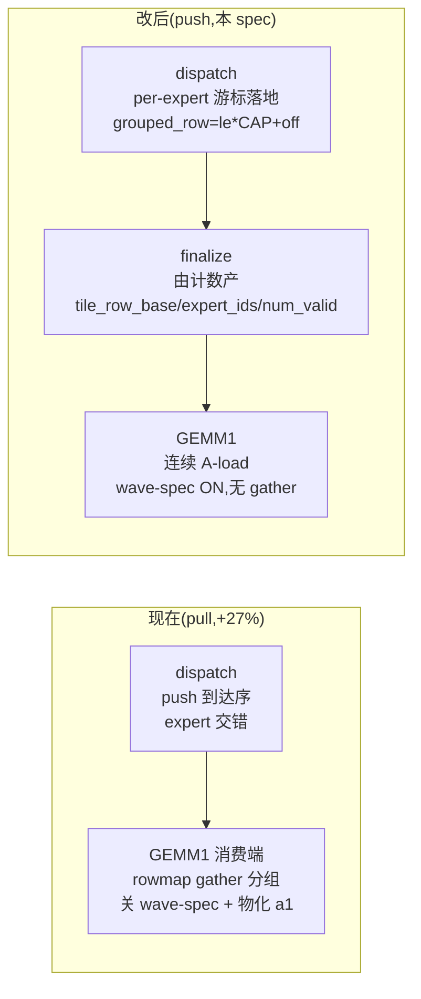

# push-grouped dispatch → 连续 GEMM1(gfx1250)Design

> 参照 PR #4439 megamoe 的 **写模式(push)分组**,只移植其 **fixed-slot** 到 gfx1250 `dispatch_combine_v2` + a8w4 GEMM1。**不做** 单巨核 / 跨 CTA 重叠 / compact(见 §6)。

## 1. 一句话

把"分组"从 **GEMM1 消费端 pull-gather** 挪到 **dispatch 生产端 push 落地**:token 落地时就按 expert 排好,GEMM1 直接**连续读**,不再 gather —— 消灭 T-B 的 +27% 回归根因(关 wave-spec + a1 物化)。

## 2. 现在 vs 改后



唯一变化:dispatch 落地行号从 **per-PE 单计数器** 换成 **per-(dest_pe, local_expert) 游标**。

```
grouped_row = local_expert * CAP + atomic_add_global(running[dest_pe][local_expert], 1)
```

## 3. 为什么可行(现状勘探)

- gfx1250 现有 `make_dispatch` **本就是 push**:`atomic_add_global(peer_tok_off,1)` 领槽(`intranode_kernels.py:192`)+ `window.lsa_ptr(dest_pe,off)` 写 embedding/scale/wts/tis。
- 唯一"未分组"原因 = 那个计数器是 **per-PE 单一**(到达序)。换成 per-expert 游标即分组。
- 原语齐备:`atomic_add_global` 已在现网用 8 处;fixed-slot 单相**只需它**。
- 两次独立 launch(dispatch / GEMM1,stream 有序)⇒ **不需要任何就绪协议**(store/spin/fence 全省)。

**⇒ 改动级别:改落地寻址 + 加 finalize 元数据 + 换连续 A-load,非重写。**

### 3.5 跨卡读写实测(gfx1250 ×2,xGMI)

用与 dispatch 同款原语(cco 对称 arena + `lsa_ptr(peer)` + `buffer_load/store`)实测 pull(远程读)vs push(远程写)。脚本:`op_tests/multigpu_tests/bench_cco_push_pull.py`。

| 指标 | 远程读(pull) | 远程写(push) |
|---|---|---|
| 带宽(饱和,双向) | ~300 GB/s | ~315 GB/s(+5%) |
| 数据延迟(单发) | 依赖链读 **~3.06 µs/read**(NT,真远程) | — |
| 同步延迟 | — | flag ping-pong **RTT 15.2 µs**(单向 ~7.6 µs) |

**结论(支撑本方案)**:
1. 数据面 pull/push 差距很小(读能深流水到 ~300 GB/s,写带宽还略高)⇒ 选型不该按"读/写谁快"。
2. **真正贵的是跨卡同步**:一次 release/acquire 握手 15 µs,**比一次裸远程读还贵一倍多** ⇒ **握手次数必须最少**。
3. 因此选 push 的理由是结构性的:(a) 写 fire-and-forget,把跨卡延迟移出 GEMM1 关键路径;(b) 砍掉 gather(+27% 根因);(c) **fixed-slot 只需一个 epoch 级握手**,不做 per-tile/per-expert 反复就绪信号 —— 这条实测正是本期只做 fixed-slot、把跨 CTA 重叠推到期三的量化依据。

## 4. 三处手术点

| # | 文件 | 改动 |
|---|---|---|
| 1 | `intranode_kernels.py::make_dispatch` | 开关下:落地行号 `dest_tok_id` → `grouped_row=le*CAP+off`;publish 门 `off<CAP`;dedup/scale/wts/tis 落地沿用 |
| 2 | 新增 finalize 小核 | 仿 megamoe `emit_direct_fixed_slot_finalize` + `_wave_inclusive_scan_i32`:由 `running[le]` 计数产 `tile_row_base`/`expert_ids`(GLOBAL)/`num_valid` + 尾行 srcmap padding |
| 3 | `grouped_moe_gfx1250.py` / `mxfp4_preshuffle_gfx1250_tdm.py` / `batched_gemm_mxfp4.py` | 开关下跳过 `topids_to_rows`/`contiguous_psum_remap`/`a1_payload` 物化;A-load 走连续块(复用 T-B.3 连续 `add_tdm_loads`,wave-spec ON) |

配置:`EpDispatchCombineConfig.push_group`(env `AITER_EP_PUSH_GROUP`,默认关)、`push_group_cap`、`reset_push_group()`、`push_group_ptrs()`。

## 5. 约束

- 仅 `a8w4`+`fp8`;与 `AITER_EP_FP8_TRANSPORT` 组合;关时逐字节等于主线。
- `CAP = align_up(每 expert 容量, tile_m)`,默认上界 `npes*max_tok_per_rank`(env 可传更紧)。**代价**:recv 显存 ≈ `num_local_experts*CAP`(期二 compact 消除)。
- cap 溢出 = 丢弃(同现 overflow 语义);空 expert 不占 work;padding 行 srcmap sentinel,GEMM1 照算、combine 跳过 ⇒ 保 byte-exact。
- CUDA graph:固定 grid + 序列;`running` 每 launch 前 memset 清零(进 graph)。

## 6. 分期与 Fallback

- **本期**:fixed-slot + 无重叠 + 两次独立 launch。判据:parity byte-exact + 消除 +27%。
- **期二**:compact 密排(两相 plan→push)省显存。
- **期三**:per-expert ready + 跨 CTA / 单巨核重叠(与 `2026-07-31-crossCTA-ring` plan 交汇,择优)。
- **Fallback**:无净收益 → 开关默认关,pull 路径 + ring plan 仍是并行退路。

## 7. 测试

- 单 GPU 门禁(`op_tests/flydsl_tests/`):dispatch 落地 grouped buffer + finalize 元数据 **逐字节 ==** 现路径物化的 grouped a1 / 元数据(`atol=0,rtol=0`)。
- 端到端(`op_tests/multigpu_tests/test_mega_moe.py`,非 `/app` 跑):`PUSH_GROUP={0,1}` 均 `MEGA-CHECK PASS`;2/4-rank。
- 性能(`--profile_table 1 --layers 61`):核对 gather+`a1_payload` 消失、GEMM1 优于 T-B.4、整层 ≤ T-A 基座。
