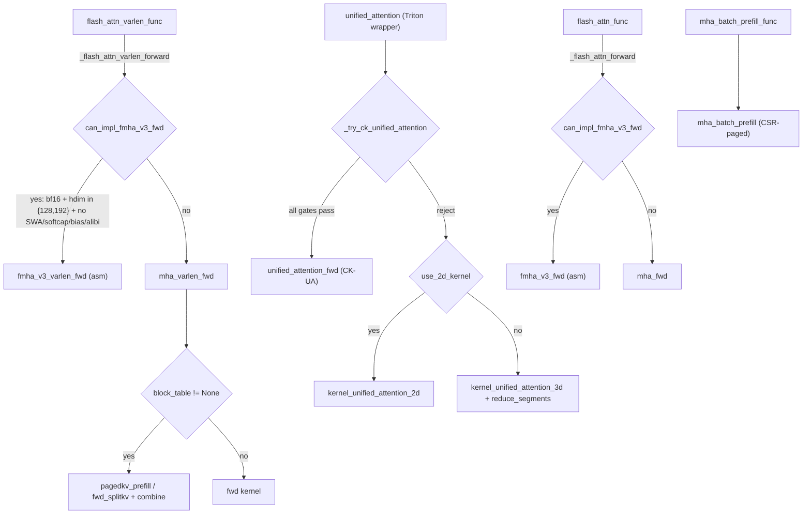

# `unified_attention_fwd` vs the CK FMHA family

This document compares the **input parameters and capabilities** of CK
Unified Attention (`unified_attention_fwd`) against every CK FMHA forward
entry point exposed in `aiter.ops.mha`, and answers the question of whether
unified attention adds anything the FMHA family doesn't already cover.

For kernel-level pseudocode and routing logic see
[`docs/attention_kernels_explained.md`](attention_kernels_explained.md).
For benchmarking commands see
[`op_tests/triton_tests/attention/bench_unified_vs_fmha.py`](../op_tests/triton_tests/attention/bench_unified_vs_fmha.py).

---

## 1. Functions in scope

| Backend | Python entry point | Source | Kernel C++ |
|---|---|---|---|
| CK Unified Attention (CK-UA) | `aiter.ops.unified_attention.unified_attention_fwd` | [`aiter/ops/unified_attention.py`](../aiter/ops/unified_attention.py) | [`csrc/py_itfs_ck/unified_attention_ck_kernels.cu`](../csrc/py_itfs_ck/unified_attention_ck_kernels.cu), [`3rdparty/composable_kernel/example/ck_tile/42_unified_attention/`](../3rdparty/composable_kernel/example/ck_tile/42_unified_attention/) |
| CK FMHA fwd (CK-Fwd) | `aiter.ops.mha.mha_fwd` | [`aiter/ops/mha.py:198`](../aiter/ops/mha.py) | `fmha_fwd_kernel.hpp` |
| CK FMHA varlen fwd (CK-PK / CK-SK) | `aiter.ops.mha.mha_varlen_fwd` | [`aiter/ops/mha.py:480`](../aiter/ops/mha.py) | `fmha_fwd_pagedkv_kernel.hpp`, `fmha_fwd_splitkv_kernel.hpp` |
| CK FMHA batch prefill | `aiter.ops.mha.mha_batch_prefill` | [`aiter/ops/mha.py:2753`](../aiter/ops/mha.py) | `fmha_fwd_batch_prefill_kernel.hpp` |
| FMHA v3 fwd (asm) | `aiter.ops.mha.fmha_v3_fwd` | [`aiter/ops/mha.py:251`](../aiter/ops/mha.py) | gfx942 + gfx950 assembly |
| FMHA v3 varlen fwd (asm) | `aiter.ops.mha.fmha_v3_varlen_fwd` | [`aiter/ops/mha.py:581`](../aiter/ops/mha.py) | gfx942 + gfx950 assembly |
| High-level wrapper (batched) | `aiter.ops.mha.flash_attn_func` | [`aiter/ops/mha.py:1896`](../aiter/ops/mha.py) | dispatches to `fmha_v3_fwd` or `mha_fwd` |
| High-level wrapper (varlen) | `aiter.ops.mha.flash_attn_varlen_func` | [`aiter/ops/mha.py:2550`](../aiter/ops/mha.py) | dispatches to `fmha_v3_varlen_fwd` or `mha_varlen_fwd` |

The Triton wrapper `aiter.ops.triton.attention.unified_attention.unified_attention(...)`
chooses between `unified_attention_fwd` (CK-UA) and Triton 2D/3D kernels — see
selector at [`aiter/ops/triton/attention/unified_attention.py:114`](../aiter/ops/triton/attention/unified_attention.py).

For a pipeline-internals comparison (CK-UA's `UnifiedAttentionPipeline` is a
fork of CK FMHA's `BlockFmhaFwdV3Pipeline`; what's added, what's stripped,
side-by-side Python pseudocode of the core loop), see
[`unified_attention_vs_v3_pipeline.md`](unified_attention_vs_v3_pipeline.md).

---

## 2. Tensor layout summary

### Q/K/V layouts

| Layout | Shape | Used by |
|---|---|---|
| **Varlen 3D** (paged or unpaged) | Q `(total_q, h_q, d)`, K/V `(total_kv, h_kv, d)` | `mha_varlen_fwd` non-paged, `mha_batch_prefill` Q only, `unified_attention_fwd` Q only |
| **Batched 4D** | `(b, s, h, d)` | `mha_fwd`, `fmha_v3_fwd` |
| **Paged 4D** | `[num_blocks, page_size, h_kv, d]` | `unified_attention_fwd`, `mha_varlen_fwd` (with `block_table`), `mha_batch_prefill` linear |
| **Paged 5D vectorized** | K `[num_blocks, page_size, h_kv, d/v, v]`, V `[num_blocks, page_size, h_kv, v, d]` | `mha_batch_prefill` (16-byte vector layout) |

### Per-sequence indexing

| Backend | Q ranges | K/V ranges |
|---|---|---|
| `unified_attention_fwd` | `query_start_len[num_seqs+1]` (CSR) | `seq_lens[num_seqs]` + `block_tables[num_seqs, max_blocks]` (paged) |
| `mha_varlen_fwd` | `cu_seqlens_q[num_seqs+1]` | `cu_seqlens_k[num_seqs+1]` + optional `block_table[num_seqs, max_blocks]` |
| `mha_batch_prefill` | `cu_seqlens_q[num_seqs+1]` | **CSR pages**: `kv_indptr[num_seqs+1]` + `kv_page_indices[total_pages]` + `kv_last_page_lens[num_seqs]` |
| `mha_fwd` / `fmha_v3_fwd` | implicit (4D `b×s`) | implicit (4D `b×s`) |

`query_start_len` and `cu_seqlens_q` carry the same information (cumulative
token starts). `seq_lens` carries each sequence's KV length, equivalent to
`cu_seqlens_k[i+1] - cu_seqlens_k[i]`.

---

## 3. Parameter cross-reference

Mandatory parameters across the six backends. Optional/feature parameters
are tracked in the [capability matrix](#5-capability-matrix).

| Parameter | UA | mha_fwd | mha_varlen_fwd | mha_batch_prefill | fmha_v3_fwd | fmha_v3_varlen_fwd |
|---|---|---|---|---|---|---|
| `q` | `[T_q, h_q, d]` | `(b, s_q, h_q, d)` | `[T_q, h_q, d]` | `[T_q, h_q, d]` | `(b, s_q, h_q, d)` | `[T_q, h_q, d]` |
| `k` | paged 4D | `(b, s_k, h_kv, d)` | varlen 3D or paged 4D | paged 4D or 5D | `(b, s_k, h_kv, d)` | varlen 3D or paged 4D |
| `v` | paged 4D | `(b, s_k, h_kv, d_v)` | varlen 3D or paged 4D | paged 4D or 5D | `(b, s_k, h_kv, d_v)` | varlen 3D or paged 4D |
| `output` | **in-place** `[T_q, h_q, d]` | returned | returned | returned | returned | returned |
| Q starts | `query_start_len[num_seqs+1]` | — | `cu_seqlens_q[num_seqs+1]` | `cu_seqlens_q[num_seqs+1]` | — | `cu_seqlens_q[num_seqs+1]` |
| K ranges | `seq_lens[num_seqs]` | — | `cu_seqlens_k[num_seqs+1]` | `kv_indptr` + `kv_page_indices` + `kv_last_page_lens` | — | `cu_seqlens_k[num_seqs+1]` |
| Page table | `block_tables[num_seqs, max_blocks]` | — | optional `block_table` | via `kv_indptr` CSR | — | optional `block_table` |
| `max_seqlen_q` | implicit | implicit | **required `int`** | **required `int`** | implicit | **required `int`** |
| `max_seqlen_k` | implicit | implicit | **required `int`** | **required `int`** | implicit | **required `int`** |
| `softmax_scale` | `scale_s: float` | `softmax_scale: float` | `softmax_scale: float` | `softmax_scale: float` | `softmax_scale: float` | `softmax_scale: float` |
| Mask | `mask_type: int` (0,2) | `is_causal: bool` + `window_size_left/right` | same + `sink_size` | same | same | same |
| Causal | `mask_type==2` | `is_causal=True` | `is_causal=True` | `is_causal=True` | `is_causal=True` | `is_causal=True` |
| Sliding window | not supported | `window_size_left/right: int` | same | same | not supported | not supported |
| Softcap | not supported | not supported | `logits_soft_cap: float` | `logits_soft_cap: float` | not supported | `logits_soft_cap: float` |
| Sinks | not supported | `sink_size: int` + `sink_ptr` | same | `sink_ptr` | not supported | not supported |
| Bias | not supported | `bias: Tensor` | `bias: Tensor` | `bias: Tensor` | `bias: Tensor` | `bias: Tensor` |
| ALiBi | not supported | `alibi_slopes: Tensor` | `alibi_slopes: Tensor` | `alibi_slopes: Tensor` | `alibi_slopes: Tensor` | `alibi_slopes: Tensor` |
| Dropout | not supported | `dropout_p: float` | `dropout_p: float` | `dropout_p: float` | `dropout_p: float` | `dropout_p: float` |
| LSE out | not returned | `return_softmax_lse: bool` | same | same | same | same |
| FP8 per-tensor | `scale_k`, `scale_v`, `scale_out` floats | `q_descale/k_descale/v_descale: Tensor[1]` | same | same + `kv_block_descale` per-page | `q/k/v_descale: Tensor[1]` | `q/k/v_descale: Tensor[1]` |
| FP8 per-page | not supported | not supported | not supported | `kv_block_descale[num_block, h_kv, 2]` | not supported | not supported |
| Returns | `None` (writes `output`) | `(out, lse, S_dmask, rng)` | `(out, lse, S_dmask, rng)` | `(out, lse, S_dmask, rng)` | `(out, lse, S_dmask, rng)` | `(out, lse, S_dmask, rng)` |

Notation: `T_q = sum(query_lens)`, `T_kv = sum(kv_lens)`.

---

## 4. CK Unified Attention parameter detail

```python
unified_attention_fwd(
    output,           # [num_tokens, num_heads_q, head_size]      writes in place
    query,            # [num_tokens, num_heads_q, head_size]
    key_cache,        # [num_blks, page_blk_size, num_kv_heads, head_size]
    value_cache,      # [num_blks, page_blk_size, num_kv_heads, head_size]
    block_tables,     # [num_seqs, max_blocks_per_seq]            int32
    seq_lens,         # [num_seqs]                                 int32, KV length per seq
    query_start_len,  # [num_seqs + 1]                             int32, cu_seqlens_q
    mask_type,        # 0 = no mask, 2 = causal (bottom-right)
    scale_s,          # float, applied to QK^T (typically 1/sqrt(d))
    scale,            # float, additional Q scale (FP8 path; pass 1.0 for fp16/bf16)
    scale_k,          # float, K dequant scale  (FP8 path; pass 1.0 for fp16/bf16)
    scale_v,          # float, V dequant scale  (FP8 path; pass 1.0 for fp16/bf16)
    scale_out,        # float, output requant   (FP8 path; pass 1.0 for fp16/bf16)
)
```

### Hard constraints (current shipped instances)

From [`example/ck_tile/42_unified_attention/PARAMETERS.md`](../3rdparty/composable_kernel/example/ck_tile/42_unified_attention/PARAMETERS.md)
and the C++ wrapper [`unified_attention_ck_kernels.cu`](../csrc/py_itfs_ck/unified_attention_ck_kernels.cu):

| Field | Allowed values |
|---|---|
| `query.dtype` | `fp16` or `bf16` |
| `(head_size, num_queries_per_kv)` | `(64, 8)` or `(128, 1)` |
| `page_blk_size` | `32` or `64` (`64` only when `head_size ≤ 64`, `32` otherwise) |
| `mask_type` | `0` (none) or `2` (causal) |
| Sliding window / softcap / ALiBi / sinks / dropout / LSE | not supported |
| Output dtype | same as input |
| Int32 offset budget | `num_blocks * page_blk_size * num_kv_heads * head_size < 2^31` |
| Routing-layer extra constraint | `max_seqlen_q == 1` (decode only) — enforced by `_try_ck_unified_attention`, not by the kernel itself |

The kernel itself runs with arbitrary `max_seqlen_q`, but the production
selector in [`unified_attention.py:114`](../aiter/ops/triton/attention/unified_attention.py)
only routes decode shapes here.

---

## 5. Capability matrix

`Y` = supported, `–` = not supported, `Y*` = supported with caveat (see notes).

| Feature | UA | mha_fwd | mha_varlen_fwd | mha_batch_prefill | fmha_v3_fwd | fmha_v3_varlen_fwd |
|---|---|---|---|---|---|---|
| Paged KV (`block_table`) | Y | – | Y | Y (CSR `kv_indptr`) | – | Y |
| Non-paged | – | Y | Y | – | Y | Y |
| Varlen Q (CSR) | Y | – | Y | Y | – | Y |
| Batched Q (4D) | – | Y | – | – | Y | – |
| GQA / MQA | Y | Y | Y | Y | Y | Y |
| Head-merge for decode | Y | – | Y* (split-kv decode) | – | – | – |
| Causal mask | Y | Y | Y | Y | Y | Y |
| Sliding window | – | Y | Y | Y | – | – |
| Softcap | – | – | Y | Y | – | Y |
| Attention bias | – | Y | Y | Y | Y | Y |
| ALiBi | – | Y | Y | Y | Y | Y |
| Sinks | – | Y | Y | Y | – | – |
| Dropout | – | Y | Y | Y | Y | Y |
| LSE return | – | Y | Y | Y | Y | Y |
| FP16 input | Y | Y | Y | Y | – | – |
| BF16 input | Y | Y | Y | Y | Y | Y |
| FP8 input (per-tensor descale) | Y* (scalar floats) | Y | Y | Y | Y (gfx942) | Y (gfx942) |
| FP8 KV per-page descale | – | – | – | Y (`kv_block_descale`) | – | – |
| AMD asm path | – | – | – | – | Y (gfx942 + gfx950) | Y (gfx942 + gfx950) |

Notes:
- `mha_varlen_fwd` head-merge applies inside the split-KV decode kernel
  (`kMergeNumHeadGroupsSeqLenQ`); it is enabled automatically when the
  paged decode shape benefits from it.
- `unified_attention_fwd` exposes FP8 scaling parameters (`scale, scale_k,
  scale_v, scale_out`) but the shipped instance set only generates
  `fp16/bf16` kernels.
- `fmha_v3_fwd` / `fmha_v3_varlen_fwd` ship pre-built ASM `.co` blobs in
  both [`hsa/gfx942/fmha_v3_fwd/`](../hsa/gfx942/fmha_v3_fwd/) and
  [`hsa/gfx950/fmha_v3_fwd/`](../hsa/gfx950/fmha_v3_fwd/).  The MI350
  catalog actually has *more* tile variants (9 vs 3 `.co` files) than the
  MI300X catalog.  The Python selector
  [`can_impl_fmha_v3_fwd`](../aiter/ops/mha.py) does **not** gate on
  arch — only the FP8 sub-path (`is_fmha_v3_fp8`) requires gfx942.

---

## 6. Coverage analysis — does CK-UA add anything?

**Functionally: no.** Every (Q, K, V, mask, GQA) shape that
`unified_attention_fwd` accepts is also a legal input for `mha_varlen_fwd`
with a `block_table` (which routes to CK-PK or CK-SK + combine). The CK-UA
kernel is feature-restricted relative to FMHA varlen — it has no SWA,
no softcap, no ALiBi, no sinks, no bias, no dropout, no LSE.

**Performance-wise: yes, in a narrow regime.** CK-UA's grid uses
`(num_kv_heads, num_seqs)` workgroups and packs all GQA heads into the
M dimension of one MFMA. For decode with GQA-8, that turns ~0.8% MFMA
utilization (per-Q-head FMHA tile of 128 rows with 1 token) into ~50%
(8 useful rows out of 16). The selector
[`_try_ck_unified_attention`](../aiter/ops/triton/attention/unified_attention.py#L114)
routes to CK-UA only when:

```
max_seqlen_q == 1
window_size == (-1, -1)  # no SWA
softcap == 0, alibi is None, sinks is None
(head_size, num_queries_per_kv) in {(64, 8), (128, 1)}
page_size >= 32 (and >= 64 when max_seqlen_k < 256)
num_blocks * page_size * h_kv * d < 2**31
cu_count * 4 <= num_kv_heads * num_seqs <= cu_count * 8
```

That last condition is the operating window: on MI300X (256 CUs, 8 KV
heads) it activates for batches of 128–256 sequences. Below that the
batch is too small to amortize CK-UA's fixed setup; above it Triton 2D
already saturates the GPU.

**Conclusion**: CK-UA is **not strictly necessary for correctness**, but
it is currently the fastest available path for the GQA-8 / decode /
moderate-batch regime, which is a common LLM serving point. Removing it
would force those shapes onto `mha_varlen_fwd` (split-KV) or Triton 2D,
which the selector data shows are 13–32% slower in that band.

### 6.1 Empirical complementarity (gfx950 build)

In the *current* `module_unified_attention` and `module_mha_batch_prefill`
builds, the shipped CK instance sets are **narrow on both sides** and only
partially overlap.  Running the mixed paged-KV demo at
[`op_tests/triton_tests/attention/demo_ua_unique.py`](../op_tests/triton_tests/attention/demo_ua_unique.py)
on a vLLM-style chunked-prefill batch (`q_lens=[1,1,64,64]`,
`ctx_lens=[400,200,64,320]`) gives:

| Backend                  | `(GQA-8, hdim=64)` | `(GQA-8, hdim=128)` |
|--------------------------|--------------------|---------------------|
| `unified_attention_fwd`  | **OK** (0.015 ms)  | `no matching kernel for hdim=128 num_queries_per_kv=8 mask_type=2` |
| `mha_batch_prefill_func` | `invalid argument for batch_prefill` | **OK** (0.024 ms) |
| `mha_fwd`, `fmha_v3_fwd` | layout-incompatible (uniform 4D only) | layout-incompatible |
| `mha_varlen_fwd` (paged) | `invalid argument for fmha_fwd_splitkv` | `invalid argument for fmha_fwd_splitkv` |

So today, CK-UA isn't just *faster* in its hot zone — for the
`(GQA-8, hdim=64)` decode + chunked-prefill mix it's the **only** working
backend in the shipped build, and `mha_batch_prefill_func` plays the
symmetric role at `hdim=128`.  The two are complementary, not redundant.

---

## 7. Dispatch graph



---

## 8. Minimal example for each backend

These build the smallest sensible inputs and call the kernel. Identical
runnable copies live in the benchmark script (`--examples` flag).

### 8.1 `unified_attention_fwd`

```python
import math, torch
from aiter.ops.unified_attention import unified_attention_fwd

num_seqs, kv_len, h_q, h_kv, d, page = 4, 256, 8, 8, 128, 32  # MHA, GQA=1
num_pages_per_seq = (kv_len + page - 1) // page
num_blocks = num_seqs * num_pages_per_seq

q_lens = [1] * num_seqs                          # decode
total_q = sum(q_lens)
q = torch.randn(total_q, h_q, d, dtype=torch.bfloat16, device="cuda")
out = torch.empty_like(q)
k = torch.randn(num_blocks, page, h_kv, d, dtype=torch.bfloat16, device="cuda")
v = torch.randn_like(k)

cu_q = torch.tensor([0] + list(torch.tensor(q_lens).cumsum(0).tolist()),
                    dtype=torch.int32, device="cuda")
seq_lens_k = torch.tensor([kv_len] * num_seqs, dtype=torch.int32, device="cuda")
block_tables = torch.arange(num_blocks, dtype=torch.int32, device="cuda") \
    .reshape(num_seqs, num_pages_per_seq)

unified_attention_fwd(out, q, k, v, block_tables, seq_lens_k, cu_q,
                      mask_type=2, scale_s=1.0/math.sqrt(d),
                      scale=1.0, scale_k=1.0, scale_v=1.0, scale_out=1.0)
```

### 8.2 `mha_fwd` (CK FMHA, non-paged batched)

```python
import math, torch
from aiter.ops.mha import mha_fwd

b, s, h_q, h_kv, d = 4, 512, 8, 8, 128
q = torch.randn(b, s, h_q, d, dtype=torch.bfloat16, device="cuda")
k = torch.randn(b, s, h_kv, d, dtype=torch.bfloat16, device="cuda")
v = torch.randn_like(k)

out, lse, S_dmask, rng = mha_fwd(
    q, k, v,
    dropout_p=0.0, softmax_scale=1.0/math.sqrt(d),
    is_causal=True, window_size_left=-1, window_size_right=-1, sink_size=0,
    return_softmax_lse=False, return_dropout_randval=False,
)
```

### 8.3 `mha_varlen_fwd` (CK FMHA varlen, optionally paged)

```python
import math, torch
from aiter.ops.mha import mha_varlen_fwd

q_lens = [256, 1, 512, 1]
kv_lens = [256, 2048, 512, 4096]
h_q, h_kv, d, page = 8, 8, 128, 128
num_blocks = 1024

cu_q = torch.tensor([0, *torch.tensor(q_lens).cumsum(0).tolist()],
                    dtype=torch.int32, device="cuda")
cu_k = torch.tensor([0, *torch.tensor(kv_lens).cumsum(0).tolist()],
                    dtype=torch.int32, device="cuda")
total_q, total_k = sum(q_lens), sum(kv_lens)

q = torch.randn(total_q, h_q, d, dtype=torch.bfloat16, device="cuda")
# Paged path:
k = torch.randn(num_blocks, page, h_kv, d, dtype=torch.bfloat16, device="cuda")
v = torch.randn_like(k)
max_pages = max((kl + page - 1) // page for kl in kv_lens)
block_table = torch.randint(0, num_blocks, (len(q_lens), max_pages),
                            dtype=torch.int32, device="cuda")

out, lse, S_dmask, rng = mha_varlen_fwd(
    q, k, v, cu_q, cu_k,         # NOTE: even with paged KV, cu_seqlens_k must
                                  # be cumulative shape (batch+1), not per-seq.
    max_seqlen_q=max(q_lens), max_seqlen_k=max(kv_lens), min_seqlen_q=0,
    dropout_p=0.0, softmax_scale=1.0/math.sqrt(d),
    logits_soft_cap=0.0, zero_tensors=False,
    is_causal=True, window_size_left=-1, window_size_right=-1, sink_size=0,
    return_softmax_lse=False, return_dropout_randval=False,
    block_table=block_table,
)
```

### 8.4 `mha_batch_prefill_func` (CK FMHA, CSR-paged)

```python
import math, torch
from aiter.ops.mha import mha_batch_prefill_func

q_lens = [256, 1, 512, 1]
kv_lens = [256, 2048, 512, 4096]
h_q, h_kv, d, page = 8, 8, 128, 128
num_blocks = 1024

cu_q = torch.tensor([0, *torch.tensor(q_lens).cumsum(0).tolist()],
                    dtype=torch.int32, device="cuda")
total_q = sum(q_lens)
q = torch.randn(total_q, h_q, d, dtype=torch.bfloat16, device="cuda")
k = torch.randn(num_blocks, page, h_kv, d, dtype=torch.bfloat16, device="cuda")
v = torch.randn_like(k)

# CSR paged layout
pages_per_seq = [(kl + page - 1) // page for kl in kv_lens]
kv_indptr = torch.tensor([0, *torch.tensor(pages_per_seq).cumsum(0).tolist()],
                         dtype=torch.int32, device="cuda")
kv_page_indices = torch.randint(0, num_blocks, (sum(pages_per_seq),),
                                dtype=torch.int32, device="cuda")
kv_last_page_lens = torch.tensor([((kl - 1) % page) + 1 for kl in kv_lens],
                                 dtype=torch.int32, device="cuda")

out = mha_batch_prefill_func(
    q, k, v, cu_q, kv_indptr, kv_page_indices,
    max_seqlen_q=max(q_lens), max_seqlen_k=max(kv_lens),
    softmax_scale=1.0/math.sqrt(d), causal=True,
    kv_last_page_lens=kv_last_page_lens,
)
```

### 8.5 `fmha_v3_fwd` / `fmha_v3_varlen_fwd` (gfx942 + gfx950 asm)

These are normally invoked via `flash_attn_func` / `flash_attn_varlen_func`,
which auto-detect eligibility (bf16, hdim ∈ {128, 192}, no SWA/softcap/bias/alibi).
Direct call signatures match `mha_fwd` / `mha_varlen_fwd` plus a
`how_v3_bf16_cvt` integer (0 = RTNE, 1 = RTNA, 2 = RTZ).  On gfx950 only
mode 0 (RTNE) is honored; the wrapper rewrites other modes to 0
([`aiter/ops/mha.py:1619`](../aiter/ops/mha.py)).  See
[`aiter/ops/mha.py:251`](../aiter/ops/mha.py).

---

## 9. Where to read more

- Numpy-style pseudocode for every kernel: [`docs/attention_kernels_explained.md`](attention_kernels_explained.md)
- CK-UA compile-time parameters: [`example/ck_tile/42_unified_attention/PARAMETERS.md`](../3rdparty/composable_kernel/example/ck_tile/42_unified_attention/PARAMETERS.md)
- CK-UA tier dispatch (tiny / small / medium / prefill): [`example/ck_tile/42_unified_attention/unified_attention.cpp`](../3rdparty/composable_kernel/example/ck_tile/42_unified_attention/unified_attention.cpp)
- Selector source: [`aiter/ops/triton/attention/unified_attention.py`](../aiter/ops/triton/attention/unified_attention.py)
- Existing CK-vs-Triton bench: [`op_tests/triton_tests/attention/compare_ck_aiter_vs_triton_unified.py`](../op_tests/triton_tests/attention/compare_ck_aiter_vs_triton_unified.py)
