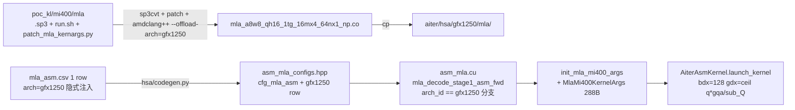

# Port mi400 mla minimal smoke to aiter

> 按 port-mi400-op-to-aiter skill 把 poc_kl/mi400/mla 中的 `mla_a8w8_qh16_1tg_16mx4_64nx1_np` 单变体作为 minimal_smoke 移植到 aiter，extend 现有 `module_mla_asm`，arch 分流到 gfx1250，Python 入口不变，仅在 C++ 端按 arch + 形状自适应；同时把 gfx1250 的 build/arch wiring 一次性补齐，为后续增量加变体留好脚手架。

## Decisions baked in

- **Coverage = minimal_smoke**：首发只移植 1 个变体 `mla_a8w8_qh16_1tg_16mx4_64nx1_np`（对应 `test_kl_mla_tp_np_test`，model_version=3）。`v4 / sparse / 3p / k128 / qh32 / qh32x32` 等 11 个变体留给后续 PR，按本次脚手架批量加 CSV 行 + 复制 .co 即可。
- **Python entry = extend_with_csv_only**：`aiter.mla_decode_stage1_asm_fwd` 的 Python 签名不动；C++ 端 `asm_mla.cu` 在最早处按 `arch_id == "gfx1250"` 分流到一段独立的 mi400 路径（独立 packed struct + init + bdx/gdx + 不同的 cfg 匹配字段），完全不污染现有 `gfx942/gfx950` 路径。
- **资产策略 = co_only**：只把 `.co + .csv` 提交到 `aiter/hsa/gfx1250/mla/`；`.s / .sp3` 仍留在 `poc_kl/mi400/mla/shaders/` 作 source of truth。
- **kernel 符号**：直接用 `mla_a8w8_qh16_1tg_16mx4_64nx1_np_KERNEL_FUNC`（无 C++ mangling），与现有 `_ZN5aiter…E` mangled 符号靠 `arch+knl_name` 主键自然分离。
- **smoke 边界**：smoke 只验证「JIT 构建通过 + .co 通过 aiter loader 装入 + kernel launch 不报 HIP 错误 + 返回 shape 合法」；和 PyTorch eager / mi400 test 完整数值对齐属于增量补齐范畴。但 CSV/dispatcher **不能伪装语义**：目标 `.co` 来自 `test_kl_mla_tp_np_test` 且 `mask=1` 烘焙在 shader 内，本期 smoke 必须把该行标为 `causal=1` 并在 C++ 分支固定匹配该语义；当前 decode Python 入口没有显式 `causal` 参数，所以测试只证明这个 baked masked `.co` 可被 aiter loader/launcher 跑通，不代表 `causal=0` API 覆盖。后续若要支持 `causal=0`，需另选/另加真实 non-mask 变体。

## 关键事实速查

- **mi400 mla kernarg ABI = 18 × 16B = 288B**（`patch_mla_kernargs.py` 强制写入），与 aiter 现有 `KernelArgs`（20 槽位 320B）**不同结构**；必须新建 `MlaMi400KernelArgs`，不能复用。
- mi400 mla 的 patched `.args:` 名称共用 v4 layout（`patch_mla_kernargs.py` 把所有 `.s` 的 `.args:` 都改成：`R, LSE, Q, KV, LTP, LTD, LTL, scalar, q_seq_lens, passes, total_kv, stride_page, log2_page, QTP, STP, out_16_nosplit, QROPE, KVROPE`），但本期目标是 **v3 kernel**：offset 160 这个 slot 在 v3 host 中实际语义是 `stride_Q`，不是 `total_kv`；offset 256/272 在 v3 host 中实际是 `descale_q/k`，不是 rope ptr。**aiter 端 struct 可按 patched 名称保留 slot 名，但 init 必须按 v3 语义填值**。
- 选定 shader 元数据（`poc_kl/mi400/mla/shaders/mla_a8w8_qh16_1tg_16mx4_64nx1_np.s`）：`gfx1250`、`wavefront_size 32`、`vgpr 1024`、`sgpr 106`、`kernarg 288`、`wv_tg=4 → blockSizeX = 4*32 = 128`。LDS 以 convert/patch 后最终 `.s` 为准，必须在编译前重新 grep `.amdhsa_group_segment_fixed_size` 与 `.group_segment_fixed_size`；不要只相信计划里记录的历史值。
- mi400 `make_launch_geometry` 已经把 `q_seq_lens` 乘了 `gqa_ratio` (`parse_runtime_args` 末尾)，公式：`gdx = ceil(q_seq_lens * gqa_ratio / sub_Q)`、`gdy = batch`、`gdz = passes`（即 num_kv_splits）。
- `aiter/hsa/gfx1250/` 当前为空目录；`aiter/aiter/jit/utils/build_targets.py::GFX_CU_NUM_MAP` **缺 `gfx1250`**——必须先补，否则 `GPU_ARCHS=gfx1250` JIT 直接抛 `Unknown gfx`。
- 现有 dispatcher [aiter/csrc/py_itfs_cu/asm_mla.cu](../aiter/csrc/py_itfs_cu/asm_mla.cu) 里 `mla_decode_stage1_asm_fwd` 在 gqa=16/fp8/fp8/max_seqlen_q=4 路径已经把 `sub_Q` 调成 64、`config_max_seqlen_q=4`——这正好是我们要 dispatch 到的 mi400 64nx1_np 变体的形状，CSV 调度键无需新加列。

## 端到端流程图



## 对应文件清单

- 资产：
  - `poc_kl/mi400/mla/mla_a8w8_qh16_1tg_16mx4_64nx1_np.co`（构建产物，源在 [shaders/mla_a8w8_qh16_1tg_16mx4_64nx1_np.s](../poc_kl/mi400/mla/shaders/mla_a8w8_qh16_1tg_16mx4_64nx1_np.s)）
  - `aiter/hsa/gfx1250/mla/mla_a8w8_qh16_1tg_16mx4_64nx1_np.co`（拷贝目标）
  - `aiter/hsa/gfx1250/mla/mla_asm.csv`（**新文件**，1 行；列必须与 [aiter/hsa/gfx950/mla/mla_asm.csv](../aiter/hsa/gfx950/mla/mla_asm.csv) 第 1 行 header 对齐：`qType,kvType,Gqa,ps,qSeqLen,prefill,causal,lse,knl_name,co_name`）

- C++ dispatcher：
  - [aiter/csrc/py_itfs_cu/asm_mla.cu](../aiter/csrc/py_itfs_cu/asm_mla.cu) 里 `mla_decode_stage1_asm_fwd` 函数：在 `arch_id` 拿到后立即 `if (arch_id == "gfx1250") { return mla_decode_mi400_dispatch(...); }`，把所有 mi400 逻辑封进新加的 `mla_decode_mi400_dispatch` 静态函数；新加 `MlaMi400KernelArgs` packed struct 和 `init_mla_mi400_args` lambda/静态函数。**不动**现有 `KernelArgs / get_heuristic_kernel_mla / PsKernelArgs / mla_prefill_*` 任何字节。

- arch wiring：
  - [aiter/aiter/jit/utils/build_targets.py](../aiter/aiter/jit/utils/build_targets.py) `GFX_CU_NUM_MAP` 加一行 `"gfx1250": <CU_NUM>`（CU 数见后文 step 7 的 question）。
  - [aiter/aiter/jit/utils/chip_info.py](../aiter/aiter/jit/utils/chip_info.py) `get_device_name()` 加 `gfx == "gfx1250" → "MI400"`（避免 RuntimeError）。
  - [aiter/aiter/jit/optCompilerConfig.json](../aiter/aiter/jit/optCompilerConfig.json) `module_mla_asm` 不需要改 srcs，只确认 `blob_gen_cmd` 仍是 `f'{AITER_META_DIR}/hsa/codegen.py -m mla --output_dir {{}}'`（已经是这个，OK）。

- 测试：
  - `aiter/op_tests/test_mla_mi400.py`（**新文件**，smoke：构造 1 个 `(batch=1, gqa_ratio=16, q_seqlen=4, kv_seqlen=578, page_size=64, fp8/fp8, num_kv_splits=1)` 的输入，调用 `aiter.mla.mla_decode_fwd`，断言输出 shape 正确、不抛 HIP 错误；测试 docstring 明确说明该 kernel 是 baked masked/`causal=1` 语义，当前 smoke 不代表 non-causal 覆盖）。先用 `batch=1` 避免 v3 `descale_q/k` 需要 per-batch scale 时 `[1]` 标量 scale 发生越界；如果改回 `batch>1`，必须构造长度至少为 `batch` 的 scale tensor 并加 C++ shape check。

## 8 步具体操作（按 SKILL.md 的 12 步骨架，合并到本任务实际需要的 8 步）

### Step 1 — Discovery（已做）
- 读了 [mla.cpp](../poc_kl/mi400/mla/mla.cpp)、[mla_helper.h](../poc_kl/mi400/mla/mla_helper.h)、[mla_execute_v3_hip.inl](../poc_kl/mi400/mla/mla_execute_v3_hip.inl)、[mla_execute_v4_hip.inl](../poc_kl/mi400/mla/mla_execute_v4_hip.inl)、[run.sh](../poc_kl/mi400/mla/run.sh)、[patch_mla_kernargs.py](../poc_kl/mi400/mla/patch_mla_kernargs.py)、[CMakeLists.txt](../poc_kl/mi400/mla/CMakeLists.txt) 和目标 `.s` 的 `.amdgpu_metadata`。
- 选定 shader：`mla_a8w8_qh16_1tg_16mx4_64nx1_np.sp3`（test_kl_mla_tp_np_test）。
- 记录 grid/block 公式与 ABI 关键数（见上"关键事实速查"）。

### Step 2 — Build .co in poc_kl
1. 跑 sp3 → `.s` + 同步 `.args:`：`cd poc_kl/mi400/mla && bash run.sh convert`（内部已串接 sp3cvt + patch_mla_kernargs.py）。
2. 单独把目标 `.s` 编成 `.co`，**不**调用 `bash run.sh compile` 全量（避免 host `mla.out` 那段在 `common/` 头缺时拖累）：
   - `amdclang++ -ggdb -g -x assembler -target amdgcn--amdhsa --offload-arch=gfx1250 poc_kl/mi400/mla/shaders/mla_a8w8_qh16_1tg_16mx4_64nx1_np.s -o poc_kl/mi400/mla/mla_a8w8_qh16_1tg_16mx4_64nx1_np.co`
3. 编译前校验 patched `.s` 元数据：`grep -nE 'amdhsa_group_segment_fixed_size|group_segment_fixed_size|amdhsa_kernarg_size|kernarg_segment_size|amdhsa_code_object_version' poc_kl/mi400/mla/shaders/mla_a8w8_qh16_1tg_16mx4_64nx1_np.s`，必须确认 code object v6、kernarg 288，且 LDS 两处一致。
4. 符号校验：`llvm-readelf -s poc_kl/mi400/mla/mla_a8w8_qh16_1tg_16mx4_64nx1_np.co | grep mla_a8w8_qh16_1tg_16mx4_64nx1_np_KERNEL_FUNC`，必须能看到符号本体 + `.kd` 描述符。

### Step 3 — Place assets in aiter
1. `mkdir -p aiter/hsa/gfx1250/mla/`
2. `cp poc_kl/mi400/mla/mla_a8w8_qh16_1tg_16mx4_64nx1_np.co aiter/hsa/gfx1250/mla/`
3. 新建 `aiter/hsa/gfx1250/mla/mla_asm.csv`，列名与 gfx950/mla_asm.csv 完全一致，单行：

```csv
qType,kvType,Gqa,ps,qSeqLen,prefill,causal,lse,knl_name,co_name
fp8,fp8,16,0,4,0,1,0,mla_a8w8_qh16_1tg_16mx4_64nx1_np_KERNEL_FUNC,mla_a8w8_qh16_1tg_16mx4_64nx1_np.co
```

   - `causal=1` 反映 `test_kl_mla_tp_np_test` 中 `mask=1` 的真实 shader 语义。不要为了对齐 Python 默认 `causal=False` 把该行写成 `causal=0`，否则会把 masked kernel 暴露给 non-causal 调用，后续很容易 silent wrong result。
4. 干跑 codegen：`AITER_GPU_ARCHS='gfx1250;gfx950;gfx942' python3 aiter/hsa/codegen.py -m mla --output_dir /tmp`，确认输出 `/tmp/asm_mla_configs.hpp` 中能找到 `ADD_CFG(..., "gfx1250", "mla/", "mla_a8w8_qh16_1tg_16mx4_64nx1_np_KERNEL_FUNC", "mla_a8w8_qh16_1tg_16mx4_64nx1_np.co")` 一行。注意 shell 里分号必须放在引号内。

### Step 4 — KernelArgs struct + ABI 校验
在 [aiter/csrc/py_itfs_cu/asm_mla.cu](../aiter/csrc/py_itfs_cu/asm_mla.cu) 顶部（紧跟现有 `KernelArgs` 之后）加：

```cpp
struct __attribute__((packed)) MlaMi400KernelArgs {
    void* ptr_R;        p2 _p0;   // 0
    void* ptr_LSE;      p2 _p1;   // 1
    void* ptr_Q;        p2 _p2;   // 2
    void* ptr_KV;       p2 _p3;   // 3
    void* ptr_LTP;      p2 _p4;   // 4
    void* ptr_LTD;      p2 _p5;   // 5
    void* ptr_LTL;      p2 _p6;   // 6
    float scalar;       p3 _p7;   // 7
    unsigned int q_seq_lens;     p3 _p8;   // 8
    unsigned int passes;         p3 _p9;   // 9
    unsigned int stride_Q;       p3 _p10;  // 10  (patched .args 名为 total_kv；v3 实际语义是 stride_Q)
    unsigned int stride_page;    p3 _p11;  // 11
    unsigned int log2_page;      p3 _p12;  // 12
    void* ptr_QTP;      p2 _p13;  // 13
    void* ptr_STP;      p2 _p14;  // 14
    unsigned int out_16_nosplit; p3 _p15;  // 15
    void* ptr_QROPE;    p2 _p16;  // 16  (v3: descale_q ptr; v4: rope ptr)
    void* ptr_KVROPE;   p2 _p17;  // 17  (v3: descale_k ptr; v4: rope ptr)
};
static_assert(sizeof(MlaMi400KernelArgs) == 288, "MLA mi400 packed args must be 18*16=288B");
```

字节级校验：`grep -n .args: poc_kl/mi400/mla/shaders/mla_a8w8_qh16_1tg_16mx4_64nx1_np.s` 输出的 18 条 `(.name, .size, .offset)` 必须与上表 18 个槽位字面对应（offset 步进 16，pointer .size=8, scalar .size=4）。其中 offset 160 的 `.args` 名称仍会显示 `total_kv`，这是 patched metadata 兼容名；本期 v3 init 必须按 `stride_Q` 填，不按 `total_kv` 填。

### Step 5 — Dispatcher 分支
在 `mla_decode_stage1_asm_fwd` 头部（拿到 `arch_id` 和 dtype 之后、走入现有 gqa heuristic 之前）加：

```cpp
std::string arch_id = get_gpu_arch();
if (arch_id == "gfx1250") {
    return mla_decode_mi400_dispatch(
        Q, KV, qo_indptr, kv_indptr, kv_page_indices, kv_last_page_lens,
        num_kv_splits_indptr, work_meta_data, work_indptr, work_info_set,
        max_seqlen_q, page_size, nhead_kv, softmax_scale,
        splitData, splitLse, output, lse, q_scale, kv_scale, stream);
}
```

新增静态函数 `mla_decode_mi400_dispatch`，骨架按 [templates/dispatcher.cu.tmpl](../.cursor/skills/port-mi400-op-to-aiter/templates/dispatcher.cu.tmpl) 来：

- arch 白名单：只允许 `gfx1250`，否则 `AITER_CHECK(false, ...)`.
- 路径 guard：本期只支持 non-persistent decode smoke，进入 mi400 分支后立即检查 `work_meta_data == nullptr && work_indptr == nullptr && work_info_set == nullptr && num_kv_splits_indptr != nullptr`；如果不是这个路径，直接 `AITER_CHECK(false, "gfx1250 MLA minimal smoke only supports non-persistent decode")`，避免 v3 kernel 被 persistent 路径误用。
- 形状/语义 guard：只允许 `qType=fp8, kvType=fp8, gqa_ratio=16, max_seqlen_q=4, page_size=64, nhead_kv=1, lse=nullptr, splitData->size(1)==1`。本期 Python decode 入口没有显式传 `causal` 到 C++ 的 stage1 签名，所以 mi400 分支内固定只匹配 `causal=1` 的 CSV 行，并在测试文件 docstring 说明该分支仅用于目标 baked masked `.co` 的 minimal smoke；不要把它当作 non-causal API 覆盖。
- cfg 匹配：复用 `cfg_mla_asm`（codegen 出来的同一张表），key 用 `(arch="gfx1250", qType, kvType, Gqa, ps=0, qSeqLen=max_seqlen_q, prefill=0, causal=1, lse=0)` 8 元组迭代匹配。
- packed struct 填充（mi400 v3 语义）：
  - `args.ptr_R/LSE/Q/KV/LTP/LTD/LTL/QTP/STP` 直接来自张量 `data_ptr()`
  - `args.scalar = softmax_scale`
  - `args.q_seq_lens = max_seqlen_q * gqa_ratio`（mi400 host 的"乘 gqa_ratio"约定）
  - `args.passes = (uint32_t)splitData->size(1)`（即 kv_split / num_kv_splits）
  - `args.stride_Q = (unsigned int)(Q->stride(0) * Q->element_size() * max_seqlen_q)`（v3 host 的 `stride_Q` 语义，不能置 0；batch>1 时置 0 会导致读错 Q）
  - `args.stride_page = (unsigned int)(KV->stride(0) * KV->element_size())`
  - `args.log2_page = (uint32_t)log2f((float)page_size)`
  - `args.out_16_nosplit = 0`
  - `args.ptr_QROPE = q_scale ? q_scale->data_ptr() : nullptr;`（v3 用作 descale_q，必须非空）
  - `args.ptr_KVROPE = kv_scale ? kv_scale->data_ptr() : nullptr;`（v3 用作 descale_k，必须非空）
  - scale shape：`q_scale/kv_scale` 至少要覆盖 `batch` 个 float；minimal smoke 先固定 `batch=1`，后续 `batch>1` 时必须构造 per-batch scale 并加 shape check。
- grid/block：`bdx = 128, bdy = 1, bdz = 1; gdx = (max_seqlen_q * gqa_ratio + sub_Q - 1) / sub_Q; gdy = batch; gdz = (uint32_t)splitData->size(1);`，其中 `sub_Q = 64`（首发 .co 的固定 tile）。
- `AiterAsmKernel` 缓存：复用 `static SynchronizedCache<std::string_view, AiterAsmKernel>`（独立一份，避免与现有 mla_asm cache 共享 std::string_view 生命周期问题）。
- 调 `impl_ptr->launch_kernel({&args, &arg_size, gdx, gdy, gdz, bdx, 1, 1, stream})`。

### Step 6 — Arch wiring + JIT
1. [aiter/aiter/jit/utils/build_targets.py](../aiter/aiter/jit/utils/build_targets.py)：在 `GFX_CU_NUM_MAP` 里加 `"gfx1250": <CU_NUM>`（CU 数见 question 区，先用占位，可被 `CU_NUM` env 覆盖）。
2. [aiter/aiter/jit/utils/chip_info.py](../aiter/aiter/jit/utils/chip_info.py) `get_device_name()`：加 `elif gfx == "gfx1250": return "MI400"`，避免运行时抛 `Unsupported gfx`。
3. JIT 单模块构建确认：`GPU_ARCHS=gfx1250 python3 -c "from aiter.jit.core import build_module; build_module('module_mla_asm')"`，预期产出 `aiter/jit/build/asm_mla_configs.hpp` 包含 gfx1250 行 + 整个模块编译通过。

### Step 7 — 符号 & 加载校验
- `llvm-readelf -s aiter/hsa/gfx1250/mla/mla_a8w8_qh16_1tg_16mx4_64nx1_np.co | grep KERNEL_FUNC` 必须返回符号。
- `AITER_ASM_DIR=$(pwd)/aiter/hsa python3 op_tests/test_mla_mi400.py -k smoke`，预期日志出现 `LoadKernel: mla_a8w8_qh16_1tg_16mx4_64nx1_np_KERNEL_FUNC hsaco: .../aiter/hsa/gfx1250/mla/mla_a8w8_qh16_1tg_16mx4_64nx1_np.co`。
- 检查打包：`git status` 显示新增 `aiter/hsa/gfx1250/mla/{mla_a8w8_qh16_1tg_16mx4_64nx1_np.co, mla_asm.csv}`；过一遍 `aiter/setup.py` 的 `package_data` 与 `aiter/MANIFEST.in` 是否把 `aiter_meta/hsa/gfx1250/**/*.co` 包入。

### Step 8 — Smoke test + 回归
- 新建 `aiter/op_tests/test_mla_mi400.py`：构造 `batch=1, gqa_ratio=16, q_seqlen=4, kv_seqlen=578, page_size=64, q_dtype=fp8, kv_dtype=fp8, num_kv_splits=1` 的小 input；显式传 `num_kv_splits=1` 和 `num_kv_splits_indptr=torch.tensor([0, 1], device="cuda", dtype=torch.int32)`，避免 `get_meta_param()` 根据 CU 数自动选择 split 数；传非空 `q_scale/kv_scale`，长度至少为 `batch`；调 `aiter.mla.mla_decode_fwd(...)`；断言 `o.shape == (4, 16, 512)` 且没抛异常即可；不与 PyTorch eager 对数。测试 docstring 必须写明该 `.co` 是 baked masked/`causal=1` 语义，当前 smoke 不验证 non-causal 数值正确性。
- 回归：在 gfx950 机器上跑现有 `aiter/op_tests/test_mla.py`（或对应的 mla 测试集），确认 0 diff——因为我们只在 `arch_id == "gfx1250"` 分支早返回，gfx950 路径字节未改。

## 不在本计划内（明确留作后续 PR）

- 其他 11 个 mi400 mla shaders（v3 9 个 + v4 3 个）的 .co、CSV 行、对应 sub_Q/causal/sparse 的 dispatcher 分支。
- v4 model_version=4 的 `_nm/_sparse*` 三个变体所需的「真 rope tensor + 双 q/kv buffer + total_kv」语义接入。
- 与 PyTorch eager 的端到端数值对齐；真实 non-causal 变体；`mla_a8w8_qh16_1tg_16mx4_64nx1_sparse_msb_cycling_pure_issue` 等 sparse 调度键扩展。
- Python 入口扩展（增加 mi400 专属可选参数）——按 question 选择是 `extend_with_csv_only`，本期不做。
- `aiter/aiter/jit/optCompilerConfig.json` 的 `flags_extra_cc` 是否需要 `-DENABLE_CK=0`（mi400 host 不依赖 ck_tile，但 asm_mla.cu 走的 [aiter_hip_common.h](../aiter/csrc/include/aiter_hip_common.h) 默认 include `ck_tile_shim.h`，与现有 gfx950/942 路径一致，本期保持原样）。

## ⚠️ 开工前还需要确认 1 个数：gfx1250 的 CU_NUM

`GFX_CU_NUM_MAP["gfx1250"]` 需要一个 CU 数；这只影响 build target 决议、不影响 kernel 正确性，运行时还能用 `CU_NUM=...` 覆盖。如果你不确定，本计划默认填 `64`（典型 RDNA4 工程占位），并在代码里加注释 `# placeholder; override via CU_NUM env if needed`。如果你已知目标 SKU 的真实 CU 数，请告诉我以便直接用真值。

## Todos（执行清单）

- [ ] **build_co** — 在 poc_kl/mi400/mla 下跑 `bash run.sh convert` 同步 .args，重新 grep 最终 `.s` 的 code object/kernarg/LDS 元数据，再用 amdclang++ 单独把 `mla_a8w8_qh16_1tg_16mx4_64nx1_np.s` 编成 .co，并用 llvm-readelf 校验 `KERNEL_FUNC` 符号
- [ ] **place_assets** — `mkdir aiter/hsa/gfx1250/mla/`，cp .co 进去，新建 `mla_asm.csv`（1 行，列名与 gfx950 完全一致，`causal=1` 反映 mask=1 的真实语义），用 `AITER_GPU_ARCHS='gfx1250;gfx950;gfx942'` 跑 codegen.py 干跑校验生成的 `cfg_mla_asm` 包含 gfx1250 行
- [ ] **args_struct** — 在 asm_mla.cu 顶部新增 `MlaMi400KernelArgs` packed struct（18 槽位 288B），加 `static_assert`，并对照 .s 的 `.args:` 块字段逐项校验顺序与 offset；offset 160 虽名为 `total_kv`，本期 v3 init 按 `stride_Q` 填
- [ ] **dispatcher** — 在 `mla_decode_stage1_asm_fwd` 顶部按 `arch_id == 'gfx1250'` 分流到新的 `mla_decode_mi400_dispatch` 静态函数，包含 non-persistent/shape/causal guard + cfg 查表 + `init_mla_mi400_args` + `stride_Q` 正确填充 + scale 非空/shape 检查 + bdx=128 + gdx=ceil(q*gqa/sub_Q) + AiterAsmKernel 缓存 + launch；不动现有 gfx942/gfx950 路径
- [ ] **arch_wiring** — `GFX_CU_NUM_MAP` 加 gfx1250（默认 64，可被 CU_NUM 覆盖）；`chip_info.get_device_name` 加 `gfx1250 -> MI400` 分支
- [ ] **build_jit** — `GPU_ARCHS=gfx1250 build_module('module_mla_asm')` 跑通；产物 `asm_mla_configs.hpp` 含 gfx1250 行；模块编译无 lint 错误
- [ ] **load_smoke** — 新建 `aiter/op_tests/test_mla_mi400.py` 的 smoke 用例（fp8/fp8 batch=1 gqa=16 qseqlen=4 kvseqlen=578 page=64 num_kv_splits=1；docstring 标注 baked masked/causal=1 语义），`AITER_ASM_DIR` 指到本地 hsa；确认日志出现 `LoadKernel: mla_a8w8_qh16_1tg_16mx4_64nx1_np_KERNEL_FUNC`，且 `mla_decode_fwd` 不抛 HIP 错误，输出 shape 合法
- [ ] **regression** — 在 gfx950 上回归 `aiter/op_tests/test_mla.py`，确认与 main 分支 0 diff（gfx950 分支字节未改）；`git status` 确认只新增了 .co/.csv/.cu/.py 几类预期文件，无 .s/.sp3 误提交
