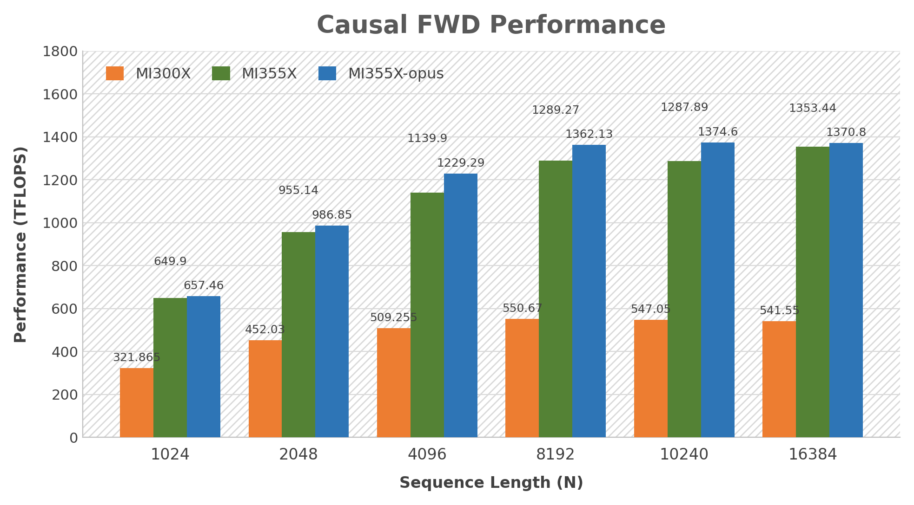
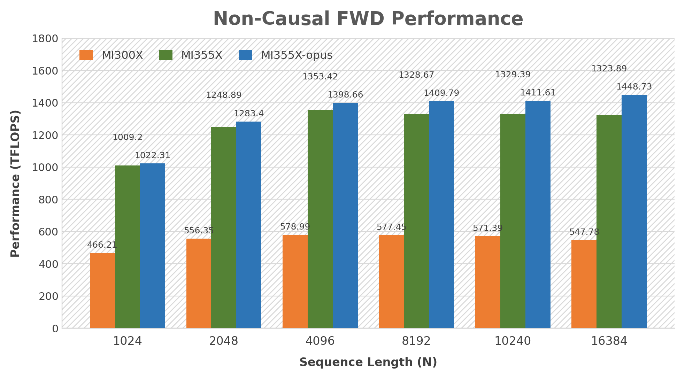
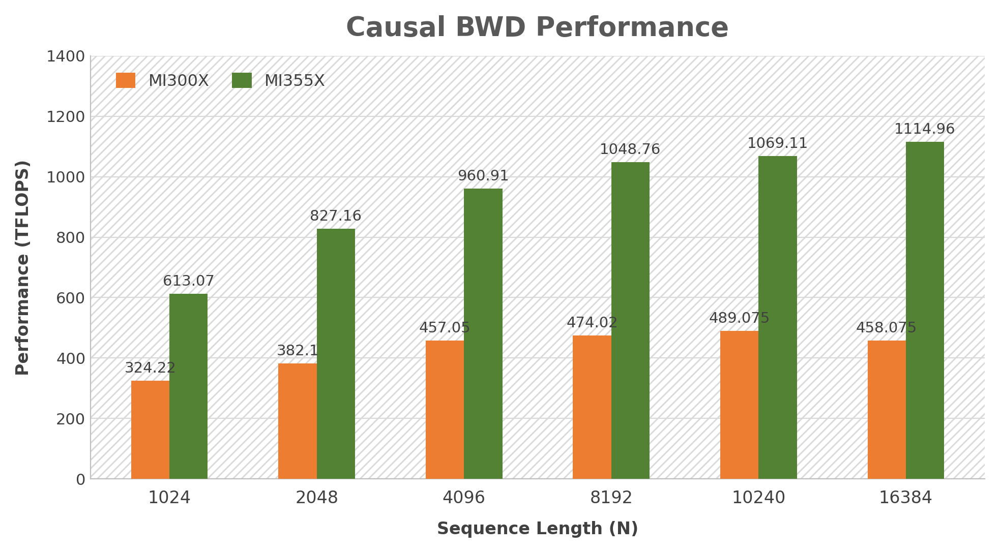
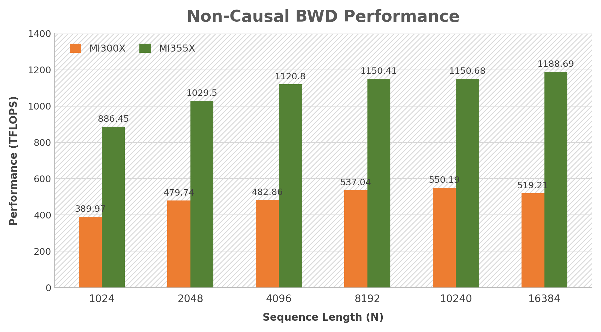
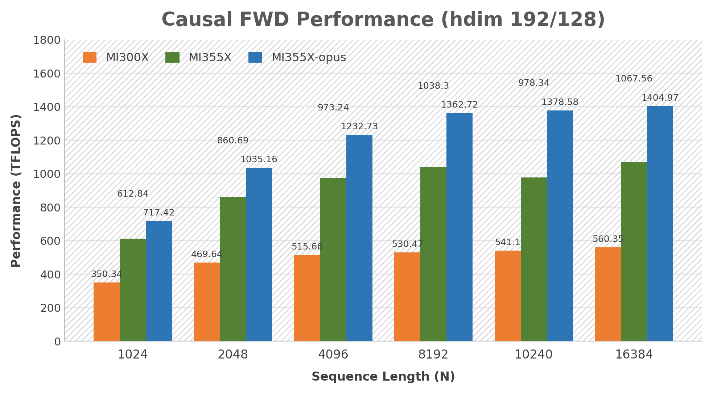
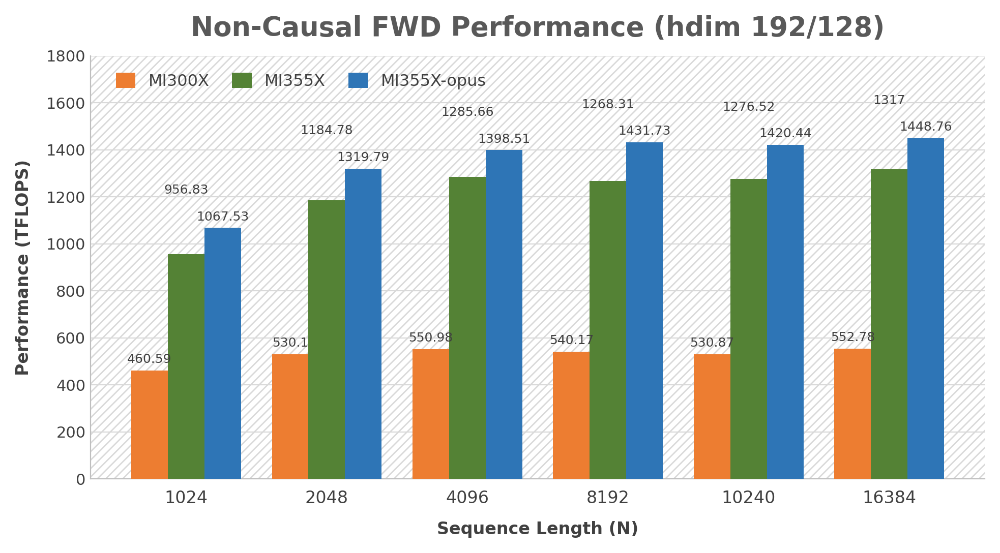
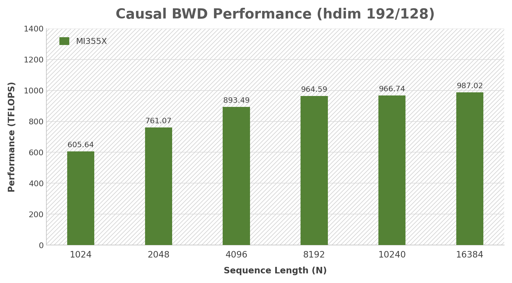
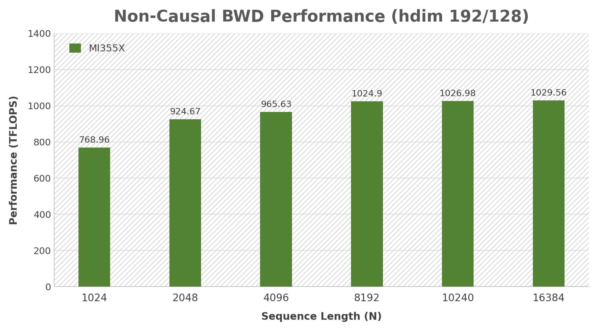

# aiter mha kernel

this is an example how to benchmark aiter mha fwd/bwd kernel through c++ API: `aiter::mha_fwd`, `aiter::mha_fwd_splitkv`, `aiter::mha_bwd`.

## build and run
We provide a simple script `build_mha.sh` to build the device library as well as a simple executable:
```
# this will build fwd_v3(asm) only
bash build_mha.sh fwd_v3

# this will build bwd_v3(asm) only
bash build_mha.sh bwd_v3

# this will build full fwd(asm + ck)
bash build_mha.sh fwd

# this will build full bwd(asm + ck)
bash build_mha.sh bwd

# this will build full fwd+bwd
bash build_mha.sh
```
Device library `libmha_fwd.so` and `libmha_bwd.so` will be built under current folder, and corresponding executables `benchmark_mha_fwd` and/or `benchmark_mha_bwd` will also be built. You can type `./benchmark_mha_fwd -?` to list all the supported arguments. You can also refer to the `smoke_test_*` script under this folder for a list of quick test.

To benchmark asm kernel, try following commands:
```

# Set this env before you run
export AITER_ASM_DIR={path_to_aiter}/hsa/

# fwd_v3
./benchmark_mha_fwd -prec=bf16 -b=1 -h=64 -d=128 -s=8192 -iperm=1 -operm=1 -mask=1 -lse=1 -fwd_v3=1 -mode=0 -kname=1 -v=0

# bwd_v3 with atomic fp16
./benchmark_mha_bwd -prec=bf16 -b=1 -h=64 -d=128 -s=8192 -iperm=1 -operm=1 -mask=1 -bwd_v3=1 -v3_atomic_fp32=0 -v3_bf16_cvt=2 -mode=0 -kname=1 -v=0

# bwd_v3 with atomic fp32
./benchmark_mha_bwd -prec=bf16 -b=1 -h=64 -d=128 -s=8192 -iperm=1 -operm=1 -mask=1 -bwd_v3=1 -v3_atomic_fp32=1 -v3_bf16_cvt=2 -mode=0 -kname=1 -v=0
```

## how to build/link aiter mha in your c++ project
We recommend you download the source code of `aiter` and put it under the `3rdparty` submodule folder of your project (you don't need to install `aiter`). We use a way simliar to [cpp_extension](https://github.com/pytorch/pytorch/blob/main/torch/utils/cpp_extension.py) to build the device kernel library without `torch` dependency (you don't need to install `torch`), so it's easy to embed `aiter` into other project.

Basically the build process will be similiar to that inside `build_mha.sh` script.

First, you need to build the device kernel into a `so`, which is done by a python `compile.py` inside this folder.
```
python3 compile.py
```
you can also call this python script from different directory, the generated `.so` will always under current directory.

Second, link the `.so` into your executable and compile. You need specify the correct path through `-L` inorder to link to the device lib. You also need to specify the include directory through `-I`, for this example you need set `$TOP_DIR/csrc/include` for the `aiter` API header, and the dependent ck header `$TOP_DIR/3rdparty/composable_kernel/include` and `$TOP_DIR/3rdparty/composable_kernel/example/ck_tile/01_fmha/`. Please refer to `build_mha.sh` for detailed command


## `aiter::mha_fwd` supported arguments configuration
Note: For optimal performance, the input configuration preferentially matches the supported parameters of the asm kernel type.

you can also call the executable `fwd.exe` to check whether the arguments are supported by the asm kernel with the `-is_v3_check=1` condition, try following commands:
```
    ./fwd.exe -prec=bf16 -b=1 -h=64 -d=128 -s=8192 -iperm=1 -operm=1 -mask=1 -lse=1 -fwd_v3=1 -mode=0 -kname=1 -v=0 -is_v3_check=1
```
`causal` below always means `window_size_left == -1 && window_size_right == 0`. The asm and opus kernels are compiled for `mask_bottom_right`; `mask_top_left` is only accepted when `seqlen_q == seqlen_k` (the two are equivalent there). `fp8bf16` means fp8 q/k/v with a bf16 output, and it requires the fp32 `q/k/v_descale` buffers to be set.

| data_type    | hdim_q  | hdim_v  | mode           | mask_type                            | general constraints                                | kernel type | mi308 | mi300/325 | mi350/355  |
|--------------|---------|---------|----------------|--------------------------------------|----------------------------------------------------|-------------|-------|-----------|------------|
| bf16         | 128     | 128     | batch or group | no_mask or causal(mask_bottom_right) | bias, dropout and swa are not supported            | asm         | y     | y         | y          |
| bf16         | 192     | 128     | batch or group | no_mask or causal(mask_bottom_right) | bias, dropout and swa are not supported            | asm         | y     | y         | y          |
| fp8bf16      | 128     | 128     | batch or group | no_mask or causal(mask_bottom_right) | same as above; descale of q/k/v is required        | asm         | y     | y         | y          |
| fp8bf16      | 256     | 256     | batch or group | no_mask or causal(mask_bottom_right) | same as above; descale of q/k/v is required        | asm         | n     | n         | y          |
| bf16         | 128     | 128     | batch          | no_mask or causal(mask_bottom_right) | bias, dropout and swa are not supported            | opus        | n     | n         | y          |
| bf16         | 192     | 128     | batch or group | no_mask or causal(mask_bottom_right) | bias, dropout and swa are not supported            | opus        | n     | n         | y          |
| fp16 or bf16 | [0,32]  | [0,32]  | batch or group | no_mask or causal or swa             | unconstrained                                      | ck          | y     | y         | y          |
| fp16 or bf16 | (0,64]  | (0,64]  | batch or group | no_mask or causal or swa             | unconstrained                                      | ck          | y     | y         | y          |
| fp16 or bf16 | (0,80]  | (0,96]  | batch or group | no_mask or causal or swa             | unconstrained                                      | ck          | y     | y         | y          |
| fp16 or bf16 | (0,96]  | (0,128] | batch or group | no_mask or causal or swa             | unconstrained                                      | ck          | y     | y         | y          |
| fp16 or bf16 | (0,128] | (0,128] | batch or group | no_mask or causal or swa             | unconstrained                                      | ck          | y     | y         | y          |
| fp16 or bf16 | (0,192] | (0,128] | batch or group | no_mask or causal or swa             | unconstrained                                      | ck          | y     | y         | y          |
| fp16 or bf16 | (0,192] | (0,192] | batch or group | no_mask or causal or swa             | unconstrained                                      | ck          | y     | y         | y          |
| fp16 or bf16 | (0,256] | (0,256] | batch or group | no_mask or causal or swa             | unconstrained                                      | ck          | y     | y         | y          |
| fp8bf16      | (0,128] | (0,128] | batch or group | no_mask or causal or swa             | descale of q/k/v is required                       | ck          | y     | y         | y          |
| fp8bf16      | (0,192] | (0,128] | batch or group | no_mask or causal or swa             | descale of q/k/v is required                       | ck          | y     | y         | y          |

Notes:
* The ck rows are matched top-down: the first row whose `hdim_q`/`hdim_v` both fit is the one that gets dispatched.
* `logits_soft_cap` and the attention sink are only implemented by the ck kernels; the asm and opus paths do not guard against them, so pass `fwd_v3=0` (or leave it at the default) when you need them.
* `-v3_bf16_cvt` (0:RTNE, 1:RTNA, 2:RTZ) only affects the gfx942 asm kernels. All three variants exist for `bf16`, while `fp8bf16` on gfx942 only ships the RTNA(=1) variant. gfx950 has a single variant and ignores this flag.
* The opus rows are **not** reachable through `aiter::mha_fwd`. They have their own entry point, `fmha_fwd_bf16_opus_fwd`, which `fwd.exe` calls with `-fwd_v3=2`. bias, dropout, `logits_soft_cap` and the attention sink are not parameters of that entry point at all, so the API cannot be handed them by mistake — but `fwd.exe` still accepts `-bias`, `-p_drop`, `-logits_soft_cap`, `-qscale` and a non-bf16 `-prec` under `-fwd_v3=2` and passes the buffers down unchanged, which makes the reported number describe something other than what was asked for. A head-dim pair outside the two rows above, group mode on the D=128 kernel, and an over-large kv extent are refused and print `not supported yet`.
* The opus kernels are compiled for gfx950 only: on any other arch the kernel template expands to an empty stub, and nothing checks the arch at runtime, so a call there returns without writing `out`.
* The D=128 opus kernel needs the kv byte extent (`seqlen_k * max(k, v seqlen-stride) * 2`) to stay below 2^32, because a larger one wraps the async-load offset. The 192/128 kernel rebases its buffer descriptors per tile and has no such limit.
* q/k/v/out must be contiguous along the head dim; the remaining strides are free, so both bshd and bhsd work. `-vlayout=c` does not (opus reads V row-major over the sequence).


## `aiter::mha_bwd` supported arguments configuration
Note: For optimal performance, the input configuration preferentially matches the supported parameters of the asm kernel type.

you can also call the executable `bwd.exe` to check whether the arguments are supported by the asm kernel with the `-v3_api_check=1` condition, try following commands:
```
    ./bwd.exe -prec=bf16 -b=1 -h=64 -d=128 -s=8192 -iperm=1 -operm=1 -mask=1 -bwd_v3=1 -v3_atomic_fp32=0 -v3_bf16_cvt=2 -mode=0 -kname=1 -v=0 -v3_api_check=1
```
Unlike fwd, the bwd asm kernels have separate `mask_top_left` and `mask_bottom_right` instances, so `causal` below covers both unless stated otherwise. The generic mask (`-mask=g:y,x`) is never supported by asm. `dq_acc` is no longer supplied by the caller: it is allocated internally through `mha_bwd_args::workspace_alloc`.

| data_type    | hdim_q       | hdim_v          | mode           | mask_type                | dq_accumulation          | general constraints                                                       | shape&stride constraints                                                                                                                                                                                          | kernel type(asm/ck) | mi308 | mi300/325 | mi350/355 |
|--------------|--------------|-----------------|----------------|--------------------------|--------------------------|---------------------------------------------------------------------------|-------------------------------------------------------------------------------------------------------------------------------------------------------------------------------------------------------------------|---------------------|-------|-----------|-----------|
| fp16 or bf16 | (128,192]/x8 | equal to hdim_q | batch or group | no_mask or causal        | atomic_f32               | bias, dbias, dropout and deterministic is not supported                   | unconstrained                                                                                                                                                                                                     | asm                 | y     | y         | y         |
| fp16 or bf16 | (64,128]/x8  | equal to hdim_q | batch or group | no_mask or causal        | atomic_f32               | bias, dbias, dropout and deterministic is not supported                   | unconstrained                                                                                                                                                                                                     | asm                 | y     | y         | y         |
| fp16 or bf16 | (64,128]/x8  | equal to hdim_q | batch          | swa                      | atomic_f32               | bias, dbias, dropout and deterministic is not supported                   | unconstrained                                                                                                                                                                                                     | asm                 | y     | y         | n         |
| fp16 or bf16 | (64,128]/x8  | equal to hdim_q | batch          | no_mask or causal_top_left | atomic_f16             | bias, dbias, dropout and deterministic is not supported                   | seqlen_q == seqlen_k and seqlen_k % 64 == 0. The shape&stride of q and do must be the same, the shape&stride of k and v must be the same, and dk/dv must keep the nhead stride of k/v.                             | asm                 | y     | y         | n         |
| fp16 or bf16 | (64,128]/x8  | equal to hdim_q | batch or group | no_mask or causal        | atomic_f16               | bias, dbias, dropout and deterministic is not supported                   | unconstrained                                                                                                                                                                                                     | asm                 | n     | n         | y         |
| fp16 or bf16 | 192          | 128             | batch          | no_mask or causal        | atomic_f32 or atomic_f16 | bias, dbias, dropout and deterministic is not supported                   | unconstrained                                                                                                                                                                                                     | asm                 | n     | n         | y         |
| fp16 or bf16 | 64           | equal to hdim_q | batch or group | no_mask or causal        | atomic_f32               | bias, dbias, dropout and deterministic is not supported                   | unconstrained                                                                                                                                                                                                     | asm                 | y     | y         | y         |
| fp16 or bf16 | 64           | equal to hdim_q | batch          | no_mask or causal_top_left | atomic_f16             | bias, dbias, dropout and deterministic is not supported                   | seqlen_q == seqlen_k and seqlen_k % 64 == 0. The shape&stride of q and do must be the same, the shape&stride of k and v must be the same, and dk/dv must keep the nhead stride of k/v.                             | asm                 | y     | y         | y         |
| fp16 or bf16 | [0,32]       | [0,32]          | batch or group | no_mask or causal or swa | atomic_f32 or atomic_f16 | unconstrained                                                             | unconstrained                                                                                                                                                                                                     | ck                  | y     | y         | y         |
| fp16 or bf16 | (0,64]       | (0,64]          | batch or group | no_mask or causal or swa | atomic_f32 or atomic_f16 | unconstrained                                                             | unconstrained                                                                                                                                                                                                     | ck                  | y     | y         | y         |
| fp16 or bf16 | (0,96]       | (0,96]          | batch or group | no_mask or causal or swa | atomic_f32 or atomic_f16 | unconstrained                                                             | unconstrained                                                                                                                                                                                                     | ck                  | y     | y         | y         |
| fp16 or bf16 | (0,128]      | (0,128]         | batch or group | no_mask or causal or swa | atomic_f32 or atomic_f16 | unconstrained                                                             | unconstrained                                                                                                                                                                                                     | ck                  | y     | y         | y         |
| fp16 or bf16 | (0,256]      | (0,256]         | batch or group | no_mask or causal or swa | atomic_f32 or atomic_f16 | unconstrained                                                             | unconstrained                                                                                                                                                                                                     | ck                  | y     | y         | y         |

Notes:
* All asm rows additionally require `hdim_q % 8 == 0 && hdim_v % 8 == 0`. `hdim_q` is padded up to 64/128/192 internally, and the `hdim_q == 64` bucket has no padded-hdim instance, so a head dim below 64 always falls back to ck.
* The rows marked `causal_top_left` have no `mask_bottom_right` instance. On gfx942 a bottom-right causal request is remapped to top-left, which is legal because those rows already require `seqlen_q == seqlen_k`; on gfx950 (`hdim_q == 64`, `atomic_f16`) there is no such remap and the bottom-right case falls back to ck.
* `-v3_bf16_cvt` (0:RTNE, 1:RTNA, 2:RTZ) picks the float→bf16 rounding variant of the bf16 dqdkdv and dq_convert instances. Every gfx942 bf16 instance is rounding-specific; on gfx950 only the `hdim_q == hdim_v == 192` and `hdim_q == hdim_v == 64` dqdkdv instances are, and all the fp16 instances are rounding-agnostic.
* gfx1250 is also dispatched to asm, but only for `bf16`, `hdim_q == hdim_v == 128`, batch mode, `atomic_f32`, `no_mask` or `mask_bottom_right`, and `seqlen_q == seqlen_k` with `seqlen_k % 128 == 0`.


## the asm and opus kernel performance of the attention forwards and attention backwards.
the performance data was tested under the conditions of BF16 and BSHD in batch mode.

The table covers both head-dim pairs the asm forward supports, `hdim_q`/`hdim_v`
of 128/128 and 192/128, and carries three forward numbers per row: the asm kernel
on MI300X and on MI355X, plus the opus kernel (`-fwd_v3=2`) on MI355X. Every cell
is the best of 3 runs, measured with the asm-only builds (`bash build_mha.sh
fwd_v3` / `bash build_mha.sh bwd_v3`):
```
    ./fwd.exe -prec=bf16 -iperm=0 -operm=0 -mode=0 -v=0 -warmup=20 -repeat=50 -lse=1 -fwd_v3=1        -b=$b -h=$hq -h_k=$hkv -s=$s -d=$dq -d_v=$dv -mask=$causal
    ./fwd.exe -prec=bf16 -iperm=0 -operm=0 -mode=0 -v=0 -warmup=20 -repeat=50 -lse=1 -fwd_v3=2        -b=$b -h=$hq -h_k=$hkv -s=$s -d=$dq -d_v=$dv -mask=$causal
    ./bwd.exe -prec=bf16 -iperm=0 -operm=0 -mode=0 -v=0 -warmup=20 -repeat=50 -bwd_v3=1 -v3_bf16_cvt=1 -v3_atomic_fp32=0|1 -b=$b -h=$hq -h_k=$hkv -s=$s -d=$dq -d_v=$dv -mask=$causal
```

The `-warmup`/`-repeat` window matters and is part of the numbers above. At the
default 10/10 the short shapes finish before the clocks ramp and read low --
`b=4 h=32/8 s=1024` backward-a16 reports 753 TFLOPS at 10/10, 832 at 20/50 and
895 at 50/100, while shapes at `s>=8192` are already saturated and move by well
under 1%. Comparing a re-measurement against this table means matching 20/50.

`n/a` marks a cell that no kernel can fill rather than one that was skipped. The
opus kernels are compiled for gfx950 only, so they have no MI300X column at all,
and the 192/128 backward asm instances likewise only exist for gfx950, which
leaves the MI300X backward cells empty on those rows.



*Figure 1: Evaluating GQA attention forwards performance at hdim 128/128 under the conditions of batch=8, q_nheads=64 and kv_nheads=8. The third bar is the opus kernel, which exists on MI355X only.*



*Figure 2: Evaluating GQA attention backwards(a16) performance at hdim 128/128 under the conditions of batch=8, q_nheads=64 and kv_nheads=8.*



*Figure 3: The same forwards comparison at hdim 192/128 (batch=8, q_nheads=64, kv_nheads=8). The opus kernel leads the asm one by a wider margin here than at 128/128, and by more still under a causal mask.*



*Figure 4: GQA attention backwards(a16) performance at hdim 192/128 (batch=8, q_nheads=64, kv_nheads=8). Only MI355X appears: the 192/128 backward asm instances are built for gfx950 only, so there is no MI300X series to plot.*

**More performance test results are shown in the table below:**

| batch | q_nheads | kv_nheads | seqlen_q | seqlen_kv | hdim_q | hdim_v | causal | FWD(TFLOPS) |         |             | BWD-a16(TFLOPS) |         | BWD-a32(TFLOPS) |        |
|-------|----------|-----------|----------|-----------|--------|--------|--------|-------------|---------|-------------|-----------------|---------|-----------------|--------|
|       |          |           |          |           |        |        |        | MI300X      | MI355X  | MI355X-opus | MI300X          | MI355X  | MI300X          | MI355X |
| 1     | 32       | 8         | 1024     | 1024      | 128    | 128    | 0      | 338.07      | 613.51  | 637.25      | 344.03          | 527.26  | 313.67          | 495.92 |
| 1     | 32       | 8         | 2048     | 2048      | 128    | 128    | 0      | 513.45      | 1014.67 | 1090.01     | 311.9           | 889.55  | 269.19          | 713.15 |
| 1     | 32       | 8         | 4096     | 4096      | 128    | 128    | 0      | 527.73      | 1176.56 | 1259.69     | 472.01          | 1097.3  | 423.53          | 788.98 |
| 1     | 32       | 8         | 8192     | 8192      | 128    | 128    | 0      | 558.17      | 1355.47 | 1407.88     | 524.15          | 1158.3  | 481.28          | 821.16 |
| 1     | 32       | 8         | 10240    | 10240     | 128    | 128    | 0      | 549.73      | 1364.76 | 1419.67     | 536.48          | 1162.24 | 491.28          | 831.2  |
| 4     | 32       | 8         | 1024     | 1024      | 128    | 128    | 0      | 458.41      | 894.8   | 913.44      | 390.4           | 828.91  | 353.44          | 676.35 |
| 4     | 32       | 8         | 2048     | 2048      | 128    | 128    | 0      | 504.8       | 1122.86 | 1181.49     | 459.52          | 1007.82 | 430.81          | 748.73 |
| 4     | 32       | 8         | 4096     | 4096      | 128    | 128    | 0      | 577.16      | 1312.37 | 1377.52     | 505.82          | 1102.76 | 457.38          | 805.49 |
| 4     | 32       | 8         | 8192     | 8192      | 128    | 128    | 0      | 574.62      | 1368.66 | 1418.75     | 491.07          | 1159.66 | 458.72          | 832.01 |
| 4     | 32       | 8         | 10240    | 10240     | 128    | 128    | 0      | 584.66      | 1301.47 | 1430.09     | 535.92          | 1167.62 | 476.64          | 841.19 |
| 8     | 32       | 8         | 1024     | 1024      | 128    | 128    | 0      | 459.43      | 901.6   | 965.78      | 379.88          | 861.67  | 329.69          | 681.11 |
| 8     | 32       | 8         | 2048     | 2048      | 128    | 128    | 0      | 543.77      | 1193.75 | 1234.94     | 475.12          | 1017.49 | 426.56          | 759.93 |
| 8     | 32       | 8         | 4096     | 4096      | 128    | 128    | 0      | 567.82      | 1342.07 | 1395.4      | 519.34          | 1104.79 | 460.44          | 814.41 |
| 8     | 32       | 8         | 8192     | 8192      | 128    | 128    | 0      | 585.29      | 1379.02 | 1436.89     | 518.07          | 1165.42 | 475.56          | 837.57 |
| 8     | 32       | 8         | 10240    | 10240     | 128    | 128    | 0      | 577.5       | 1319.69 | 1405.5      | 534.98          | 1171.44 | 480.87          | 841.93 |
| 1     | 64       | 8         | 1024     | 1024      | 128    | 128    | 0      | 418.36      | 946.25  | 985.23      | 292.68          | 755.12  | 266.06          | 644.99 |
| 1     | 64       | 8         | 2048     | 2048      | 128    | 128    | 0      | 485.45      | 1023.02 | 1082.92     | 437.26          | 983.53  | 393.6           | 734.86 |
| 1     | 64       | 8         | 4096     | 4096      | 128    | 128    | 0      | 546.34      | 1286.63 | 1342.3      | 524.33          | 1106.39 | 470.15          | 795.11 |
| 1     | 64       | 8         | 8192     | 8192      | 128    | 128    | 0      | 591.37      | 1357.22 | 1419.07     | 473             | 1155.27 | 441.82          | 826.53 |
| 1     | 64       | 8         | 10240    | 10240     | 128    | 128    | 0      | 572.09      | 1369.88 | 1427.78     | 503.78          | 1141.15 | 460             | 836.05 |
| 4     | 64       | 8         | 1024     | 1024      | 128    | 128    | 0      | 440.07      | 969.09  | 971.33      | 376.75          | 854.71  | 340.25          | 676.59 |
| 4     | 64       | 8         | 2048     | 2048      | 128    | 128    | 0      | 554.8       | 1205.25 | 1241.71     | 477.46          | 1017.83 | 425.74          | 758.53 |
| 4     | 64       | 8         | 4096     | 4096      | 128    | 128    | 0      | 573.6       | 1342.83 | 1388.95     | 510.76          | 1119.47 | 456.78          | 813.03 |
| 4     | 64       | 8         | 8192     | 8192      | 128    | 128    | 0      | 592.16      | 1327.66 | 1434.59     | 511.65          | 1153.58 | 468.71          | 834.88 |
| 4     | 64       | 8         | 10240    | 10240     | 128    | 128    | 0      | 578.93      | 1340.57 | 1434.98     | 535.75          | 1170.89 | 479.52          | 839.6  |
| 8     | 64       | 8         | 1024     | 1024      | 128    | 128    | 0      | 466.21      | 1009.2  | 1022.31     | 389.97          | 886.45  | 357.82          | 693.21 |
| 8     | 64       | 8         | 2048     | 2048      | 128    | 128    | 0      | 556.35      | 1248.89 | 1283.4      | 479.74          | 1029.5  | 430.07          | 765.76 |
| 8     | 64       | 8         | 4096     | 4096      | 128    | 128    | 0      | 578.99      | 1353.42 | 1398.66     | 482.86          | 1120.8  | 445.73          | 814.12 |
| 8     | 64       | 8         | 8192     | 8192      | 128    | 128    | 0      | 577.45      | 1328.67 | 1409.79     | 537.04          | 1150.41 | 475.07          | 836.11 |
| 8     | 64       | 8         | 10240    | 10240     | 128    | 128    | 0      | 571.39      | 1329.39 | 1411.61     | 550.19          | 1150.68 | 480.35          | 839.67 |
| 1     | 64       | 4         | 1024     | 1024      | 128    | 128    | 0      | 383.85      | 956.49  | 988.45      | 291.27          | 763.33  | 264.63          | 645.41 |
| 1     | 64       | 4         | 2048     | 2048      | 128    | 128    | 0      | 506.89      | 1015.75 | 1077.67     | 443.31          | 984.56  | 396.33          | 737.56 |
| 1     | 64       | 4         | 4096     | 4096      | 128    | 128    | 0      | 549.2       | 1293.28 | 1346.07     | 520.99          | 1108.41 | 467.24          | 795.44 |
| 1     | 64       | 4         | 8192     | 8192      | 128    | 128    | 0      | 591.77      | 1363.13 | 1417.8      | 465.87          | 1151.57 | 439.94          | 827.23 |
| 1     | 64       | 4         | 10240    | 10240     | 128    | 128    | 0      | 571.59      | 1370.72 | 1427.15     | 505.49          | 1166.91 | 459.64          | 835.7  |
| 4     | 64       | 4         | 1024     | 1024      | 128    | 128    | 0      | 460.34      | 970.89  | 967.27      | 395.21          | 860.44  | 332.54          | 675.52 |
| 4     | 64       | 4         | 2048     | 2048      | 128    | 128    | 0      | 556.35      | 1219.4  | 1250.03     | 474.83          | 1016.71 | 424.12          | 758.08 |
| 4     | 64       | 4         | 4096     | 4096      | 128    | 128    | 0      | 575.69      | 1343.82 | 1390.15     | 519.08          | 1102.78 | 457.51          | 812.58 |
| 4     | 64       | 4         | 8192     | 8192      | 128    | 128    | 0      | 590.93      | 1378.79 | 1433.23     | 513.66          | 1165.61 | 469.72          | 834.89 |
| 4     | 64       | 4         | 10240    | 10240     | 128    | 128    | 0      | 582.64      | 1342.6  | 1374        | 534.39          | 1171.6  | 475.49          | 840.32 |
| 8     | 64       | 4         | 1024     | 1024      | 128    | 128    | 0      | 497.15      | 1015.17 | 1024.75     | 389.54          | 887.59  | 360.39          | 691.15 |
| 8     | 64       | 4         | 2048     | 2048      | 128    | 128    | 0      | 556.22      | 1253.21 | 1294.93     | 478.01          | 1022.89 | 426.77          | 765.8  |
| 8     | 64       | 4         | 4096     | 4096      | 128    | 128    | 0      | 581.34      | 1357.26 | 1397.17     | 481.35          | 1121    | 438.77          | 812.45 |
| 8     | 64       | 4         | 8192     | 8192      | 128    | 128    | 0      | 583.23      | 1331.93 | 1422.53     | 536.72          | 1156.89 | 475.68          | 836.22 |
| 8     | 64       | 4         | 10240    | 10240     | 128    | 128    | 0      | 566.17      | 1331.28 | 1409.38     | 550.05          | 1163.52 | 478.88          | 839.04 |
| 1     | 64       | 8         | 16384    | 16384     | 128    | 128    | 0      | 547.78      | 1323.89 | 1448.73     | 519.21          | 1188.69 | 441.55          | 836.14 |
| 1     | 64       | 4         | 16384    | 16384     | 128    | 128    | 0      | 549.09      | 1328.63 | 1447.8      | 516.26          | 1189.11 | 448.83          | 836.13 |
| 1     | 32       | 8         | 1024     | 1024      | 128    | 128    | 1      | 130.62      | 234.18  | 328.39      | 177.565         | 217.34  | 166.78          | 209.02 |
| 1     | 32       | 8         | 2048     | 2048      | 128    | 128    | 1      | 255.105     | 558.09  | 673.23      | 317.3           | 516.81  | 295.865         | 479.18 |
| 1     | 32       | 8         | 4096     | 4096      | 128    | 128    | 1      | 467.805     | 967.04  | 922.54      | 317.685         | 925.52  | 296.025         | 715.48 |
| 1     | 32       | 8         | 8192     | 8192      | 128    | 128    | 1      | 522.68      | 1259.8  | 1216.32     | 436.13          | 1055.09 | 388.235         | 775.74 |
| 1     | 32       | 8         | 10240    | 10240     | 128    | 128    | 1      | 440.12      | 1200.01 | 1267.67     | 513.85          | 1011.13 | 244.705         | 755.64 |
| 4     | 32       | 8         | 1024     | 1024      | 128    | 128    | 1      | 334.005     | 623.57  | 574.5       | 257.115         | 574.49  | 226.39          | 477.56 |
| 4     | 32       | 8         | 2048     | 2048      | 128    | 128    | 1      | 419.435     | 840.41  | 832.32      | 377.51          | 787.65  | 330.23          | 607.05 |
| 4     | 32       | 8         | 4096     | 4096      | 128    | 128    | 1      | 486.73      | 1135.82 | 1140.41     | 464.83          | 956.83  | 416.54          | 726.11 |
| 4     | 32       | 8         | 8192     | 8192      | 128    | 128    | 1      | 547.09      | 1300.06 | 1317.54     | 468.205         | 1058.44 | 422.835         | 780.52 |
| 4     | 32       | 8         | 10240    | 10240     | 128    | 128    | 1      | 527.705     | 1322.4  | 1336.47     | 474.205         | 1081.75 | 432.545         | 799.36 |
| 8     | 32       | 8         | 1024     | 1024      | 128    | 128    | 1      | 311.385     | 614.91  | 628.85      | 301.495         | 572.3   | 258.26          | 470.45 |
| 8     | 32       | 8         | 2048     | 2048      | 128    | 128    | 1      | 412.99      | 900.65  | 911.39      | 374.255         | 809.83  | 326.355         | 625.5  |
| 8     | 32       | 8         | 4096     | 4096      | 128    | 128    | 1      | 513.1       | 1156.08 | 1197.38     | 454.36          | 964.89  | 409.05          | 730.56 |
| 8     | 32       | 8         | 8192     | 8192      | 128    | 128    | 1      | 537.36      | 1299.22 | 1337.34     | 491.78          | 1066.47 | 441.4           | 780.5  |
| 8     | 32       | 8         | 10240    | 10240     | 128    | 128    | 1      | 556.045     | 1312.48 | 1365.83     | 495.15          | 1075.33 | 443.78          | 799.36 |
| 1     | 64       | 8         | 1024     | 1024      | 128    | 128    | 1      | 228.54      | 428.08  | 577.76      | 283.58          | 392.5   | 242.43          | 370.75 |
| 1     | 64       | 8         | 2048     | 2048      | 128    | 128    | 1      | 392.425     | 793.64  | 782.77      | 279.72          | 765.19  | 257.855         | 596.54 |
| 1     | 64       | 8         | 4096     | 4096      | 128    | 128    | 1      | 474.385     | 1070.47 | 1076.2      | 420.265         | 947.16  | 378.155         | 718.87 |
| 1     | 64       | 8         | 8192     | 8192      | 128    | 128    | 1      | 518.29      | 1294.72 | 1293.77     | 481.895         | 1053.32 | 433.285         | 775.71 |
| 1     | 64       | 8         | 10240    | 10240     | 128    | 128    | 1      | 510.895     | 1312.4  | 1324.1      | 501.055         | 1071.99 | 447.995         | 794.69 |
| 4     | 64       | 8         | 1024     | 1024      | 128    | 128    | 1      | 326.51      | 616.08  | 653.47      | 311.005         | 583.09  | 266.9           | 472.71 |
| 4     | 64       | 8         | 2048     | 2048      | 128    | 128    | 1      | 425.735     | 902.37  | 924.03      | 377.225         | 818.03  | 326.805         | 624.73 |
| 4     | 64       | 8         | 4096     | 4096      | 128    | 128    | 1      | 513.79      | 1154.92 | 1203.69     | 449             | 964.17  | 391.235         | 730.01 |
| 4     | 64       | 8         | 8192     | 8192      | 128    | 128    | 1      | 540.515     | 1296.05 | 1341.17     | 482.505         | 1066.67 | 434.645         | 778.28 |
| 4     | 64       | 8         | 10240    | 10240     | 128    | 128    | 1      | 557.475     | 1315.91 | 1370.65     | 493.745         | 1085.25 | 442.51          | 795.81 |
| 8     | 64       | 8         | 1024     | 1024      | 128    | 128    | 1      | 321.865     | 649.9   | 657.46      | 324.22          | 613.07  | 265.08          | 493.14 |
| 8     | 64       | 8         | 2048     | 2048      | 128    | 128    | 1      | 452.03      | 955.14  | 986.85      | 382.1           | 827.16  | 347.89          | 637.36 |
| 8     | 64       | 8         | 4096     | 4096      | 128    | 128    | 1      | 509.255     | 1139.9  | 1229.29     | 457.05          | 960.91  | 402.18          | 726.45 |
| 8     | 64       | 8         | 8192     | 8192      | 128    | 128    | 1      | 550.67      | 1289.27 | 1362.13     | 474.02          | 1048.76 | 432.715         | 782.36 |
| 8     | 64       | 8         | 10240    | 10240     | 128    | 128    | 1      | 547.05      | 1287.89 | 1374.6      | 489.075         | 1069.11 | 439.785         | 799.28 |
| 1     | 64       | 4         | 1024     | 1024      | 128    | 128    | 1      | 229.09      | 424.42  | 566.21      | 265.11          | 394.53  | 238.755         | 369.96 |
| 1     | 64       | 4         | 2048     | 2048      | 128    | 128    | 1      | 407.525     | 824.7   | 781.14      | 277.86          | 755.87  | 254.375         | 597.09 |
| 1     | 64       | 4         | 4096     | 4096      | 128    | 128    | 1      | 476.26      | 1079.85 | 1085.41     | 418.73          | 951.71  | 384.585         | 717.88 |
| 1     | 64       | 4         | 8192     | 8192      | 128    | 128    | 1      | 519.32      | 1293.74 | 1294.67     | 480.06          | 1054.97 | 442.955         | 775.52 |
| 1     | 64       | 4         | 10240    | 10240     | 128    | 128    | 1      | 515.275     | 1315.05 | 1324.63     | 499.72          | 1074.85 | 459.745         | 793.4  |
| 4     | 64       | 4         | 1024     | 1024      | 128    | 128    | 1      | 314.82      | 653.52  | 630.13      | 324.22          | 593.8   | 264.795         | 474.99 |
| 4     | 64       | 4         | 2048     | 2048      | 128    | 128    | 1      | 426.77      | 914.76  | 927.16      | 374.96          | 820.15  | 331.95          | 624.69 |
| 4     | 64       | 4         | 4096     | 4096      | 128    | 128    | 1      | 524.585     | 1172.53 | 1205.37     | 453.97          | 965.67  | 405.02          | 728.42 |
| 4     | 64       | 4         | 8192     | 8192      | 128    | 128    | 1      | 540.935     | 1309.93 | 1340.09     | 478.735         | 1053.63 | 430.95          | 777.74 |
| 4     | 64       | 4         | 10240    | 10240     | 128    | 128    | 1      | 560.63      | 1329.86 | 1369.01     | 491.435         | 1085.4  | 441.345         | 795.89 |
| 8     | 64       | 4         | 1024     | 1024      | 128    | 128    | 1      | 348.76      | 667.31  | 667.74      | 315.035         | 617.53  | 267.48          | 496.86 |
| 8     | 64       | 4         | 2048     | 2048      | 128    | 128    | 1      | 461.89      | 964.78  | 991.29      | 400.31          | 829.71  | 352.7           | 637.67 |
| 8     | 64       | 4         | 4096     | 4096      | 128    | 128    | 1      | 513.795     | 1186.79 | 1230.54     | 456.415         | 960.66  | 402.68          | 727.14 |
| 8     | 64       | 4         | 8192     | 8192      | 128    | 128    | 1      | 552.78      | 1306.09 | 1359.88     | 473.41          | 1061.03 | 434.51          | 780.18 |
| 8     | 64       | 4         | 10240    | 10240     | 128    | 128    | 1      | 548.65      | 1313.29 | 1370.25     | 488.145         | 1077.87 | 435.745         | 798.93 |
| 1     | 64       | 8         | 16384    | 16384     | 128    | 128    | 1      | 541.55      | 1353.44 | 1370.8      | 458.075         | 1114.96 | 412.04          | 817.47 |
| 1     | 64       | 4         | 16384    | 16384     | 128    | 128    | 1      | 544.1       | 1351.69 | 1373.42     | 458.065         | 1115.16 | 419.975         | 817.53 |
| 1     | 32       | 8         | 1024     | 1024      | 192    | 128    | 0      | 375.85      | 898.97  | 664.01      | n/a             | 537.51  | n/a             | 387.95 |
| 1     | 32       | 8         | 2048     | 2048      | 192    | 128    | 0      | 482.74      | 948.04  | 1099.29     | n/a             | 721.26  | n/a             | 464.08 |
| 1     | 32       | 8         | 4096     | 4096      | 192    | 128    | 0      | 494.19      | 1173.56 | 1293.04     | n/a             | 946.8   | n/a             | 511.88 |
| 1     | 32       | 8         | 8192     | 8192      | 192    | 128    | 0      | 575.51      | 1278.98 | 1418.39     | n/a             | 948.84  | n/a             | 533.05 |
| 1     | 32       | 8         | 10240    | 10240     | 192    | 128    | 0      | 557.43      | 1283.33 | 1424.35     | n/a             | 1008.33 | n/a             | 545.08 |
| 4     | 32       | 8         | 1024     | 1024      | 192    | 128    | 0      | 437.19      | 835.58  | 940.5       | n/a             | 713.23  | n/a             | 438.7  |
| 4     | 32       | 8         | 2048     | 2048      | 192    | 128    | 0      | 508.79      | 1105.55 | 1220.39     | n/a             | 889.27  | n/a             | 498.33 |
| 4     | 32       | 8         | 4096     | 4096      | 192    | 128    | 0      | 559.41      | 1257.74 | 1402.16     | n/a             | 975.64  | n/a             | 524.5  |
| 4     | 32       | 8         | 8192     | 8192      | 192    | 128    | 0      | 565.42      | 1302.63 | 1424.79     | n/a             | 1019.77 | n/a             | 547.66 |
| 4     | 32       | 8         | 10240    | 10240     | 192    | 128    | 0      | 558.48      | 1278.38 | 1442.34     | n/a             | 1030.07 | n/a             | 544.57 |
| 8     | 32       | 8         | 1024     | 1024      | 192    | 128    | 0      | 431.01      | 897.45  | 985.61      | n/a             | 743.53  | n/a             | 438.73 |
| 8     | 32       | 8         | 2048     | 2048      | 192    | 128    | 0      | 533.17      | 1138    | 1272.65     | n/a             | 926.5   | n/a             | 509.7  |
| 8     | 32       | 8         | 4096     | 4096      | 192    | 128    | 0      | 565.67      | 1163.62 | 1407.57     | n/a             | 969.64  | n/a             | 528.77 |
| 8     | 32       | 8         | 8192     | 8192      | 192    | 128    | 0      | 558.15      | 1268.55 | 1434.68     | n/a             | 1032.73 | n/a             | 546.78 |
| 8     | 32       | 8         | 10240    | 10240     | 192    | 128    | 0      | 571.3       | 1288.35 | 1436.05     | n/a             | 1024.79 | n/a             | 548    |
| 1     | 64       | 8         | 1024     | 1024      | 192    | 128    | 0      | 401.92      | 892.55  | 987.09      | n/a             | 602.57  | n/a             | 422    |
| 1     | 64       | 8         | 2048     | 2048      | 192    | 128    | 0      | 434.98      | 1006.59 | 1117.25     | n/a             | 864.93  | n/a             | 500.68 |
| 1     | 64       | 8         | 4096     | 4096      | 192    | 128    | 0      | 547.17      | 1245.33 | 1379.37     | n/a             | 949.67  | n/a             | 511.52 |
| 1     | 64       | 8         | 8192     | 8192      | 192    | 128    | 0      | 557         | 1276.78 | 1420.15     | n/a             | 1018.75 | n/a             | 546.02 |
| 1     | 64       | 8         | 10240    | 10240     | 192    | 128    | 0      | 566.67      | 1291.28 | 1432.22     | n/a             | 983.26  | n/a             | 544.62 |
| 4     | 64       | 8         | 1024     | 1024      | 192    | 128    | 0      | 436.5       | 907.25  | 1013.12     | n/a             | 749.95  | n/a             | 438.02 |
| 4     | 64       | 8         | 2048     | 2048      | 192    | 128    | 0      | 523.61      | 1156.81 | 1297.87     | n/a             | 926.71  | n/a             | 508.43 |
| 4     | 64       | 8         | 4096     | 4096      | 192    | 128    | 0      | 555.97      | 1276.9  | 1392.52     | n/a             | 967.87  | n/a             | 528.73 |
| 4     | 64       | 8         | 8192     | 8192      | 192    | 128    | 0      | 548.34      | 1305.74 | 1435.78     | n/a             | 1025.81 | n/a             | 549.46 |
| 4     | 64       | 8         | 10240    | 10240     | 192    | 128    | 0      | 536.27      | 1284.63 | 1438.42     | n/a             | 1034.13 | n/a             | 547.98 |
| 8     | 64       | 8         | 1024     | 1024      | 192    | 128    | 0      | 460.59      | 956.83  | 1067.53     | n/a             | 768.96  | n/a             | 442.88 |
| 8     | 64       | 8         | 2048     | 2048      | 192    | 128    | 0      | 530.1       | 1184.78 | 1319.79     | n/a             | 924.67  | n/a             | 513.73 |
| 8     | 64       | 8         | 4096     | 4096      | 192    | 128    | 0      | 550.98      | 1285.66 | 1398.51     | n/a             | 965.63  | n/a             | 530.54 |
| 8     | 64       | 8         | 8192     | 8192      | 192    | 128    | 0      | 540.17      | 1268.31 | 1431.73     | n/a             | 1024.9  | n/a             | 549.28 |
| 8     | 64       | 8         | 10240    | 10240     | 192    | 128    | 0      | 530.87      | 1276.52 | 1420.44     | n/a             | 1026.98 | n/a             | 550.91 |
| 1     | 64       | 4         | 1024     | 1024      | 192    | 128    | 0      | 418.14      | 882.28  | 995.38      | n/a             | 605.49  | n/a             | 420.04 |
| 1     | 64       | 4         | 2048     | 2048      | 192    | 128    | 0      | 455.99      | 1004.46 | 1126.06     | n/a             | 868.24  | n/a             | 500.52 |
| 1     | 64       | 4         | 4096     | 4096      | 192    | 128    | 0      | 548.24      | 1246.36 | 1381.16     | n/a             | 947.25  | n/a             | 511.96 |
| 1     | 64       | 4         | 8192     | 8192      | 192    | 128    | 0      | 559.25      | 1279.56 | 1424.59     | n/a             | 1019.17 | n/a             | 545.74 |
| 1     | 64       | 4         | 10240    | 10240     | 192    | 128    | 0      | 574.18      | 1292.28 | 1368.34     | n/a             | 1009.16 | n/a             | 544.29 |
| 4     | 64       | 4         | 1024     | 1024      | 192    | 128    | 0      | 448.71      | 924.57  | 1008.32     | n/a             | 755.94  | n/a             | 439.21 |
| 4     | 64       | 4         | 2048     | 2048      | 192    | 128    | 0      | 531.22      | 1170.37 | 1298.03     | n/a             | 927.21  | n/a             | 506.37 |
| 4     | 64       | 4         | 4096     | 4096      | 192    | 128    | 0      | 565.29      | 1267.57 | 1391.69     | n/a             | 968     | n/a             | 528.73 |
| 4     | 64       | 4         | 8192     | 8192      | 192    | 128    | 0      | 559.48      | 1304.34 | 1434.1      | n/a             | 1030.44 | n/a             | 547.33 |
| 4     | 64       | 4         | 10240    | 10240     | 192    | 128    | 0      | 572.1       | 1304.66 | 1405.96     | n/a             | 1034.3  | n/a             | 544.88 |
| 8     | 64       | 4         | 1024     | 1024      | 192    | 128    | 0      | 480.31      | 967.4   | 1081.02     | n/a             | 769.28  | n/a             | 443.29 |
| 8     | 64       | 4         | 2048     | 2048      | 192    | 128    | 0      | 544.32      | 1182.66 | 1324.08     | n/a             | 925.91  | n/a             | 515.19 |
| 8     | 64       | 4         | 4096     | 4096      | 192    | 128    | 0      | 555.52      | 1280.76 | 1399.79     | n/a             | 941.2   | n/a             | 530.75 |
| 8     | 64       | 4         | 8192     | 8192      | 192    | 128    | 0      | 572.77      | 1281.12 | 1432.99     | n/a             | 1026.12 | n/a             | 548.23 |
| 8     | 64       | 4         | 10240    | 10240     | 192    | 128    | 0      | 578.38      | 1263.89 | 1435.65     | n/a             | 1033.94 | n/a             | 551.86 |
| 1     | 64       | 8         | 16384    | 16384     | 192    | 128    | 0      | 552.78      | 1317    | 1448.76     | n/a             | 1029.56 | n/a             | 549.72 |
| 1     | 64       | 4         | 16384    | 16384     | 192    | 128    | 0      | 570.23      | 1270.69 | 1449.36     | n/a             | 1032.22 | n/a             | 549.62 |
| 1     | 32       | 8         | 1024     | 1024      | 192    | 128    | 1      | 251.14      | 349.9   | 343.99      | n/a             | 294.36  | n/a             | 274.65 |
| 1     | 32       | 8         | 2048     | 2048      | 192    | 128    | 1      | 391.96      | 704.88  | 635.06      | n/a             | 586.1   | n/a             | 433.19 |
| 1     | 32       | 8         | 4096     | 4096      | 192    | 128    | 1      | 453.39      | 853.8   | 1062.54     | n/a             | 740.38  | n/a             | 472.37 |
| 1     | 32       | 8         | 8192     | 8192      | 192    | 128    | 1      | 541.39      | 1056.92 | 1345.74     | n/a             | 927.46  | n/a             | 515.76 |
| 1     | 32       | 8         | 10240    | 10240     | 192    | 128    | 1      | 560.41      | 1084.84 | 1269.8      | n/a             | 880.44  | n/a             | 513.47 |
| 4     | 32       | 8         | 1024     | 1024      | 192    | 128    | 1      | 354.29      | 566.54  | 664.07      | n/a             | 498.45  | n/a             | 355.99 |
| 4     | 32       | 8         | 2048     | 2048      | 192    | 128    | 1      | 406.51      | 770.68  | 928.24      | n/a             | 737.66  | n/a             | 439.15 |
| 4     | 32       | 8         | 4096     | 4096      | 192    | 128    | 1      | 522.02      | 967.43  | 1214.29     | n/a             | 867     | n/a             | 488.48 |
| 4     | 32       | 8         | 8192     | 8192      | 192    | 128    | 1      | 550.77      | 1058.05 | 1363.22     | n/a             | 959.07  | n/a             | 530.57 |
| 4     | 32       | 8         | 10240    | 10240     | 192    | 128    | 1      | 551.88      | 1032.92 | 1385.44     | n/a             | 950.54  | n/a             | 536.39 |
| 8     | 32       | 8         | 1024     | 1024      | 192    | 128    | 1      | 348.14      | 585.7   | 663.99      | n/a             | 577.35  | n/a             | 371.31 |
| 8     | 32       | 8         | 2048     | 2048      | 192    | 128    | 1      | 430.64      | 804.93  | 981.16      | n/a             | 761.29  | n/a             | 448.19 |
| 8     | 32       | 8         | 4096     | 4096      | 192    | 128    | 1      | 523.1       | 973.02  | 1224.66     | n/a             | 905.31  | n/a             | 500.41 |
| 8     | 32       | 8         | 8192     | 8192      | 192    | 128    | 1      | 541.58      | 1033.75 | 1354.77     | n/a             | 951.27  | n/a             | 532.49 |
| 8     | 32       | 8         | 10240    | 10240     | 192    | 128    | 1      | 547.89      | 1049.85 | 1389.5      | n/a             | 977.81  | n/a             | 538.91 |
| 1     | 64       | 8         | 1024     | 1024      | 192    | 128    | 1      | 319         | 581.01  | 538.66      | n/a             | 459.85  | n/a             | 359.24 |
| 1     | 64       | 8         | 2048     | 2048      | 192    | 128    | 1      | 440.65      | 711.27  | 878.83      | n/a             | 637     | n/a             | 425.21 |
| 1     | 64       | 8         | 4096     | 4096      | 192    | 128    | 1      | 486.59      | 930.33  | 1175.97     | n/a             | 867.88  | n/a             | 489.85 |
| 1     | 64       | 8         | 8192     | 8192      | 192    | 128    | 1      | 553.13      | 1062.71 | 1357.28     | n/a             | 893.66  | n/a             | 512.62 |
| 1     | 64       | 8         | 10240    | 10240     | 192    | 128    | 1      | 559.31      | 1068.6  | 1374.32     | n/a             | 961.92  | n/a             | 535.83 |
| 4     | 64       | 8         | 1024     | 1024      | 192    | 128    | 1      | 358.89      | 579.66  | 688.06      | n/a             | 575.6   | n/a             | 368.65 |
| 4     | 64       | 8         | 2048     | 2048      | 192    | 128    | 1      | 431.39      | 816.07  | 995.82      | n/a             | 768.68  | n/a             | 447.83 |
| 4     | 64       | 8         | 4096     | 4096      | 192    | 128    | 1      | 518.09      | 987.88  | 1235.91     | n/a             | 905.95  | n/a             | 500.95 |
| 4     | 64       | 8         | 8192     | 8192      | 192    | 128    | 1      | 539.21      | 1028.81 | 1369.57     | n/a             | 952.72  | n/a             | 532.4  |
| 4     | 64       | 8         | 10240    | 10240     | 192    | 128    | 1      | 540.14      | 1027.51 | 1386.7      | n/a             | 975.45  | n/a             | 539.23 |
| 8     | 64       | 8         | 1024     | 1024      | 192    | 128    | 1      | 350.34      | 612.84  | 717.42      | n/a             | 605.64  | n/a             | 375.03 |
| 8     | 64       | 8         | 2048     | 2048      | 192    | 128    | 1      | 469.64      | 860.69  | 1035.16     | n/a             | 761.07  | n/a             | 456.12 |
| 8     | 64       | 8         | 4096     | 4096      | 192    | 128    | 1      | 515.66      | 973.24  | 1232.73     | n/a             | 893.49  | n/a             | 504.96 |
| 8     | 64       | 8         | 8192     | 8192      | 192    | 128    | 1      | 530.47      | 1038.3  | 1362.72     | n/a             | 964.59  | n/a             | 535.2  |
| 8     | 64       | 8         | 10240    | 10240     | 192    | 128    | 1      | 541.1       | 978.34  | 1378.58     | n/a             | 966.74  | n/a             | 541.95 |
| 1     | 64       | 4         | 1024     | 1024      | 192    | 128    | 1      | 269.09      | 591.89  | 547.14      | n/a             | 465.07  | n/a             | 360.73 |
| 1     | 64       | 4         | 2048     | 2048      | 192    | 128    | 1      | 456.89      | 725.09  | 877.94      | n/a             | 642.71  | n/a             | 425.46 |
| 1     | 64       | 4         | 4096     | 4096      | 192    | 128    | 1      | 504.33      | 941.68  | 1180.37     | n/a             | 874.47  | n/a             | 490.55 |
| 1     | 64       | 4         | 8192     | 8192      | 192    | 128    | 1      | 561.86      | 1056.63 | 1354.06     | n/a             | 894.15  | n/a             | 512.97 |
| 1     | 64       | 4         | 10240    | 10240     | 192    | 128    | 1      | 566.33      | 1079.94 | 1373.1      | n/a             | 963.25  | n/a             | 535.72 |
| 4     | 64       | 4         | 1024     | 1024      | 192    | 128    | 1      | 367.64      | 590.74  | 694.07      | n/a             | 581.71  | n/a             | 369.94 |
| 4     | 64       | 4         | 2048     | 2048      | 192    | 128    | 1      | 444.97      | 819.99  | 1009.2      | n/a             | 766.98  | n/a             | 447.07 |
| 4     | 64       | 4         | 4096     | 4096      | 192    | 128    | 1      | 531.91      | 998.76  | 1264.44     | n/a             | 907.36  | n/a             | 501.62 |
| 4     | 64       | 4         | 8192     | 8192      | 192    | 128    | 1      | 550.59      | 1042.28 | 1361.08     | n/a             | 951.63  | n/a             | 533.18 |
| 4     | 64       | 4         | 10240    | 10240     | 192    | 128    | 1      | 553.92      | 1037.39 | 1386.22     | n/a             | 978.05  | n/a             | 539.52 |
| 8     | 64       | 4         | 1024     | 1024      | 192    | 128    | 1      | 359.01      | 628.65  | 726.42      | n/a             | 611.44  | n/a             | 376.51 |
| 8     | 64       | 4         | 2048     | 2048      | 192    | 128    | 1      | 479.86      | 869.46  | 1045.03     | n/a             | 765.13  | n/a             | 456.91 |
| 8     | 64       | 4         | 4096     | 4096      | 192    | 128    | 1      | 529.82      | 1006.36 | 1243.55     | n/a             | 898.26  | n/a             | 504.35 |
| 8     | 64       | 4         | 8192     | 8192      | 192    | 128    | 1      | 541.56      | 1016.95 | 1360.95     | n/a             | 959.4   | n/a             | 535.23 |
| 8     | 64       | 4         | 10240    | 10240     | 192    | 128    | 1      | 550.55      | 1013.12 | 1379.95     | n/a             | 965.53  | n/a             | 542.34 |
| 1     | 64       | 8         | 16384    | 16384     | 192    | 128    | 1      | 560.35      | 1067.56 | 1404.97     | n/a             | 987.02  | n/a             | 546.89 |
| 1     | 64       | 4         | 16384    | 16384     | 192    | 128    | 1      | 566.76      | 1079.84 | 1405.38     | n/a             | 990.13  | n/a             | 546.88 |

