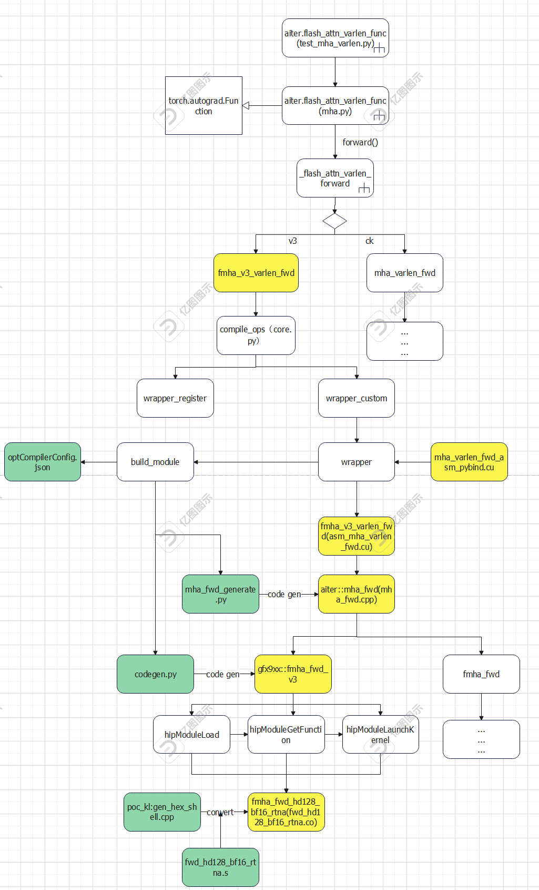
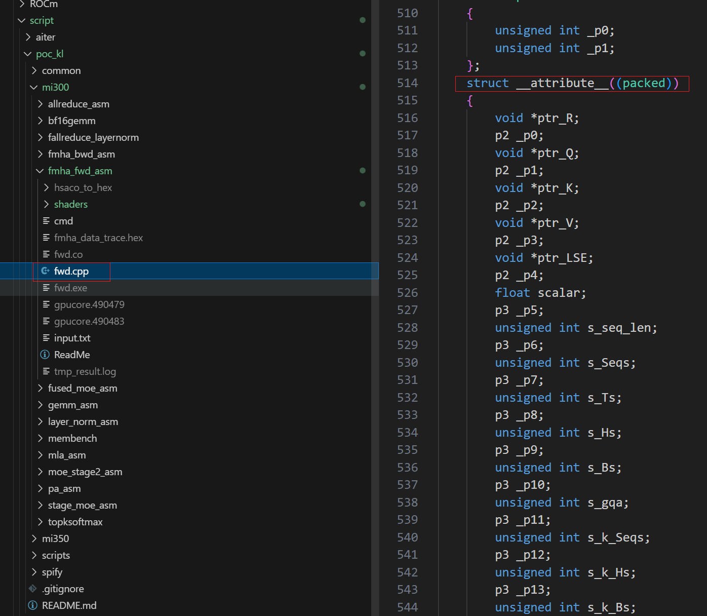
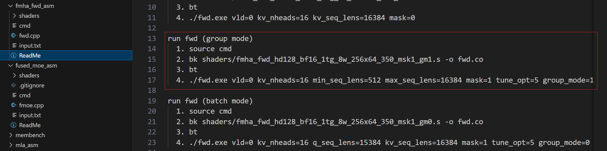
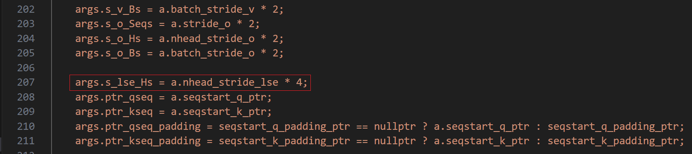

# 1. The Description of requirements

https://github.com/niels-zhang/poc_kl/tree/main/mi300/fmha_fwd_asm/shaders

https://github.com/niels-zhang/poc_kl/tree/main/mi350/fmha_fwd_asm/shaders

kernel已经更新好了，这两个目录下带gm0/1后缀的都要加进AITER里面，替换掉AITER里面原有的；

AITER里面原有的是带layout限制的poc版本，带gm0/1后缀的是产品化了的kernel，gm0就是batch mode， gm1就是group mode，都支持任意seqlen，但要求传进来的scale>0，api上面要加这个限制，更新了的参数列表可以看下https://github.com/niels-zhang/poc_kl/blob/main/mi300/fmha_fwd_asm/fwd.cpp和[https://github.com/niels-zhang/poc_kl/blob/main/mi350/fmha_fwd_asm/fwd.cpp](https://github.com/niels-zhang/poc_kl/blob/main/mi300/fmha_fwd_asm/fwd.cpp "https://github.com/niels-zhang/poc_kl/blob/main/mi300/fmha_fwd_asm/fwd.cpp")。

## 1.1 Requirements analysis

It is a very important thing to extract and analyze all the requirements from a paragraph. Novices often cannot analyze completely correct without any omissions. More detailed requirement guidance and suggestions are needed. It is suggested to conduct an analysis from two aspects: demand decomposition and test contents, and then align the information as much as possible before development.

### 1.1.1 Update and add the co file of the asm kernel

#### Requirement content decomposition

- fwd v3 kernel adaptation for three chip versions, including MI300,MI308,MI355. 

- Support different seqlen and stride inputs. 

- The kernel supports group mode. 

- Changes in kernel entry parameters, with new input parameters added.

#### Test contents

- Benchmark's smoke test add test cases for different group mode, seqlen_q/seqlen_k, and stride

#### Notice

- the kernel will be different with different v3_bf16_cvt parameter on the MI300 or MI308. Please Confirm whether this parameter need to be considered.

- The supported functions are generally automatically inherited and cannot be lost. For example, the mask type previously supported 0,1,2, but now only 0,2 are supported. It is necessary to clarify the inheritance. The batch mode supports 0,1,2, and the newly added group mode only supports 0,2.

- The stride cannot be easily tested in Smoke Test, and it is necessary to consider adding test case in Python Unitest.

### 1.1.2 fwd_v3 support group mode

#### Requirement content decomposition

- Provide the python interface(`fmha_v3_varlen_fwd`) 

#### Test contents

- The test_mha_varlen.py increased the pathway to call the fwd_v3 kernel.

#### Notice

- It is essential to clarify whether a new pytorch interfaces is needed.
  
  

# 2. Design for requirements

### 2.1 The logic graph of function invocation

参考PR:  https://github.com/ROCm/aiter/pull/870 



## 2.2 Use Case1--add and update fwd asm kernel

### 2.2.1 Implementation Plan

#### 2.2.1.1 Convert the `.s` file of the kernel to the `.co` file in aiter

##### 1. clone the poc_kl project form https://github.com/niels-zhang/poc_kl ,

##### 2. Replace the kernel func name in the `.s` file with the `_ZN5aiter{len(kernel_name)}{kernel_name}E` format which can refer to the existing rules in codegen.py.

##### 3. convert the `.s` file to the `.co` file through gen_hex_shell.cpp script in poc_kl project.

#### 2.2.1.2 Convert the `.s` file of the kernel to the `.co` file in aiter through script

##### 1. Put the following script in the hsaco_to_hex directory, replace the content of `target_str` `arch_version`和`file_map`, and then execute the script to automatically generate the co file.

https://github.com/niels-zhang/poc_kl/blob/0528ac8e40f7a6ec847d1a6439c75ffb4a6025b8/mi300/fmha_fwd_asm/hsaco_to_hex/modify_kernel_name.py


#### 2.2.1.3 Integrate .co files into AITER

The reference PR: https://github.com/ROCm/aiter/pull/870 

##### 1. copy the `.co` file to the aiter/hsa/gfxxxx/fmha_fwd_asm path

##### 2. modify the gfxXXX::fmha_fwd_v3 function in the codegen.py for the new kernel and param

the input parameter of new kernel can refer to the struct in the /poc_kl/mi300/fmha_fwd_asm/fwd.cpp script, and the fmha_fwd_v3_args struct in Aiter **must be exactly the same as it in byte order**.



##### 3. modify the `aiter::mha_fwd` function (`csrc/cpp_itfs/mha_fwd_generate.py`) for the new param.

### 2.2.2 The test plan

#### 1. modify the op_tests/cpp/mha/benchmark_mha_fwd.cpp for the new input param

#### 2. modify the smoke_test_fwd_v3.sh for the added test scenarios

#### 3. compile the benchmark_mha_fwd, and run the smoke test

```shell
bash build_mha.sh fwd_v3
export AITER_ASM_DIR=xxx/xxx/aiter/hsa/gfx942/
bash smoke_test_fwd_v3.sh -a gfx942
```


## 2.3 Use Case2--fwd_v3 support group mode

### 2.3.1 Implementation Plan

#### 2.3.1.1 Add the pytorch interface

1. Refer to the logic of function invocation(2.1), Both the yellow-marked and green-marked  methods need to be adapted for the new interface. The detail of implementation can see in the PR (https://github.com/ROCm/aiter/pull/870)

### 2.3.2 The test plan

#### 2.3.2.1 run the python unitest

```shell
python3 aiter/op_tests/test_mha.py
python3 aiter/op_tests/test_mha_varlen.py
pytest aiter/op_tests/test_mha.py
pytest aiter/op_tests/test_mha_varlen.py
```

#### 2.3.2.2 add the testcase for the stride test

Refer to the PR: [add different layout pytest by minmengdie · Pull Request #1003 · ROCm/aiter · GitHub](https://github.com/ROCm/aiter/pull/1003)

`aiter/test_mha_common.py: generate_qkv()`

# 3. Position error

## 3.1 To discriminate whether the error is in the parameter construction of aiter or the logic of kernel

1. confirm the kernel name and the parameters in aiter

2. Refer to the ReadMe(such as poc_kl/mi350/fmha_fwd_asm/ReadMe) in the poc_kl project, run the kernel with the same input parameters for the result. if the result is PASS, the error is in the aiter.



## 3.2 The output of the softmax_lse has a precision error

1. Focus on whether the s_lse_Hs stride is calculated correctly.the data type of softmax_lse is float, the size of it is 4.


