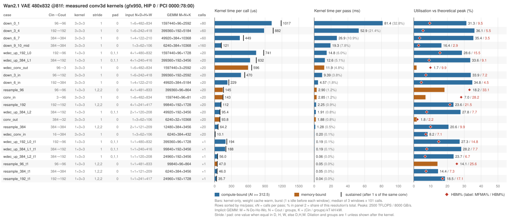
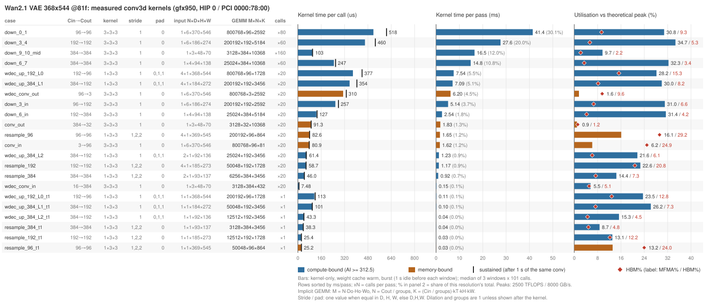
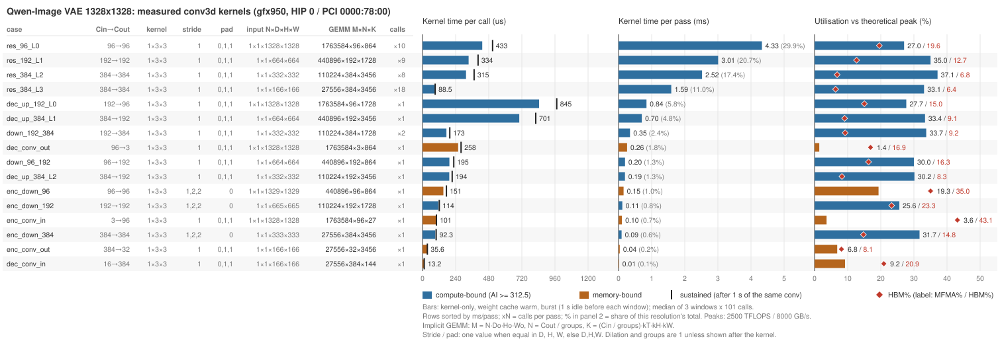
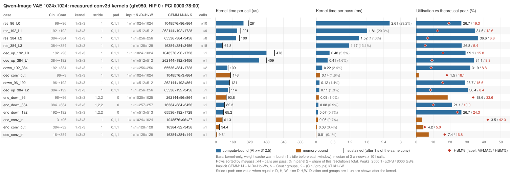

# conv3d 隐式 GEMM：76 个 tuned case 的空闲卡复测与利用率（2026-09-29）

> 范围：`aiter/configs/model_configs/wan21_vae_bf16_tuned_conv3d.csv`（44 行）与
> `qwenimage_vae_bf16_tuned_conv3d.csv`（32 行）的**全部 76 行**。通用表 `aiter/configs/bf16_tuned_conv3d.csv`
> 只有表头、没有数据行，所以这 76 行就是目前所有 conv3d tuned case。BF16 前向，NDHWC 进出，
> 走生产入口 `flydsl_conv_implicit`（不指定 tile，按 tuned 表查）。
> 代码版本：`6d0a0ef9b`（`feature/flydsl-a16w16-pruner-hti`），与 0928 复测相同；工作区里 `conv_kernels.py`
> 仍是同一处未提交的 `_prep_bias` 缓存（本测试的 bias 是 fp32 连续张量，不走缓存，对数字无影响）。
> 硬件：gfx950 / MI355X 256 CU。主测 **HIP 0 = PCI `78:00` = `rocm-smi` GPU 3**（与 0928 同一张卡），
> 复核 **HIP 7 = PCI `98:00` = `rocm-smi` GPU 5**，两张卡跑前跑后已用显存均为 0.62 GiB。
> 前一次复测：`conv3d_implicit_rebench_20260928.md`（未入库，在文档工作区 `docs_flydsl_conv_0922/`；口径、功耗墙与热权重两个
> 测量发现的机制分析都在那篇，本文不重复）。脚本、HIP 0 原始数据与图：本目录（§9）。

---

## 目录

- [1. 结论](#1-结论)
- [2. 测量环境与门禁](#2-测量环境与门禁)
- [3. 口径](#3-口径)
- [4. 利用率汇总](#4-利用率汇总)
- [5. 复现性：与 0928 对比、跨卡对比](#5-复现性与-0928-对比跨卡对比)
- [6. 与 CSV 的偏差](#6-与-csv-的偏差)
- [7. 重点优化 case 分析](#7-重点优化-case-分析)
  - [7.1 筛选方法与总览](#71-筛选方法与总览)
  - [7.2 `down_9_10_mid`：小 M 大 K，冷权重是唯一没试过的线索](#72-down_9_10_mid小-m-大-k冷权重是唯一没试过的线索)
  - [7.3 `down_0_1` 与 `wdec_up_192_L0`：体量最大，但已在主档，瓶颈可能在功耗](#73-down_0_1-与-wdec_up_192_l0体量最大但已在主档瓶颈可能在功耗)
  - [7.4 `wdec_conv_out`：N=3，两头都没跑满](#74-wdec_conv_outn3两头都没跑满)
  - [7.5 `conv_out` 及其余：利用率低但不值得投入](#75-conv_out-及其余利用率低但不值得投入)
  - [7.6 建议顺序](#76-建议顺序)
  - [7.7 四个分辨率里耗时占比最大的都是同一类层](#77-四个分辨率里耗时占比最大的都是同一类层)
- [8. 完整性能表](#8-完整性能表)
- [9. 复现](#9-复现)
- [10. 边界](#10-边界)

---

## 1. 结论

**76 行全部通过，性能与 CSV、与昨天的复测都一致。** 生产入口在两张卡上都是 76/76 命中 tuned tile，
对 bf16 `F.conv3d` 的超差元素（rtol = atol = 2e-2）全为 0。76 行合计（按每 pass 调用次数加权）：

| | CSV `us` | e2e（CSV 协议） | kernel-only（burst） | kernel-only（sustained） |
|---|---:|---:|---:|---:|
| 0929 HIP 0（主测） | 409.4 ms | 410.9 ms | **408.9 ms** | 462.4 ms |
| 0929 HIP 7（复核） | 409.4 ms | 406.9 ms | 406.7 ms | 453.3 ms |
| 0928 HIP 0 | 409.4 ms | 410.8 ms | 408.8 ms | 462.5 ms |

同一张卡隔一天，kernel-only 合计相差 +0.0%，76 行里 72 行逐行差在 ±2% 以内；换一张卡合计快 0.5%。

**每 pass 合计（HIP 0）：**

| 模型 / 分辨率 | 行数 | CSV ms | e2e ms | kernel-only ms | sustained ms | 耗时加权 MFMA% |
|---|---:|---:|---:|---:|---:|---:|
| Wan2.1 480×832 @81f | 22 | 249.5 | 249.3 | 247.7 | 283.2 | 29.4 |
| Wan2.1 368×544 @81f | 22 | 136.4 | 137.7 | 137.7 | 152.4 | 26.5 |
| Qwen-Image 1328² | 16 | 14.6 | 14.8 | 14.5 | 16.8 | 30.9 |
| Qwen-Image 1024² | 16 | 8.9 | 9.1 | 8.9 | 10.1 | 29.9 |

**MFMA 与 HBM 带宽利用率（kernel-only、burst，分母为理论峰值 2500 TFLOPS / 8000 GB/s）：**

| 指标 | 最小 | 中位 | 最大 | 耗时加权 | HIP 7 耗时加权 |
|---|---:|---:|---:|---:|---:|
| MFMA 利用率 % | 0.9 | 25.9 | **37.1** | **28.5** | 28.7 |
| HBM 带宽利用率 % | 1.2 | 9.4 | **43.1** | 8.2 | 8.3 |
| 达成率 %（相对同卡实测 roofline） | 2.1 | 47.5 | 77.4 | 50.3 | 49.9 |

- MFMA 利用率最高的是 `res_384_L2` @1328²（928 TFLOPS，37.1%），前五行都在 35–37%，对应达成率 60–64%。
- HBM 利用率最高的是 C=3 的 `enc_conv_in` @1328²（3452 GB/s，43.1%），这一行在 kernel-only 口径下
  偏高，原因见 §3。
- **75% 的耗时落在达成率 50–65% 这一档**（306.8 / 408.9 ms），与 0928（74.4%）一致。

**三条既有结论今天都复现了：**

1. 仍然是那 3 行比 CSV 慢 15–21%，两张卡上都一样：`dec_up_192_L0` @1328²（696 → 840 µs）、
   @1024²（410 → 482 µs）、`wdec_up_384_L1` @368×544（307 → 353 µs）。0928 已确认 tile 没选错、
   是 CSV 那次测量偏乐观（§6）。
2. 持续负载下慢 13%：sustained 相对 burst 耗时加权慢 13.1%（HIP 7 为 11.5%），最多慢 20.5%，
   受影响最大的仍是 MFMA 利用率 27–37% 的大 tile 层（§4.4）。
3. CSV 协议对小 M 层偏乐观：权重缓存命中后 conv kernel 反而慢 5–30%，排在前面的 9 行与 0928 相同，
   差值相差不到 1 个百分点（§4.5）。

**耗时长且 MFMA 利用率低的重点 case**（§7）：`down_9_10_mid`（35.8 ms/pass，MFMA 10–16%）、
`wdec_conv_out`（18.1 ms/pass，MFMA 1.6%），以及体量最大但已在主档的 `down_0_1`（122.8 ms/pass，MFMA 31%）。
`down_9_10_mid` 的 split-K 和大 tile 都已被实测证伪；本轮量到它有 6.9 ms/pass 的冷权重代价，
这是唯一还没试过的线索，但要先在真实 VAE 前向里确认权重确实是冷的。

---

## 2. 测量环境与门禁

这台机器上 `rocm-smi -d N` 和 `HIP_VISIBLE_DEVICES=N` 不是同一张卡（0928 文档 §2 踩过这个坑），
本次按 PCI 总线号对齐后再判定。开跑前（10:50，UTC+8）：

| HIP 设备号 | PCI | `rocm-smi` 卡号 | 进程内已用显存 | `rocm-smi` 利用率 | 用途 |
|---:|---|---:|---:|---:|---|
| **0** | `78:00` | 3 | 0.62 GiB | 0–5% | **主测** |
| 1 | `08:00` | 0 | 0.62 GiB | 0–4% | 空闲，未用 |
| 2 | `68:00` | 2 | 21.60 GiB | 0% | 被占 |
| 3 | `18:00` | 1 | 257.51 GiB | 0% | 被占 |
| 4 | `f9:00` | 7 | 21.81 GiB | 0% | 被占 |
| 5 | `88:00` | 4 | 23.38 GiB | 0% | 被占 |
| 6 | `e8:00` | 6 | 21.83 GiB | 0% | 被占 |
| **7** | `98:00` | 5 | 0.62 GiB | 0–5% | **复核** |

利用率一栏是连续 8 次、间隔 1 s 的采样：三张空闲卡在同一时刻一起跳到 1–5%、下一次一起回到 0，
显存始终只有 0.62 GiB 驱动基线，属于 `rocm-smi` 的采样抖动，不是有进程在用（0928 也记录了同样的 0–4%）。
0.62 GiB 就是这台机器空卡的基线，`bench_all.py` 启动时会再用 `torch.cuda.mem_get_info()` 检查一次，
超过 2 GiB 直接拒绝开跑。

两轮是先后跑的，没有并行：HIP 0 在 10:50–11:03，HIP 7 在 11:03–11:16。每轮结束后确认测量进程已退出、
该卡显存回到 0.62 GiB，再开下一轮。

---

## 3. 口径

与 0928 完全相同（脚本原样复用，见其 §3），这里只列要点。每行测三种时间，都来自 torch.profiler 的设备时间，
每种 3 次取中位数：

| 列 | 前置条件 | 输入 | 含义 |
|---|---|---|---|
| **e2e us** | 空闲 1 s | `run_perftest` 协议：min(101, 32 GiB / 输入字节) 份深拷贝轮转 | 与 CSV `us` 同口径，含冷拷贝上的 weight repack、C=3 的通道 pad |
| **kernel us** | 空闲 1 s | 同样的轮转拷贝，先让每份拷贝的权重缓存命中 | 生产稳态下 conv kernel 本身的时间，**利用率按它算** |
| **sustained us** | 同一个 conv 连跑 1 s | 同 kernel us | 持续负载（功耗墙）下的 kernel 时间 |

利用率的计算：

```
TFLOPS = 2·M·N·K / t                    （M、N、K 为隐式 GEMM 维度，按有效 FLOPs 计）
GB/s   = (x + w + y 各一次的字节数) / t     （compulsory traffic，不含 im2col 放大）
MFMA%  = TFLOPS / 2500                   HBM% = GB/s / 8000
AI     = FLOPs / bytes，ridge = 312.5，AI ≥ ridge 记为 compute-bound
达成率 = TFLOPS / min(mm_peak, AI × copy_peak)   （mm_peak / copy_peak 为同卡实测 burst 峰值）
```

同卡实测峰值（`bench_all.py::peaks`）：

| | 理论 | HIP 0 burst | HIP 0 sustained | HIP 7 burst | HIP 7 sustained | 0928 HIP 0 burst |
|---|---:|---:|---:|---:|---:|---:|
| `torch.mm` 8192³ bf16（TFLOPS） | 2500 | 1459 | 1172 | 1478 | 1201 | 1450 |
| device-to-device copy 读+写（GB/s） | 8000 | 4458 | 4518 | 4607 | 4597 | 4576 |

HIP 0 这次的 copy 峰值比 0928 低 2.6%，所以 memory-bound 行的达成率比 0928 略高 1 个百分点左右；
MFMA% 和 HBM% 用的是理论峰值，不受影响。

两个口径细节（与 0928 相同）：

- **C=3 的四行**（`conv_in` ×2、`enc_conv_in` ×2）的 kernel us 不含每次调用 17–31 µs 的通道 pad（§4.6），
  分子里的 x 字节仍按 C=3 计，而 kernel 实际读的是补齐到 C=8 的缓冲，所以这四行的 HBM% 偏高。
- `bw` 是流量下界，所以 AI 是上界。

---

## 4. 利用率汇总

以下均为 HIP 0 数据。

### 4.1 分布

| 指标 | 最小 | 中位 | 最大 | 按 calls×时间加权 |
|---|---:|---:|---:|---:|
| MFMA 利用率 %（kernel-only, burst） | 0.9 | 25.9 | 37.1 | 28.5 |
| HBM 带宽利用率 %（kernel-only, burst） | 1.2 | 9.4 | 43.1 | 8.2 |
| MFMA 利用率 %（kernel-only, sustained） | 0.9 | 23.9 | 31.9 | 24.9 |
| MFMA 利用率 %（e2e, CSV 协议） | 1.0 | 25.0 | 36.4 | 28.4 |
| 达成率 %（相对同卡实测 roofline） | 2.1 | 47.5 | 77.4 | 50.3 |
| sustained 相对 burst 变慢 % | −7.1 | +5.5 | +20.5 | +13.1 |
| e2e 相对 CSV `us` 偏差 % | −8.3 | +0.8 | +20.7 | — |

按 bound 分组：

| | 行数 | MFMA% 中位（最高） | HBM% 中位（最高） | 达成率中位 |
|---|---:|---:|---:|---:|
| compute-bound | 56 | 28.4（37.1） | 8.6（24.3） | 48.7 |
| memory-bound | 20 | 6.5（19.3） | 22.4（43.1） | 40.3 |

### 4.2 按达成率分档

| 达成率区间 | 行数 | kernel-only ms/pass | 占比 |
|---|---:|---:|---:|
| (0, 20] | 10 | 38.8 | 9.5% |
| (20, 35] | 9 | 20.8 | 5.1% |
| (35, 50] | 25 | 42.4 | 10.4% |
| **(50, 65]** | **30** | **306.8** | **75.0%** |
| (65, 100] | 2 | 0.2 | 0.0% |

达成率低于 20% 的 10 行仍是 roofline 文档里的两族：N=3 / 32 的窄 N 收尾层（`conv_out`、`enc_conv_out`、
`wdec_conv_out` 各两档）和 M ≤ 6240 的小 tile 层（`down_9_10_mid` @368×544、`wdec_conv_in` ×2、`resample_384_t1` @368×544）。

### 4.3 利用率最高的行

MFMA 利用率前五：

| case | kernel us | TFLOPS | MFMA% | 达成率% |
|---|---:|---:|---:|---:|
| `res_384_L2` @1328² | 315.2 | 928 | 37.1 | 63.6 |
| `res_384_L2` @1024² | 190.1 | 915 | 36.6 | 62.7 |
| `down_3_4` @480×832 | 881.9 | 901 | 36.1 | 61.8 |
| `down_6_7` @480×832 | 448.8 | 886 | 35.4 | 60.7 |
| `res_192_L1` @1328² | 334.2 | 875 | 35.0 | 60.0 |

HBM 带宽利用率前五（全是 memory-bound）：

| case | kernel us | GB/s | HBM% | AI | 达成率% |
|---|---:|---:|---:|---:|---:|
| `enc_conv_in` @1328² | 101.2 | 3452 | 43.1 | 26 | 77.4 |
| `enc_conv_in` @1024² | 61.3 | 3386 | 42.3 | 26 | 76.0 |
| `enc_down_96` @1328² | 151.4 | 2801 | 35.0 | 173 | 62.8 |
| `enc_down_96` @1024² | 93.8 | 2690 | 33.6 | 172 | 60.3 |
| `resample_96` @480×832 | 145.2 | 2648 | 33.1 | 172 | 59.4 |

HIP 7 上两张前五表的成员与顺序基本相同（MFMA 最高 `res_384_L2` @1328² 37.5%，HBM 最高 `enc_conv_in` @1328² 43.5%）。

### 4.4 持续负载下变慢最多的 10 行

| case | kernel us（burst） | sustained us | 变慢 | MFMA%（burst） | HBM%（burst） |
|---|---:|---:|---:|---:|---:|
| `res_192_L1` @1328² | 334.2 | 402.7 | +20.5% | 35.0 | 12.7 |
| `res_384_L2` @1328² | 315.2 | 373.9 | +18.6% | 37.1 | 6.8 |
| `down_3_4` @480×832 | 881.9 | 1044.1 | +18.4% | 36.1 | 5.5 |
| `wdec_up_192_L0` @480×832 | 740.7 | 875.6 | +18.2% | 28.6 | 15.5 |
| `wdec_up_384_L1` @480×832 | 631.7 | 742.8 | +17.6% | 33.6 | 9.1 |
| `down_0_1` @368×544 | 517.6 | 607.7 | +17.4% | 30.8 | 9.3 |
| `res_96_L0` @1024² | 260.8 | 306.0 | +17.3% | 26.7 | 19.3 |
| `res_96_L0` @1328² | 432.9 | 507.7 | +17.3% | 27.0 | 19.6 |
| `res_192_L1` @1024² | 201.2 | 235.5 | +17.1% | 34.6 | 12.6 |
| `dec_up_384_L1` @1328² | 701.5 | 820.8 | +17.0% | 33.4 | 9.1 |

sustained 下耗时加权 MFMA 利用率从 28.5% 降到 24.9%。`torch.mm` 8192³ 在同样前置条件下也从 1459 降到
1172 TFLOPS（−20%），是整卡的功耗墙行为，不是 conv 特有。VAE 连续前向时的真实耗时更接近 sustained 列。

### 4.5 热权重：CSV 协议下 conv kernel 比权重缓存命中时快 5% 以上的行

| case | M | N | K | 权重 MB | x MB | kernel us（CSV 协议） | kernel us（缓存命中） | 差 |
|---|---:|---:|---:|---:|---:|---:|---:|---:|
| `down_9_10_mid` @368×544 | 3,128 | 384 | 10368 | 7.6 | 7.4 | 79.0 | 103.0 | +30.3% |
| `enc_conv_out` @1024² | 16,384 | 32 | 3456 | 0.2 | 12.0 | 26.5 | 34.4 | +29.9% |
| `enc_down_384` @1024² | 16,384 | 384 | 3456 | 2.5 | 48.4 | 63.9 | 82.3 | +28.7% |
| `enc_conv_out` @1328² | 27,556 | 32 | 3456 | 0.2 | 20.2 | 28.5 | 35.6 | +24.8% |
| `down_9_10_mid` @480×832 | 6,240 | 384 | 10368 | 7.6 | 14.4 | 101.5 | 120.8 | +19.1% |
| `conv_out` @480×832 | 6,240 | 32 | 10368 | 0.6 | 14.4 | 79.6 | 93.8 | +17.8% |
| `conv_out` @368×544 | 3,128 | 32 | 10368 | 0.6 | 7.4 | 78.0 | 91.3 | +17.1% |
| `wdec_up_384_L2_t1` @368×544 | 12,512 | 192 | 3456 | 1.3 | 9.2 | 37.5 | 43.3 | +15.6% |
| `resample_384_t1` @368×544 | 3,128 | 384 | 3456 | 2.5 | 9.3 | 33.8 | 38.3 | +13.2% |
| `dec_up_384_L2` @1024² | 65,536 | 192 | 3456 | 1.3 | 48.0 | 105.4 | 114.4 | +8.5% |
| `resample_384` @368×544 | 6,256 | 384 | 3456 | 2.5 | 18.7 | 43.0 | 46.0 | +7.1% |
| `res_384_L3` @1024² | 16,384 | 384 | 3456 | 2.5 | 12.0 | 60.5 | 64.8 | +7.1% |
| `resample_192_t1` @368×544 | 12,512 | 192 | 1728 | 0.6 | 18.5 | 23.8 | 25.4 | +7.1% |
| `wdec_up_384_L2` @368×544 | 25,024 | 192 | 3456 | 1.3 | 18.3 | 57.5 | 61.4 | +6.8% |
| `resample_384_t1` @480×832 | 6,240 | 384 | 3456 | 2.5 | 18.5 | 43.0 | 46.0 | +6.8% |
| `wdec_up_384_L1_t1` @368×544 | 50,048 | 192 | 3456 | 1.3 | 36.7 | 95.8 | 101.3 | +5.7% |
| `down_6_in` @368×544 | 25,024 | 384 | 5184 | 3.8 | 19.0 | 120.5 | 127.0 | +5.4% |
| `wdec_up_384_L1_t1` @480×832 | 99,840 | 192 | 3456 | 1.3 | 73.1 | 178.4 | 187.9 | +5.3% |
| `down_192_384` @1024² | 65,536 | 384 | 1728 | 1.3 | 24.0 | 103.6 | 109.1 | +5.3% |

前 9 行（差超过 10%）与 0928 表中完全相同，逐行差值相差不到 1 个百分点。机制（CSV 协议下刚 repack 出来的
权重还在 L2/MALL 里）见 0928 文档 §6.2。

### 4.6 权重缓存命中后仍有额外 kernel 的行

只有 C=3 的四行：每次调用有一个 fill 和一个 copy 做通道 pad。

| case | 额外设备时间 / 次 | 占 e2e |
|---|---:|---:|
| `conv_in` @480×832 | 31.2 µs | 17% |
| `conv_in` @368×544 | 20.7 µs | 18% |
| `enc_conv_in` @1328² | 27.8 µs | 20% |
| `enc_conv_in` @1024² | 17.0 µs | 18% |

---

## 5. 复现性：与 0928 对比、跨卡对比

脚本 `compare.py` 按 `case@分辨率` 对齐逐行比较，下表即其输出（0928 与 HIP 7 两份原始数据未入库，见 §9）。

| 对比 | 列 | 合计差 | 逐行差 最小 / 中位 / 最大 | 逐行 \|Δ\| ≤ 2% 的行数 |
|---|---|---:|---|---:|
| 0929 HIP 0 vs 0928 HIP 0（同卡隔天） | e2e | +0.0% | −10.1% / −0.1% / +6.3% | 73 / 76 |
| | kernel-only burst | **+0.0%** | −7.4% / +0.0% / +5.4% | **72 / 76** |
| | kernel-only sustained | −0.0% | −7.9% / −0.1% / +6.1% | 61 / 76 |
| 0929 HIP 7 vs 0929 HIP 0（同天跨卡） | e2e | −1.0% | −2.7% / −0.2% / +8.3% | 72 / 76 |
| | kernel-only burst | **−0.5%** | −2.1% / −0.2% / +6.9% | **72 / 76** |
| | kernel-only sustained | −2.0% | −6.3% / −0.4% / +9.0% | 50 / 76 |

kernel-only burst 变化超过 ±3% 的行全是单次 10 µs 左右的输入层：

| case | 0928 HIP 0 | 0929 HIP 0 | 0929 HIP 7 |
|---|---:|---:|---:|
| `wdec_conv_in` @368×544 | 8.1 | 7.5 | 8.0 |
| `wdec_conv_in` @480×832 | 9.6 | 10.1 | 10.0 |
| `dec_conv_in` @1024² | 9.8 | 9.8 | 10.4 |
| `dec_conv_in` @1328² | 12.9 | 13.2 | 13.7 |

读法：

- **burst 口径是稳定的**：大层隔天、跨卡都在 ±2% 内，只有几 µs 量级的小层会有 0.5 µs 级的绝对抖动，
  换算成百分比才显得大。这四行合计不到 0.4 ms/pass，对任何结论都没有影响。
- **sustained 口径波动更大**（同卡隔天 61 行在 ±2% 内，跨卡只有 50 行），因为它测的是功耗墙下的状态，
  而功耗墙与卡的个体、温度相关。HIP 7 的 `torch.mm` sustained 峰值（1201）比 HIP 0（1172）高 2.5%，
  conv 的 sustained 合计也快 2.0%，方向一致。做 A/B 仍应用 burst 口径、同一张卡。
- 3 次 rep 的极差：HIP 0 中位 0.5%、最大 8.6%（`dec_conv_in` @1024²，9.8 / 9.8 / 10.6 µs）；
  HIP 7 中位 0.6%，最大一行 `wdec_conv_in` @480×832 有一次离群（9.9 / 10.0 / 15.2 µs），中位数不受影响。

---

## 6. 与 CSV 的偏差

HIP 0 上 76 行里 70 行的 e2e 与 CSV `us` 相差在 ±5% 以内。超出的 6 行：

| case | CSV us | e2e us（HIP 0） | Δ | 3 次 e2e（HIP 0） | e2e us（HIP 7） | Δ（HIP 7） |
|---|---:|---:|---:|---|---:|---:|
| `wdec_conv_in` @368×544 | 13.6 | 12.5 | −8.3% | 12.5 / 12.5 / 12.6 | 13.6 | −0.7% |
| `dec_conv_in` @1024² | 15.9 | 14.7 | −7.8% | 14.7 / 14.8 / 14.8 | 15.8 | −0.8% |
| `enc_down_384` @1328² | 95.0 | 100.9 | +6.1% | 99.7 / 100.9 / 100.9 | 99.4 | +4.6% |
| `wdec_up_384_L1` @368×544 | 306.7 | 352.6 | **+15.0%** | 350.8 / 352.6 / 354.2 | 350.8 | **+14.4%** |
| `dec_up_192_L0` @1024² | 410.1 | 482.1 | **+17.6%** | 471.0 / 481.0 / 482.1 | 474.9 | **+15.8%** |
| `dec_up_192_L0` @1328² | 696.1 | 840.2 | **+20.7%** | 837.5 / 840.2 / 845.8 | 838.3 | **+20.4%** |

- 前三行在另一张卡上回到 ±5% 以内，是单次十几 µs（或 e2e 里 repack 部分）的抖动；`enc_down_384` @1328² 的
  kernel us 是 92.3 µs，与 0928 的 92.6 µs 相同。
- **后三行在两张卡、两天里都慢 14–21%**，与 0928 的结论一致：0928 §5 已在两张卡上扫过候选 tile，
  CSV 的 tile 与最好候选相差不到 1%，但没有候选能达到 CSV 的数值，判断为 CSV 那次测量偏乐观。
  可执行项仍只有 `wdec_up_384_L1` @368×544 换 `128x192/2x2 g1`（约快 7%、0.5 ms/pass）；
  另外两行按实测更新 CSV 的 `us` 即可，tile 不用动。本轮没有重扫 tile。

---

## 7. 重点优化 case 分析

### 7.1 筛选方法与总览

筛选的目标是“耗时长、MFMA 利用率又低”的行。做法是：只看每 pass ≥ 1 ms 的行，再估算把它提到本表
现有最好水平能省多少时间，按这个数排序。compute-bound 行按 MFMA 利用率提到 35% 估
（§4.3 前五行的水平），memory-bound 行按 HBM 利用率提到 33% 估（§4.3 HBM 前五的水平）：

```
可省上界 = ms/pass × (1 − 当前利用率 / 目标利用率)
```

**这个上界只用来排序，不代表能兑现。** 能不能兑现，要看 roofline 文档已经实测过哪些改法
（[`conv3d_implicit_roofline_headroom.md`](./conv3d_implicit_roofline_headroom.md) §3.4、§6、§7）。
按族归并后排在前面的五族：

| 族 | 行 | kernel-only ms/pass | 占比 | MFMA% | HBM% | 达成率% | 可省上界 ms | 既有判定（roofline 文档） | 本轮新增信息 |
|---|---|---:|---:|---:|---:|---:|---:|---|---|
| `down_9_10_mid` | @368×544、@480×832 | 35.8 | 8.8% | 9.7 / 16.4 | 2.2 / 2.9 | 16.6 / 28.2 | 22.1 | **堵死**：split-K、大 tile 都已证伪 | 冷权重每 pass 多花 6.9 ms，是一条没试过的线索（§7.2） |
| `down_0_1` | @480×832、@368×544 | 122.8 | 30.0% | 31.3 / 30.8 | 9.5 / 9.3 | 53.6 / 52.8 | 13.7 | 已在 50–65% 主档；唯一开放的是主循环同步纪律（§6.1） | N=96 的层里它已是最高；持续负载下 MFMA 掉到 26–27%（§7.3） |
| `wdec_conv_out` | @480×832、@368×544 | 18.1 | 4.4% | 1.7 / 1.6 | 9.9 / 9.6 | 17.8 / 17.2 | 12.7 | 候选集里没有能改善的配置，需另立项目（§6.3） | 与热权重无关；同族的 Qwen `dec_conv_out` 达成率高近一倍（§7.4） |
| `wdec_up_192_L0` | @480×832、@368×544 | 22.3 | 5.5% | 28.6 / 28.2 | 15.5 / 15.3 | 49.0 / 48.3 | 4.2 | 同 `down_0_1` | 同 `down_0_1`（§7.3） |
| `conv_out` | @480×832、@368×544 | 3.7 | 0.9% | 1.8 / 0.9 | 2.2 / 1.2 | 3.9 / 2.1 | 3.6 | 窄 N 开 split-K 已证伪（roofline 文档 §7 #2） | 冷权重慢 17–18%（§7.5） |

五族合计 202.7 ms/pass，占总耗时的 50%。

### 7.2 `down_9_10_mid`：小 M 大 K，冷权重是唯一没试过的线索

| | @368×544 | @480×832 |
|---|---:|---:|
| M / N / K | 3,128 / 384 / 10368 | 6,240 / 384 / 10368 |
| tile，CTA 数（M 向 × N 向） | `32x32/1x2`，98 × 12 | `64x64/2x2`，98 × 6 |
| calls / pass | 160 | 160 |
| kernel us：HIP 0 / HIP 7 | 103.0 / 103.0 | 120.8 / 120.6 |
| kernel us：CSV 协议（权重是热的） | 79.0 | 101.5 |
| kernel us：持续负载 | 100.6（−2.3%） | 119.6（−1.0%） |
| MFMA% / 达成率% | 9.7 / 16.6 | 16.4 / 28.2 |
| ms/pass | 16.5 | 19.3 |

**为什么慢。** 同样 N=384、K=10368 的 `down_6_7`，M 大 8 倍，达成率 55–61%，这两档只有 17–28%。
差别只在 M：M 太小，只能用 `32x32` / `64x64` 的小 tile，每个 CTA 算得少、K 方向又很长。

**已证伪、不要重复做的**（roofline 文档 §6.4、§7）：

- conv 自己开 split-K：`down_9_10_mid` @480×832 实测 0.44×，fp32 staging 的额外流量约 19 MB，
  比卷积本身的流量还大；@368×544 的 M = 3128 = 8×17×23，没有能整除它的 `tile_m`，而 split-K 不能 mask tile 尾。
- 改用 hgemm 的 split-K：看似快 27–46%，但它的部分和经 16 位 LDS 中转，4.3–4.4% 元素超出精度门槛，
  fp32 输出也不行；**不开 split-K 时 hgemm 与 conv 持平**。
- 放大 tile：256×256 慢 54%。

**本轮新增：冷权重的代价是 6.9 ms/pass。** 权重缓存命中时（生产稳态）conv 读的是不在 L2/MALL 里的打包权重，
比 CSV 协议下（权重刚被 repack、还是热的）慢 24.0 / 19.3 µs，乘以 160 次调用是 3.8 + 3.1 = **6.9 ms/pass，
占这一族耗时的 19%**。两张卡、两天的数字都一致。0928 的区分实验（0928 文档 §6.2）已经确认：
在 conv 前读一遍打包权重，conv 就回到 79.4 µs；读 x 或插一个无关 copy 都没用。
持续负载下这两行不变慢，说明它们不受功耗限制，与“延迟落在关键路径上”的推断一致。

**这条线索还缺两个测量，缺一个都不能立项：**

1. **真实 VAE 前向里权重是冷的还是热的。** 本文的 kernel-only 口径是“权重冷、x 也冷”。真实前向里 x 是上一层
   刚写出来的，权重是否还留在 L2/MALL 取决于中间隔了多少层，本文没测。如果真实前向里这一层本来就接近 79 µs，
   这 6.9 ms 就不存在。做法：在 Wan VAE 前向上用 profiler 拆出这两个 shape 的 conv kernel 时间，和 103 / 121 µs 对比。
2. **预取本身的代价。** 0928 的实验只量了 conv kernel，没量“读一遍权重”那次操作本身花多少时间（7.6 MB，
   外加一次 launch）。要看的是净收益：比如另开一条 stream 预取、或者在 kernel 里更早发出 B 的首批 load，
   和 conv 的时间合起来是否仍然更短。

### 7.3 `down_0_1` 与 `wdec_up_192_L0`：体量最大，但已在主档，瓶颈可能在功耗

| | `down_0_1` @480×832 | `down_0_1` @368×544 | `wdec_up_192_L0` @480×832 | `wdec_up_192_L0` @368×544 |
|---|---:|---:|---:|---:|
| M / N / K | 1,597,440 / 96 / 2592 | 800,768 / 96 / 2592 | 1,597,440 / 96 / 1728 | 800,768 / 96 / 1728 |
| tile | `192x96/3x1` | `192x96/3x1` | `96x96/2x3` | `96x96/2x3` |
| calls / pass | 80 | 80 | 20 | 20 |
| kernel us：HIP 0 / HIP 7 | 1017.0 / 1009.8 | 517.6 / 513.9 | 740.7 / 739.7 | 377.2 / 374.6 |
| 持续负载 us（变慢） | 1186.5（+16.7%） | 607.7（+17.4%） | 875.6（+18.2%） | 440.1（+16.7%） |
| MFMA%：burst → 持续负载 | 31.3 → 26.8 | 30.8 → 26.2 | 28.6 → 24.2 | 28.2 → 24.1 |
| 达成率% | 53.6 | 52.8 | 49.0 | 48.3 |
| ms/pass | 81.4 | 41.4 | 14.8 | 7.5 |

这四行合计 145.1 ms/pass，占总耗时的 35%。其中 `down_0_1` @480×832 一行就占 20%，是全表最大的单行。

**§7.1 的上界对这一族偏乐观。** 35% 这个目标只有 N=192 / 384 的层达到过（`down_3_4` 36.1%、`res_384_L2` 37.1%）。
N=96 的 10 行 compute-bound 里，最高的就是 `down_0_1` @480×832 本身（31.3%），耗时加权 30.5%。
**所以这一族在同 N 的层里已经是最好的，“提到 35%”没有任何实测依据。**

**持续负载下，功耗墙可能比 kernel 效率更要紧。** 这四行在持续负载下都慢 17–18%，MFMA 利用率掉到 24–27%；
`torch.mm` 在同样条件下也掉 20%。VAE 连续前向时这几层背靠背运行，更接近持续负载那一列。
由此推断：让 MFMA 发射更密的改动，有一部分收益会被更高的功耗吃掉，持续负载下的净收益可能比 burst 下小。
这只是推断，本文没有测功耗或时钟。

**唯一还开着的方向是主循环同步纪律**（roofline 文档 §6.1：用 `BufferLoadAsyncLDS128b` 做部分等待，
不再每批都排干）。那里估的“约 3 ms/pass”没有覆盖这一族：它是拿 hgemm 在等价 shape 上对拍得出的，
而 C=96 时 K = 2592 / 1728 不能被 64 整除，hgemm 跑不了这些 shape。所以这一族的可兑现收益**目前完全未知**。
如果要做 §6.1，建议用 `down_0_1` @480×832 与 Qwen 的 `res_96_L0` @1328² 作为主要 A/B shape（覆盖面最大，
且分别代表 3D / 2D 两种卷积核，见 §7.7），并且 **burst 和持续负载两种口径都要测**，
只看 burst 会高估收益。这是 kernel 主循环的结构性改写，LDS 时序出错会带来静默数值错误，每一步都要过 allclose。

### 7.4 `wdec_conv_out`：N=3，两头都没跑满

| | @480×832 | @368×544 | 参照：Qwen `dec_conv_out` @1328² | @1024² |
|---|---:|---:|---:|---:|
| M / N / K | 1,597,440 / 3 / 2592 | 800,768 / 3 / 2592 | 1,763,584 / 3 / 864 | 1,048,576 / 3 / 864 |
| tile | `96x32/1x2` | `64x32/1x2` | `192x48/3x1` | `128x32/2x1` |
| kernel us：HIP 0 / HIP 7 | 596.4 / 595.7 | 310.2 / 311.0 | 258.2 / 258.8 | 143.0 / 141.6 |
| CSV 协议 kernel us | 596.5 | 310.4 | 258.2 | 143.9 |
| MFMA% / HBM% | 1.7 / 9.9 | 1.6 / 9.6 | 1.4 / 16.9 | 1.5 / 18.1 |
| AI / 达成率% | 53 / 17.8 | 52 / 17.2 | 26 / 30.3 | 26 / 32.6 |
| ms/pass | 11.9 | 6.2 | 0.26 | 0.14 |

**为什么慢。** 输出只有 RGB 三个通道，最窄的 `tile_n` 是 32，每 32 列里有 29 列在乘零，所以 MFMA 利用率只有 1.6%。
但它按 AI 算是 memory-bound，本该贴着带宽跑，HBM 却只用了 10%、达成率 17%——**慢的原因不只是算力浪费，
访存也没跑起来**。它和热权重无关（CSV 协议与缓存命中的 kernel 时间相同，权重只有约 15 KB）。

同族的 Qwen `dec_conv_out`（K=864）达成率 30–33%，几乎是 Wan 这两行的两倍，差别在 K：Wan 是 3×3×3 卷积
（K=2592），Qwen 是 3×3（K=864）。**这只是两个点的对比，还不能说明原因**，但说明 K 大的窄 N 层更差，
专用路径应以 Wan 这两行为主要目标。

**既有判定**（roofline 文档 §6.3）：`N=3` 连 `N % tile_n == 0` 都不满足，现有候选集里没有能改善它的配置；
同族 `conv_out` 的 split-K 与窄 tile 组合也都实测过，生产选择已是最快。要改只能给 N 极窄的层单独做一条路径，
属于另立项目。可省上界 12.7 ms/pass 是按 HBM 提到 33%（与 `resample_96` 等 memory-bound 行持平）估的。

### 7.5 `conv_out` 及其余：利用率低但不值得投入

- `conv_out` ×2（N=32、M = 3,128 / 6,240、K=10368）：MFMA 0.9–1.8%、达成率 2–4%，是全表最低的两行，
  但合计只有 3.7 ms/pass。窄 N 开 split-K 已证伪（roofline 文档 §7 #2）。它同样有 17–18% 的冷权重代价
  （CSV 协议 79.6 / 78.0 µs 对缓存命中 93.8 / 91.3 µs），如果 §7.2 的冷权重线索成立，可以一起受益。
- `wdec_conv_in`、`resample_384_t1`、`enc_conv_out` 等小层：利用率同样低，但每行每 pass 不到 1 ms。
- stride-2 下采样与 `conv_in` 这类 memory-bound 层：达成率已经 43–77%，roofline 文档 §3.4 判为已到顶。

### 7.6 建议顺序

| 顺序 | 做什么 | 针对 | 上界 | 前置条件 / 风险 |
|---:|---|---|---:|---|
| 1 | **先测量**：在真实 Wan VAE 前向里拆出这些层的 conv kernel 时间 | `down_9_10_mid`、`conv_out` | 6.9 + 0.5 ms/pass | 不改 kernel，成本低；它决定冷权重这条线是否存在 |
| 2 | 若第 1 步确认真实前向里权重是冷的：试预取（另一条 stream，或在 kernel 内更早发出 B 的 load），量净收益 | 同上 | 同上 | 必须把预取本身的时间算进去 |
| 3 | 主循环同步纪律（roofline 文档 §6.1），以 `down_0_1` @480×832 与 `res_96_L0` @1328² 为主要 A/B shape（§7.7） | `down_0_1`、`res_96_L0`、`wdec_up_192_L0` 及其余大 M 层 | 未知 | 结构性改写、静默错误风险高；burst 与持续负载都要测 |
| 4 | N 极窄层的专用路径 | `wdec_conv_out` | 12.7 ms/pass | 另立项目；访存也没跑满，不能只做“去掉乘零”这一件事 |

**不要做**：给 `down_9_10_mid` 开 split-K（conv 自己的或 hgemm 的）、放大 tile——这两条都已实测证伪，理由见 §7.2。

### 7.7 四个分辨率里耗时占比最大的都是同一类层

§8 的四张柱状图里，每张排第一的都是**最高分辨率那一级、96 通道进 96 通道出、stride 1 的普通卷积**，
排第二的都是半分辨率那一级的 192→192 卷积，前两名在每张图里都占一半左右：

| 分辨率 | 第一名 | 占比 | 参数 | 等效 GEMM M×N×K | tile | MFMA% | 达成率% | 持续负载变慢 |
|---|---|---:|---|---|---|---:|---:|---:|
| Wan 480×832 | `down_0_1` ×80 | 32.8% | 96→96，3×3×3 | 1,597,440×96×2592 | `192x96/3x1` | 31.3 | 53.6 | +16.7% |
| Wan 368×544 | `down_0_1` ×80 | 30.1% | 96→96，3×3×3 | 800,768×96×2592 | `192x96/3x1` | 30.8 | 52.8 | +17.4% |
| Qwen 1328² | `res_96_L0` ×10 | 29.9% | 96→96，1×3×3 | 1,763,584×96×864 | `192x96/3x1` | 27.0 | 46.3 | +17.3% |
| Qwen 1024² | `res_96_L0` ×10 | 29.2% | 96→96，1×3×3 | 1,048,576×96×864 | `192x96/3x1` | 26.7 | 45.7 | +17.3% |

| 分辨率 | 第二名 | 占比 |
|---|---|---:|
| Wan 480×832 / 368×544 | `down_3_4`（192→192，3×3×3） | 21.4% / 20.0% |
| Qwen 1328² / 1024² | `res_192_L1`（192→192，1×3×3） | 20.7% / 20.3% |

**共同点。** 在 GEMM 视角下都是 M 极大（80 万–176 万）、N=96 的 compute-bound 形状，tuned 表在四档上选的都是同一个
tile `192x96/3x1`；MFMA 利用率 27–31%，达成率 46–54%，处在主档，而且在 N=96 的层里已经是最高水平（§7.3）；
持续负载下都慢约 17%，受功耗墙影响大。

**差别只在卷积核。** Wan 是 3D 卷积（3×3×3，K=2592，每 pass 80 次），Qwen 是 2D 卷积（3×3，K=864，每 pass 10 次）。
K 小三分之二，数据复用也少（AI 约 430 对 1030），所以 Qwen 这一行的 MFMA 比 Wan 低约 4 个百分点。

**对优化的含义。** N=96 的 compute-bound 层合计 153.7 ms/pass，占全部 76 行的 38%，是最大的一块。但 hgemm 跑不了这些
形状（K = 2592 / 864 都不能被 64 整除），所以一直没有外部参照，roofline 文档 §6.4 估的“主循环优化约 3 ms/pass”
也没覆盖它们。做主循环优化时，A/B 的主要 shape 建议同时用 `down_0_1` @480×832 和 `res_96_L0` @1328²，
一次覆盖 3D / 2D 两种卷积核与两种 K（§7.3、§7.6 已按此更新）。

---

## 8. 完整性能表

HIP 0 数据。列含义：

- `CSV us`：tuned CSV 里的值；`e2e us`：本次按同一协议复测（§3）；`Δ` = e2e / CSV − 1
- `kernel us`：权重缓存命中时 conv kernel 本身的设备时间（burst）；**TFLOPS / MFMA% / GB/s / HBM% / 达成率都按它算**
- `sustained us`：同一个 conv 连跑 1 s 后的 kernel 时间
- `AI` 单位 FLOP/byte；`bound`：`com` = compute-bound（AI ≥ 312.5），`mem` = memory-bound
- `ms/pass` = kernel us × calls，calls 取自 `op_tests/test_flydsl_conv_implicit.py` 的 shape 生成函数
  （Wan 81 帧一次 encode 或 decode，Qwen 一次 encode + decode）
- 每张表按 `ms/pass` 降序排列。HIP 7 的同格式表未入库（§9）

### 8.1 Wan2.1 VAE 480×832 @81f



图：读法与 §8.2 的图相同（左侧是 conv3d 参数和等效 GEMM，三栏依次是单次 kernel 时间、每 pass 耗时、
MFMA / HBM 利用率）。该分辨率合计 247.7 ms/pass。`down_0_1`、`down_3_4` 两行占 54%；`down_9_10_mid`
排第四（7.8%），MFMA 16.4%，比 368×544 那档的 9.7% 高，因为 M 大一倍、能用 `64x64` tile；`wdec_conv_out`
占 4.8%，MFMA 1.7%。持续负载下 `down_0_1`、`down_3_4`、`wdec_up_192_L0`、`wdec_up_384_L1` 慢 17–18%，
`down_6_7` 在这一档也慢了 15%（368×544 只慢 5%）。

| case | calls | M | N | K | tile/wave | CSV us | e2e us | Δ | kernel us | sustained us | TFLOPS | MFMA% | GB/s | HBM% | AI | bound | 达成率% | ms/pass |
|---|---:|---:|---:|---:|---|---:|---:|---:|---:|---:|---:|---:|---:|---:|---:|---|---:|---:|
| `down_0_1` | 80 | 1,597,440 | 96 | 2592 | 192x96/3x1 | 1017.9 | 1023.4 | +0.5% | 1017.0 | 1186.5 | 782 | 31.3 | 757 | 9.5 | 1032 | com | 53.6 | 81.36 |
| `down_3_4` | 60 | 399,360 | 192 | 5184 | 128x192/2x2 | 908.0 | 888.3 | -2.2% | 881.9 | 1044.1 | 901 | 36.1 | 440 | 5.5 | 2047 | com | 61.8 | 52.91 |
| `down_6_7` | 60 | 49,920 | 384 | 10368 | 128x128/4x2 | 456.1 | 452.0 | -0.9% | 448.8 | 514.0 | 886 | 35.4 | 279 | 3.5 | 3180 | com | 60.7 | 26.93 |
| `down_9_10_mid` | 160 | 6,240 | 384 | 10368 | 64x64/2x2 | 114.8 | 115.7 | +0.8% | 120.8 | 119.6 | 411 | 16.4 | 231 | 2.9 | 1781 | com | 28.2 | 19.33 |
| `wdec_up_192_L0` | 20 | 1,597,440 | 96 | 1728 | 96x96/2x3 | 731.1 | 742.1 | +1.5% | 740.7 | 875.6 | 716 | 28.6 | 1243 | 15.5 | 576 | com | 49.0 | 14.81 |
| `wdec_up_384_L1` | 20 | 399,360 | 192 | 3456 | 128x192/2x2 | 646.2 | 634.7 | -1.8% | 631.7 | 742.8 | 839 | 33.6 | 730 | 9.1 | 1149 | com | 57.5 | 12.63 |
| `wdec_conv_out` | 20 | 1,597,440 | 3 | 2592 | 96x32/1x2 | 581.6 | 600.8 | +3.3% | 596.4 | 660.8 | 42 | 1.7 | 793 | 9.9 | 53 | mem | 17.8 | 11.93 |
| `down_3_in` | 20 | 399,360 | 192 | 2592 | 128x192/2x2 | 469.1 | 465.9 | -0.7% | 469.7 | 536.4 | 846 | 33.9 | 577 | 7.2 | 1467 | com | 58.0 | 9.39 |
| `down_6_in` | 20 | 49,920 | 384 | 5184 | 128x128/2x4 | 226.6 | 231.1 | +2.0% | 228.6 | 253.1 | 870 | 34.8 | 357 | 4.5 | 2433 | com | 59.6 | 4.57 |
| `resample_96` | 20 | 399,360 | 96 | 864 | 192x128/2x2 | 145.1 | 148.8 | +2.5% | 145.2 | 158.0 | 456 | 18.2 | 2648 | 33.1 | 172 | mem | 59.4 | 2.90 |
| `conv_in` | 20 | 1,597,440 | 96 | 81 | 192x96/3x1 | 183.5 | 184.9 | +0.8% | 142.6 | 150.2 | 174 | 7.0 | 2252 | 28.2 | 77 | mem | 50.5 | 2.85 |
| `resample_192` | 20 | 99,840 | 192 | 1728 | 128x192/2x2 | 113.5 | 116.1 | +2.3% | 112.5 | 113.3 | 589 | 23.6 | 1719 | 21.5 | 343 | com | 40.4 | 2.25 |
| `wdec_up_384_L2` | 20 | 49,920 | 192 | 3456 | 128x192/1x4 | 98.2 | 100.4 | +2.3% | 95.4 | 95.9 | 694 | 27.8 | 617 | 7.7 | 1126 | com | 47.6 | 1.91 |
| `conv_out` | 20 | 6,240 | 32 | 10368 | 32x32/1x2 | 84.5 | 85.2 | +0.8% | 93.8 | 93.7 | 44 | 1.8 | 173 | 2.2 | 256 | mem | 3.9 | 1.88 |
| `resample_384` | 20 | 12,480 | 384 | 3456 | 128x128/2x1 | 69.0 | 69.5 | +0.7% | 64.2 | 61.0 | 516 | 20.6 | 796 | 9.9 | 648 | com | 35.4 | 1.28 |
| `wdec_conv_in` | 20 | 6,240 | 384 | 432 | 64x64/2x2 | 15.4 | 15.4 | +0.1% | 10.1 | 9.8 | 205 | 8.2 | 571 | 7.1 | 360 | com | 14.1 | 0.20 |
| `wdec_up_192_L0_t1` | 1 | 399,360 | 96 | 1728 | 96x96/3x2 | 192.8 | 194.2 | +0.7% | 194.4 | 217.5 | 682 | 27.3 | 1185 | 14.8 | 575 | com | 46.7 | 0.19 |
| `wdec_up_384_L1_t1` | 1 | 99,840 | 192 | 3456 | 128x192/4x1 | 180.3 | 184.6 | +2.3% | 187.9 | 200.6 | 705 | 28.2 | 619 | 7.7 | 1139 | com | 48.3 | 0.19 |
| `wdec_up_384_L2_t1` | 1 | 24,960 | 192 | 3456 | 96x96/2x1 | 59.2 | 60.3 | +1.9% | 56.0 | 52.4 | 592 | 23.7 | 537 | 6.7 | 1101 | com | 40.5 | 0.06 |
| `resample_96_t1` | 1 | 99,840 | 96 | 864 | 128x96/1x2 | 48.2 | 49.2 | +2.3% | 47.0 | 46.0 | 352 | 14.1 | 2046 | 25.6 | 172 | mem | 45.9 | 0.05 |
| `resample_384_t1` | 1 | 6,240 | 384 | 3456 | 64x64/2x2 | 48.4 | 49.0 | +1.3% | 46.0 | 44.3 | 360 | 14.4 | 585 | 7.3 | 616 | com | 24.7 | 0.05 |
| `resample_192_t1` | 1 | 24,960 | 192 | 1728 | 96x96/2x1 | 39.8 | 40.6 | +1.9% | 35.7 | 33.7 | 464 | 18.5 | 1367 | 17.1 | 339 | com | 31.8 | 0.04 |

### 8.2 Wan2.1 VAE 368×544 @81f



图：22 个 case 按每 pass 耗时降序排列（与下表同序），蓝色为 compute-bound，橙色为 memory-bound。
case 名后面依次是 conv3d 参数和等效 GEMM：`Cin→Cout`、卷积核 `kT×kH×kW`、stride、pad（三个方向相同时只写一个数，
否则按 D,H,W 写）、输入 `N×D×H×W`（通道即 Cin）、隐式 GEMM 的 `M×N×K`，以及每 pass 调用次数。
3×3×3 的层 pad 为 0，是因为调用方已经在输入上做过因果 pad（例如 `down_0_1` 输入 D=6、H=370，输出 4×368）。
左栏是单次调用的 kernel-only 时间，柱子为 burst 口径，黑色竖线为持续负载下的时间；中栏是每 pass 耗时
（括号内为占该分辨率合计 137.7 ms 的比例）；右栏柱子是 MFMA 利用率，红色菱形是 HBM 带宽利用率，
都相对理论峰值。几个要点一眼可见：前两行 `down_0_1`、`down_3_4` 占 50%；`down_9_10_mid` 单次只有 103 µs，
但 160 次调用使它排第三、MFMA 只有 9.7%；`wdec_conv_out` 和 `conv_out` 的 MFMA 分别只有 1.6% 和 0.9%；
`down_0_1`、`down_3_4`、`wdec_up_192_L0`、`wdec_up_384_L1` 的竖线明显在柱子右侧（持续负载慢 14–17%），
`down_6_7` 只慢 5%，小层的竖线则贴着或落在柱子里。

| case | calls | M | N | K | tile/wave | CSV us | e2e us | Δ | kernel us | sustained us | TFLOPS | MFMA% | GB/s | HBM% | AI | bound | 达成率% | ms/pass |
|---|---:|---:|---:|---:|---|---:|---:|---:|---:|---:|---:|---:|---:|---:|---:|---|---:|---:|
| `down_0_1` | 80 | 800,768 | 96 | 2592 | 192x96/3x1 | 515.9 | 513.8 | -0.4% | 517.6 | 607.7 | 770 | 30.8 | 748 | 9.3 | 1030 | com | 52.8 | 41.41 |
| `down_3_4` | 60 | 200,192 | 192 | 5184 | 128x192/2x2 | 467.7 | 471.0 | +0.7% | 459.8 | 530.8 | 867 | 34.7 | 427 | 5.3 | 2030 | com | 59.4 | 27.59 |
| `down_9_10_mid` | 160 | 3,128 | 384 | 10368 | 32x32/1x2 | 92.7 | 93.4 | +0.7% | 103.0 | 100.6 | 242 | 9.7 | 176 | 2.2 | 1376 | com | 16.6 | 16.48 |
| `down_6_7` | 60 | 25,024 | 384 | 10368 | 192x128/4x1 | 247.4 | 252.4 | +2.1% | 246.8 | 258.2 | 807 | 32.3 | 272 | 3.4 | 2973 | com | 55.3 | 14.81 |
| `wdec_up_192_L0` | 20 | 800,768 | 96 | 1728 | 96x96/2x3 | 385.5 | 377.4 | -2.1% | 377.2 | 440.1 | 704 | 28.2 | 1224 | 15.3 | 576 | com | 48.3 | 7.54 |
| `wdec_up_384_L1` | 20 | 200,192 | 192 | 3456 | 96x96/3x2 | 306.7 | 352.6 | +15.0% | 354.5 | 404.4 | 749 | 30.0 | 654 | 8.2 | 1145 | com | 51.4 | 7.09 |
| `wdec_conv_out` | 20 | 800,768 | 3 | 2592 | 64x32/1x2 | 315.0 | 315.0 | -0.0% | 310.2 | 331.8 | 40 | 1.6 | 766 | 9.6 | 52 | mem | 17.2 | 6.20 |
| `down_3_in` | 20 | 200,192 | 192 | 2592 | 128x192/2x2 | 245.2 | 252.4 | +2.9% | 257.0 | 278.1 | 775 | 31.0 | 532 | 6.6 | 1459 | com | 53.1 | 5.14 |
| `down_6_in` | 20 | 25,024 | 384 | 5184 | 192x128/4x1 | 128.6 | 129.9 | +1.0% | 127.0 | 131.5 | 785 | 31.4 | 340 | 4.2 | 2310 | com | 53.8 | 2.54 |
| `conv_out` | 20 | 3,128 | 32 | 10368 | 32x32/1x2 | 82.9 | 83.4 | +0.6% | 91.3 | 91.2 | 23 | 0.9 | 94 | 1.2 | 241 | mem | 2.1 | 1.83 |
| `resample_96` | 20 | 200,192 | 96 | 864 | 128x96/2x1 | 84.3 | 84.6 | +0.4% | 82.6 | 80.2 | 402 | 16.1 | 2338 | 29.2 | 172 | mem | 52.5 | 1.65 |
| `conv_in` | 20 | 800,768 | 96 | 81 | 192x128/4x1 | 114.6 | 114.6 | -0.1% | 80.9 | 77.6 | 154 | 6.2 | 1990 | 24.9 | 77 | mem | 44.6 | 1.62 |
| `wdec_up_384_L2` | 20 | 25,024 | 192 | 3456 | 192x64/4x1 | 62.2 | 62.6 | +0.7% | 61.4 | 57.0 | 541 | 21.6 | 491 | 6.1 | 1101 | com | 37.1 | 1.23 |
| `resample_192` | 20 | 50,048 | 192 | 1728 | 128x192/2x2 | 63.2 | 63.3 | +0.2% | 58.7 | 56.0 | 566 | 22.6 | 1661 | 20.8 | 341 | com | 38.8 | 1.17 |
| `resample_384` | 20 | 6,256 | 384 | 3456 | 64x64/2x2 | 48.6 | 48.9 | +0.6% | 46.0 | 44.3 | 361 | 14.4 | 587 | 7.3 | 614 | com | 24.7 | 0.92 |
| `wdec_conv_in` | 20 | 3,128 | 384 | 432 | 32x32/1x2 | 13.6 | 12.5 | -8.3% | 7.5 | 7.6 | 139 | 5.5 | 409 | 5.1 | 340 | com | 9.5 | 0.15 |
| `wdec_up_192_L0_t1` | 1 | 200,192 | 96 | 1728 | 96x96/2x3 | 110.5 | 113.5 | +2.7% | 112.8 | 118.4 | 589 | 23.5 | 1025 | 12.8 | 574 | com | 40.3 | 0.11 |
| `wdec_up_384_L1_t1` | 1 | 50,048 | 192 | 3456 | 128x192/1x4 | 100.7 | 101.8 | +1.1% | 101.3 | 98.4 | 656 | 26.2 | 582 | 7.3 | 1126 | com | 44.9 | 0.10 |
| `wdec_up_384_L2_t1` | 1 | 12,512 | 192 | 3456 | 64x64/2x2 | 42.5 | 42.4 | -0.4% | 43.3 | 41.3 | 383 | 15.3 | 363 | 4.5 | 1055 | com | 26.3 | 0.04 |
| `resample_384_t1` | 1 | 3,128 | 384 | 3456 | 32x32/1x2 | 39.9 | 40.0 | +0.1% | 38.3 | 37.2 | 217 | 8.7 | 387 | 4.8 | 559 | com | 14.8 | 0.04 |
| `resample_192_t1` | 1 | 12,512 | 192 | 1728 | 64x64/2x2 | 29.0 | 28.4 | -2.1% | 25.4 | 24.4 | 326 | 13.1 | 977 | 12.2 | 334 | com | 22.4 | 0.03 |
| `resample_96_t1` | 1 | 50,048 | 96 | 864 | 128x96/2x1 | 29.4 | 30.1 | +2.2% | 25.2 | 24.3 | 329 | 13.2 | 1917 | 24.0 | 172 | mem | 43.0 | 0.03 |

### 8.3 Qwen-Image VAE 1328²



图：读法与 §8.2 的图相同；Qwen 全是 2D 卷积（`kernel` 为 1×3×3、D=1），一个 pass 是一次 encode 加一次 decode。
合计 14.5 ms/pass，`res_96_L0`（29.9%）与 `res_192_L1`（20.7%）占一半。MFMA 最高的是 `res_384_L2`（37.1%，全表最高），
HBM 最高的是 `enc_conv_in`（43.1%，C=3 口径偏高，见 §3），`dec_conv_out`（N=3）的 MFMA 只有 1.4%。

| case | calls | M | N | K | tile/wave | CSV us | e2e us | Δ | kernel us | sustained us | TFLOPS | MFMA% | GB/s | HBM% | AI | bound | 达成率% | ms/pass |
|---|---:|---:|---:|---:|---|---:|---:|---:|---:|---:|---:|---:|---:|---:|---:|---|---:|---:|
| `res_96_L0` | 10 | 1,763,584 | 96 | 864 | 192x96/3x1 | 439.4 | 435.3 | -0.9% | 432.9 | 507.7 | 676 | 27.0 | 1565 | 19.6 | 432 | com | 46.3 | 4.33 |
| `res_192_L1` | 9 | 440,896 | 192 | 1728 | 128x192/2x2 | 343.5 | 337.8 | -1.7% | 334.2 | 402.7 | 875 | 35.0 | 1015 | 12.7 | 862 | com | 60.0 | 3.01 |
| `res_384_L2` | 8 | 110,224 | 384 | 3456 | 192x128/2x2 | 319.2 | 321.3 | +0.7% | 315.2 | 373.9 | 928 | 37.1 | 546 | 6.8 | 1701 | com | 63.6 | 2.52 |
| `res_384_L3` | 18 | 27,556 | 384 | 3456 | 192x128/1x4 | 91.2 | 93.0 | +2.0% | 88.5 | 91.6 | 827 | 33.1 | 508 | 6.4 | 1626 | com | 56.6 | 1.59 |
| `dec_up_192_L0` | 1 | 1,763,584 | 96 | 1728 | 96x96/2x3 | 696.1 | 840.2 | +20.7% | 844.9 | 972.8 | 693 | 27.7 | 1203 | 15.0 | 576 | com | 47.5 | 0.84 |
| `dec_up_384_L1` | 1 | 440,896 | 192 | 3456 | 128x192/2x2 | 705.1 | 703.4 | -0.2% | 701.5 | 820.8 | 834 | 33.4 | 726 | 9.1 | 1149 | com | 57.2 | 0.70 |
| `down_192_384` | 2 | 110,224 | 384 | 1728 | 128x128/4x2 | 173.3 | 175.9 | +1.5% | 173.5 | 197.8 | 843 | 33.7 | 740 | 9.2 | 1140 | com | 57.8 | 0.35 |
| `dec_conv_out` | 1 | 1,763,584 | 3 | 864 | 192x48/3x1 | 262.4 | 262.4 | +0.0% | 258.2 | 279.4 | 35 | 1.4 | 1352 | 16.9 | 26 | mem | 30.3 | 0.26 |
| `down_96_192` | 1 | 440,896 | 192 | 864 | 128x192/2x2 | 195.2 | 196.2 | +0.5% | 195.1 | 226.6 | 750 | 30.0 | 1303 | 16.3 | 575 | com | 51.4 | 0.20 |
| `dec_up_384_L2` | 1 | 110,224 | 192 | 3456 | 128x192/4x1 | 187.3 | 192.3 | +2.7% | 194.0 | 215.2 | 754 | 30.2 | 661 | 8.3 | 1140 | com | 51.7 | 0.19 |
| `enc_down_96` | 1 | 440,896 | 96 | 864 | 192x128/2x2 | 153.0 | 154.5 | +1.0% | 151.4 | 173.3 | 483 | 19.3 | 2801 | 35.0 | 173 | mem | 62.8 | 0.15 |
| `enc_down_192` | 1 | 110,224 | 192 | 1728 | 128x192/2x2 | 115.9 | 118.3 | +2.0% | 114.2 | 121.6 | 640 | 25.6 | 1863 | 23.3 | 344 | com | 43.9 | 0.11 |
| `enc_conv_in` | 1 | 1,763,584 | 96 | 27 | 192x96/3x2 | 139.9 | 141.0 | +0.8% | 101.2 | 101.0 | 90 | 3.6 | 3452 | 43.1 | 26 | mem | 77.4 | 0.10 |
| `enc_down_384` | 1 | 27,556 | 384 | 3456 | 192x128/4x1 | 95.0 | 100.9 | +6.1% | 92.3 | 98.6 | 793 | 31.7 | 1181 | 14.8 | 671 | com | 54.3 | 0.09 |
| `enc_conv_out` | 1 | 27,556 | 32 | 3456 | 32x32/1x2 | 32.5 | 32.9 | +1.2% | 35.6 | 34.9 | 171 | 6.8 | 650 | 8.1 | 263 | mem | 14.6 | 0.04 |
| `dec_conv_in` | 1 | 27,556 | 384 | 144 | 128x192/2x2 | 18.9 | 18.2 | -3.5% | 13.2 | 12.6 | 230 | 9.2 | 1673 | 20.9 | 138 | mem | 37.5 | 0.01 |

### 8.4 Qwen-Image VAE 1024²



图：读法与 §8.3 相同。合计 8.9 ms/pass，`res_96_L0`（29.2%）与 `res_192_L1`（20.3%）占一半；
MFMA 最高 `res_384_L2`（36.6%），HBM 最高 `enc_conv_in`（42.3%），`dec_conv_out` 的 MFMA 为 1.5%。
与 1328² 的排序与利用率几乎一致，只是各层 M 小约 40%。

| case | calls | M | N | K | tile/wave | CSV us | e2e us | Δ | kernel us | sustained us | TFLOPS | MFMA% | GB/s | HBM% | AI | bound | 达成率% | ms/pass |
|---|---:|---:|---:|---:|---|---:|---:|---:|---:|---:|---:|---:|---:|---:|---:|---|---:|---:|
| `res_96_L0` | 10 | 1,048,576 | 96 | 864 | 192x96/3x1 | 262.6 | 262.2 | -0.2% | 260.8 | 306.0 | 667 | 26.7 | 1545 | 19.3 | 432 | com | 45.7 | 2.61 |
| `res_192_L1` | 9 | 262,144 | 192 | 1728 | 128x192/2x2 | 202.0 | 204.7 | +1.3% | 201.2 | 235.5 | 865 | 34.6 | 1004 | 12.6 | 861 | com | 59.3 | 1.81 |
| `res_384_L2` | 8 | 65,536 | 384 | 3456 | 128x128/2x2 | 189.3 | 194.5 | +2.7% | 190.1 | 221.3 | 915 | 36.6 | 543 | 6.8 | 1684 | com | 62.7 | 1.52 |
| `res_384_L3` | 18 | 16,384 | 384 | 3456 | 128x128/2x2 | 65.5 | 66.5 | +1.5% | 64.8 | 63.7 | 671 | 26.8 | 429 | 5.4 | 1563 | com | 46.0 | 1.17 |
| `dec_up_192_L0` | 1 | 1,048,576 | 96 | 1728 | 128x128/2x2 | 410.1 | 482.1 | +17.6% | 478.0 | 555.6 | 728 | 29.1 | 1264 | 15.8 | 576 | com | 49.9 | 0.48 |
| `dec_up_384_L1` | 1 | 262,144 | 192 | 3456 | 128x192/2x2 | 417.5 | 413.5 | -1.0% | 408.6 | 476.5 | 851 | 34.1 | 742 | 9.3 | 1147 | com | 58.3 | 0.41 |
| `down_192_384` | 2 | 65,536 | 384 | 1728 | 128x192/4x1 | 104.6 | 109.0 | +4.2% | 109.1 | 115.2 | 797 | 31.9 | 704 | 8.8 | 1132 | com | 54.6 | 0.22 |
| `dec_conv_out` | 1 | 1,048,576 | 3 | 864 | 128x32/2x1 | 145.3 | 148.3 | +2.1% | 143.0 | 139.1 | 38 | 1.5 | 1451 | 18.1 | 26 | mem | 32.6 | 0.14 |
| `down_96_192` | 1 | 262,144 | 192 | 864 | 128x192/2x2 | 122.0 | 124.1 | +1.7% | 121.2 | 129.4 | 718 | 28.7 | 1249 | 15.6 | 575 | com | 49.2 | 0.12 |
| `dec_up_384_L2` | 1 | 65,536 | 192 | 3456 | 128x192/4x1 | 109.0 | 111.2 | +2.0% | 114.4 | 125.7 | 760 | 30.4 | 672 | 8.4 | 1132 | com | 52.1 | 0.11 |
| `enc_down_96` | 1 | 262,144 | 96 | 864 | 128x96/2x1 | 96.9 | 97.2 | +0.3% | 93.8 | 97.2 | 464 | 18.6 | 2690 | 33.6 | 172 | mem | 60.3 | 0.09 |
| `enc_down_384` | 1 | 16,384 | 384 | 3456 | 128x128/2x2 | 68.3 | 69.8 | +2.2% | 82.3 | 81.3 | 529 | 21.1 | 802 | 10.0 | 659 | com | 36.2 | 0.08 |
| `enc_down_192` | 1 | 65,536 | 192 | 1728 | 128x192/2x2 | 66.8 | 69.2 | +3.6% | 65.2 | 72.1 | 667 | 26.7 | 1947 | 24.3 | 343 | com | 45.7 | 0.07 |
| `enc_conv_in` | 1 | 1,048,576 | 96 | 27 | 64x96/1x2 | 93.6 | 92.8 | -1.0% | 61.3 | 58.7 | 89 | 3.5 | 3386 | 42.3 | 26 | mem | 76.0 | 0.06 |
| `enc_conv_out` | 1 | 16,384 | 32 | 3456 | 32x32/1x2 | 31.1 | 30.7 | -1.5% | 34.4 | 33.9 | 105 | 4.2 | 403 | 5.0 | 262 | mem | 9.0 | 0.03 |
| `dec_conv_in` | 1 | 16,384 | 384 | 144 | 128x128/2x4 | 15.9 | 14.7 | -7.8% | 9.8 | 9.8 | 184 | 7.4 | 1343 | 16.8 | 137 | mem | 30.1 | 0.01 |

---

## 9. 复现

脚本都按自身位置找仓库根目录，默认读写本目录的 `data/` 和 `figures/`，从仓库根目录运行：

```bash
# 先按 PCI 号对齐卡号，确认目标卡空闲（§2）
rocm-smi --showbus --showuse
python3 -c "import torch; [print(i, hex(torch.cuda.get_device_properties(i).pci_bus_id), \
  (lambda f,t:(t-f)/2**30)(*torch.cuda.mem_get_info(i))) for i in range(torch.cuda.device_count())]"

D=op_tests/op_benchmarks/flydsl/conv3d_implicit_rebench
HIP_VISIBLE_DEVICES=0 python3 -u $D/bench_all.py                        # 全量 76 行，约 13 分钟，写 $D/data/
HIP_VISIBLE_DEVICES=7 python3 -u $D/bench_all.py --out /tmp/rebench_hip7 # 跨卡复核
python3 $D/analyze.py > /tmp/tables.md                                   # §4 与 §8 的表
python3 $D/compare.py 0929_HIP0=$D/data 0929_HIP7=/tmp/rebench_hip7      # §5
python3 $D/plot_bars.py                                                  # §8.2 的图，figures/wan21_368x544_bars.svg
python3 $D/plot_bars.py --res 480x832                                    # §8.1
python3 $D/plot_bars.py --model qwenimage --res 1328x1328                # §8.3
python3 $D/plot_bars.py --model qwenimage --res 1024x1024                # §8.4
```

本目录内容：

| 文件 | 内容 |
|---|---|
| `bench_all.py` | 测量脚本：查表核对、正确性、三种时间、同卡峰值；启动时自检 PCI 号与已用显存 |
| `analyze.py` | 从 `results.jsonl` 生成利用率汇总、达成率分档、MFMA / HBM 前五与逐行表 |
| `compare.py` | 按 `case@分辨率` 对齐两次或多次结果，输出合计差与逐行差 |
| `plot_bars.py` | 按模型 / 分辨率画三栏柱状图（手写 SVG，输出逐字节稳定） |
| `plot_roofline.py` | [`conv3d_implicit_roofline_headroom.md`](./conv3d_implicit_roofline_headroom.md) 的两张图，从 tuned CSV 生成，不需要 GPU |
| `data/` | 本文主测（HIP 0，PCI 78:00）的 `meta.json`（PCI、开跑前已用显存、同卡峰值）与 `results.jsonl`（每行 3 次 rep 的原始值） |
| `figures/` | §8 的四张柱状图与 roofline 文档的两张图 |

未入库、只在文档工作区 `docs_flydsl_conv_0922/scripts/` 里的：0928 复测的原始数据与脚本（`rebench_0928/`）、
本轮 HIP 7 复核的原始数据，以及 §5 的 `compare.md`。§5 的数字就是它们的对比结果。

---

## 10. 边界

- **只覆盖 tuned CSV 的 76 个 shape**，不含查表 miss 后借用或走启发式的分辨率。
- **burst 与 sustained 只是两个端点。** 真实 VAE 前向里各层交替运行，时钟介于两者之间；sustained 用的是
  “同一层连跑 1 s”，不等于整个 VAE 前向的状态。
- **利用率是有效 FLOPs 口径。** N 被 tile 补齐的部分（例如 N=3 用 `tile_n=32`）不计入，那几行真实发射的
  MFMA 占比更高，但都是无效工作。
- **HBM% 按 compulsory traffic 计**，不含 im2col 放大与多 tile 对 A 的重复读，是下界；C=3 四行另有偏高（§3）。
- **本轮没有 trace / 计数器，也没有重扫 tile。** 偏慢 3 行的归因沿用 0928 的排除法结论。
