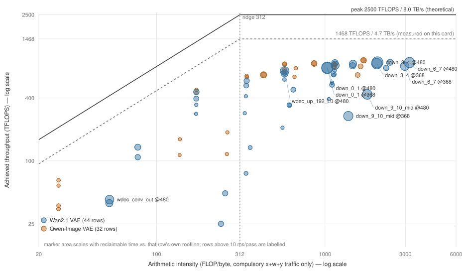
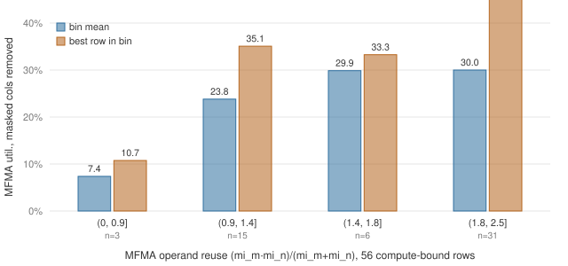

# conv3d 隐式 GEMM：tuned 配置的 roofline 分解

> 范围：**只看 BF16 前向**，对象是 `aiter/ops/flydsl/kernels/conv3d_implicit_gfx950.py`
> 及其 host 侧的 tile / splitK 决策（`aiter/ops/flydsl/conv_kernels.py`）。
> 数据来源：`aiter/configs/model_configs/wan21_vae_bf16_tuned_conv3d.csv`（44 行）与
> `qwenimage_vae_bf16_tuned_conv3d.csv`（32 行），共 **76 行**，全部是 gfx950 / MI355X
> 256 CU 上 tuner 的 on-device 实测结果。本文**没有新跑任何 benchmark**，只是把这两份
> CSV 已有的 `us` / `tflops` / `bw` 三列做 roofline 分解。
>
> **表的版本：`ed7b5a5a8`（NDHWC in and out）之后。** 这一版把两份表按 VAE 真正跑的
> 布局重新 tune 了，44/76 行换了 tile，`us` 里**不再含 NCDHW→NDHWC 预转置**（只剩
> 一两微秒的 weight repack）。本文所有数字都出自这一版；若手上的表早于该 commit，
> §1/§3/§4/§8 的数会系统性偏低，`us` 也含转置。核对办法见 [§2.1](#21-两列的定义决定了它们就是-roofline-的两个轴)。
> 姊妹文档：`wan21_vae_conv3d_t_gt_1_opt_plan.md`、`qwen_image_vae_conv_384_opt_plan.md`
> （未入库，在文档工作区 `docs_flydsl_conv_0826/`）；实测复测见同目录的
> [`conv3d_implicit_rebench_20260929.md`](./conv3d_implicit_rebench_20260929.md)。
> 图表：[`figures/conv3d_roofline.svg`](./figures/conv3d_roofline.svg) 与
> [`figures/conv3d_reuse_bins.svg`](./figures/conv3d_reuse_bins.svg)，由
> [`plot_roofline.py`](./plot_roofline.py) 从同两份 CSV 重新生成（不需要 GPU）。
> 另有一个同数据的交互式 Cursor canvas（可切分辨率的排序表），在
> `~/.cursor/projects/<workspace>/canvases/conv3d-roofline-headroom.canvas.tsx`——
> canvas 只在那个目录下才会被 IDE 渲染，所以没有放进本目录。
>
> **状态（2026-09-23）：分析完成，结论与既有 opt_plan 一致。** 本文的价值不在提出新方向——
> 它对 `384→384 @166²` 算出的 32.1% 与 opt_plan §8.0b 用 rocprofv3 在同一个 shape 上量到的
> 33% MFMA 端口占用落在一处，两条互不依赖的路径指向同一个根因（§5）。本文同时记录了两个
> **被推翻的判断**：一个诊断被受控实验证伪（§4），一个估算被实测打脸近 3 倍（§6.2），
> 保留下来是为了说明从 CSV 反推有哪些系统性陷阱。
>
> **更新（2026-09-24）：§6 的优先级按 §6.4 的实测重排。** 对标 FlyDSL hgemm 的两个 kernel 后，
> 主循环重写的可兑现收益从「约 1.3×」下修到约 3 ms/pass。一度排第一的「hgemm 式 split-K」
> 被同卡复核否掉（精度不过门槛，且不开 split-K 时 conv 已与 hgemm 持平），与 opt_plan
> 「splitK 已证伪」一致。新的第 1 位是每次调用 4.5 µs 的 bias 转换，确定且好修。

---

## 目录

- [1. 结论](#1-结论)
- [2. 方法：怎么从 tuned CSV 读出 roofline](#2-方法怎么从-tuned-csv-读出-roofline)
  - [2.1 两列的定义决定了它们就是 roofline 的两个轴](#21-两列的定义决定了它们就是-roofline-的两个轴)
  - [2.2 峰值基线与 ridge point](#22-峰值基线与-ridge-point)
  - [2.3 复现脚本](#23-复现脚本)
- [3. Roofline 分解结果](#3-roofline-分解结果)
  - [3.1 三个汇总数字](#31-三个汇总数字)
  - [3.2 56 行是 compute-bound，天花板在 36.7%](#32-56-行是-compute-bound天花板在-367)
  - [3.3 splitK 全为 1，occupancy 集中在 2 waves/SIMD](#33-splitk-全为-1occupancy-集中在-2-wavessimd)
  - [3.4 换个参照：相对实测可达上限的达成率](#34-换个参照相对实测可达上限的达成率)
- [4. 一个被证伪的诊断：operand 复用度](#4-一个被证伪的诊断operand-复用度)
  - [4.1 跨 shape 的相关性很漂亮](#41-跨-shape-的相关性很漂亮)
  - [4.2 受控实验否掉了因果](#42-受控实验否掉了因果)
  - [4.3 教训：这类相关性为什么必然出现](#43-教训这类相关性为什么必然出现)
- [5. 交叉印证：同一个 shape，两种测法都是 32–33%](#5-交叉印证同一个-shape两种测法都是-3233)
- [6. 按优先级的行动清单](#6-按优先级的行动清单)
  - [6.1 主循环的同步纪律](#61-主循环的同步纪律)（优先级 2）
  - [6.2 转置消除（已由调用约定解决）](#62-转置消除已由调用约定解决)
  - [6.3 窄 N 收尾层：数字刺眼但不要按它开题](#63-窄-n-收尾层数字刺眼但不要按它开题)（优先级 3）
  - [6.4 对标哪个 GEMM：HTI 与整块版本在等价 shape 上的实测](#64-对标哪个-gemmhti-与整块版本在等价-shape-上的实测)（优先级 1 的依据）
- [7. 不要重复开题](#7-不要重复开题)
- [8. 附录：完整数据表](#8-附录完整数据表)
- [9. 边界](#9-边界)

---

## 1. 结论

**MFMA 和 HBM 两头都远未饱和。** 76 行 tuned 配置里：

| 指标 | 最小 | 中位 | 最大 | 耗时加权 |
|---|---:|---:|---:|---:|
| MFMA 利用率（相对 2500 TFLOPS 理论峰值） | 1.0% | 25.8% | **36.7%** | 28.5% |
| HBM 带宽利用率（相对 8 TB/s） | 1.3% | 9.4% | 34.6% | — |
| occupancy（LDS 允许的 waves/SIMD，上限 8） | 1.0 | 2.0 | 5.0 | 2.48 |

76 行里 **56 行的算术强度高于 ridge point**（312 FLOP/byte），本该是 compute-bound；
但它们既没吃满算力也没吃满带宽。一个 compute-bound 的 kernel 两头都空着，剩下的时间
就是在**等**——这与 opt_plan §8.0b 量到的「conv 的 wave 46.5% 时间卡在
`s_waitcnt` / `s_barrier`」是同一件事。

> **但不要据此认为「处处是空间」。** 上表的分母是理论峰值，而这张卡上最好的 GEMM 也
> 只到理论峰值的 59%。换成实测可达上限做分母，compute-bound 的中位达成率是 **49.7%**，
> 且 **75% 的耗时已经落在 50–65%**。排优先级必须用后一个口径，
> 见 [§3.4](#34-换个参照相对实测可达上限的达成率)。

按可回收时间排序（定义见 §2），四个受测分辨率都是 **69–72% 的时间落在自身 roofline 之下**：

| 模型 / 分辨率 | 每 pass 合计 | roofline 之下 | 占比 |
|---|---:|---:|---:|
| Wan 480×832 | 249.5 ms | 174.5 ms | 70% |
| Wan 368×544 | 136.4 ms | 98.8 ms | 72% |
| Qwen 1328² | 14.6 ms | 10.0 ms | 69% |
| Qwen 1024² | 8.9 ms | 6.2 ms | 69% |

（NDHWC 重调前这四行分别是 315.1 / 167.4 / 19.2 / 11.4 ms，roofline 之下 76–78%。
两处差额基本就是预转置：合计 513.1 → 409.4 ms，−20.2%，与 `ed7b5a5a8` 自己量到的
「20% summed」一致。）

**但这一列只能用来排优先级，不能当作可兑现的收益。** `down_9_10_mid` 是最好的反例：
可回收 15.3 ms、调用频次全场最高（160 次/encode），而所有已知手段在它身上都实测更慢
（§7）。同 shape 的 hgemm 靠 bf16 atomic split-K 看似快 27–46%，但同卡复核证明它过不了
精度门槛，不开 split-K 时两者持平（§6.4）。

---

## 2. 方法：怎么从 tuned CSV 读出 roofline

### 2.1 两列的定义决定了它们就是 roofline 的两个轴

`csrc/flydsl_conv3d/conv3d_tune.py::Conv3dTuner.calculate`：

```python
tflops = round(m * n * k * 2 / (time * 1e6), 2)
...
moved = x_elems * in_bpe + w_elems * w_bpe + y_elems * out_bpe
bw = round(moved / (time * 1e-6) / 1e9, 2)
```

- `tflops` 是**有效** FLOPs（`m/n/k` 由 `_gemm_dims` 给出，grouped conv 只累加自己组内）。
- `bw` 只计 `x + w + y` 各读写一次的**必需** HBM 流量（compulsory traffic），
  **不含 im2col 的 9× 放大，也不含多 tile 对 A 的重复读**。

所以每行的算术强度可以直接相除得到，不需要重新推导 shape：

```
AI = tflops × 1e12 / (bw × 1e9)      [FLOP / byte]
```

这里有一个必须记住的偏差：**`bw` 是流量下界，所以 AI 是上界**。真实的 L2/HBM 流量更大，
真实 AI 更小，意味着每行离「带宽墙」其实比图上更近一点。带宽利用率最高的一行已经到
34.6%（`enc_down_96` @1328²），所以这个偏差对偏带宽的几行开始要紧了：判断它们是否贴墙
之前，要先把 im2col 放大算进去。

#### `us` 的口径：NDHWC 两端，不含预转置

`us` 是端到端时间，但从 `ed7b5a5a8` 起，两端都是 NDHWC——也就是 VAE 真正跑的布局，
kernel 内部本来也只读 NDHWC。留在 kernel 之外的只有 weight repack，
`run_perftest` 的每份轮转副本各做一次，量级一两微秒。**所以这三列现在接近 kernel-only，
只是仍略偏高。**

这一点决定了很多结论，务必先核对手上的表是哪一版：

```python
# NDHWC 版的 tuner 会在两侧都传 LAYOUT
grep -n 'LAYOUT = ' csrc/flydsl_conv3d/conv3d_tune.py        # -> LAYOUT = "NDHWC"
grep -c 'input_layout=LAYOUT' csrc/flydsl_conv3d/conv3d_tune.py
```

更直接的判据是看一行的值：`down_0_1` @480×832（`C=96,D=6,H=482,W=834`）在 NDHWC 版里是
`192x96/3x1`、**1017.87 µs / 781.03 TFLOPS**；在它之前是 `192x128/4x1`、1328.70 µs /
598.32 TFLOPS。

旧口径下，「转置占多少」可以直接从表里推（本文早期版本就是这么做的，估出 13–18%）。
现在不行了：**转置已经不在 `us` 里**，表衡量的是一个已经拿到 NDHWC 输入的调用。
转置的代价改为由 `ed7b5a5a8` 的实测给出，见 [§6.2](#62-转置消除已由调用约定解决)。

### 2.2 峰值基线与 ridge point

gfx950 / MI355X（device id `0x75a0`，256 CU，288 GiB HBM3E）：

| | 理论峰值 | 同卡实测可达 | 实测/理论 |
|---|---:|---:|---:|
| BF16 matrix | 2500 TFLOPS | 1468 TFLOPS（`torch.mm` 8192³） | 59% |
| HBM | 8000 GB/s | 4700 GB/s（device copy，读+写） | 59% |
| **ridge point** | **312.5** | **312.3** | — |

两套基线的 ridge point 几乎相同（因为算力与带宽的折损比例一致），所以**用哪套算
bound 分类都一样**，只是整体缩放 0.59。本文的百分比一律按理论峰值算，是乐观口径。

> 注：负载下 `rocm-smi --showclocks` 读到的 sclk 是 37–145 MHz，与持续 1113 TFLOPS
> 的实测明显矛盾，该读数不可用于反推峰值。上表的「实测可达」是直接测出来的吞吐。

每行的 roofline 上限与可回收时间：

```
roof_TFLOPS  = min(2500, AI × 8)
可回收 ms    = us × (1 − tflops / roof_TFLOPS) × calls / 1000
```

`calls` 取自 `op_tests/test_flydsl_conv_implicit.py` 的 shape 生成函数
（`wan_vae_conv3d` / `wan_vae_aux` / `wan_vae_decode` / `qwen_vae_conv2d`），
按 CSV 的 20 列 problem key 精确匹配，76 行全部命中。

### 2.3 复现脚本

不需要 GPU，也不需要跑 benchmark：

```python
import pandas as pd, numpy as np

d = pd.concat([pd.read_csv(f) for f in (
    "aiter/configs/model_configs/wan21_vae_bf16_tuned_conv3d.csv",
    "aiter/configs/model_configs/qwenimage_vae_bf16_tuned_conv3d.csv",
)], ignore_index=True)

d["AI"]     = d.tflops * 1e12 / (d.bw * 1e9)
d["mfma%"]  = d.tflops / 2500 * 100
d["bw%"]    = d.bw / 8000 * 100
d["roofTF"] = np.minimum(2500, d.AI * 8)
d["roof%"]  = d.tflops / d.roofTF * 100
d["bound"]  = np.where(d.AI >= 312.5, "compute", "mem")

# tile 几何：MFMA_M = MFMA_N = 16，PIPE_STAGES = 2 * TILES_PER_BARRIER = 4
d["mi_m"]  = d.tile_m // d.wave_m // 16
d["mi_n"]  = d.tile_n // d.wave_n // 16
d["reuse"] = d.mi_m * d.mi_n / (d.mi_m + d.mi_n)
d["ldsKB"] = 4 * (d.tile_m + d.tile_n) * 32 * 2 / 1024
d["w_simd"] = (160 // d.ldsKB) * d.wave_m * d.wave_n / 4   # gfx950 LDS = 160 KB/CU

# N 填充率，以及扣掉 masked 列后的「真实」MFMA 利用率。
# §4.1 的相关系数是对 mfma_adj 算的，用 mfma% 会得到 0.64 而不是 0.70。
kg = d.K // d.groups
d["nfill"]    = kg / (np.ceil(kg / d.tile_n) * d.tile_n)
d["mfma_adj"] = d["mfma%"] / d.nfill
```

自检（应与本文各处引用一致）：

```
rows = 76                          compute-bound rows = 56
mfma%    min/med/max = 1.0 / 25.8 / 36.7      splitK unique = [1]
bw%      min/med/max = 1.3 / 9.4 / 34.6       AI min/max    = 26 / 3180
w_simd   min/max     = 1.0 / 5.0              w_simd == 2.0 的行数 = 37
corr(mfma_adj, reuse) = +0.55    ← 对 56 个 compute-bound 行
```

`AI` 与 `bound` 两列不随重调变化：算术强度是 shape 的属性，`tflops` 和 `bw` 同除一个
时间，比值与时间无关。所以「56 行 compute-bound」在两版表上都成立，变的只是它们离
roofline 多远。

---

## 3. Roofline 分解结果



全部 76 个 tuned 配置，双对数轴。实线是理论 roofline（2500 TFLOPS / 8 TB/s），
虚线是同卡实测可达（1468 TFLOPS / 4.7 TB/s），竖虚线是 ridge point 312 FLOP/byte。
点面积随「相对该行自身 roofline 的可回收时间」变化，超过 10 ms/pass 的标出名字。
**没有一个点接近任何一条边**——右侧那 30 个算术强度超过 1000 的点距离带宽墙极远，
唯一的约束本该是 MFMA 发射率，而它们落在 10.7–36.7% 之间。
图由 [`plot_roofline.py`](./plot_roofline.py) 从两份 tuned CSV 直接生成。

### 3.1 三个汇总数字

见 [§1](#1-结论) 的表。三个值得单独记住的：

- **36.7%** —— 全表最高的 MFMA 利用率（`res_384_L2`，1024² 用 `128x128/2x2`、
  1328² 用 `192x128/2x2`，两个分辨率都落在 36.7）。这是天花板，不是平均值。
- **34.6%** —— 全表最高的 HBM 带宽利用率（`enc_down_96` @1328²，`AI=173` 的
  stride-2 下采样）。这一档已经高到要留意 §2.1 那个流量下界偏差了。
- **2.48** —— 耗时加权的 waves/SIMD。76 行里 **37 行**是 2.0，而它们是跑得最快的那批配置。

### 3.2 56 行是 compute-bound，天花板在 36.7%

算术强度的跨度很大（26 到 3180 FLOP/byte），但和 MFMA 利用率几乎没关系：

| case | AI | MFMA% | 说明 |
|---|---:|---:|---|
| `down_6_7` @480×832 | 3180 | 34.9 | AI 是 ridge 的 10 倍，仍只有 35% |
| `res_384_L2` @1024² | 1684 | **36.7** | 全表最好 |
| `down_9_10_mid` @368×544 | 1376 | 10.7 | AI 同量级，利用率差 3.4 倍 |
| `enc_conv_in` @1024² | 26 | 2.3 | 真正 memory-bound，但 `bw%` 也只有 27.7 |

`down_6_7` 那一行最能说明问题：算术强度 3180 是 ridge point 的 10 倍，距离带宽墙极远，
整条路上唯一的约束应该是 MFMA 发射率——而它只拿到 35%。

### 3.3 splitK 全为 1，occupancy 集中在 2 waves/SIMD

两个可以直接从 CSV 读出来的事实：

- **`splitK` 列 76 行全是 1**，NDHWC 重调后依然如此。这不是漏测，见 [§7](#7-不要重复开题)。
- **LDS 是 occupancy 的唯一约束。** `PIPE_STAGES = 2 × TILES_PER_BARRIER = 4`，
  于是每 WG 的 LDS 是 `4 × (TILE_M + TILE_N) × 32 × 2` 字节。跑得最快的那批
  `128x192` / `192x128` 配置正好是 80 KB，160 KB 的 LDS 只放得下 2 个 WG：

| tile | LDS/WG | waves/SIMD | 行数 | 平均 `mfma_adj` | 该档范围 |
|---|---:|---:|---:|---:|---|
| `128x192` / `192x128` | 80 KB | 2.0 | 30 | **28.7** | 5.8–36.7 |
| `192x96` | 72 KB | 1.5–3.0 | 6 | 20.5 | 2.6–31.2 |
| `128x128` / `192x64` | 64 KB | 1.0–4.0 | 10 | **28.3** | 4.6–45.2 |
| `192x48` | 60 KB | 1.5 | 1 | 22.3 | — |
| `128x96` | 56 KB | 1.0 | 4 | 14.7 | 11.3–17.9 |
| `96x96` | 48 KB | 1.5–4.5 | 8 | 26.9 | 16.6–34.7 |
| `64x64` / `96x32` | 32 KB | 2.5–5.0 | 7 | 13.6 | 5.4–18.2 |
| `32x32` | 16 KB | 5.0 | 7 | 5.3 | 1.0–10.7 |

读表：**最好的两档（80 KB 与 64 KB）都只有 2 waves/SIMD，而 occupancy 最高的
`32x32`（5 waves/SIMD）平均只有 5.3。** 按 waves/SIMD 重新分组也是同一结论——
2.0 那组平均 28.0，5.0 那组平均 8.8。所以 occupancy 不是约束：否则 `32x32` 应该赢。

### 3.4 换个参照：相对实测可达上限的达成率

上面所有百分比都是对理论峰值算的。那个口径适合说明「离硬件极限有多远」，但用来排
优化优先级会误导：**这张卡上最好的 GEMM 也只到理论峰值的 59%**（§2.2），拿 100% 当
目标等于把一个达不到的量当分母。

换成 §2.2 那条实测可达线（1468 TFLOPS / 4.7 TB/s，ridge 仍是 312），定义

```
ach% = tflops / min(1468, AI × 4.7)
```

同一批 76 行的面貌完全不同：

| | 行数 | `ach%` 中位 | `ach%` 最高 |
|---|---:|---:|---:|
| compute-bound | 56 | **49.7** | 62.6 |
| memory-bound | 20 | 30.2 | 59.0 |

按耗时加权分布，**四分之三的时间落在 50–65% 这一档**：

| `ach%` 区间 | 行数 | 耗时 | 占比 |
|---|---:|---:|---:|
| (50, 65] | 32 | 305.4 ms | **75%** |
| (35, 50] | 21 | 43.6 ms | 11% |
| (20, 35] | 11 | 23.6 ms | 6% |
| (0, 20] | 12 | 36.8 ms | 9% |

三条结论，都直接改写了 [§6](#6-按优先级的行动清单) 的优先级：

**① 主循环那条路值约 1.3×，不是 3×。** `res_384_L3` @1328²（就是 `@166²`）的 `ach%`
是 **54.6%**；opt_plan 说它对 `a16w16` 是 0.764×，所以**追平 `a16w16` 也只到 71.5%**
（MFMA 利用率 32.1% → 42%）。方向没错，但别拿「28.5% → 100%」估收益。
（§6.4 进一步下修：1.3× 只在这一个 shape 上成立，推到全部大 M 层后可兑现的约 3 ms/pass。）

**② memory-bound 那族已经到顶了。** 这是 NDHWC 重调带来的一处翻转：

| case | `bw%`（对 8 TB/s） | `ach%` |
|---|---:|---:|
| `enc_down_96` @1328² | 34.6 | **59.0** |
| `resample_96` @480×832 | 33.1 | **56.4** |
| `enc_down_96` @1024² | 32.5 | 55.4 |
| `enc_conv_in` @1328² | 31.2 | 53.1 |

旧表上这几行的 `bw%` 只有 13–17%，看着像有大量空间——**那是预转置拖累造成的假象**。
对 memory-bound 层，56–59% 的实测可达带宽已经相当高，而且 `bw` 是流量下界（§2.1），
真实达成率还要更高。这一族不该再进优化列表。

**③ 新暴露一族：小 tile 占掉 15% 的时间。** `ach% < 35` 的 14 行合计 60.4 ms
（占 409.4 ms 的 15%），几乎全集中在两种 tile 上：

| tile | 行数 | 耗时 | 平均 `ach%` |
|---|---:|---:|---:|
| `64x64` | 6 | 19.8 ms | 21.9 |
| `32x32` | 7 | 18.6 ms | 9.8 |
| `96x32` | 1 | 11.6 ms | 17.3 |
| `64x32` | 1 | 6.3 ms | 16.0 |

里面有一个很干净的对照——同样的 N 和 K，只有 M 差 8 倍：

| case | N | K | M | tile | `ach%` |
|---|---:|---:|---:|---|---:|
| `down_6_7` @480×832 | 384 | 10368 | 49,920 | `128x128/4x2` | **59.4** |
| `down_9_10_mid` @480×832 | 384 | 10368 | 6,240 | `64x64/2x2` | **29.5** |
| `down_6_7` @368×544 | 384 | 10368 | 25,024 | `192x128/4x1` | **54.9** |
| `down_9_10_mid` @368×544 | 384 | 10368 | 3,128 | `32x32/1x2` | **18.3** |

达成率掉一半，差别纯粹是 M 不够大、被迫用小 tile。**但对它的两条自然改法（splitK、
保住大 tile）都已被实测证伪**（§7 #1、#6），所以这一项目前是堵死的，不是待做项。
`wdec_conv_in` 的 `ach%` = 5.2 是全场最低（`K=432` 只有 13.5 个 k-tile、`M=3128`、
单次 13.6 µs，像是 launch 与尾声主导），但绝对量只有 0.3 ms/pass。

---

## 4. 一个被证伪的诊断：operand 复用度

这一节记录一个**错误的**诊断及其被证伪的过程。保留它是因为这个错误很容易重犯：
它在数据上看起来非常有说服力。

### 4.1 跨 shape 的相关性很漂亮

定义 operand 复用度为「每个 k-step 里，一组 A/B fragment 能喂多少条 MFMA」：

```
reuse = (mi_m × mi_n) / (mi_m + mi_n)
```

对 56 个 compute-bound 行算相关系数（`mfma_adj` 是扣掉 masked N 列后的利用率）：

| 变量 | 与 `mfma_adj` 的相关系数 |
|---|---:|
| `ldsKB`（与 tile 面积同向） | **+0.75** |
| **`reuse`** | **+0.55** |
| `nacc = mi_m × mi_n` | +0.52 |
| `waves` | +0.43 |
| `M` | +0.32 |
| `blocks/CU` | +0.29 |
| `ktiles` | +0.04 |
| `nfill`（N 方向填充率） | **−0.29** |
| `Ndim` | −0.27 |

分箱后均值也是单调的：

| `reuse` 区间 | 行数 | 平均 `mfma_adj` | 该组最好 |
|---|---:|---:|---:|
| (0, 0.9] | 3 | 7.4 | 10.7 |
| (0.9, 1.4] | 15 | 23.8 | 35.1 |
| (1.4, 1.8] | 6 | 29.9 | 33.3 |
| (1.8, 2.5] | 31 | 30.0 | **45.2** |



注意「该组最好」那条橙色柱：**上限完全不单调**。`(0.9, 1.4]` 组里已经有 35.1 的行，
比 `(1.4, 1.8]` 整组的上限 33.3 还高；换句话说复用度只有 1.33 的配置能达到的高度，
复用度 1.71 的一档反而达不到。均值的单调只是因为低复用度那几档里混着 `32x32` 这种
又小又慢的 tile。**这是「复用度不是约束」的第一个线索，当时没有读出来。**

据此得出的（错误）结论是：瓶颈在 operand 供给，而 N 填充率和 grid 填充都不是主因；
既然提高 `reuse` 的唯一办法是放大 tile、而放大 tile 就掉到 2 waves/SIMD，
那么解法应该是**换 32×32×16 的 MFMA**——同 tile 下 acc VGPR 不变，
但每 k-step 的 fragment 读取数减半，等于在不动 occupancy 的前提下把 `reuse` 翻倍。

> **NDHWC 重调让这个相关性自己弱了一截。** 旧表上 `corr(mfma_adj, reuse)` 是 **+0.70**，
> 重调后是 **+0.55**；`nfill` 从 −0.17 走到 −0.29。表变了而 shape 没变，唯一变化是
> 44 行换了 tile、`us` 去掉了转置——**一个真实的物理约束不会因为换一批 tile 就松动
> 0.15**。这比 §4.2 引用的受控实验更早一步说明：它是配置选择的副产品，不是因果。

### 4.2 受控实验否掉了因果

`qwen_image_vae_conv_384_opt_plan.md`（未入库）
已经在**同一个 shape 内**做过对照，两条都是负的：

- **§6.1c（排除表 #7）**：在同样 64 KB LDS 下提高 `MI_M × MI_N` 分块，
  `@166²` **单调变慢**，跟着 waves/CU 走。低 wave 数配置能在同 LDS 下拿到更高分块，
  用 `tile=` 覆盖即可测，不用改 kernel——测出来是反向的。
- **§6.1e（排除表 #8）**：`TILE_K=64` + flygemm 的 XOR swizzle 已经把
  LDS 周期/MFMA 从 **6.00 砍到 3.00**、bank 冲突从 **50.0% 降到 0.0%**，
  与 flygemm 持平。整体只值 **0.4–1.5%**，同 `PIPE_STAGES` 下反而略慢。改动已回退。

第二条是决定性的：**把 LDS operand 流量减半只值 1%**。换 32×32×16 MFMA 本质上做的是
同一件事（减少每条 MFMA 摊到的 operand 读取），没有理由更值钱。

### 4.3 教训：这类相关性为什么必然出现

`reuse` 是 tuner **选出来的**配置属性，不是自变量。tuner 给每个 shape 挑最快的 tile，
而大 shape 本来就跑得更有效率、也更能吃下大 tile——于是「高 `reuse`」和「高利用率」
在跨 shape 的散点上必然同向，哪怕两者之间没有任何因果。

`nfill` 的负相关也有类似的解释，但方向相反：Wan opt_plan §1.1 那张表里
`down_3_4` 选的还是 `(256,256,2,4)`、N 填充 75%，而现在 CSV 里是
`128x192/2x2` 填满——**阶段 A 的精确 N tile 已经落地**
（commit [`4d847400`](https://github.com/ROCm/FlyDSL/commit/4d847400)）。
N 填充问题已经被修掉，所以在当前数据里看不到它。**在已经修过的数据上做相关性分析，
会把修好的因素判成「不重要」。**

结论：**从 tuned CSV 只能定位「哪里慢」，不能定位「为什么慢」。** 后者必须靠同 shape
受控实验或计数器归因。

---

## 5. 交叉印证：同一个 shape，两种测法都是 32–33%

opt_plan §8.0b 的计数器归因是在 `384→384 @166²` 上做的。那个 shape 在本文的表里就是
**`res_384_L3` @1328²**，可以直接对上：

| | 本文（CSV 吞吐 / 峰值） | opt_plan（rocprofv3 端口占用） |
|---|---:|---:|
| NDHWC 表（`ed7b5a5a8` 起，kernel-only 口径） | **32.1%**（91.2 µs / 802 TFLOPS） | **33%** |
| NDHWC 之前（含预转置） | 28.2%（103.7 µs / 705 TFLOPS） | 同上 |

**只有 NDHWC 那一行的口径与计数器一致**，两者也就落在了同一个数上。
这是本文早期版本的一处错误：当时拿的是旧表**全表最高**的 33.5%（另一个 shape，
而且含转置）去对这个 33%，数字碰巧接近，但一个是端到端、一个是 kernel 内，
对上了也不说明什么。换成同 shape、同口径之后，32.1% 对 33% 才是真的交叉印证。

（旧表那个 33.5% 在新表上变成了 36.7%，所以「天花板 = 33%」这个说法本身也只是旧口径
的产物。现在 MFMA 利用率的天花板是 36.7%，而 `@166²` 这一个 shape 停在 32.1%。）

下面是 §8.0b 的原始对照：

| | conv 3×3 | `gemm_a16w16` |

| | conv 3×3 | `gemm_a16w16` |
|---|---:|---:|
| 实际发射的指令（`SQ_ACTIVE_INST_ANY`） | 13,281,408 | 13,189,000 |
| wave 生命周期总和（`SQ_WAVE_CYCLES`） | 127,581,746 | 54,628,774 |
| 显式等待占比（`SQ_WAIT_ANY`） | **46.5%** | 30.3% |
| 发射占比 | 10.4% | 24.1% |
| VALU / MFMA | 1.60 | 1.29 |
| **MFMA 端口占用** | **33%** | **61%** |

**两者发射的指令总数几乎相同，但 conv 的 wave 有近一半时间卡在等待上。** conv 既没多干活
（VALU/MFMA 只多 24%，不是地址计算爆炸），也没吃满任何发射端口。

§8.0c 给出了机制，这是本文之外最重要的一段：

| | 主循环形态 | vmcnt 等待 |
|---|---|---|
| conv | 整批 DMA → `vmcnt=0` + `lgkmcnt=0` **全排干** → 屏障 → 整批 MFMA | 54 个 k-tile 批次，**每批一次双计数器全排干** |
| `a16w16` | `use_half_tile_interleaved`：手工全展开，把下一个 k-tile 的 async load 切碎插进四组 `consume()` MFMA 之间，中间只用裸 `s_barrier()` | 整个 kernel 只有 7 次，**主循环里一次都没有** |

`a16w16` 的 `wait_vmcnt_and_barrier()` 传的是 `half_ldg_b_iters + half_ldg_a_iters`
这类**非零值**，也就是**带着尚未完成的 load 跨过屏障**。conv 必须靠 `PIPE_STAGES=4`
多备两级缓冲，才能在每轮全排干之后还剩下点预取。

还有一处曾被 §6.1 误判、由 §8.0c 修正的细节：conv 用 `fx.rocdl.BufferCopyLDS128b`，
`a16w16` 用 `fx.rocdl.cdna4.BufferLoadAsyncLDS128b`——两者都不经 VGPR 中转，
但**「direct-to-LDS」不等于「async」**。这条误判曾把整个阶段 B 的搜索方向带偏到
tile / LDS / 预取深度上。

---

## 6. 按优先级的行动清单

先给全表，再逐条展开。**同一份候选里既有开放的也有已证伪的**——分开放在不同章节容易
被当成"漏了"，所以并列在一起，每条都标明判决与出处。

| 优先级 | 方向 | 判决 | 量级 | 详见 |
|---:|---|---|---|---|
| **1** | 缓存 fp32 bias（host 侧每次调用都跑一个 4.5 µs 的 `bias.to(float32)` kernel） | **开放**，改法照抄 `_prep_weight` 的缓存 | Wan 2.73 ms/pass（1.1% / 2.0%）、Qwen 0.26 ms（1.8% / 2.9%）；同卡实测 | [§6.4](#64-对标哪个-gemmhti-与整块版本在等价-shape-上的实测) |
| — | 小 M 大 K 层改用 hgemm 式 split-K | **证伪**（同卡实测）：hgemm 的部分和经 16 位 LDS 中转，4.3–4.4% 元素超出 err = 0 门槛；fp32 atomic 版不比不开快 | 不开 split-K 时 conv 已与 hgemm 持平 | [§6.4](#64-对标哪个-gemmhti-与整块版本在等价-shape-上的实测) |
| **2** | 主循环同步纪律（`BufferLoadAsyncLDS128b` + 部分等待，不再每批全排干），**按整块版本的通用形态做** | **开放**，有停顿归因支撑；**收益下修** | 上界约 **3 ms/pass**（`down_6_7` @368×544 约 2.3 ms + 中小 M 的 384 层约 0.7 ms）；原「约 1.3×」只在 `@166²` 成立 | [§6.1](#61-主循环的同步纪律)、[§6.4](#64-对标哪个-gemmhti-与整块版本在等价-shape-上的实测) |
| **3** | `N < 16` 收尾层的专用路径 | **开放但需另立项目** | Wan decode 11.6 ms/pass；现有候选集里无配置可改善 | [§6.3](#63-窄-n-收尾层数字刺眼但不要按它开题) |
| — | 小 tile（`32x32` / `64x64`）的低达成率一族 | **已堵死**：splitK（fp32 staging 与 bf16 atomic 两种归约）与保大 tile 均实测不行 | 占 15% 耗时、`ach%` 仅 9.8–21.9 | [§3.4 ③](#34-换个参照相对实测可达上限的达成率)、§6.4 |
| — | stride-2 下采样 / `conv_in` 的带宽一族 | **已到顶**，旧表上的「空间」是转置假象 | `ach%` 已 53–59 | [§3.4 ②](#34-换个参照相对实测可达上限的达成率) |
| — | 转置消除（channels-last 贯穿整个 VAE） | **已由调用约定解决**，不再是 kernel 侧的待做项 | 实测占端到端 13% 中位 / 20% 求和 / 最高 50% | [§6.2](#62-转置消除已由调用约定解决) |
| — | 换 32×32×16 的 MFMA（降 operand 流量） | **证伪**：同类改动只值 1% | — | [§4.2](#42-受控实验否掉了因果) |
| — | 大 tile + splitK 换 occupancy（fp32 staging 版） | **证伪**：0.44× | — | [§7](#7-不要重复开题) #1 |
| — | 窄 N 形状开 splitK | **证伪**：0.93–0.94× | — | §7 #2 |
| — | 把 splitK 加成 tuner 候选轴 | **证伪**：无收益 | — | §7 #3 |
| — | 提高寄存器分块 `MI_M×MI_N` | **证伪**：反向 | — | §7 #4 |
| — | LDS bank 冲突 / LDS 带宽 | **证伪**：真实但只值 1% | — | §7 #5 |
| — | 宏 tile 放大到 256×256 | **证伪**：慢 54% | — | §7 #6 |
| — | 加深流水 / 放宽 `barrier(vmcnt=0)` | **证伪**：收益为零 | — | §7 #7 |
| — | 优化 im2col gather | **证伪**：不是瓶颈 | — | §7 #8 |

**排序按可兑现收益。** 第 1 条是同卡实测的确定开销，改动小、无数值风险。第 2 条原先排第一，
是按 `@166²` 一个 shape 的 1.3× 外推的；放到全部大 M 层上，conv 在 `down_6_7` @480×832 已与
HTI 256×256 打平、在 N=192 的大 M 层上反而更快，能兑现的只剩约 3 ms，且这是 CSV 对 hgemm 的
跨次比较，立项前要先做同卡 A/B（§6.4 的同卡复核里 CSV 比同卡实测慢 7–13%）。
原先排在第 2 位的转置消除已经落地——`ed7b5a5a8` 把两份表按 NDHWC 重调，
VAE 也在向 NDHWC 端到端迁移，那 20% 不再是「表里能看出的 headroom」。

**用 [§3.4](#34-换个参照相对实测可达上限的达成率) 的达成率读这张表，而不是用 §1 的
理论峰值百分比。** 按理论峰值，76 行全在 37% 以下，像是处处都有空间；按实测可达上限，
75% 的耗时已经在 50–65%，剩下的 15%（小 tile 一族）已被证伪堵死，另有一族本来就到顶。
**真正还开着的是第 1、2 条，合计约 3–6 ms/pass，远不是 3×。** 这是本文最容易被误读的地方——
早期版本正是因为只看理论峰值百分比，才把「处处是空间」当成了结论。

> **给按早期版本行动的人**：本文曾把「换 32×32×16 MFMA」和「splitK 从未生效」列为
> 头两号方向，理由分别是 §4.1 的相关性和「CSV 里 splitK 全是 1」。两条都被既有
> opt_plan 的实测推翻了（§4.2、§7 #1–#3）。**CSV 里 splitK 全是 1 是正确结果，不是漏测**，
> NDHWC 重调后依然全是 1；换成 hgemm 的 bf16 atomic 归约也不行（精度，见 §6.4）。

### 6.1 主循环的同步纪律

> **收益修正（2026-09-24，§6.4）。** 原判「覆盖 75% 耗时、约 1.3×」只在 `@166²` 上成立。
> 把 HTI 256×256 放到全部大 M 层上对拍：`down_6_7` @480×832 conv 456.1 vs 455.2 µs 已打平，
> N=192 的大 M 层 conv 更快，可兑现上界只剩约 3 ms/pass。**机制判断不变，形态建议改为整块版本的
> 通用流水**（`BufferLoadAsyncLDS128b` + `wait_asyncmark(stages-2)` + 裸 `s_barrier`，运行时循环、
> 任意 tile），避开下文 HTI 形态「每个 tile 一份手工展开」的代价。

这是 §8.0b/§8.0c 的停顿归因直接指向的根因，也是十条假设全负之后唯一没被碰过的一条。
两处要改：

1. 主循环从「整批 DMA → 全排干 → 屏障 → 整批 MFMA」改成把下一个 k-tile 的 load 切碎、
   插进分组 MFMA 之间，中间只用裸 `s_barrier()`。
2. 把 `BufferCopyLDS128b` 换成 cdna4 的 `BufferLoadAsyncLDS128b`——
   否则无法带着未完成的 load 跨屏障。

**必须连机制一起搬，不能只搬配置。** §8.0c 已经试过「逐项对齐 `a16w16` 的参数」：
`256×256` + `TILE_K=64` + swizzle + `PIPE_STAGES=2`，LDS 恰好 128 KB，
每屏障 `MI 8×4 × 2 个 k 步 = 64` 条 MFMA，与 `a16w16` 完全一致——

| tile | `TILE_K` | `PIPE` | swz | LDS | block/CU | MFMA/屏障 | µs | vs `a16w16` |
|---|---:|---:|---:|---:|---:|---:|---:|---:|
| `128×128×2×4`（现状） | 32 | 4 | 否 | 64 KB | 2 | 16 | **102.9** | 0.765× |
| `256×256×2×4` | 32 | 4 | 否 | 128 KB | 1 | 64 | 109.0 | 0.722× |
| `256×256×2×4` | 64 | 2 | 是 | 128 KB | 1 | 64 | **267.2** | **0.295×** |

**逐项对齐之后慢了 2.6 倍。** 每屏障 64 条 MFMA 这个曾被认定为关键的量已经追平，仍然慢——
说明「每屏障工作量」是症状而非病因，病因是 `PIPE_STAGES=2`：`a16w16` 敢用 stages=2
是因为它从不排干，conv 照抄就得到两者之短（既失去 4 级流水的缓冲，又没有 HTI 的跨屏障重叠）。

风险提示：这是 kernel 主循环的结构性改写，涉及 LDS 时序与 barrier 覆盖，
是静默数值错误的高发区，每步都要过 `checkAllclose`（现有测试的门槛是 err = 0，
不是「在容差内」）。

### 6.2 转置消除（已由调用约定解决）

这一条现在是记录而不是待做项。`ed7b5a5a8` 把两份表按 NDHWC 两端重新 tune，同时 VAE
本身在向 NDHWC 端到端迁移；kernel 内部本来就只读 NDHWC，所以一个 NCDHW 输入要额外付
一个**任何 tile 选择都影响不到**的转置 kernel。该 commit 在 76 个 VAE shape 上量到的
代价是：

| 统计口径 | 转置占端到端时间 |
|---|---:|
| 76 个 shape 的中位数 | **13%** |
| 按时间求和 | **20%** |
| 最高（stride-2 下采样一族） | **50%** |

本文两版表的总时间差正好是这个量：**513.1 → 409.4 ms，−20.2%**，与「20% summed」吻合。
逐行看降幅最大的几个（这几行的 tile 没变，所以差额就是转置）：

| case | 转置口径 µs | NDHWC µs | 降幅 |
|---|---:|---:|---:|
| `wdec_up_192_L0` @480×832 | 1486.2 | 731.1 | **−50.8%** |
| `wdec_conv_out` @480×832 | 780.0 | 581.6 | −25.4% |
| `wdec_up_384_L1` @480×832 | 863.3 | 646.2 | −25.1% |
| `down_3_4` @480×832 | 999.4 | 908.0 | −9.2% |

> **一个估算教训。** 本文早期版本用「输入张量字节数 ÷ 实测可达带宽 4.7 TB/s（读+写）」
> 估转置成本，对 `wdec_up_192_L0` 估出 17.6%，实测是 **50.8%**——低估了近 3 倍。
> 原因是 NCDHW→NDHWC 是跨 stride 的散列访问，效率远达不到顺序 copy 的峰值，
> 拿 copy 带宽做分母会系统性乐观。**估流量型开销时，分母要用同类访问模式的实测值，
> 不是顺序 copy 的峰值。**

仍然成立的两点：入口的 `input_layout` / `output_layout` 是独立的，
NCDHW 调用方拿到的是同一行 tuned 配置（表里没有 layout 列），只是要自己付转置；
以及这一项**不能缩小相对 `gemm_a16w16` 的差距**——384 层激活只有 12–50 MB，
转置 11–17 µs，见 384 opt_plan §7。Wan opt_plan 阶段 C 的 `F.pad` / `cat`
两次拷贝不在 `ed7b5a5a8` 的范围内，那部分仍待做。

### 6.3 窄 N 收尾层：数字刺眼但不要按它开题

`wdec_conv_out` / `dec_conv_out` 输出 RGB，N 只有 3，而最窄的 `tile_n` 是 32——
填充率 0.09，**每 32 列里 29 列在乘零**。MFMA 利用率 1.4–1.7%，全表最低；
Wan 480×832 每次 decode 在这上面花 11.6 ms（NDHWC 口径；含转置时是 15.6 ms）。

但不要直接按这个数字立项：

- 它是 memory-bound（AI = 53），理论上该贴着带宽跑，可 `bw%` 也只有 10.2%——
  说明慢的原因不在 mask。去掉转置后这一行只快了 25%，剩下的还在 kernel 里。
- 同族的 `conv_out`（N=32）的所有 splitK 与窄 tile 组合**都已实测过**，生产选择最快。
- `kg = 3` 连 `kg % tile_n == 0` 都不成立，现有候选集里**根本没有**能改善它的配置。

要动就得给一条 N 极窄的专用路径（或在 dispatch 层判掉），属于另立项目而非调参。

### 6.4 对标哪个 GEMM：HTI 与整块版本在等价 shape 上的实测

§6.1 的标尺 `a16w16` 是 FlyDSL hgemm 的 HTI kernel（`gemm_a16w16_hti_gfx950_kernel`）；
同一文件里还有整块版本 `gemm_a16w16_gfx950_kernel`。conv3d 的数据通路（`16x16x32_bf16`
MFMA、direct-to-LDS、整块累加器）更像后者。把 76 行按 M = N·Do·Ho·Wo、N = K_out、
K = C_pad·kvol 换成 GEMM，在两个 kernel 上各自实测（2026-09-23，gfx950 空闲卡，
`run_perftest` 设备侧计时，同卡交替 5 轮取 median，全部 err = 0）：

**能不能跑由输入通道 C 决定。** hgemm 不支持 K 尾（K 须被 `block_k` ≥ 64 整除），
HTI 还要求 K tile 数为偶数；kvol = 27 / 9 是奇数，K 的 2 的幂次全来自 C：

| 输入 C | 行数 | 可用 |
|---|---:|---|
| 3 / 16 / 96（K 不能被 64 整除），或 N = 3 | 26 | 两者都不能跑 |
| 192（K/64 为奇数），或 N = 32 | 26 | 只有整块版本 |
| 384 | 24 | 两者都能跑 |

**24 行上，HTI 的 `256×256×64×2 / w2×4` 与整块版本各自最优配置的比值：**

| 区间 | 行 | HTI / 整块 |
|---|---|---:|
| N=384 且 M ≥ 25k（`res_384_L2` @1024² 除外），或 N=192 且 M ≥ 50k | 12 行：`down_6_7` 两档，`wdec_up_384_L1` / `_L1_t1` / `_L2`@480×832，`dec_up_384_*`，`res_384_L2/L3` 与 `enc_down_384` @1328² | **0.68–0.88** |
| 其余：M ≤ 16k，N=192 且 M ≈ 25k，`res_384_L2` @1024² | 12 行 | 1.07–3.4 |

结论：

- **大 M 一族的对标就是 HTI 256×256**，与 §6.1 方向一致；`@166²` 上它是 83.3 µs
  （opt_plan 量到 78.7 µs，口径是热缓存、无 bias），整块版本最优只有 108.8 µs。
- **小 M（≤ 16k）一族的对标是整块版本**：它靠深流水（stages 最高到 7）、split-K / slice-K，
  比 CSV 里 conv3d 的 `us` 快 11–46%（例：M=3128 的两行，K=3456 是 24.4 vs 39.9 µs，
  `down_9_10_mid` 是 50.0 vs 92.7 µs）。这给 §3.4 ③ 已堵死的小 tile 一族留了一条新线索——
  §7 #1–#3、#7 的证伪都是在 conv 现有主循环里做的，与此不矛盾。但 CSV 与本轮不是同卡同时测的，
  要立项先做同卡 A/B。
- **按调用次数折算的可兑现上界**（`(conv us − hgemm 最优 us) × calls`，只覆盖本轮测过的
  23 行；C=192 与 N=32 的 26 行尚未对拍）：四个分辨率合计约 14 ms/pass，Wan 368×544 9.4、
  Wan 480×832 4.7、Qwen 两档各约 0.15。前三行就占 13.4 ms：

  | case | M×N×K | calls | conv µs | hgemm µs（配置） | ms/pass |
  |---|---|---:|---:|---:|---:|
  | `down_9_10_mid` @368×544 | 3128×384×10368 | 160 | 92.7 | 50.2（整块，split-K 3） | 6.8 |
  | `down_9_10_mid` @480×832 | 6240×384×10368 | 160 | 114.8 | 87.7（整块，split-K 3） | 4.3 |
  | `down_6_7` @368×544 | 25024×384×10368 | 60 | 247.4 | 209.4（HTI 256×256） | 2.3 |

  另有 9 行 conv 反而更快（主要是 N=192 的大 M 层）。**前两行已被下面的同卡复核否掉。**
- **同卡复核 `down_9_10_mid`（2026-09-24，GPU 0，profiler 按 kernel 拆分，门槛同测试：
  rtol = atol = 2e-2、超差元素数 0）：**

  | 368×544 / 480×832 | 设备时间 µs | 超差元素 |
  |---|---:|---:|
  | conv 生产配置（kernel + bias 转换） | 77.7 + 4.5 / 96.6 + 4.5 | 0 / 0 |
  | hgemm 不开 split-K | 76.6 / 111.6 | 0 / 0 |
  | hgemm split-K 3，bf16 输出 | 47.2 / 83.1 | **4.4% / 4.3%** |
  | hgemm split-K 3，fp32 输出 + 加 bias 转 bf16 | 81.2 + 8.7 / 145.4 + 10.5 | 3.2% / 3.2% |

  1. **不开 split-K 时 conv 与 hgemm 持平**，CSV 对比出的 27–46% 全来自 split-K，外加 CSV 本身
     比同卡实测慢 7–13%。
  2. **hgemm 的 split-K 过不了精度门槛，fp32 输出也一样。** 误差均匀分布、量级约 0.2（输出约 100），
     不对应漏加/多加任何一个 split——是因为 epilogue 把累加器转成 16 位写进 LDS 再读出
     （"Shared C remains in the 16-bit input dtype"），每个部分和先被舍入成 bf16。tuner 的门槛是
     5e-2 且容许 5% 超差，所以放过了。**快的那一截正是 bf16 packed atomic，而它恰是精度不过的部分。**
  3. **conv 自己的 split-K 在这两档也用不了**：3128 = 8×17×23 没有能整除的 `tile_m`，而 split-K
     不能 mask tile 尾；6240 只有 32×32 能开，kernel 本身就从 220 µs 涨到 470–547 µs。
  4. **顺带量到一笔确定开销**：每次调用都有一个 4.5 µs 的 `bfloat16tofloat32_copy`，来自
     `conv_kernels.py` 每次都做的 `bias.to(torch.float32)`。按附录 calls 折算 Wan 2.73 ms/pass、
     Qwen 0.26 ms/pass，列为 §6 第 1 条。
- **两个测量坑。** ① aiter tuner 的 hgemm 候选集（`get_flydsl_a16w16_configs`）在这些 shape
  上剪掉了 256×256 HTI，只剩 128×128 / 256×64 的 HTI，拿它比会得出「HTI 从不赢」的错误结论。
  ② `flydsl_hgemm` 每次调用约 68 µs host 开销，背靠背的 CUDA event 计时在小 shape 上量到的是
  host 地板，必须用 `run_perftest`。

复现：`scripts/hgemm_ab/`（未入库，在文档工作区 `docs_flydsl_conv_0922/`；`shapes.py` 换算 shape，`bench2.py` 全候选扫描，
`hti256.py` 补测 256×256 HTI，原始数据 `res2_all.jsonl` / `hti256.txt`；同卡复核为
`splitk_baseline.py` / `splitk_fp32_bound.py` / `splitk_err.py` 及对应 `.txt`）。

---

## 7. 不要重复开题

下表每一条都有对应的实测数据段，出处是
`wan21_vae_conv3d_t_gt_1_opt_plan.md` §3/§3.1
与 `qwen_image_vae_conv_384_opt_plan.md` §6.1–§6.3（两份都未入库，见文首）。
**两处的 kernel 改动都已实现、验证并回退。**

| # | 方向 | 判决 | 证据 |
|---:|---|---|---|
| 1 | 大 tile + splitK 换 occupancy | **0.44×** | `down_9_10_mid` @480×832：`(128,128,2,4)`+sk2 = 246.04 µs vs 生产 108.55 µs。fp32 staging `npq×k×4 ≈ 9.6 MB`，两个 split 各写一遍再规约读回约 19 MB，而卷积自身只搬 15 MB 输入 + 4.8 MB 输出。hgemm 的 bf16 atomic 归约同层快 40%，但 4.3–4.4% 元素超出精度门槛，也不可用（§6.4） |
| 2 | 窄 N 形状开 splitK | 0.93–0.94× | `conv_out` / `enc_conv_out` 的全部强制组合都慢于生产；启发式两个方向都判对了（该给 3 的地方给 3，该给 1 的地方给 1） |
| 3 | 把 splitK 加成 tuner 候选轴 | 无收益 | 遍历每 shape 的 74–119 个候选 tile，`_resolve_splitk` 一次都没返回过 >1；强制指定的值全为负 |
| 4 | 提高寄存器分块 `MI_M×MI_N` | 反向 | §6.1c：同 LDS 下提高分块，`@166²` 单调变慢，跟着 waves/CU 走 |
| 5 | LDS bank 冲突 / LDS 带宽 | 真实但不值钱 | §6.1e：`TILE_K=64`+swizzle 把冲突 50.0%→0.0%、`cyc/inst` 8→4、LDS 周期/MFMA 6.00→3.00，整体只值 0.4–1.5% |
| 6 | 宏 tile 放大到 256×256 | 慢 54% | §6.1b：LDS/MFMA 减半却更慢。`Cout=384` 要把 N 补到 512（多做 33% MFMA），LDS 翻倍到 128 KB 掉到 1 block/CU |
| 7 | 加深流水 / 放宽 `barrier(vmcnt=0)` | 机制属实，收益为零 | §6.1f：深预取从灾难性（144.6）救回中性（105.6），从未赢过基线 103.1 |
| 8 | 优化 im2col gather / 边界分支 | 不是瓶颈 | 同 `M/N/K` 下 3×3 比 1×1 还快 3%；gather 净效果 0.886× |
| 9 | `TILE_K` 32→64（单独上） | 慢 15% | 行距变 128 B 撞 bank 轮转。必须与 swizzle 同时上，而合上也只值 1%（#5） |
| 10 | 换 preshuffle / 旧 HGEMM / 量化 GEMM | 无模板更优 | §6.3：按 18+18+8 加权，没有模板超过 `a16w16` |
| 11 | `TILES_PER_BARRIER` 调整 | 当前值即最优 | §6.2.1：tpb=1 全线慢 4–27%，tpb=3 慢 19–33% |
| 12 | 参差 M 尾（`_row_chk`） | 不成立 | §6.1：参差的 27556 反而比整除的 27520 快 10% |
| 13 | 尾声存储未合并（NCDHW stride-M 散写） | 影响 ~1% | §6.2.1：换 NDHWC 后 `@166²` 只快 1.0% |

要重开 splitK 这个题，先拿出一个 shape 同时满足三条（Wan opt_plan §3.1 末尾）：
`base < 3/4·num_cu`、`npq × k × 4` 的 staging 流量远小于卷积自身流量、
**且大 tile 在不开 splitK 时就已经赢过小 tile**。已测的四个 shape 没有一个满足第三条。

---

## 8. 附录：完整数据表

列含义：

- `MI` = `mi_m × mi_n`，即每 wave 每 k-step 的累加器块数（`tile/wave/16`）
- `复用度` = `mi_m·mi_n / (mi_m+mi_n)`，见 §4.1
- `waves/SIMD` = LDS 容量允许的 occupancy，`(160 // ldsKB) × waves / 4`
- `N填充` = `N / (ceil(N/tile_n) × tile_n)`
- `MFMA%` / `HBM%` 相对 2500 TFLOPS / 8000 GB/s 理论峰值
- `AI` 单位 FLOP/byte，ridge point = 312
- `可回收 ms` 见 §2.2，是乐观上界

### 8.1 Wan 480×832 @81f — 合计 249.5 ms/pass，roofline 之下 174.5 ms（70%）

| case | 调用 | M | N | K | tile/wave | MI | 复用度 | waves/SIMD | N填充 | us | TFLOPS | MFMA% | HBM% | AI | 可回收 ms |
|---|---:|---:|---:|---:|---|---|---:|---:|---:|---:|---:|---:|---:|---:|---:|
| `down_0_1` | 80 | 1,597,440 | 96 | 2592 | 192x96/3x1 | 4x6 | 2.40 | 1.5 | 1.00 | 1017.9 | 781 | 31.2 | 9.5 | 1032 | 55.99 |
| `down_3_4` | 60 | 399,360 | 192 | 5184 | 128x192/2x2 | 4x6 | 2.40 | 2 | 1.00 | 908.0 | 876 | 35.0 | 5.3 | 2047 | 35.40 |
| `down_6_7` | 60 | 49,920 | 384 | 10368 | 128x128/4x2 | 2x4 | 1.33 | 4 | 1.00 | 456.1 | 872 | 34.9 | 3.4 | 3180 | 17.82 |
| `down_9_10_mid` | 160 | 6,240 | 384 | 10368 | 64x64/2x2 | 2x2 | 1.00 | 5 | 1.00 | 114.8 | 433 | 17.3 | 3.0 | 1781 | 15.19 |
| `wdec_conv_out` | 20 | 1,597,440 | 3 | 2592 | 96x32/1x2 | 6x1 | 0.86 | 2.5 | 0.09 | 581.6 | 43 | 1.7 | 10.2 | 53 | 10.45 |
| `wdec_up_192_L0` | 20 | 1,597,440 | 96 | 1728 | 96x96/2x3 | 3x2 | 1.20 | 4.5 | 1.00 | 731.1 | 725 | 29.0 | 15.7 | 576 | 10.38 |
| `wdec_up_384_L1` | 20 | 399,360 | 192 | 3456 | 128x192/2x2 | 4x6 | 2.40 | 2 | 1.00 | 646.2 | 820 | 32.8 | 8.9 | 1149 | 8.69 |
| `down_3_in` | 20 | 399,360 | 192 | 2592 | 128x192/2x2 | 4x6 | 2.40 | 2 | 1.00 | 469.1 | 847 | 33.9 | 7.2 | 1467 | 6.20 |
| `down_6_in` | 20 | 49,920 | 384 | 5184 | 128x128/2x4 | 4x2 | 1.33 | 4 | 1.00 | 226.6 | 877 | 35.1 | 4.5 | 2433 | 2.94 |
| `conv_in` | 20 | 1,597,440 | 96 | 81 | 192x96/3x1 | 4x6 | 2.40 | 1.5 | 1.00 | 183.5 | 135 | 5.4 | 21.9 | 77 | 2.87 |
| `resample_96` | 20 | 399,360 | 96 | 864 | 192x128/2x2 | 6x4 | 2.40 | 2 | 0.75 | 145.1 | 456 | 18.3 | 33.1 | 172 | 1.94 |
| `resample_192` | 20 | 99,840 | 192 | 1728 | 128x192/2x2 | 4x6 | 2.40 | 2 | 1.00 | 113.5 | 584 | 23.4 | 21.3 | 343 | 1.74 |
| `conv_out` | 20 | 6,240 | 32 | 10368 | 32x32/1x2 | 2x1 | 0.67 | 5 | 1.00 | 84.5 | 49 | 2.0 | 2.4 | 255 | 1.65 |
| `wdec_up_384_L2` | 20 | 49,920 | 192 | 3456 | 128x192/1x4 | 8x3 | 2.18 | 2 | 1.00 | 98.2 | 675 | 27.0 | 7.5 | 1126 | 1.43 |
| `resample_384` | 20 | 12,480 | 384 | 3456 | 128x128/2x1 | 4x8 | 2.67 | 1 | 1.00 | 69.0 | 480 | 19.2 | 9.2 | 648 | 1.12 |
| `wdec_conv_in` | 20 | 6,240 | 384 | 432 | 64x64/2x2 | 2x2 | 1.00 | 5 | 1.00 | 15.4 | 134 | 5.4 | 4.7 | 360 | 0.29 |
| `wdec_up_192_L0_t1` | 1 | 399,360 | 96 | 1728 | 96x96/3x2 | 2x3 | 1.20 | 4.5 | 1.00 | 192.8 | 687 | 27.5 | 14.9 | 575 | 0.14 |
| `wdec_up_384_L1_t1` | 1 | 99,840 | 192 | 3456 | 128x192/4x1 | 2x12 | 1.71 | 2 | 1.00 | 180.3 | 735 | 29.4 | 8.1 | 1139 | 0.13 |
| `wdec_up_384_L2_t1` | 1 | 24,960 | 192 | 3456 | 96x96/2x1 | 3x6 | 2.00 | 1.5 | 1.00 | 59.2 | 560 | 22.4 | 6.4 | 1101 | 0.05 |
| `resample_384_t1` | 1 | 6,240 | 384 | 3456 | 64x64/2x2 | 2x2 | 1.00 | 5 | 1.00 | 48.4 | 342 | 13.7 | 6.9 | 616 | 0.04 |
| `resample_96_t1` | 1 | 99,840 | 96 | 864 | 128x96/1x2 | 8x3 | 2.18 | 1 | 1.00 | 48.2 | 344 | 13.8 | 25.0 | 172 | 0.04 |
| `resample_192_t1` | 1 | 24,960 | 192 | 1728 | 96x96/2x1 | 3x6 | 2.00 | 1.5 | 1.00 | 39.8 | 416 | 16.6 | 15.3 | 339 | 0.03 |

### 8.2 Wan 368×544 @81f — 合计 136.4 ms/pass，roofline 之下 98.8 ms（72%）

| case | 调用 | M | N | K | tile/wave | MI | 复用度 | waves/SIMD | N填充 | us | TFLOPS | MFMA% | HBM% | AI | 可回收 ms |
|---|---:|---:|---:|---:|---|---|---:|---:|---:|---:|---:|---:|---:|---:|---:|
| `down_0_1` | 80 | 800,768 | 96 | 2592 | 192x96/3x1 | 4x6 | 2.40 | 1.5 | 1.00 | 515.9 | 773 | 30.9 | 9.4 | 1030 | 28.52 |
| `down_3_4` | 60 | 200,192 | 192 | 5184 | 128x192/2x2 | 4x6 | 2.40 | 2 | 1.00 | 467.7 | 852 | 34.1 | 5.2 | 2030 | 18.50 |
| `down_9_10_mid` | 160 | 3,128 | 384 | 10368 | 32x32/1x2 | 2x1 | 0.67 | 5 | 1.00 | 92.7 | 269 | 10.7 | 2.4 | 1376 | 13.24 |
| `down_6_7` | 60 | 25,024 | 384 | 10368 | 192x128/4x1 | 3x8 | 2.18 | 2 | 1.00 | 247.4 | 806 | 32.2 | 3.4 | 2973 | 10.06 |
| `wdec_conv_out` | 20 | 800,768 | 3 | 2592 | 64x32/1x2 | 4x1 | 0.80 | 3 | 0.09 | 315.0 | 40 | 1.6 | 9.4 | 52 | 5.71 |
| `wdec_up_192_L0` | 20 | 800,768 | 96 | 1728 | 96x96/2x3 | 3x2 | 1.20 | 4.5 | 1.00 | 385.5 | 689 | 27.6 | 15.0 | 576 | 5.59 |
| `wdec_up_384_L1` | 20 | 200,192 | 192 | 3456 | 96x96/3x2 | 2x3 | 1.20 | 4.5 | 1.00 | 306.7 | 866 | 34.7 | 9.5 | 1145 | 4.01 |
| `down_3_in` | 20 | 200,192 | 192 | 2592 | 128x192/2x2 | 4x6 | 2.40 | 2 | 1.00 | 245.2 | 813 | 32.5 | 7.0 | 1459 | 3.31 |
| `conv_in` | 20 | 800,768 | 96 | 81 | 192x128/4x1 | 3x8 | 2.18 | 2 | 0.75 | 114.6 | 109 | 4.3 | 17.6 | 77 | 1.89 |
| `down_6_in` | 20 | 25,024 | 384 | 5184 | 192x128/4x1 | 3x8 | 2.18 | 2 | 1.00 | 128.6 | 775 | 31.0 | 4.2 | 2310 | 1.77 |
| `conv_out` | 20 | 3,128 | 32 | 10368 | 32x32/1x2 | 2x1 | 0.67 | 5 | 1.00 | 82.9 | 25 | 1.0 | 1.3 | 241 | 1.64 |
| `resample_96` | 20 | 200,192 | 96 | 864 | 128x96/2x1 | 4x6 | 2.40 | 1 | 1.00 | 84.3 | 394 | 15.8 | 28.6 | 172 | 1.20 |
| `resample_192` | 20 | 50,048 | 192 | 1728 | 128x192/2x2 | 4x6 | 2.40 | 2 | 1.00 | 63.2 | 525 | 21.0 | 19.3 | 341 | 1.00 |
| `wdec_up_384_L2` | 20 | 25,024 | 192 | 3456 | 192x64/4x1 | 3x4 | 1.71 | 2 | 1.00 | 62.2 | 534 | 21.4 | 6.1 | 1101 | 0.98 |
| `resample_384` | 20 | 6,256 | 384 | 3456 | 64x64/2x2 | 2x2 | 1.00 | 5 | 1.00 | 48.6 | 342 | 13.7 | 7.0 | 614 | 0.84 |
| `wdec_conv_in` | 20 | 3,128 | 384 | 432 | 32x32/1x2 | 2x1 | 0.67 | 5 | 1.00 | 13.6 | 76 | 3.0 | 2.8 | 340 | 0.26 |
| `wdec_up_192_L0_t1` | 1 | 200,192 | 96 | 1728 | 96x96/2x3 | 3x2 | 1.20 | 4.5 | 1.00 | 110.5 | 601 | 24.0 | 13.1 | 574 | 0.08 |
| `wdec_up_384_L1_t1` | 1 | 50,048 | 192 | 3456 | 128x192/1x4 | 8x3 | 2.18 | 2 | 1.00 | 100.7 | 660 | 26.4 | 7.3 | 1126 | 0.07 |
| `resample_384_t1` | 1 | 3,128 | 384 | 3456 | 32x32/1x2 | 2x1 | 0.67 | 5 | 1.00 | 39.9 | 208 | 8.3 | 4.6 | 559 | 0.04 |
| `wdec_up_384_L2_t1` | 1 | 12,512 | 192 | 3456 | 64x64/2x2 | 2x2 | 1.00 | 5 | 1.00 | 42.5 | 390 | 15.6 | 4.6 | 1055 | 0.04 |
| `resample_192_t1` | 1 | 12,512 | 192 | 1728 | 64x64/2x2 | 2x2 | 1.00 | 5 | 1.00 | 29.0 | 286 | 11.4 | 10.7 | 334 | 0.03 |
| `resample_96_t1` | 1 | 50,048 | 96 | 864 | 128x96/2x1 | 4x6 | 2.40 | 1 | 1.00 | 29.4 | 282 | 11.3 | 20.5 | 172 | 0.02 |

### 8.3 Qwen-Image 1328² — 合计 14.6 ms/pass，roofline 之下 10.0 ms（69%）

| case | 调用 | M | N | K | tile/wave | MI | 复用度 | waves/SIMD | N填充 | us | TFLOPS | MFMA% | HBM% | AI | 可回收 ms |
|---|---:|---:|---:|---:|---|---|---:|---:|---:|---:|---:|---:|---:|---:|---:|
| `res_96_L0` | 10 | 1,763,584 | 96 | 864 | 192x96/3x1 | 4x6 | 2.40 | 1.5 | 1.00 | 439.4 | 666 | 26.6 | 19.3 | 432 | 3.22 |
| `res_192_L1` | 9 | 440,896 | 192 | 1728 | 128x192/2x2 | 4x6 | 2.40 | 2 | 1.00 | 343.5 | 852 | 34.1 | 12.3 | 862 | 2.04 |
| `res_384_L2` | 8 | 110,224 | 384 | 3456 | 192x128/2x2 | 6x4 | 2.40 | 2 | 1.00 | 319.2 | 916 | 36.7 | 6.7 | 1701 | 1.62 |
| `res_384_L3` | 18 | 27,556 | 384 | 3456 | 192x128/1x4 | 12x2 | 1.71 | 2 | 1.00 | 91.2 | 802 | 32.1 | 6.2 | 1626 | 1.12 |
| `dec_up_384_L1` | 1 | 440,896 | 192 | 3456 | 128x192/2x2 | 4x6 | 2.40 | 2 | 1.00 | 705.1 | 830 | 33.2 | 9.0 | 1149 | 0.47 |
| `dec_up_192_L0` | 1 | 1,763,584 | 96 | 1728 | 96x96/2x3 | 3x2 | 1.20 | 4.5 | 1.00 | 696.1 | 841 | 33.6 | 18.2 | 576 | 0.46 |
| `down_192_384` | 2 | 110,224 | 384 | 1728 | 128x128/4x2 | 2x4 | 1.33 | 4 | 1.00 | 173.3 | 844 | 33.8 | 9.3 | 1140 | 0.23 |
| `dec_conv_out` | 1 | 1,763,584 | 3 | 864 | 192x48/3x1 | 4x3 | 1.71 | 1.5 | 0.06 | 262.4 | 35 | 1.4 | 16.6 | 26 | 0.22 |
| `down_96_192` | 1 | 440,896 | 192 | 864 | 128x192/2x2 | 4x6 | 2.40 | 2 | 1.00 | 195.2 | 749 | 30.0 | 16.3 | 575 | 0.14 |
| `dec_up_384_L2` | 1 | 110,224 | 192 | 3456 | 128x192/4x1 | 2x12 | 1.71 | 2 | 1.00 | 187.3 | 781 | 31.2 | 8.6 | 1140 | 0.13 |
| `enc_down_96` | 1 | 440,896 | 96 | 864 | 192x128/2x2 | 6x4 | 2.40 | 2 | 0.75 | 153.0 | 478 | 19.1 | 34.6 | 173 | 0.10 |
| `enc_conv_in` | 1 | 1,763,584 | 96 | 27 | 192x96/3x2 | 4x3 | 1.71 | 3 | 1.00 | 139.9 | 65 | 2.6 | 31.2 | 26 | 0.10 |
| `enc_down_192` | 1 | 110,224 | 192 | 1728 | 128x192/2x2 | 4x6 | 2.40 | 2 | 1.00 | 115.9 | 631 | 25.2 | 22.9 | 344 | 0.09 |
| `enc_down_384` | 1 | 27,556 | 384 | 3456 | 192x128/4x1 | 3x8 | 2.18 | 2 | 1.00 | 95.0 | 770 | 30.8 | 14.3 | 671 | 0.07 |
| `enc_conv_out` | 1 | 27,556 | 32 | 3456 | 32x32/1x2 | 2x1 | 0.67 | 5 | 1.00 | 32.5 | 188 | 7.5 | 8.9 | 263 | 0.03 |
| `dec_conv_in` | 1 | 27,556 | 384 | 144 | 128x192/2x2 | 4x6 | 2.40 | 2 | 1.00 | 18.9 | 161 | 6.4 | 14.7 | 138 | 0.02 |

### 8.4 Qwen-Image 1024² — 合计 8.9 ms/pass，roofline 之下 6.2 ms（69%）

| case | 调用 | M | N | K | tile/wave | MI | 复用度 | waves/SIMD | N填充 | us | TFLOPS | MFMA% | HBM% | AI | 可回收 ms |
|---|---:|---:|---:|---:|---|---|---:|---:|---:|---:|---:|---:|---:|---:|---:|
| `res_96_L0` | 10 | 1,048,576 | 96 | 864 | 192x96/3x1 | 4x6 | 2.40 | 1.5 | 1.00 | 262.6 | 662 | 26.5 | 19.2 | 432 | 1.93 |
| `res_192_L1` | 9 | 262,144 | 192 | 1728 | 128x192/2x2 | 4x6 | 2.40 | 2 | 1.00 | 202.0 | 861 | 34.4 | 12.5 | 861 | 1.19 |
| `res_384_L2` | 8 | 65,536 | 384 | 3456 | 128x128/2x2 | 4x4 | 2.00 | 2 | 1.00 | 189.3 | 919 | 36.7 | 6.8 | 1684 | 0.96 |
| `res_384_L3` | 18 | 16,384 | 384 | 3456 | 128x128/2x2 | 4x4 | 2.00 | 2 | 1.00 | 65.5 | 664 | 26.6 | 5.3 | 1563 | 0.87 |
| `dec_up_384_L1` | 1 | 262,144 | 192 | 3456 | 128x192/2x2 | 4x6 | 2.40 | 2 | 1.00 | 417.5 | 833 | 33.3 | 9.1 | 1147 | 0.28 |
| `dec_up_192_L0` | 1 | 1,048,576 | 96 | 1728 | 128x128/2x2 | 4x4 | 2.00 | 2 | 0.75 | 410.1 | 848 | 33.9 | 18.4 | 576 | 0.27 |
| `down_192_384` | 2 | 65,536 | 384 | 1728 | 128x192/4x1 | 2x12 | 1.71 | 2 | 1.00 | 104.6 | 831 | 33.3 | 9.2 | 1132 | 0.14 |
| `dec_conv_out` | 1 | 1,048,576 | 3 | 864 | 128x32/2x1 | 4x2 | 1.33 | 2 | 0.09 | 145.3 | 37 | 1.5 | 17.9 | 26 | 0.12 |
| `down_96_192` | 1 | 262,144 | 192 | 864 | 128x192/2x2 | 4x6 | 2.40 | 2 | 1.00 | 122.0 | 713 | 28.5 | 15.5 | 575 | 0.09 |
| `dec_up_384_L2` | 1 | 65,536 | 192 | 3456 | 128x192/4x1 | 2x12 | 1.71 | 2 | 1.00 | 109.0 | 798 | 31.9 | 8.8 | 1132 | 0.07 |
| `enc_conv_in` | 1 | 1,048,576 | 96 | 27 | 64x96/1x2 | 4x3 | 1.71 | 2 | 1.00 | 93.6 | 58 | 2.3 | 27.7 | 26 | 0.07 |
| `enc_down_96` | 1 | 262,144 | 96 | 864 | 128x96/2x1 | 4x6 | 2.40 | 1 | 1.00 | 96.9 | 449 | 17.9 | 32.5 | 172 | 0.07 |
| `enc_down_384` | 1 | 16,384 | 384 | 3456 | 128x128/2x2 | 4x4 | 2.00 | 2 | 1.00 | 68.3 | 637 | 25.5 | 12.1 | 659 | 0.05 |
| `enc_down_192` | 1 | 65,536 | 192 | 1728 | 128x192/2x2 | 4x6 | 2.40 | 2 | 1.00 | 66.8 | 651 | 26.0 | 23.7 | 343 | 0.05 |
| `enc_conv_out` | 1 | 16,384 | 32 | 3456 | 32x32/1x2 | 2x1 | 0.67 | 5 | 1.00 | 31.1 | 116 | 4.7 | 5.6 | 262 | 0.03 |
| `dec_conv_in` | 1 | 16,384 | 384 | 144 | 128x128/2x4 | 4x2 | 1.33 | 4 | 1.00 | 15.9 | 114 | 4.6 | 10.4 | 137 | 0.01 |

---

## 9. 边界

- **只覆盖 tuned CSV 里的 76 个 shape。** 生产里大量 (T, N) 组合会 miss 查表、
  落到 `_pick_tile` / `_pick_wgm` 的启发式上，那些配置的利用率本文没有数据。
- **`calls` 是 Wan 81 帧 / Qwen 单次 encode+decode 的口径**，随 clip 长度变化；
  shape 本身不随帧数变（见 `test_flydsl_conv_implicit.py` 的注释）。
- **百分比按理论峰值算**，是乐观上界；按同卡实测可达折算约为其 59%（§2.2）。
- **`bw` 是 compulsory traffic**，所以 AI 是上界、离带宽墙的距离是高估（§2.1）。
  NDHWC 重调后最高 `bw%` 已到 34.6%，这个偏差对偏带宽的几行开始要紧。
- **表的版本要对上。** 全文数字出自 `ed7b5a5a8`（NDHWC in and out）之后的表。
  更早的表 `us` 含预转置，全部利用率会系统性偏低约 20%，且 44 行的 tile 不同。
  核对办法见 §2.1。
- **本文不含 trace/ISA 证据。** §5 引用的计数器数据来自 384 opt_plan，
  对应 `@166²` 一个 shape；把它推广到全部 76 行是本文的推断，不是那份文档的结论。
  两目录下都**没有** `ir_asm_trace_*` / `hotspot_report.md` / ISA dump 可供复核。
- **测量环境**：gfx950 单卡独占（本次分析用 GPU 5，跑前后均核对利用率 0% 与显存仅驱动基线）。
  CSV 本身的测量环境见 `csrc/flydsl_conv3d/README.md`。
