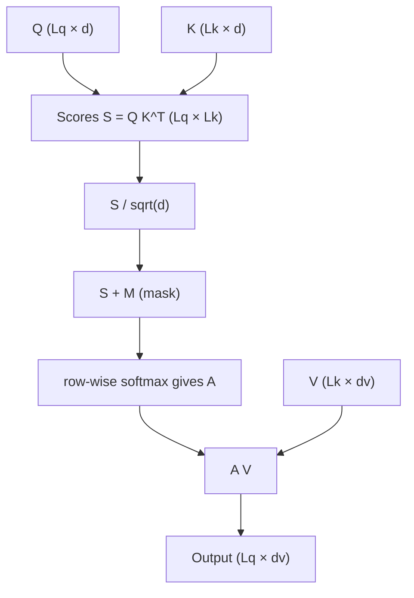

# Multi-Head Attention (MHA) benchmark — user guide

This document describes [`bench_mha.py`](bench_mha.py), which benchmarks AITER’s Triton **FlashAttention-style** MHA (`flash_attn_func`, `flash_attn_varlen_func`, and FP8 variants). It uses Triton’s `perf_report` / `do_bench` machinery to report latency, throughput, or effective memory bandwidth.

For a shorter “how to run” cheat sheet, see [How to Run MHA](../README.md#how-to-run-mha) in the parent `op_tests/op_benchmarks` README.

---

## Multi-head Attention

This benchmark times **scaled dot-product attention** on tensors that are already the **query, key, and value** representations for each head (the linear projections from the hidden state are *outside* the timed kernel).

### Single head

For one head, let $Q \in \mathbb{R}^{L_q \times d}$, $K \in \mathbb{R}^{L_k \times d}$, and $V \in \mathbb{R}^{L_k \times d_v}$ (query length $L_q$, key/value length $L_k$, head dims $d$ and $d_v$). **Scaled attention** is:

$$
\text{Attention}(Q, K, V) = \mathrm{softmax}\left( \frac{Q K^{\top}}{\sqrt{d}} + M \right) V
$$

**Computation flow** (matrix shapes for one head: scores are $L_q \times L_k$, output is $L_q \times d_v$):



```text
                    ┌─────────────┐     ┌──────────┐     ┌─────────┐
  Q (Lq×d) ─────────┤             │     │  + mask │     │ row-wise│     ┌───────────┐
                    │  Q · K^T    ├────►│    M    ├────►│ softmax ├───► │ A · V     ├──► O (Lq×dv)
  K (Lk×d) ─────────┤  → Lq×Lk   │     │         │     │  → A    │     └───────────┘
                    └─────────────┘     └──────────┘     └─────────┘           ▲
                                                                               │
  V (Lk×dv) ─────────────────────────────────────────────────────────────────────┘
         attention weights A weight the value rows; result has Lq rows, dv cols
```

- **Scale** $1/\sqrt{d}$ matches the default `softmax_scale` in code (`sm_scale`), unless you change it inside the benchmark.
- **Mask** $M$ is **causal** when `-causal` is enabled: entries above the diagonal are set so those positions get zero probability after softmax (exact layout follows the kernel; conceptually “token $i$ may not attend to token $j > i$” when $L_q = L_k$).
- With **no causal mask**, all $L_q \times L_k$ pairs contribute (subject to varlen padding, which zeroes out invalid positions in the `thd` path).

The output has shape $L_q \times d_v$.

### Multiple heads

Attention runs **in parallel over heads**: for batch index $b$ and head index $h$, you apply the same single-head computation to slices $Q_{b,h}$, $K_{b,h}$, and $V_{b,h}$. The benchmark uses **`-hq`** for the number of query heads; **`-hk`** sets the number of key/value heads when it differs (if omitted, it matches **`-hq`**).

$$
O_{b,h} = \text{Attention}\left( Q_{b,h},\, K_{b,h},\, V_{b,h} \right)
$$

Each $O_{b,h}$ has shape $L_q \times d_v$. The model usually concatenates or merges heads later; this benchmark only times the **attention** primitive per head.

### What the benchmark does *not* include

The timed kernels implement the **attention map × values** computation (and backward through it). They do **not** include the learned projections $X W^Q, X W^K, X W^V$ from the transformer block—that FLOPs and memory traffic is separate from `bench_mha.py`.

---

## What is being timed

| `-mode` | Measured work |
|--------|----------------|
| `fwd` | Forward: Q, K, V → attention output (and internal LSE when applicable). |
| `bwd` | Backward: `torch.autograd.grad` on the forward output w.r.t. Q, K, V (and **attention sink** tensor if `-sink` is used). |

**Backward FLOPs model**: The script scales forward FLOPs by **2.5×** for backward (comment in code: 2.0 backward + 0.5 recomputation).

**Dropout**: Not supported in this benchmark (`dropout` must be ≤ 0).

**Kernels used** (from `aiter.ops.triton.attention`):

- Non-varlen: `flash_attn_func` or `flash_attn_fp8_func`
- Varlen (`-layout thd`): `flash_attn_varlen_func` or `flash_attn_varlen_fp8_func`

---

## Layouts (`-layout`)

| Layout | Tensor shape | Default when |
|--------|--------------|--------------|
| `bshd` | Q: `[B, N_CTX_Q, HQ, D_HEAD]`<br>K/V: `[B, N_CTX_K, HK, D_HEAD]` (V may use `D_HEAD_V`) | No `--model` |
| `thd` | Unpadded total tokens × heads (varlen). Built with `generate_qkv` and cumulative sequence lengths. | With `--model` (unless overridden) |

**`-equal_seqlens`** (only with `thd` or `--model`): padding masks are “full” so all sequences in the batch share the same length; still uses the varlen API. The script warns that `thd` + equal lengths can add extra lookup cost versus `bshd`.

---

## Configuration modes

The benchmark sweeps **different x-axis points** depending on whether you pass a **custom shape**, use **`--model`**, or use the **built-in grid**.

### 1. Custom shape (explicit `-b`, `-hq`, `-sq`, `-d`, …)

Triggered when any of `-hq`, `-hk`, `-d`, or `-dv` is non-zero. You must supply **batch**, **Q heads**, **Q sequence length**, and **head sizes** (`-d`, and implicitly `-dv` if omitted copies `-d`).

Optional:

- **`-hk`**: key/value head count (GQA). Default: same as `-hq` if omitted.
- **`-sk`**: key sequence length. Default: same as `-sq` if omitted.
- **`-dv`**: V head dim; if omitted, equals `-d`.

### 2. Built-in sweeps (no custom flags, no `--model`)

**Non-varlen (`bshd`):** Cartesian product of

- Batch: `1, 4, 16`
- Heads: `16, 48` (HQ = HK in the grid)
- `N_CTX_Q`: `1, 1024, 4096`
- `N_CTX_K`: `163, 8192`

**Varlen (`thd`):** same idea with batch sizes `1, 4, 8` and the same head / length grid.

### 3. Model-driven (`--model`)

- Reads **`utils/model_configs.json`** (override path with **`--model-configs`**, relative to `op_tests/op_benchmarks/triton`).
- **`--model`** accepts a comma-separated list, a family name (all sizes in that family), or `all`. Exact strings are listed in `python bench_mha.py --help`.
- **Defaults when `--model` is set** (unless you override): **`causal=True`**, **`layout=thd`** — intended to match common prefill-style setups.
- **Batch**: `-b` if set, else `1`.
- **Sequence lengths**: If **`-sq` / `-sk` are omitted**, the sweep uses $2^i$ for $i = 1, \ldots, 13$ (lengths 2, 4, 8, …, 8192) for Q; K follows Q unless `-sk` is set.
- **Head dims** come from the model config: `hidden_size // num_attention_heads`, with GQA from `num_key_value_heads` when present.

Do **not** pass `-hq`, `-hk`, `-d`, or `-dv` together with `--model`; those come from the JSON.

---

## Metrics (`--metric` / `-metric`)

| Metric | Y-axis | Notes |
|--------|--------|--------|
| `time` | ms | Raw `triton.testing.do_bench` result. |
| `throughput` | TFLOPS | `total_flops / time` (see FLOPs accounting above for bwd). |
| `bandwidth` | GB/s | Simple R/W byte model over Q, K, V, O (and dout / grads in bwd). |

The shared parser also defines **`--metric`**; either form can appear in docs—use the one your installed argparse accepts (see `--help`).

---

## Data types

- **`-dtype` / `--dtype`**: `fp16` (default), `bf16`, or `fp32` for activations in the non-FP8 path.
- **`-fp8`**: Uses the FP8 entry points (`flash_attn_*_fp8_func`). **Incompatible** with positional-encoding-style head splits (see below) and with **`-sink`**.

---

## Causal mask (`-causal`)

Accepts boolean-like strings (`true`/`false`, `1`/`0`, etc.) via `str2bool`.

- Default **`False`** without `--model`.
- Default **`True`** with `--model` (unless you set `-causal` explicitly).

---

## Backward implementation toggles

- **`-fused_bwd`**: Enables the **fused** backward path via `mha_set_use_fused_bwd_kernel(True)` when the provider label contains `fused-bwd`.

**Not supported together** (assertions in the benchmark):

- Fused backward + **PE** (`D_HEAD > D_HEAD_V`)
- Fused backward + **attention sink**
- FP8 + PE or FP8 + sink

---

## Positional encoding / different QK vs V dim (“PE”)

Set **`-dv`** different from **`-d`** so that `D_HEAD > D_HEAD_V`. That path uses separate test and API coverage (`test_mha_with_pe`, etc.). **FP8** and **fused backward** are disallowed in that configuration.

---

## Attention sink (`-sink`)

Adds a learnable **per-head sink** vector (length `HQ`) passed into the non-FP8 flash APIs. In backward mode, gradients include the sink. **Not compatible** with **`-fp8`** or **fused backward**.

---

## Correctness mode (`-test_mode`)

Does **not** benchmark. Instead it runs tests from `op_tests.triton_tests.attention.test_mha` (forward + backward) comparing the Triton implementation to PyTorch SDPA for the current shape, layout, causal flag, and FP8 flag.

Use this to validate kernels after changes or on new hardware.

---

## Optional comparisons and tooling

| Flag | Purpose |
|------|---------|
| **`-bench_torch`** | Adds a second plot series labeled Torch. |
| **`-o`** | Save results under the current directory (CSV via Triton `perf_report`). |
| **`-print_vgpr`** | Print VGPR usage for Triton kernels (do not combine with `-bench_torch`). |

**`-bench_torch` note:** The timed `fn` is still the Triton path for every series; this flag does not benchmark `torch.nn.functional.scaled_dot_product_attention`.

---

## Flags present but unused in this script

The following are defined on the parser but **not referenced** in `bench_mha.py` today:

- **`-persistent`**
- **`-quantize_p`**

They may be reserved for future kernel options or copied from other benchmarks; check the implementation before relying on them.

---

## Example commands

```bash
# Built-in grid, forward, throughput (defaults: bshd, non-causal)
python bench_mha.py --metric throughput -mode fwd

# Single custom shape
python bench_mha.py -b 4 -hq 32 -hk 8 -sq 2048 -sk 2048 -d 128 --dtype bf16 -metric time -mode fwd

# Model-driven varlen sweep (causal + thd by default)
python bench_mha.py --model llama3-70B -b 1 --metric throughput

# FP8 forward (custom shape)
python bench_mha.py -fp8 -b 4 -hq 32 -hk 32 -sq 2048 -sk 2048 -d 128

# Backward, unfused vs fused (compare runs)
python bench_mha.py -mode bwd -b 4 -hq 32 -sq 1024 -sk 1024 -d 128
python bench_mha.py -mode bwd -fused_bwd -b 4 -hq 32 -sq 1024 -sk 1024 -d 128

# Correctness
python bench_mha.py -test_mode -b 2 -hq 16 -sq 512 -sk 512 -d 64 -causal true

# Varlen grid explicitly
python bench_mha.py -layout thd --metric bandwidth
```

---

## Troubleshooting

- **Import errors**: Run from the **aiter** repo with the same environment you use to build/run AITER; ensure `op_tests` is on `PYTHONPATH` if you launch from elsewhere.
- **Assertion on layout / equal seqlens**: `-equal_seqlens` requires `thd` or `--model`.
- **FP8 / PE / fused bwd / sink**: See the “Not supported together” notes above—those are enforced explicitly in the benchmark.

---

## Related code

| Area | Location |
|------|----------|
| Benchmark entrypoint | [`bench_mha.py`](bench_mha.py) |
| Shared CLI base | [`utils/argparse.py`](utils/argparse.py) |
| Model JSON | [`utils/model_configs.json`](utils/model_configs.json) |
| Triton MHA ops | `aiter.ops.triton.attention.mha`, `mha_v3` |
