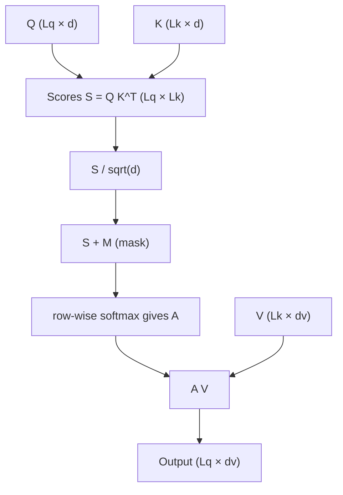
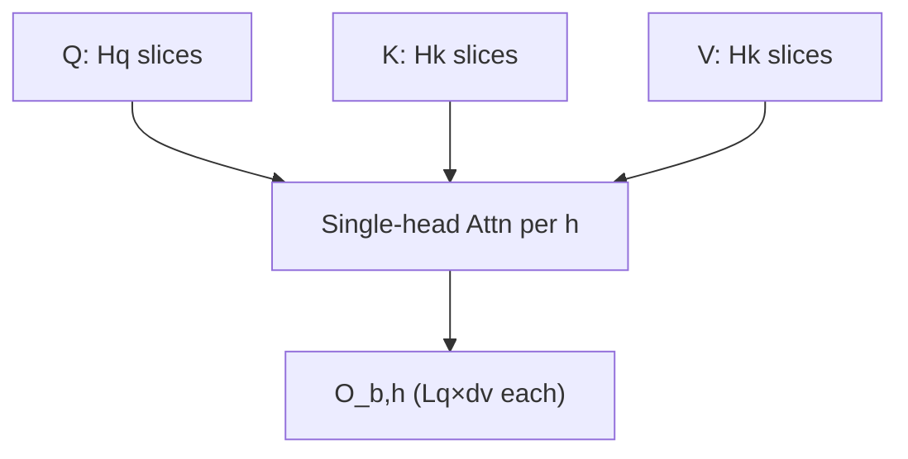

# Multi-Head Attention (MHA) benchmark — user guide

[`bench_mha.py`](bench_mha.py): Triton FlashAttention-style MHA (`flash_attn_*` / varlen / FP8). Triton `perf_report` + `do_bench` → ms, TFLOPS, or GB/s. More examples: [README § MHA](../README.md#how-to-run-mha).

---

## Multi-head Attention

Times **scaled dot-product attention** on per-head **Q, K, V** (no $W^Q,W^K,W^V$ in the timed region).

### Single head

$Q \in \mathbb{R}^{L_q \times d}$, $K \in \mathbb{R}^{L_k \times d}$, $V \in \mathbb{R}^{L_k \times d_v}$:

$$
\text{Attention}(Q, K, V) = \mathrm{softmax}\left( \frac{Q K^{\top}}{\sqrt{d}} + M \right) V
$$

Scores $L_q \times L_k$; output $L_q \times d_v$.



```text
  Q (Lq×d) ──┐     ┌─────────┐     ┌─────────┐     ┌───────────┐
  K (Lk×d) ──┼──► Q·K^T ─► +M ─► softmax ─► A·V ─► O (Lq×dv)
  V (Lk×dv) ─┘
```

- Scale: default `sm_scale` = $1/\sqrt{d}$.
- **Causal** `-causal`: upper triangle masked (when $L_q=L_k$, no attend to future).
- **Full** mask: all pairs; `thd` still zeros padded positions.

### Multiple heads

Per batch $b$, head $h$: same formula on $Q_{b,h}, K_{b,h}, V_{b,h}$. **`-hq`** = query heads; **`-hk`** = KV heads (`0` → same as `-hq`). If `-hk` < `-hq`, layout follows the kernel.

$$
O_{b,h} = \text{Attention}\left( Q_{b,h},\, K_{b,h},\, V_{b,h} \right)
$$



### Out of scope

No $XW^Q, XW^K, XW^V$ FLOPs—only attention + (optional) bwd through it.

---

## How bench_mha.py Works

`post_process_args` → defaults → `run_benchmark` → Triton `Benchmark` + `perf_report` + `do_bench`. **`-test_mode`**: check $\text{Attention}(\cdot)$ vs PyTorch SDPA, no timing.

**Symbols ↔ args** (per head $h$, batch $b$; dense `bshd` case): $L_q$ **`-sq`** (`N_CTX_Q`), $L_k$ **`-sk`** (`N_CTX_K`), $d$ **`-d`** (`D_HEAD`), $d_v$ **`-dv`** (`D_HEAD_V`), $H_q$ **`-hq`**, $H_k$ **`-hk`**, batch $B$ **`-b`**. Mask $M$ in the softmax: **`-causal`**. Same equation; **`--layout`** only changes how $Q_{b,h},K_{b,h},V_{b,h}$ are stored (`bshd` = padded $L_q,L_k$ axes; `thd` = varlen segments, same math after unpack).

### Args: shape / model (maps to $Q,K,V,M$)

| Arg | Theory / tensors |
|-----|------------------|
| `-b` | Batch size $B$ in `[B, L_q, H_q, d]`, `[B, L_k, H_k, d]`, `[B, L_k, H_k, d_v]`. |
| `-sq` | Query axis length $L_q$ (benchmark `N_CTX_Q`). |
| `-sk` | Key/value axis length $L_k$ (`N_CTX_K`); `0` → same as `-sq`. |
| `-d` | Head dim $d$ for $Q,K$; softmax scale uses $1/\sqrt{d}$ unless overridden in code. |
| `-dv` | Head dim $d_v$ for $V$ and output columns; default `-dv` = `-d` ⇒ $d_v=d$. |
| `-hq` | $H_q$: number of $Q_{b,h}$ stacks (parallel applications of the single-head equation). |
| `-hk` | $H_k$: number of $K,V$ head stacks; `0` → $H_k=H_q$. If $H_k<H_q$, kernel maps $h$ to KV slices (same $O_{b,h}$ formula, shared $K,V$ per group). |
| `-causal` | Chooses mask $M$ (causal vs full); default off without `--model`, on with `--model`. |
| `--layout` | `bshd`: fixed $L_q,L_k$ per batch row. `thd`: varlen $L_q,L_k$ per segment via `cu_seqlens`; $M$ still masks invalid positions. |
| `-equal_seqlens` | `thd`: all segments share one $L_q$ / $L_k$ (still varlen storage). |
| `--model` | Sets $H_q,H_k,d$ (and often $d_v$) from config; forbids `-hq/-hk/-d/-dv`. Seq sweep if `-sq/-sk` omitted. |
| `--model-configs` | JSON for `--model` (default `utils/model_configs.json`). |

### Args: run / metric (what is measured, not the formula)

| Arg | Role |
|-----|------|
| `-mode` | `fwd`: time $\text{Attention}(Q,K,V)\to O$. `bwd`: time $\partial L/\partial Q,\partial K,\partial V$ (+ sink if used). |
| `--dtype` / `-fp8` | Dtype of $Q,K,V$ (and compute) in the non-FP8 / FP8 paths. |
| `-sink` | Extra per-head vector in the API (not in the boxed equation above); grads if `bwd`. |
| `-fused_bwd` | Which backward implementation differentiates the same $\text{Attention}$. Incompatible with `-sink` and with $d>d_v$. |
| `--metric` / `-metric` | Report latency, FLOPs/s for the op’s FLOP model, or bytes/s for Q,K,V,O traffic. |
| `-test_mode` | Numerically match PyTorch SDPA for the same $Q,K,V,M$ setup. |
| `-bench_torch` | Second plot series only; timed code path still Triton. |
| `-o` | Save `perf_report` (e.g. CSV). |
| `-print_vgpr` | Kernel register use (Triton). No `-bench_torch`. |
| `-persistent` `-quantize_p` | Parsed; **unused** here. |

---

## What is being timed

| `-mode` | Work |
|---------|------|
| `fwd` | Forward attention (+ LSE internally). |
| `bwd` | Grad w.r.t. Q,K,V (+ sink if `-sink`). |

Bwd FLOPs model: **×2.5** vs fwd (recompute). **Dropout**: not supported.

**Kernels:** `flash_attn_func` / `flash_attn_fp8_func`; varlen: `flash_attn_varlen_*`.

---

## Layouts (`-layout`)

| Layout | Shape | Default |
|--------|--------|---------|
| `bshd` | Q `[B,N_CTX_Q,HQ,D]`; K/V `[B,N_CTX_K,HK,D]` (V may use `D_HEAD_V`) | no `--model` |
| `thd` | Unpadded tokens + `cu_seqlens` (`generate_qkv`) | `--model` |

`-equal_seqlens` + `thd`: full masks, equal lengths; slower than `bshd` for that case (warning in code).

---

## Configuration modes

**Custom:** any of `-hq/-hk/-d/-dv` nonzero → need `-b -hq -sq -d` (and `-dv` implied).

**Built-in grid** (no custom, no model): `bshd` batches `1,4,16`, heads `16,48`, `N_CTX_Q` `1,1024,4096`, `N_CTX_K` `163,8192`. `thd`: batches `1,4,8`, same heads/lengths.

**`--model`:** JSON drives HQ/HK/D; `-b` default 1; if `-sq/-sk` omitted, seq sweep $2^1 \ldots 2^{13}$.

---

## Example commands

```bash
python bench_mha.py --metric throughput -mode fwd
python bench_mha.py -b 4 -hq 32 -hk 8 -sq 2048 -sk 2048 -d 128 --dtype bf16 -metric time -mode fwd
python bench_mha.py --model llama3-70B -b 1 --metric throughput
python bench_mha.py -fp8 -b 4 -hq 32 -sq 2048 -sk 2048 -d 128
python bench_mha.py -mode bwd -b 4 -hq 32 -sq 1024 -sk 1024 -d 128
python bench_mha.py -mode bwd -fused_bwd -b 4 -hq 32 -sq 1024 -sk 1024 -d 128
python bench_mha.py -test_mode -b 2 -hq 16 -sq 512 -sk 512 -d 64 -causal true
python bench_mha.py -layout thd --metric bandwidth
```

---

## Troubleshooting

- Imports: aiter env + `PYTHONPATH` if not run from repo layout.
- `-equal_seqlens`: needs `thd` or `--model`.
- Conflicting `-fp8` / PE / `-sink` / `-fused_bwd`: asserts in script.

---

## Related code

| Item | Path |
|------|------|
| Script | [`bench_mha.py`](bench_mha.py) |
| CLI | [`utils/argparse.py`](utils/argparse.py) |
| Models | [`utils/model_configs.json`](utils/model_configs.json) |
| Ops | `aiter.ops.triton.attention.mha`, `mha_v3` |
