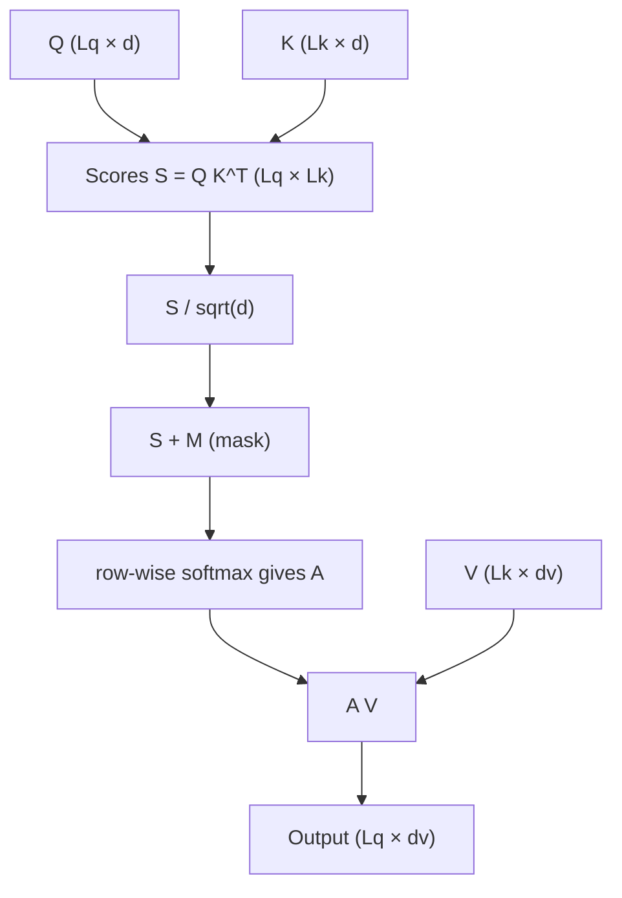
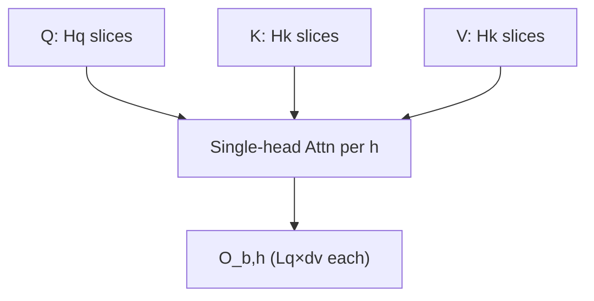

# Multi-Head Attention (MHA) benchmark — user guide

[`bench_mha.py`](bench_mha.py): Triton FlashAttention-style MHA (`flash_attn_*` / varlen / FP8). Triton `perf_report` + `do_bench` → ms, TFLOPS, or GB/s. More examples: [README § MHA](../README.md#how-to-run-mha).

---

## Multi-head Attention

Times **scaled dot-product attention** on per-head **Q, K, V** (no $W^Q,W^K,W^V$ in the timed region).

### Single head

$Q \in \mathbb{R}^{L_q \times d}$, $K \in \mathbb{R}^{L_k \times d}$, $V \in \mathbb{R}^{L_k \times d_v}$:

$$
\text{Attention}(Q, K, V) = \mathrm{softmax}\left( \frac{Q K^{\top}}{\sqrt{d}} + M \right) V
$$

Scores $L_q \times L_k$; output $L_q \times d_v$.



```text
  Q (Lq×d) ──┐     ┌─────────┐     ┌─────────┐     ┌───────────┐
  K (Lk×d) ──┼──► Q·K^T ─► +M ─► softmax ─► A·V ─► O (Lq×dv)
  V (Lk×dv) ─┘
```

- Scale: default `sm_scale` = $1/\sqrt{d}$.
- **Causal** `-causal`: upper triangle masked (when $L_q=L_k$, no attend to future).
- **Full** mask: all pairs; `thd` still zeros padded positions.

### Multiple heads

Per batch $b$, head $h$: same formula on $Q_{b,h}, K_{b,h}, V_{b,h}$. **`-hq`** = query heads; **`-hk`** = KV heads (`0` → same as `-hq`). If `-hk` < `-hq`, layout follows the kernel.

$$
O_{b,h} = \text{Attention}\left( Q_{b,h},\, K_{b,h},\, V_{b,h} \right)
$$



### Out of scope

No $XW^Q, XW^K, XW^V$ FLOPs—only attention + (optional) bwd through it.

---

## How bench_mha.py Works

`post_process_args` → defaults (`causal`, `layout`, custom vs grid vs `--model`) → `run_benchmark` → Triton `Benchmark` + `perf_report` + `do_bench`. **`-test_mode`**: correctness vs PyTorch SDPA, no timing.

### Args: shape / model

| Arg | Meaning |
|-----|---------|
| `--model` | Heads/dims from JSON. List, family, or `all`. Conflicts with `-hq/-hk/-d/-dv`. Default with model: `causal`, `layout=thd`. |
| `--model-configs` | JSON path under `triton/` (default `utils/model_configs.json`). |
| `-b` | Batch. Custom shape needs `>0`. Model: unset → `1`. |
| `-hq` `-hk` | Query / KV heads. `0` + no other custom dims → built-in sweep. `-hk` `0` → use `-hq`. |
| `-sq` `-sk` | Q / K length. `-sk` `0` → `-sq`. Model, both unset → sweep $2^1 \ldots 2^{13}$. |
| `-d` `-dv` | QK head dim; V dim (`-dv` defaults to `-d`). `-dv≠-d` → “PE” path. |
| `--layout` | `bshd` or `thd` ([Layouts](#layouts--layout)). Default: `bshd` / `thd` without / with `--model`. |
| `-equal_seqlens` | `thd` (or model): equal lens in varlen path. Not `bshd`-only without model. |

### Args: run / metric

| Arg | Meaning |
|-----|---------|
| `-mode` | `fwd` or `bwd` (`torch.autograd.grad`). |
| `--metric` / `-metric` | `time` \| `throughput` \| `bandwidth` (parser default `throughput`). |
| `--dtype` | `fp16` \| `bf16` \| `fp32` (non-FP8). |
| `-fp8` | FP8 APIs. No `-sink`, no `-dv≠-d`. |
| `-causal` | str2bool; unset → `False` / `True` without / with `--model`. |
| `-sink` | Attention sink. No `-fp8`, no `-fused_bwd`. |
| `-fused_bwd` | Fused bwd kernel. No `-sink`, no PE (`d>dv`). |
| `-test_mode` | Correctness only. |
| `-bench_torch` | Extra plot line “Torch”; still times Triton only. |
| `-o` | CSV / `perf_report` to cwd. |
| `-print_vgpr` | VGPR report. No `-bench_torch`. |
| `-persistent` `-quantize_p` | Parsed; **unused** in this script. |

---

## What is being timed

| `-mode` | Work |
|---------|------|
| `fwd` | Forward attention (+ LSE internally). |
| `bwd` | Grad w.r.t. Q,K,V (+ sink if `-sink`). |

Bwd FLOPs model: **×2.5** vs fwd (recompute). **Dropout**: not supported.

**Kernels:** `flash_attn_func` / `flash_attn_fp8_func`; varlen: `flash_attn_varlen_*`.

---

## Layouts (`-layout`)

| Layout | Shape | Default |
|--------|--------|---------|
| `bshd` | Q `[B,N_CTX_Q,HQ,D]`; K/V `[B,N_CTX_K,HK,D]` (V may use `D_HEAD_V`) | no `--model` |
| `thd` | Unpadded tokens + `cu_seqlens` (`generate_qkv`) | `--model` |

`-equal_seqlens` + `thd`: full masks, equal lengths; slower than `bshd` for that case (warning in code).

---

## Configuration modes

**Custom:** any of `-hq/-hk/-d/-dv` nonzero → need `-b -hq -sq -d` (and `-dv` implied).

**Built-in grid** (no custom, no model): `bshd` batches `1,4,16`, heads `16,48`, `N_CTX_Q` `1,1024,4096`, `N_CTX_K` `163,8192`. `thd`: batches `1,4,8`, same heads/lengths.

**`--model`:** JSON drives HQ/HK/D; `-b` default 1; if `-sq/-sk` omitted, seq sweep $2^1 \ldots 2^{13}$.

---

## Example commands

```bash
python bench_mha.py --metric throughput -mode fwd
python bench_mha.py -b 4 -hq 32 -hk 8 -sq 2048 -sk 2048 -d 128 --dtype bf16 -metric time -mode fwd
python bench_mha.py --model llama3-70B -b 1 --metric throughput
python bench_mha.py -fp8 -b 4 -hq 32 -sq 2048 -sk 2048 -d 128
python bench_mha.py -mode bwd -b 4 -hq 32 -sq 1024 -sk 1024 -d 128
python bench_mha.py -mode bwd -fused_bwd -b 4 -hq 32 -sq 1024 -sk 1024 -d 128
python bench_mha.py -test_mode -b 2 -hq 16 -sq 512 -sk 512 -d 64 -causal true
python bench_mha.py -layout thd --metric bandwidth
```

---

## Troubleshooting

- Imports: aiter env + `PYTHONPATH` if not run from repo layout.
- `-equal_seqlens`: needs `thd` or `--model`.
- Conflicting `-fp8` / PE / `-sink` / `-fused_bwd`: asserts in script.

---

## Related code

| Item | Path |
|------|------|
| Script | [`bench_mha.py`](bench_mha.py) |
| CLI | [`utils/argparse.py`](utils/argparse.py) |
| Models | [`utils/model_configs.json`](utils/model_configs.json) |
| Ops | `aiter.ops.triton.attention.mha`, `mha_v3` |
